# 分析员工离职调查

> 原文：<https://towardsdatascience.com/analyzing-employee-exit-surveys-fbbe35ae151d?source=collection_archive---------31----------------------->

## 使用 python 分析统计严密性和潜在因素以确定员工情绪


图片由来自 Pixabay 的 mohamed Hassan 提供

当分析员工情绪数据时，在我们的例子中是员工离职调查，我们必须考虑四个主题。

1.  调查的统计严密性
2.  调查对象的人口构成
3.  对已定义的潜在结构的总体看法
4.  根据受访者的特征(即性别、地点、部门等。)

首先，坚持这种方法将使我们能够确定我们的调查在多大程度上衡量了它想要衡量的东西。其次，从受访者特征的角度了解谁回答了调查(即性别、部门等)，我们可以为我们的分析和结果提供背景。第三，这种方法将帮助我们确定响应者的总体情绪。最后但同样重要的是，它将帮助我们不仅确定哪些组织计划可能有助于增加情绪，而且还确定这些计划应该在哪里实施。

# 资料组

我们将使用的数据集是一个虚构的员工离职调查，该调查向员工提出了一系列关于其组织人口统计数据的问题(即部门)和 5 分李克特(即。强烈不同意，不同意，中立，同意，强烈同意)情绪问题(即。该组织提供了大量的晋升机会。没有使用开放式问题。

# 数据处理

```
import pandas as pd
import numpy as np
import scipy.stats as stats
import matplotlib.pyplot as plt
import seaborn as snsimport warnings
warnings.filterwarnings('ignore')
pd.set_option('display.max_columns', None)
%matplotlib inlinewith open('exit_data_final.csv') as f:
    df = pd.read_csv(f)
f.close()df.info()
```

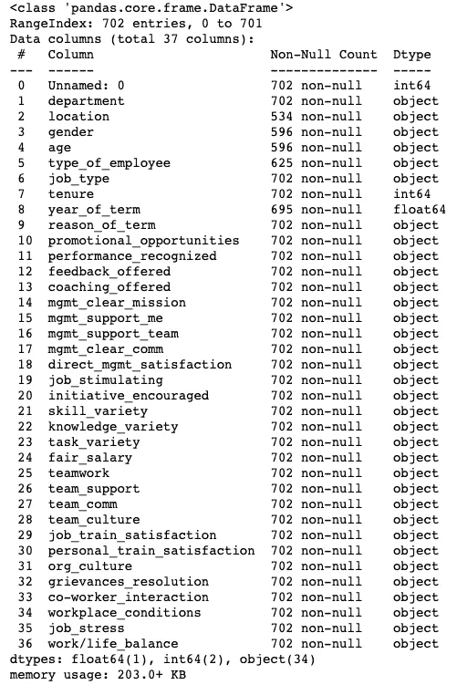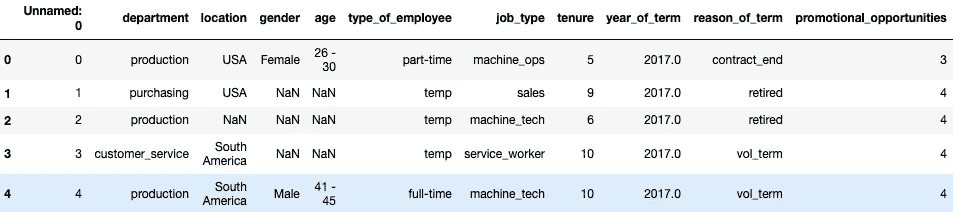

我们向员工询问了 33 个项目或问题。在我们开始分析之前，我们需要进行一些数据清理。

```
df.drop('Unnamed: 0', axis=1, inplace=True)
```

让我们放弃这个奇怪的“未命名”专栏，因为它没有任何意义。

```
for var in df.columns:
    print(var, df[var].unique())
```

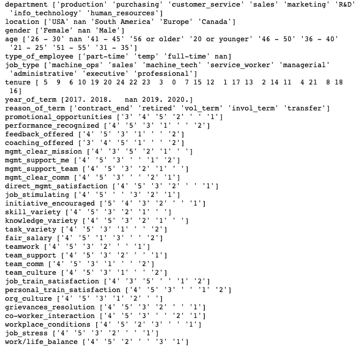

通过检查每个项目的唯一值，我们可以看到一些问题。

1.  有些项目的缺失值被正确地标记为 np.nan，但其他项目则为空。
2.  基于 df.info()，我们需要转换 Likert 项目的项目类型，因为它们当前被格式化为“objects”。
3.  最后，我们需要转换一些值，以提高可视化效果的可读性。

```
# Replacing nulls with np.nan
for var in df.columns:
    df[var].replace(to_replace=' ', value=np.nan, inplace=True)# Converting feature types
likert_items = df[['promotional_opportunities', 'performance_recognized',
       'feedback_offered', 'coaching_offered', 'mgmt_clear_mission',
       'mgmt_support_me', 'mgmt_support_team', 'mgmt_clear_comm',
       'direct_mgmt_satisfaction', 'job_stimulating', 'initiative_encouraged',
       'skill_variety', 'knowledge_variety', 'task_variety', 'fair_salary',
       'teamwork', 'team_support', 'team_comm', 'team_culture',
       'job_train_satisfaction', 'personal_train_satisfaction', 'org_culture',
       'grievances_resolution', 'co-worker_interaction',
       'workplace_conditions', 'job_stress', 'work/life_balance']]for col in likert_items:
    df[col] = pd.to_numeric(df[col], errors='coerce').astype('float64')# Discretization of tenure
bins = [0,4,9,14,19,24]
labels = ['0-4yrs', '5-9yrs', '10-14yrs', '15-19yrs', '20+yrs']
df['tenure'] = pd.cut(df['tenure'], bins = bins, labels=labels)
```

## 潜在结构的发展

在我之前的 [**文章**](/assessing-statistical-rigor-of-employee-surveys-1d27e3df998a) 中，我们回顾了分析统计严密性的过程(即。效度、信度、因子分析)。请随意回顾，但让我们快速回顾一下什么是潜在调查结构以及它们是如何派生的。

为了开发保持良好的统计严谨性的调查项目或问题，我们必须从学术文献开始。我们想要找到一个理论模型来描述我们想要测量的现象。例如，性格调查经常会使用大五模型(即。开放性、尽责性、外向性、宜人性和神经质)来开发调查项目。调查开发人员将为模型的每个组成部分精心设计 2-10 个(取决于调查的长度)项目。旨在评估相同成分的项目被称为测量“潜在结构”。换句话说，我们没有明确地测量“外向性”,因为这是一个“观察到的结构”,而是通过个别调查项目间接测量。在达到一定的严格程度之前，该调查将使用多个受访者样本进行试点测试。同样，如果你对用于确定严密性的统计分析感兴趣，看看我以前的 [**文章**](/assessing-statistical-rigor-of-employee-surveys-1d27e3df998a) 。

```
# Calculating latent variables
df['employee_valued'] = np.nanmean(df[['promotional_opportunities',
                        'performance_recognized',
                        'feedback_offered',
                        'coaching_offered']], axis=1)df['mgmt_sati'] = np.nanmean(df[['mgmt_clear_mission',
                  'mgmt_support_me', 'mgmt_support_team', 'mgmt_clear_comm', 'direct_mgmt_satisfaction']], axis=1)df['job_satisfaction'] = np.nanmean(df[['job_stimulating',
'initiative_encouraged','skill_variety','knowledge_variety',
                                     'task_variety']], axis=1)df['team_satisfaction'] = np.nanmean(df[['teamwork','team_support',
                          'team_comm','team_culture']], axis=1)df['training_satisfaction'] = np.nanmean(df[['job_train_satisfaction',
'personal_train_satisfaction']], axis=1)df['org_environment'] = np.nanmean(df[['org_culture','grievances_resolution',
'co-worker_interaction','workplace_conditions']], axis=1)df['work_life_balance'] = np.nanmean(df[['job_stress','work/life_balance']], axis=1)df['overall_sati'] = np.nanmean(df[['promotional_opportunities', 'performance_recognized','feedback_offered', 'coaching_offered', 'mgmt_clear_mission','mgmt_support_me', 'mgmt_support_team', 'mgmt_clear_comm','direct_mgmt_satisfaction', 'job_stimulating', 'initiative_encouraged','skill_variety', 'knowledge_variety', 'task_variety', 'fair_salary','teamwork', 'team_support', 'team_comm', 'team_culture', 'job_train_satisfaction', 'personal_train_satisfaction', 'org_culture', 'grievances_resolution', 'co-worker_interaction', 'workplace_conditions', 'job_stress', 'work/life_balance']], axis=1)
```

我们的离职调查也已经发展到评估某些潜在的结构。每个调查项目都根据它要测量的潜在因素进行平均。最后，我们计算了一个“总体满意度”特征，该特征计算了每位受访者所有项目/潜在因素的总体平均值。

下面是调查项目的列表以及它们要测量的潜在结构。请记住，为了便于可视化，每个项目的每个标签都被大大缩短了。你可以想象这些问题，比如“从 1 到 5 分，我觉得我的工作很刺激”。

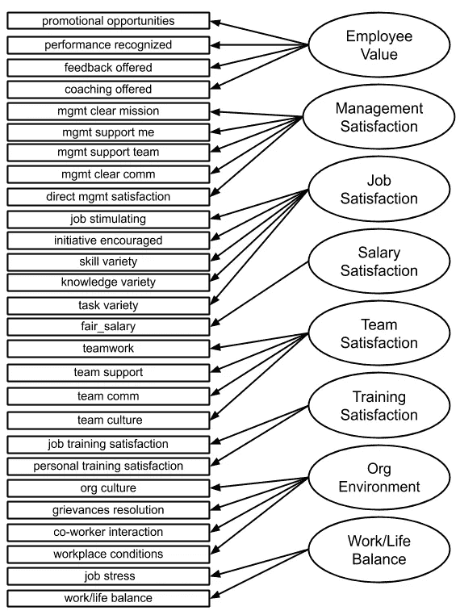

```
mappings = {1:'1) Dissatisfied', 2:'1) Dissatisfied', 3:'2) Neutral', 4:'3) Satisfied', 5:'3) Satisfied'}
likert = ['promotional_opportunities', 'performance_recognized',
       'feedback_offered', 'coaching_offered', 'mgmt_clear_mission',
       'mgmt_support_me', 'mgmt_support_team', 'mgmt_clear_comm',
       'direct_mgmt_satisfaction', 'job_stimulating', 'initiative_encouraged',
       'skill_variety', 'knowledge_variety', 'task_variety', 'fair_salary',
       'teamwork', 'team_support', 'team_comm', 'team_culture',
       'job_train_satisfaction', 'personal_train_satisfaction', 'org_culture',
       'grievances_resolution', 'co-worker_interaction',
       'workplace_conditions', 'job_stress', 'work/life_balance']for col in likert:
    df[col+'_short'] = df[col].map(mappings)

df.head()
```

为了有助于可视化，我们将创建新的功能，将 1 和 2 的评分汇总为不满意，3 为中性，4 和 5 为满意。这将使我们能够创建具有 3 个独特部分的堆积条形图。

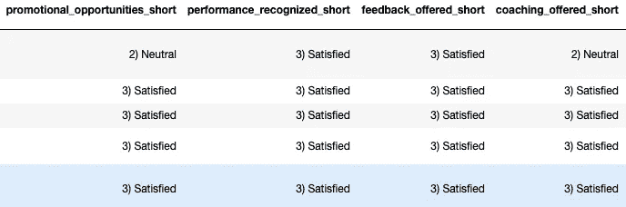

# 受访者的特征

了解调查受访者的人口统计数据有助于为我们的分析提供背景信息。我们还必须记住，大多数员工离职调查都是在自愿的基础上完成的。由于这个令人困惑的变量，我们需要将从数据中收集的任何见解作为组织事务的“证据”，而不是确定的“证据”。员工可能对组织非常满意或生气，他们的态度肯定会反映在他们的回答中。最后，该调查包括大约 600 名受访者，我们需要注意不要将这些视为过去 4 年中发生的所有终止的总数。600 例终止可能只占已发生的所有终止中的一小部分。

> 换句话说，我们的分析希望确定那些对调查做出回应的员工对几个组织因素的满意度。我们不应该将我们的结果推广到更广泛的组织或所有被解雇的员工。

```
def uni_plots(feature, text):
    tmp_count = df[feature].dropna().value_counts().values
    tmp_percent = ((df[feature].dropna().value_counts()/len(df))*100).values
    df1 = pd.DataFrame({feature: df[feature].value_counts().index,
                        'Number of Employees': tmp_count,
                        'Percent of Employees': tmp_percent})

    f, ax = plt.subplots(figsize=(20,10))
    plt.title(text, fontsize=25, pad=30)
    plt.tick_params(axis='both', labelsize=15, pad=10)
    plt.xlabel(feature, fontsize=20)
    plt.xticks(size=18)
    plt.yticks(size=18)

    sns.set_color_codes('pastel')
    count = sns.barplot(x=feature, y='Number of Employees', color='b', data=df1, label='Number of Employees')
    for p in count.patches:
        count.annotate(format(p.get_height(), '.1f'), 
                   (p.get_x() + p.get_width() / 2., p.get_height()), 
                   ha = 'center', va = 'center',
                   xytext = (0, 9), 
                   textcoords = 'offset points', size = 20)

    sns.set_color_codes('muted')
    percent = sns.barplot(x=feature, y='Percent of Employees', color='b', data=df1, label='Percent of Employees')
    for i in percent.patches:
        percent.annotate(format(i.get_height(), '.1f'), 
                   (i.get_x() + i.get_width() / 2., i.get_height()), 
                   ha = 'center', va = 'center', 
                   xytext = (0, 9), size = 20,
                   textcoords = 'offset points')

    ax.set_ylabel('')
    ax.legend(ncol=2, loc="upper right", fontsize=15, frameon=True)
    sns.despine(left=False, bottom=False)
    ax.set_xticklabels(ax.get_xticklabels(), rotation=45)
    plt.show() def bi_cat_plot(feature1, feature2):
    ax = pd.crosstab(df[feature1], df[feature2], normalize='index')*100
    ax1 = ax.plot(kind='barh', stacked=True, figsize=(25,15), fontsize=25)
    for i in ax1.patches:
        width, height = i.get_width(), i.get_height()
        x, y = i.get_xy() 
        ax1.text(x+width/2,
                 y+height/2,
                 '{:.0f} %'.format(width),
                 horizontalalignment='center',
                 verticalalignment='center',
                 size=25)

    plt.title('Percentage of Termination Reasons by {}'.format(feature1), fontsize=30, pad=25)
    plt.ylabel(' ')
    plt.legend(prop={'size':20})
```

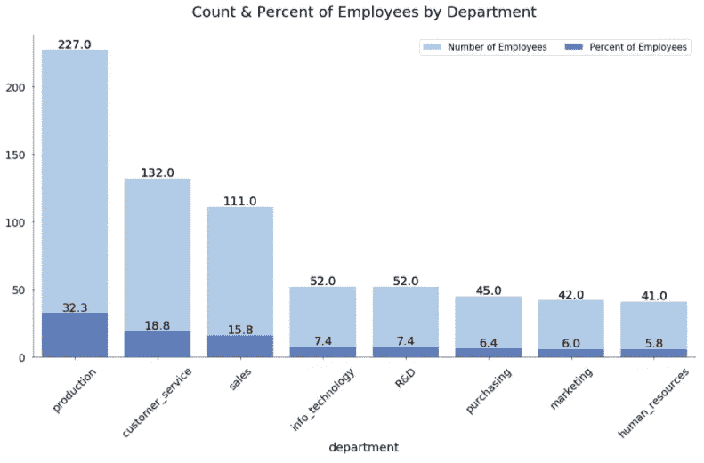

在 4 年(2017 年至 2020 年)的数据收集中，生产、客户服务和销售部门占调查受访者的 65%以上。在四年的调查中，我们的受访者有很大的差异。2018 年有 342 例终止，而 2020 年只有 37 例。

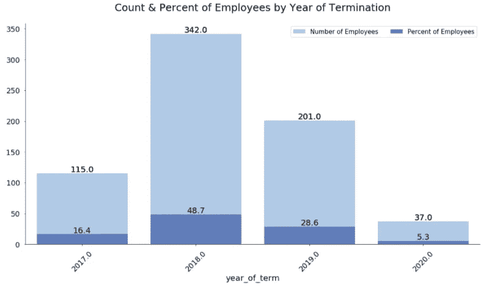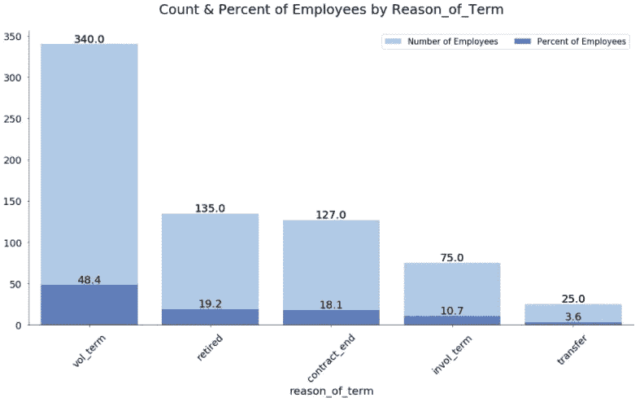

近 50%的受访者是自愿终止妊娠，这是一个重要的事实。同样，在没有确凿的 HRIS 数据的情况下，很难将我们的结果推广到更广泛的组织中，但终止原因的差异大小向我们表明，该公司可能在自愿终止方面存在问题。我们没有任何员工绩效数据来确定建设性的或令人遗憾的自愿离职，因为这将使我们能够专门集中分析令人遗憾的自愿离职。

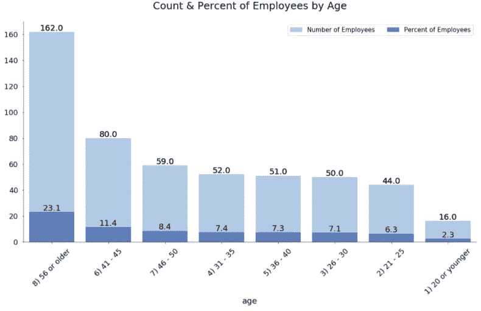

受访者中最大的年龄组是 56 岁及以上，几乎占受访者的 20%。按离职原因划分年龄，我们可以看到这个年龄组占退休人数的 87%,这是有道理的。如果我们看看自愿离职和年龄，我们可以看到所有年龄组的平均分布。

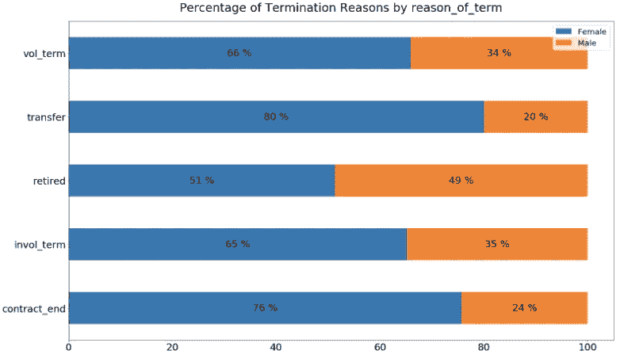

类别数量较少的变量(如性别)通常不会为我们提供很多见解，除非我们看到数据存在重大偏差。与男性相比，女性对调查的回应比例似乎接近 2:1。从终止原因的性别来看，我们看到的百分比反映了我们看到的整体性别比例。

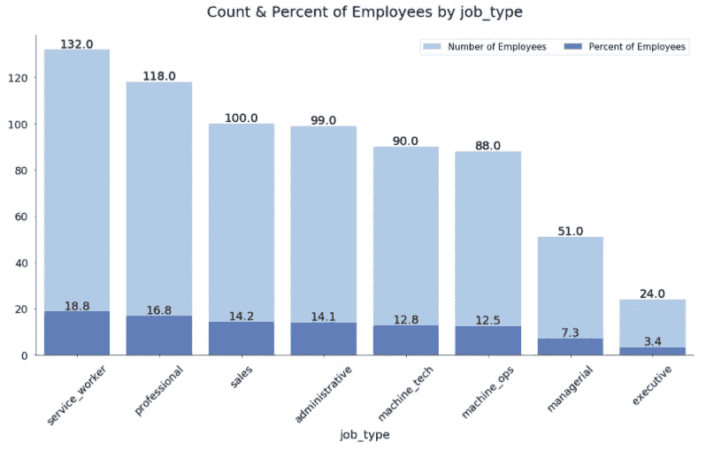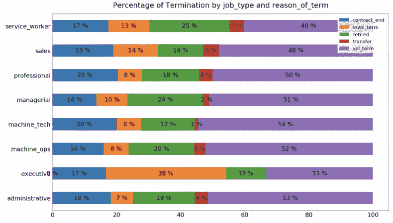

根据工作类型，我们的受访者分布相当均匀。我们确实看到管理和行政工作类型占了很小的一部分，但这些职位在整个组织中所占的比例更小。更有趣的是，我们看到高管的非自愿离职激增(38%)。与其他终止原因相比，我们通常会看到非自愿终止的情绪较低，因此，我们可以预计高管的整体情绪得分相当低。

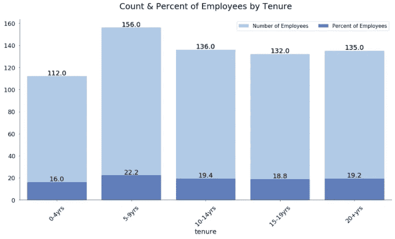

总的来说，我们看到自愿离职的受访者占大多数，他们主要来自生产、客户服务和销售部门，并在职业生涯的后期(41 岁及以上)离职。

# 总体受访者情绪

通过首先取所有单个情感项目的平均值(即李克特项目)。最后，根据数据的切片方式计算出一个总平均值。

```
def overall_plot(feature):
    ax = round(df.groupby(feature)['overall_sati'].mean(),2).sort_values().plot(kind='barh', stacked=True,
                                                              figsize=(25,15), fontsize=25)
    for i in ax.patches:
        width, height = i.get_width(), i.get_height()
        x, y = i.get_xy() 
        ax.text(x+width/2,
                y+height/2,
                '{:.2f}'.format(width),
                horizontalalignment='center',
                verticalalignment='center',
                size=25)
    plt.title('Overall Employee Sentiment by {}'.format(feature), fontsize=30, pad=25)
    plt.ylabel(' ')
```

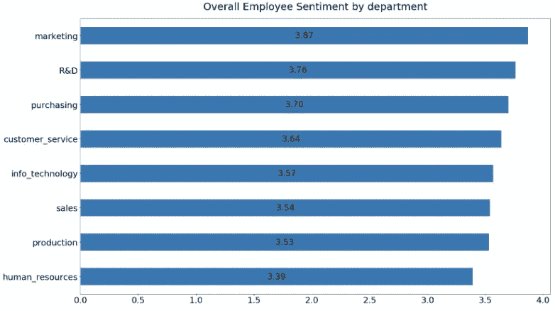

总的来说，人力资源的总体情绪最低，但在受访者中所占比例也最小(5.8%)。这是有问题的，因为平均水平会很快被少数对李克特项目评价很低的受访者左右。也就是说，我们不能忽视这种整体平均情绪的低迷。另一方面，生产和销售是受访者中最大的两个部分，他们得分第二和第三低。我们必须了解这三个部门，以确定哪些因素得分特别低。


非自愿离职在总体情绪中得分最低，这一事实并不令人惊讶。被公司解雇通常会产生负面情绪，这会影响你对调查的反应。更有趣的是，自愿终止妊娠是回复率的第一大原因，在整体情绪中排名第二。了解自愿离职的潜在原因可以为留住高绩效员工带来巨大的好处。

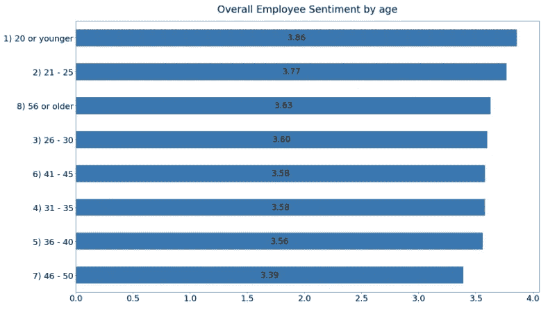

我们可以看到 46-50 岁年龄组得分最低。

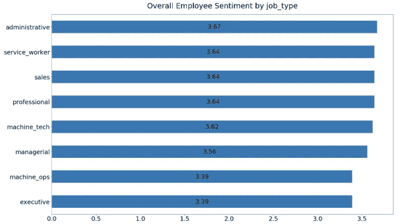

不出所料，高管在总体情绪上得分特别低，因为他们中有 38%的人是被非自愿解雇的，但我们也必须记住，有 33%的人是被自愿解雇的。我们肯定要调查高管在哪些具体因素上得分特别低。最后，machine_ops 在总体情绪上得分同样较低(3.39)，该群体的自愿终止回应率也为 52%。

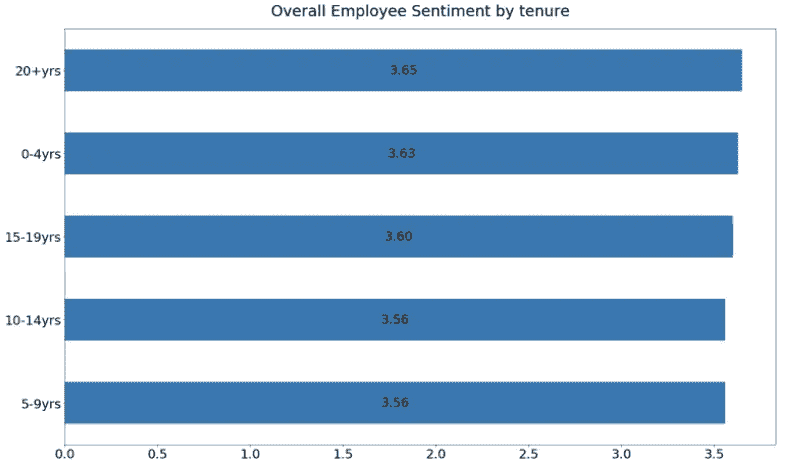

最后，我们看不出终身职位群体的总体情绪有任何特别的差异。

总之，人力资源、生产和销售的总体情绪最低，人力资源得分(3.39)。由于生产和销售部门的受访者人数最多，我们需要检查这些部门在哪些具体因素上得分最低。非自愿离职的情绪最低(3.42)，这并不奇怪，但自愿离职的平均情绪第二低，同时拥有最多的调查受访者。最后，我们看到高管和机器操作工作类型的情绪最低(3.39)。然而，还需要额外的分析来确定这种关系的性质。

# 平均整体潜在因素情绪

```
emp_value_avg = round(np.mean(df['employee_valued']),2)
mgmt_sati_avg = round(np.mean(df['mgmt_sati']),2)
job_sati_avg = round(np.mean(df['job_satisfaction']),2)
team_sati_avg = round(np.mean(df['team_satisfaction']),2)
training_sati_avg = round(np.mean(df['training_satisfaction']),2)
org_env_avg = round(np.mean(df['org_environment']),2)
work_life_avg = round(np.mean(df['work_life_balance']),2)
overall_sati = round(np.mean([emp_value_avg, mgmt_sati_avg, job_sati_avg, team_sati_avg,
                            training_sati_avg, org_env_avg, work_life_avg]), 2)
temp_dict = {'emp_value_avg': emp_value_avg, 'mgmt_sati_avg': mgmt_sati_avg,
                      'job_sati_avg': job_sati_avg, 'team_sati_avg': team_sati_avg, 
                      'training_sati_avg': training_sati_avg, 'org_env_avg': org_env_avg,
                      'work_life_avg': work_life_avg, 'overall_sati': overall_sati}
tmp_df = pd.DataFrame.from_dict(temp_dict, orient='index', columns=['average']).sort_values(by='average')plt.figure(figsize=(25,15))
plt.title('Overall Latent Factor Averages', fontsize=28)
plt.ylabel('Average Employee Rating', fontsize=25)
ax = tmp_df['average'].plot(kind='barh', fontsize=25)
for i in ax.patches:
    width, height = i.get_width(), i.get_height()
    x, y = i.get_xy() 
    ax.text(x+width/2,
            y+height/2,
            '{:.2f}'.format(width),
            horizontalalignment='center',
            verticalalignment='center',
            size=25)plt.grid(False)
plt.show()
```

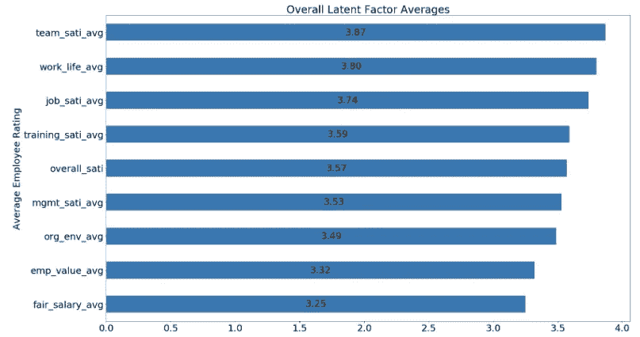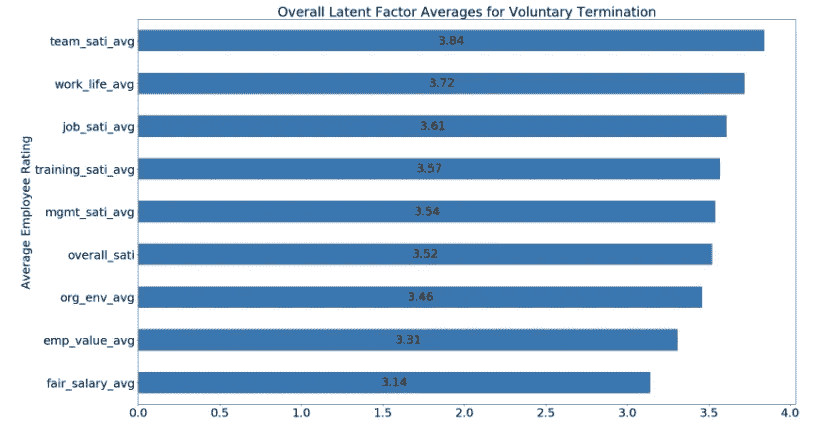

如果我们忽略任何受访者的人口统计数据，并查看我们的潜在情绪因素，我们会看到 fair_salary、emp_value 和 org_env 得分最低。将我们的分析集中在这些因素上是很重要的，以便理解这些因素为什么低，以及它们在组织中的最低位置(即部门、工作类型等。).我们的结果也被确认为自愿终止妊娠。

```
likert = ['promotional_opportunities', 'performance_recognized',
       'feedback_offered', 'coaching_offered', 'mgmt_clear_mission',
       'mgmt_support_me', 'mgmt_support_team', 'mgmt_clear_comm',
       'direct_mgmt_satisfaction', 'job_stimulating', 'initiative_encouraged',
       'skill_variety', 'knowledge_variety', 'task_variety', 'fair_salary',
       'teamwork', 'team_support', 'team_comm', 'team_culture',
       'job_train_satisfaction', 'personal_train_satisfaction', 'org_culture',
       'grievances_resolution', 'co-worker_interaction',
       'workplace_conditions', 'job_stress', 'work/life_balance'] likert_avgs = []
for col in likert:
    likert_avgs.append(round(np.nanmean(df[col]),2)) likert_avgs_df = pd.DataFrame(list(zip(likert, likert_avgs)), columns=['likert_item', 'avg_sentiment'])
likert_avgs_df.set_index('likert_item', inplace=True) plt.figure()
ax = likert_avgs_df.plot(kind='bar', figsize=(25,15), fontsize=20)
for i in ax.patches:
        width, height = i.get_width(), i.get_height()
        x, y = i.get_xy() 
        ax.text(x+width-0.25,
                 y+height+.1,
                 '{:.2f}'.format(height),
                 horizontalalignment='center',
                 verticalalignment='center',
                 size=20)
plt.title('Average Overall Likert Item Sentiment', fontsize=30, pad=25)
plt.legend().remove()
plt.xlabel(' ')
```

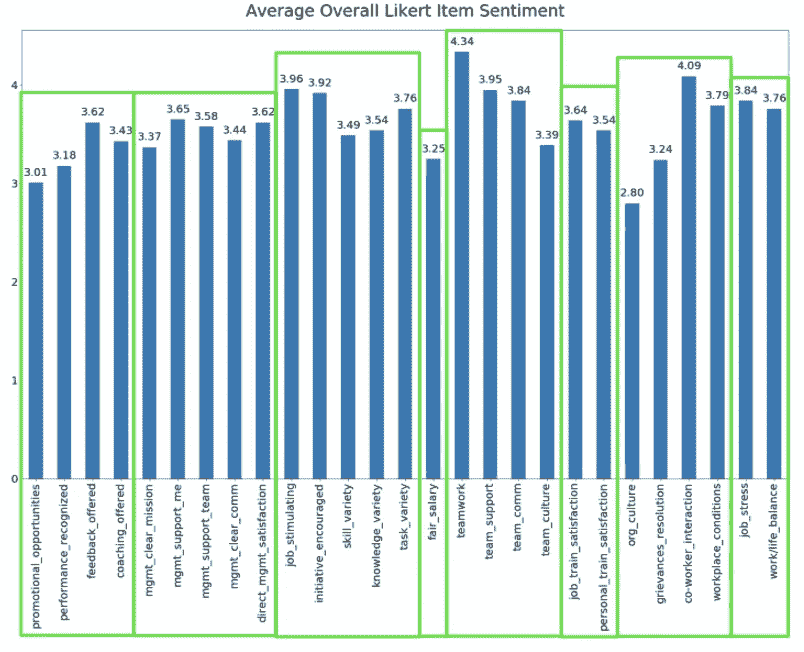

通过检查构成每个潜在因素的 Likert 项目，我们可以看到晋升机会和绩效认可对员工价值的低情绪贡献最大。虽然我们希望看到不止一个 Likert 项目来评估工资满意度，但我们可以更详细地检查 fair_salary，以确定这种情绪在哪里特别低。最后，组织文化和不满解决似乎是导致组织环境情绪低落的最主要原因。

# 被调查者特征潜在构念情感

> 当分析调查数据时，很容易陷入众所周知的图表和绘图的兔子洞，却看不到你的目标。换句话说，我们需要缩小关注范围。分析情绪调查的最终目标是识别薄弱环节，在这些环节中可以实施组织计划来改进这些已识别的环节。我们主要关注的领域是自愿终止妊娠。首先，他们几乎占受访者的 50%。第二，这是我们可以对使用组织计划产生最大影响的员工群体。最后，我们希望限制自愿离职的数量，以限制组织的知识流失，并最大限度地减少与雇用替代员工相关的招聘和培训成本。

```
# plotting average likert sentiment by respondent characteristics for voluntary terminations
def bi_volterm_plot(feature1, feature2):
    tmp_df = df.loc[(df['reason_of_term']=='vol_term')]
    ax = round(tmp_df.groupby(feature1)[feature2].mean(),2).sort_values().plot(kind='barh', stacked=True,
                                                              figsize=(25,15), fontsize=25)
    for i in ax.patches:
        width, height = i.get_width(), i.get_height()
        x, y = i.get_xy() 
        ax.text(x+width/2,
                 y+height/2,
                 '{:.2f}'.format(width),
                 horizontalalignment='center',
                 verticalalignment='center',
                 size=25)
    plt.title('Average {} Sentiment of Voluntary Terminations by {}'.format(feature2, feature1),fontsize=30, pad=25)
    plt.ylabel(' ')
    plt.legend(prop={'size':20})
```

## 员工价值因素

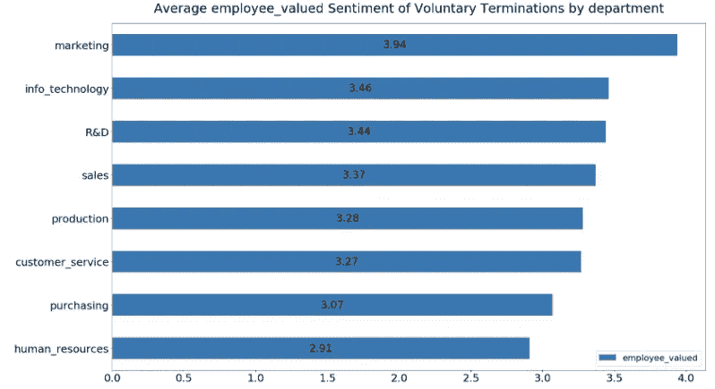

毫不奇怪，人力资源部门的自愿离职在 emp_value 上得分最低，因为人力资源部门的整体情绪最低。此外，采购、客户服务和生产得分也相对较低。这一点很重要，因为生产和客户服务部门拥有最多的调查对象。

因为我们知道晋升机会和公认的绩效是低员工价值情绪背后的主要驱动因素，所以我们根据部门、年龄和工作类型绘制了这些李克特项目。

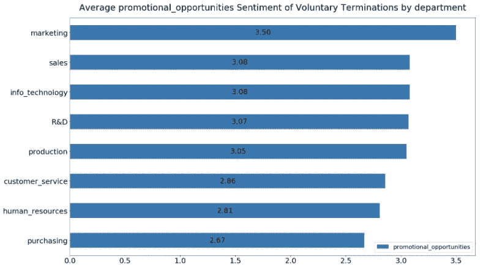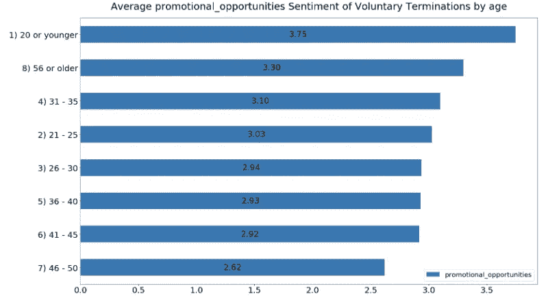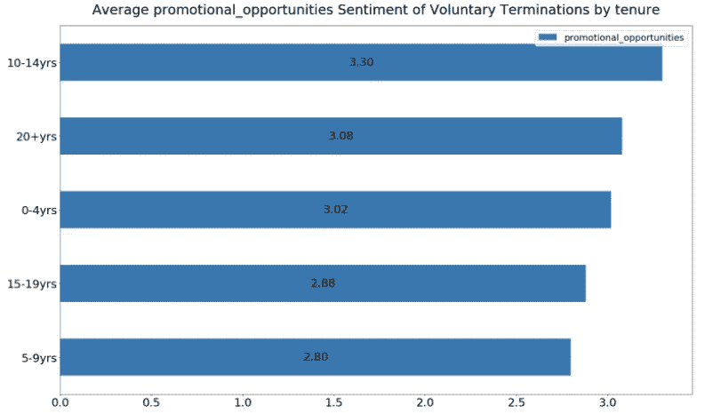

仅过滤自愿离职的数据，我们可以看到大多数部门在晋升机会方面得分较低，但客户服务、人力资源和采购得分特别低。年龄得分特别低，因为 21-50 岁之间自愿离职的员工在晋升机会情绪方面得分非常低。46-50 岁年龄组在这个李克特项目上得分很低(2.62)。主动离职的高管、管理人员、机器操作人员和服务人员工作类型在晋升机会情绪方面得分较低，高管得分非常低(2.17)。最后，除了 1-14 岁，所有终身职位组在晋升机会上得分较低，但 5-9 岁得分尤其低(2.80)。

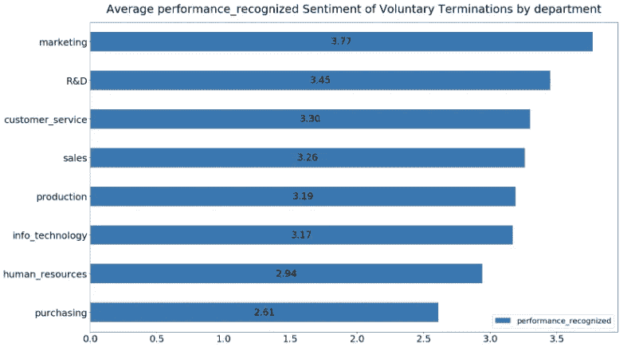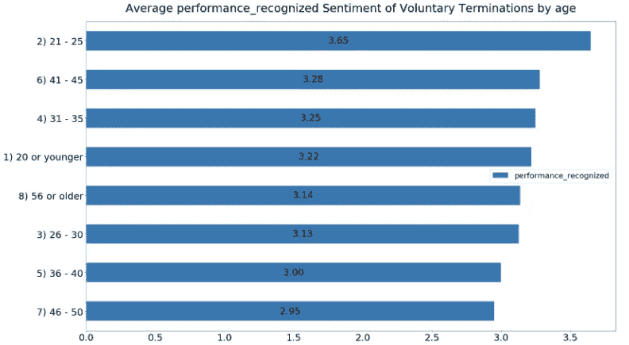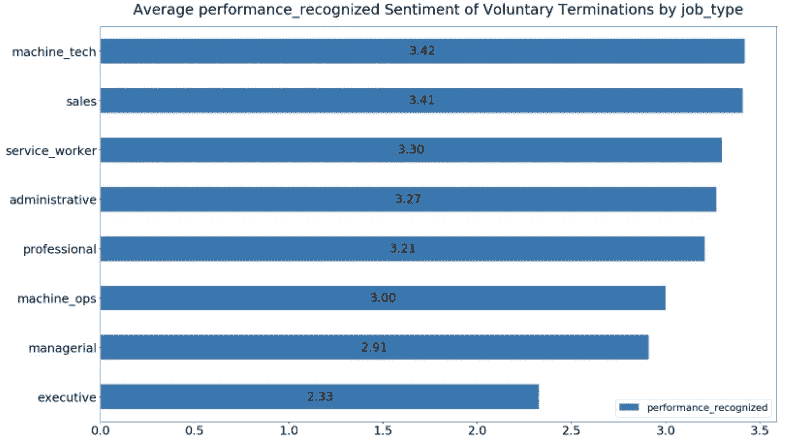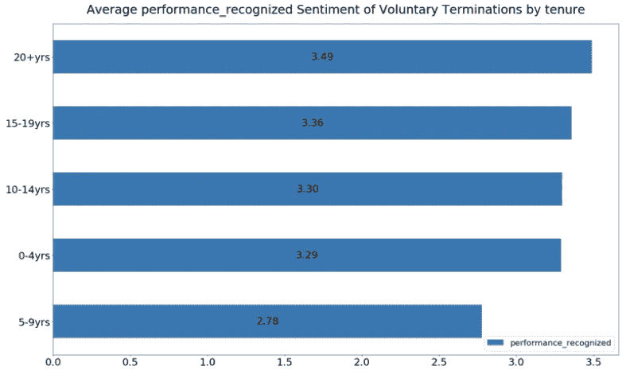

我们再次看到采购和人力资源在公认绩效方面得分最低，但 IT 和生产部门的满意度也相当低。从员工年龄的角度来看，26-50 岁的得分最低，而且这些年龄组在晋升机会方面得分也很低。我们再次看到行政、管理和机器操作工作类型得分最低。最后，就像我们看到的晋升机会一样，5-9 岁的任期组在公认绩效方面得分最低。

# 公平工资因素

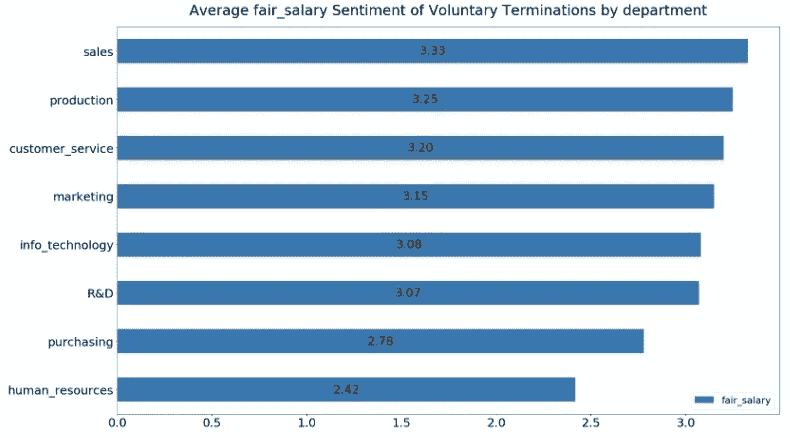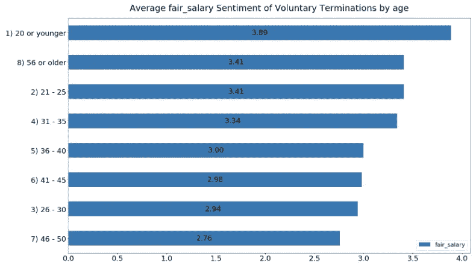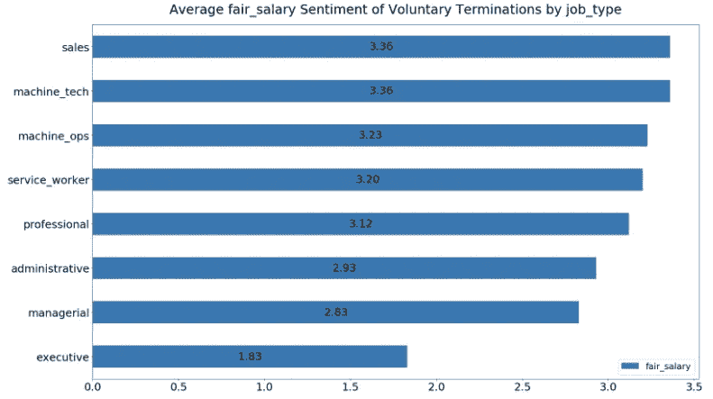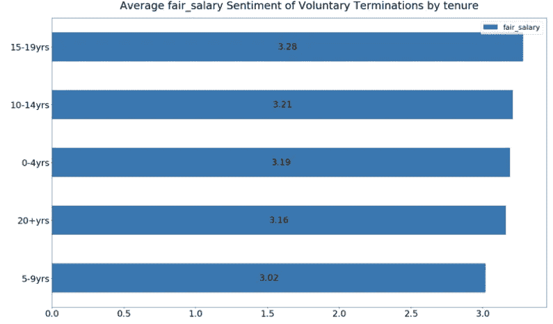

Fair_salary 在受访者的总体情绪中得分第二低。现在我们已经过滤了自愿离职的数据，让我们看看哪里的薪资情绪最低。不出所料，人力资源和采购部门得分最低。然而，倾向于在许多李克特项目上得分较低的产品实际上得分相对较高。也就是说，我们确实看到 R&D 和 IT 在这个李克特项目上得分较低。46-50 岁的人再次得分较低，他们的平均情绪得分为(2.76)。主管、管理和行政工作类型在 fair_salary 中得分最低。最后，5-9 岁的任期组得分最低。

## **组织环境因素**

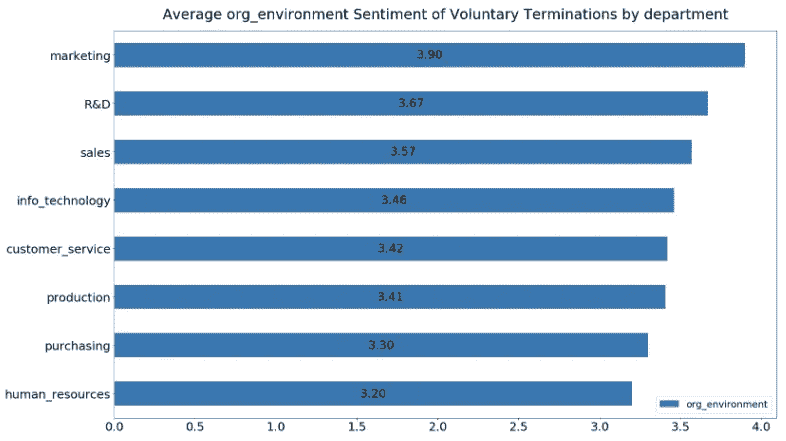

我们知道，就整体情绪而言，组织环境因素排名倒数第三。当我们过滤自愿离职时，我们看到人力资源部和采购部在这一因素上得分最低。让我们把这个因素分解成各个李克特项目。

我们从上面的分析中看到，组织文化和不满解决是李克特的两个项目，这两个项目似乎对组织环境的低整体情绪贡献最大。

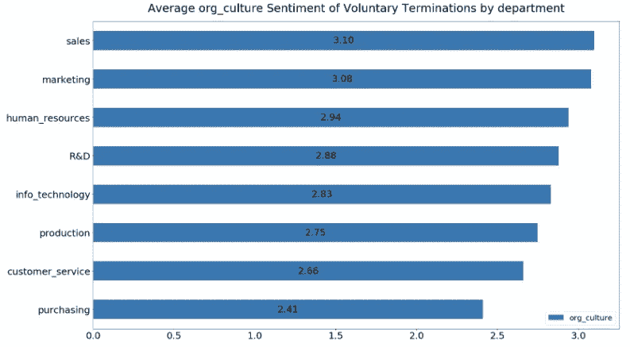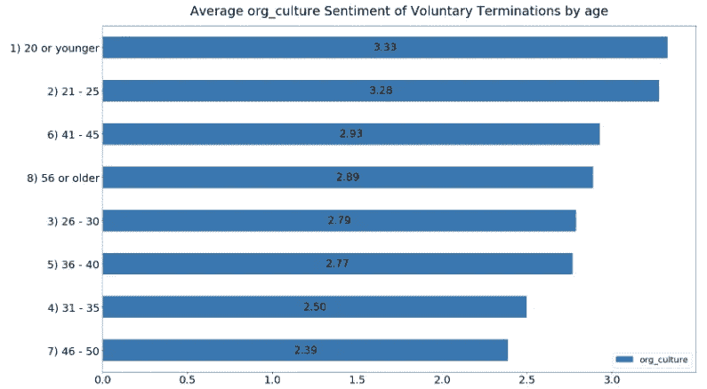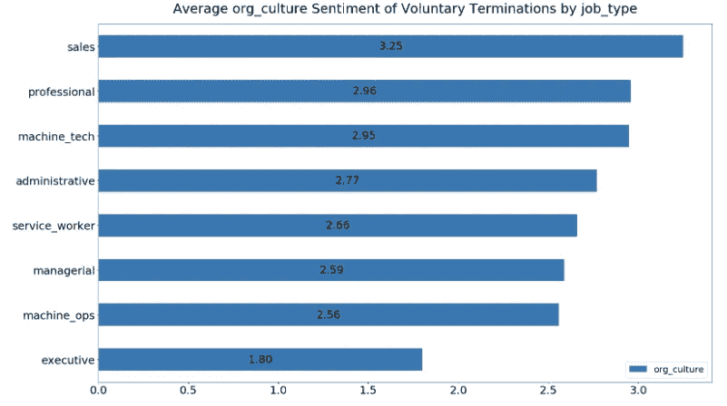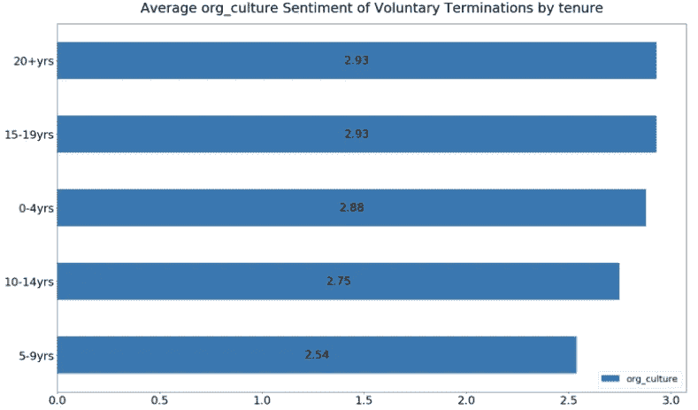

看起来组织文化在所有部门的得分都很低，有时非常低。从年龄的角度来看，46-50 岁的人的 org_culture 最低，但 26-50 岁的人的 org _ culture 普遍较低。高管在李克特项目上得分极低(1.80)，其次是机器操作和管理。也就是说，除了销售，所有工作类型的平均得分都低于 3.00。最后，从任期的角度来看，所有任期组的得分都低于 3.00，5-9 岁组的得分特别低。

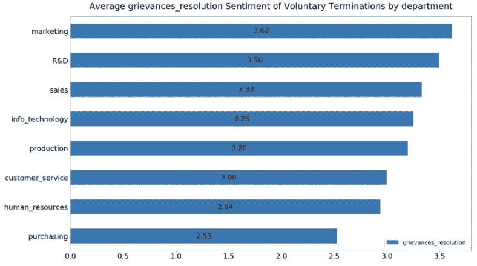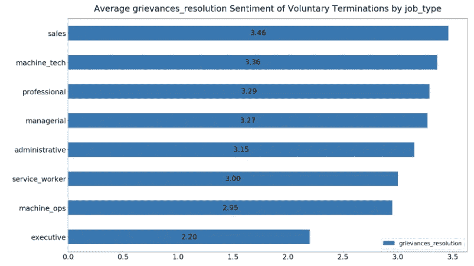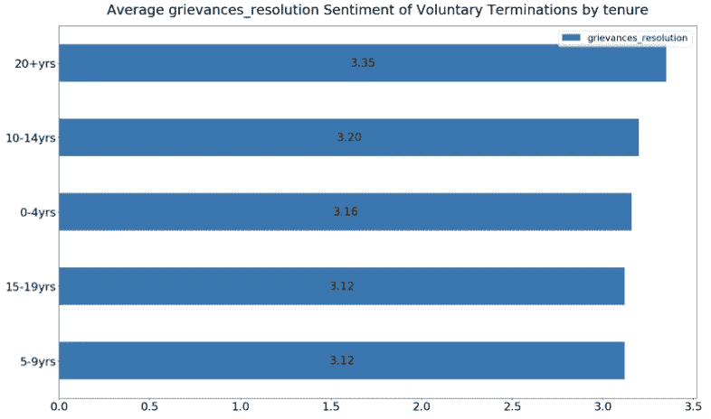

采购、人力资源、客户服务和生产部门再次在申诉解决方面得分最低。在年龄组中，我们再次看到 46-50 岁的受访者情绪最低落。高管和机器操作人员对解决不满的情绪最低。最后，5-9 年任期组在李克特项目上得分最低，非常像组织文化。

# 概括起来

## 受访者的特征

自愿终止妊娠构成了最大的调查对象群体，接近 50%。这是个好消息，因为它让我们有足够的数据来洞察一个特别重要的群体的组织情绪。了解自愿离职发生的潜在原因可以帮助公司减少人员流动，从而最大限度地减少知识流失和招聘成本。

从部门角度来看，生产(32%)、客户服务(19%)和销售(16%)构成了大部分调查反馈。尽管其余部门的回复率明显较低，但他们的回复数量并没有低到足以证明他们的见解毫无意义。

56 岁及以上的受访者构成了最大的群体(23%)，其余群体相对均衡，20 岁及以下的受访者仅占 2.3%。通过按终止原因对这些数据进行切片，我们可以看到 56 岁及以上的应答者中有 54%正在退休。

女性回答调查的比例几乎是男性的 2:1。

工作类型在调查中表现得相当均衡，服务人员(19%)、专业人员(17%)和销售人员(14%)位居前三。高管回答调查的比例最低(3%)，只有 24 人回答。24 是一个相对较低的响应数，可能会产生不准确的结果。此外，行政工作类型的非自愿离职比例最大(38%)，我们知道非自愿离职倾向于产生更负面的整体情绪。任何关于高管群体的见解都必须经过更大样本量的仔细审查和验证。

最后，组织任期产生平均 20%每个任期组响应的平均表示。

## 整体员工情绪

正如预期的那样，非自愿终止的平均情绪最低，但紧随其后的是自愿终止。似乎人力资源、生产和销售部门的整体情绪最低。此外，年龄在 46-50 岁之间以及行政、机器操作和管理工作类型的受访者整体情绪最低。

总体情绪最低的三个潜在因素是薪酬满意度(3.14)、员工价值(3.31)和组织环境(3.46)。如果我们检查这三个潜在因素的 Likert 项目/问题，我们可以看到，晋升机会和绩效认可对员工价值的影响最小。公平薪酬对薪酬满意度的影响最低。最后，组织文化和不满解决对组织环境的总体情绪最低。

## 自愿离职情绪

当具体观察自愿终止妊娠的人群时，我们看到了与上述类似的结果。薪资满意度、员工价值和组织环境的整体情绪最低。晋升机会和绩效认可再次成为员工价值情绪低落的驱动因素。公平工资是低工资满意度的主要驱动力。最后，组织文化和不满解决在组织环境潜在因素上得分最低。

**晋升机会(员工价值)**

大多数部门都需要改善晋升机会，但采购、人力资源、客户服务和生产部门最需要阻止自愿离职。此外，在大多数年龄组，尤其是 46-50 岁的人群中，晋升机会情绪似乎很低。行政人员、管理人员、机器操作人员和服务人员工作类型最缺乏晋升机会。最后，5-9 岁的终身雇员对晋升机会的情绪最低。

**绩效认可(员工价值)**

采购和人力资源部门受到了低绩效认可的困扰。46-50 岁的人、行政人员、管理人员和机器操作人员的工作类型对绩效认可的情绪也很低。最后，我们再次看到 5-9 年的任期似乎对这一项目的情绪很低。

**公平工资(工资满意度)**

人力资源、采购、R&D 和 IT 部门对他们的薪水的看法最低。年龄较大的群体，尤其是 46-50 岁的人，情绪低落。高管、管理人员和行政人员的薪酬满意度得分最低。

**组织文化(组织环境)**

在整个调查中，似乎组织文化的整体情绪最低。所有部门，尤其是采购、客户服务和生产部门，似乎都受到情绪低落的困扰。年龄和工作类型也是如此，46-50 岁的人和行政人员、机器操作人员和管理人员似乎得分最低。

**申诉解决(组织环境)**

该主题的情绪通常高于组织文化，但它仍然是导致组织环境情绪低落的主要因素。同样的部门，采购、人力资源、客户服务和生产得分最低。随着 46-50 岁的人再次得分最低，这一趋势还在继续。管理人员、机器操作人员和服务人员得分也最低。

# 行动纲要

我们将注意力集中在分析一项员工离职调查上，该调查是在 4 年前从大约 600 名员工中收集的。绝大多数调查应答者(50%)是自愿终止妊娠的。生产、客户服务和销售部门构成了大多数受访者。整体受访者的年龄略有倾斜，因为最大的群体是 56 岁及以上。最后，工作类型按比例表示。

非自愿终止妊娠的总体情绪最低，紧随其后的是自愿终止妊娠。总体而言，薪酬满意度、员工价值和组织环境的情绪最低。这些结果也在自愿终止的样本中得到证实。

然后分析特别集中在自愿终止的样品上。似乎为了提高员工的整体情绪并潜在地减少自愿离职，组织需要将其计划集中在改善晋升机会、绩效认可、薪酬、组织文化和申诉解决上。

任何旨在改善上述领域以潜在阻止自愿离职的举措最好针对采购、人力资源、客户服务和生产部门(根据需要)。此外，年龄在 46-50 岁、26-30 岁和 36-40 岁之间的员工也将从任何和所有计划中受益。从工作类型的角度来看，管理人员、机器操作人员、管理人员和服务人员也将从这些计划中受益(按需求排序)。值得注意的是，高管工作类型的样本量很小(24)，其中只有三分之一是自愿离职。总体而言，该调查的样本量相对较小(600 人)，因此，建议通过更大的调查样本来验证这些结果。也就是说，这些结果确实提供了对可能存在于内部的组织问题的一点了解。