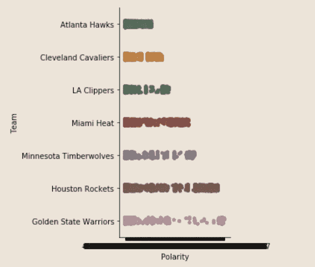
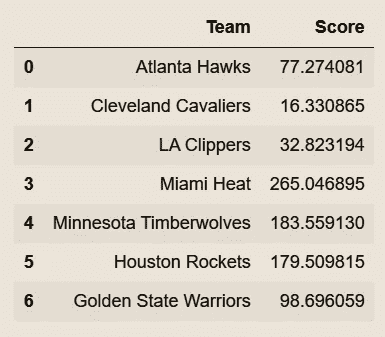
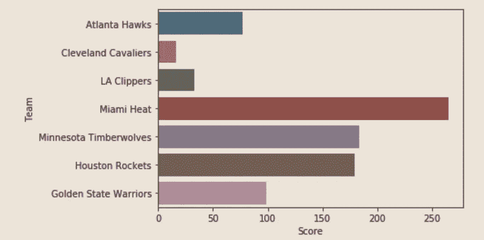

# NBA 交易截止后的球迷情绪分析

> 原文：<https://towardsdatascience.com/analyzing-fan-sentiments-after-nba-trade-deadline-1b73f72d0ca2?source=collection_archive---------33----------------------->


在 [Unsplash](https://unsplash.com?utm_source=medium&utm_medium=referral) 上[点特乡绅](https://unsplash.com/@diante21?utm_source=medium&utm_medium=referral)的照片

## 通过推特上关于截止日期前交易的信息来了解球队的整体球迷情绪。

# 介绍

今年我们看到了一些最大和最令人惊讶的季中交易。随着一些明显的赢家和其他人对其选择的怀疑，这显然是一个复杂情绪的管弦乐队。然而，在我解释我写这篇文章的原因之前，我想给非 NBA 球迷一些一周前发生的事情的背景。


照片由[拉米罗·皮亚诺罗萨](https://unsplash.com/@rapiana?utm_source=medium&utm_medium=referral)在 [Unsplash](https://unsplash.com?utm_source=medium&utm_medium=referral) 拍摄

随着 2020 年 2 月 6 日 NBA 19-20 赛季交易截止日期的临近，球迷们急切地等待着“Woj 炸弹”的降临，而谣言则通过各种人员在不同的平台上传播开来。关于这些谣言有太多要说的了，因为至少其中一些以某种形式成为了事实。

这真的在 twitter 上引起了爆发，我很享受看着推文滚动，试图抓住每个粉丝的情绪。

球员和媒体的反应很容易推断，但当你有 30 支不同球队的这么多球迷时，你如何确切地分辨谁感到不安，谁没有？一些球队因为失去了一名优秀的球员却没有得到太多的回报而明显感到沮丧，而另一些球队可能会以较小的数量表达他们的不满。


[https://commons . wikimedia . org/wiki/File:2014 _ Toronto _ 猛龙 _fans_Air_Canada_Centre.jpg](https://commons.wikimedia.org/wiki/File:2014_Toronto_Raptors_fans_Air_Canada_Centre.jpg)

所以，我做了一点挖掘，并恢复了过去 10 天中受交易截止日期影响最大的球队的推文。我的目标是了解这些球队的整体球迷情绪，并看看他们如何相互竞争。我将分析的 7 个团队是:

*   亚特兰大老鹰队
*   克利夫兰骑士队
*   洛杉矶快船队
*   迈阿密热火队
*   休斯顿火箭队
*   明尼苏达森林狼队
*   金州勇士队

所以，事不宜迟，让我们开始吧。


谢尔盖·库图佐夫在 [Unsplash](https://unsplash.com?utm_source=medium&utm_medium=referral) 上拍摄的照片

# 该过程

我在 Python (Jupyter)上做了完整的分析，如果你想复制这个过程，我将为你添加我的代码片段。

需要以下库:NLTK、Textblob、Pandas(只需 pip 安装)。

您希望从导入以下内容开始:

```
import pandas as pd
import nltk
nltk.download('stopwords')
import en_core_web_sm
from textblob import TextBlob
import seaborn as sb
from bs4 import BeautifulSoup
```

我将每个团队的所有推文保存为单独的 CSV 文件，所以我上传了以下内容:

```
HawksTweets = pd.read_csv("HawksTweets.csv")
CavaliersTweets = pd.read_csv("CavaliersTweets.csv")
ClippersTweets = pd.)read_csv("ClippersTweets.csv")
HeatTweets = pd.read_csv("HeatTweets.csv")
TimberwolvesTweets = pd.read_csv("TimberwolvesTweets.csv")
RocketsTweets = pd.read_csv("RocketsTweets.csv")
WarriorsTweets = pd.read_csv("WarriorsTweets.csv")
```

然后，我会将它们合并到一个数据集，如下所示:

```
teams = [HawksTweets, CavaliersTweets, ClippersTweets, HeatTweets, TimberwolvesTweets, RocketsTweets, WarriorsTweets]
TeamTweets =  pd.concat(teams)
```

因为我们只想分析英语的推文:

```
TeamTweets = TeamTweets[TeamTweets['Language'] == 'English']
```

现在数据集已经准备好使用 NLTK 了。


照片由[托尔加·阿赫梅特勒](https://unsplash.com/@t_ahmetler?utm_source=medium&utm_medium=referral)在 [Unsplash](https://unsplash.com?utm_source=medium&utm_medium=referral) 上拍摄

# 文本预处理

首先，我们希望将文本标记成单独的单词，这样我们就可以删除停用词、非英语单词和无意义的标签。我们用下面一行来标记:

```
TeamTweets['tokenized_sent'] = TeamTweets.apply(lambda row: nltk.word_tokenize(row['Text']), axis=1)
```

现在我们用漂亮的汤清洗课文:

```
soup = BeautifulSoup(TeamTweets['tokenized_sent'])
text = soup.get_text(strip=True)
TeamTweets['tokenized_sent'] = text
```

接下来，我将定义一个函数来分解文本，并进行一些额外的清理，这可能有助于我们完成这个过程。我还使用来自 NLTK 的英语单词语料库去除了非英语单词。

```
def untokenize(words):
    text = ' '.join(words)
    step1 = text.replace("`` ", '"').replace(" ''", '"').replace('. . .',  '...')
    step2 = step1.replace(" ( ", " (").replace(" ) ", ") ")
    step3 = re.sub(r' ([.,:;?!%]+)([ \'"`])', r"\1\2", step2)
    step4 = re.sub(r' ([.,:;?!%]+)$', r"\1", step3)
    step5 = step4.replace(" '", "'").replace(" n't", "n't").replace(
         "can not", "cannot")
    step6 = step5.replace(" ` ", " '")
    return step6.strip()englang = words = set(nltk.corpus.words.words())
TeamTweets['Sentences'] = TeamTweets['tokenized_sent'].apply(lambda x: [item for item in x if item in englang])
TeamTweets['Sentences'] = TeamTweets['Sentences'].apply(lambda x: untokenize(x))
```

现在，我有了一个包含已处理文本的数据集，它已经准备好进行 TextBlob 的情感分析。


[https://commons . wikimedia . org/wiki/File:2019 _ NBA _ 总决赛 _ 游戏 _2.jpg](https://commons.wikimedia.org/wiki/File:2019_nba_finals_game_2.jpg)

# 情感分析

首先，让我们为分数插入一列:

```
TeamTweets.insert(2, "Score", "", True)
```

接下来，我将定义一个函数，它将为我们的数据帧中的每一行文本提供情感输出。我将对我们的行应用这个函数，并获得每条推文的情感分数。

```
def senti(x):
    return TextBlob(x).sentimentTeamTweets['Score'] = TeamTweets['Sentences'].apply(senti)
```

我们以主观性和极性的形式得到分数。您可以使用下面的方法用 seaborn 来绘制它们:

```
ax1 = sb.catplot(x="Subjectivity", y="Team", data=df)
```


我的 Jupyter 笔记本截图

```
ax2 = sb.catplot(x="Polarity", y="Team", data=df)
```



我的 Jupyter 笔记本截图

现在，让我们通过对项目求和来计算每个团队的总得分。这将给出我们的最终得分，这将是球迷情绪的一个指标。

首先，我创建一个新的数据框，每个团队作为一行。

```
key = {'Team': ['Atlanta Hawks', 'Cleveland Cavaliers', 'LA Clippers', 'Miami Heat', 'Minnesota Timberwolves', 'Houston Rockets', 'Golden State Warriors']}
keydata = pd.DataFrame(key)
```

将团队列为一个列表:

```
teamlist = keydata.Team.tolist()
list2 = keydata.indexteams = []
teams.extend([list(a) for a in zip(teamlist, list2)])
```

最后，我编写了一个函数，根据球队名称计算得分总和:

```
def add_team(team_tuple):

    score = df.loc[(df['Team'] == team_tuple[0]),'Polarity'].sum()
    keydata.loc[keydata.index[team_tuple[1]]] = score
    returnfor team in teams:
    add_team(team)
```

最终的数据框汇总了每个队的得分。根据他们的推文，得分越高，这支球队的球迷情绪就越积极。



我的 Jupyter 笔记本截图

用图表展示我们的最终结果:

```
ax3 = sb.barplot(x="Score", y="Team", data=keydata)
```



我的 Jupyter 笔记本截图

# 结论

我们可以看到骑士队在得到安德烈·德拉蒙德后情绪不佳(考虑到他的合同还有 3 个月到期)，所以他们只拥有他很短一段时间。另一方面，迈阿密热火队在交易了安德烈·伊戈达拉后，似乎得到了球迷们最好的反应。


埃德加·恰帕罗在 [Unsplash](https://unsplash.com?utm_source=medium&utm_medium=referral) 上拍摄的照片

> 感谢你的阅读！希望你学到了新东西。
> 
> 更多类似内容关注我！