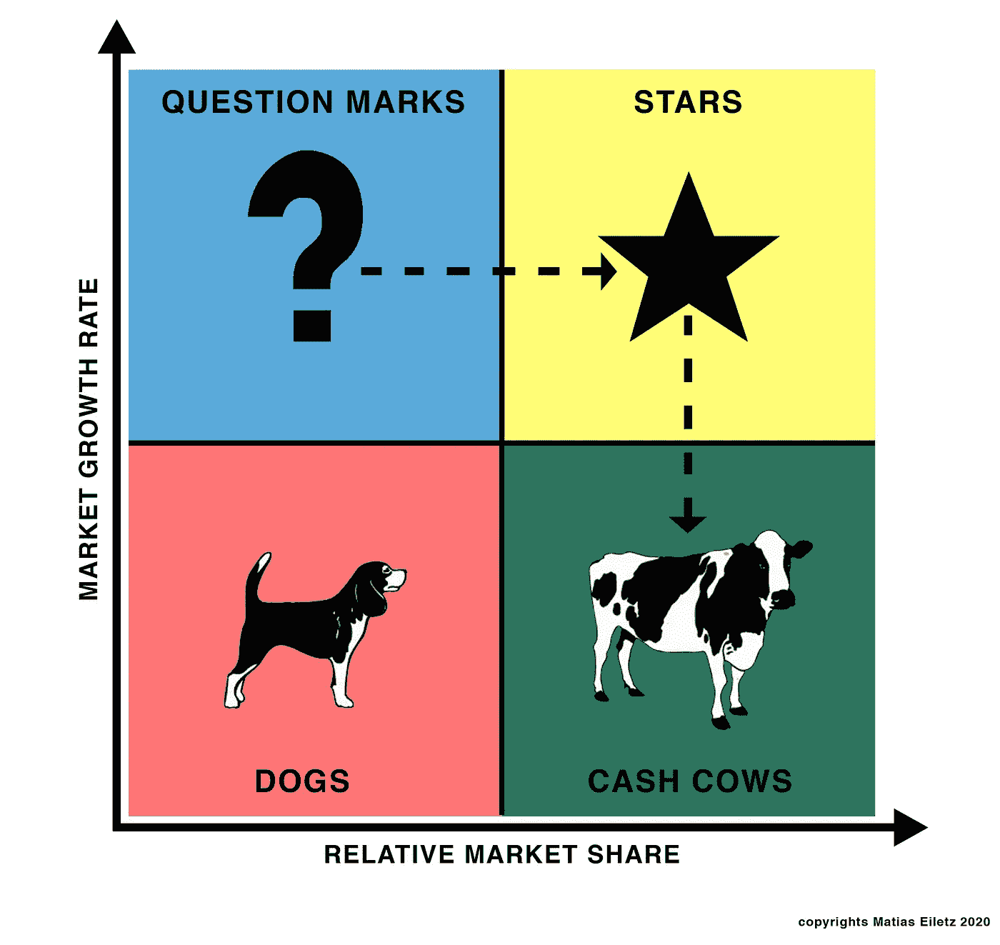

# 用特征重要性分析用户行为和 UX 性能

> 原文：<https://towardsdatascience.com/analyzing-feature-importance-user-behaviour-and-ux-performance-cbf32d55eff8?source=collection_archive---------21----------------------->

## 如何应用商业策略概念进行特性重要性分析。有例子！


图片来自 pexels.com 的 Kaboompics

当我们在数据科学中考虑特征重要性时，我们可能也会考虑特征选择，然后我们的想法可能会最终出现在 scikit-learn 中可以找到的典型分类器算法中，如决策树、回归、随机森林……你能想到的。

这些算法对于捕获数据集中最重要的特征非常有用，然后可能会根据这些特征的重要性创建一个预测模型。

数据科学目前充斥着来自不同背景的人。在我的案例中，作为一名工业工程师，我想到了一种用工业工程方法进行分析的方法。除了学习大量的数学和微积分，我们还学习了策略和流程优化。

在工业工程中学到的一个经典概念是 **BCG 矩阵**(也称为增长份额矩阵)。这是波士顿咨询集团在 70 年代开发的一个概念，用于公司识别并将其产品聚集到不同的类别中，然后使它们在市场中发展，使公司的收入最大化。

如果您不了解 BCG 矩阵，不要担心，请继续阅读本文，您将会了解其中的概念。我还会在文末留下说明链接！

# **商业案例**

假设您是一家电子商务公司的数据科学家，您的经理要求您进行分析，目的是确定他们可以在公司网站中改进的关键功能。通过这种方式，公司将获得更多的用户进行转换(在这种情况下转换可以是购买产品，或购买机票等)。所有公司最终想要的是客户转化更多，这样他们就有更多的收入。

他们可能会问你，*是什么让人们更容易皈依*？

对于这个例子，我从一个虚构的在线销售产品的电子商务公司构建了一个玩具数据集。这家公司的网站具有你可以从这样的网页中期待的典型特征:搜索引擎、搜索后的过滤选项、将产品添加到购物车等。

## 你得到的数据

你能得到的简化的数据库看起来像这样:


包含用户数据事件的熊猫数据框架

我们还可以将该表视为数据透视表，使用以下代码:

```
df['one'] = 1df_pivot = (pd.pivot_table(df
            ,values=['one']
            ,columns=['event']
            ,index=['user_id','converted']
            ,aggfunc = {'one':'sum'}))df_pivot.columns = df_pivot.columns.to_series().str.join('_')df_pivot = df_pivot.reset_index()for col in df_pivot.columns[2:]: df_pivot = df_pivot.rename(columns = {col: col.replace('one_','')})
```

我们得到了这个数据透视表:


前一个数据帧的透视版本

有很多人做的动作，比如做一个**搜索**，然而，没有多少人改变。正因为如此，很难建立一个预测模型，因为只有少数人采取行动，最终导致转变。

我们可以构建一个**决策树**，看看哪些特性是最重要的，看看哪些是阈值，我们已经可以看到明显的转化趋势。主要的问题是:*是什么使人皈依？*


决策树—使用 Graphviz 包

因此，如果用户应用过滤器超过 5 次，并向购物车中添加超过 3 件商品，那么它有很高的转换机会…但它看起来有点太具体，在这个业务案例中没有用，不是吗？

## **让我们看看如果构建波士顿矩阵会发生什么**

我为此构建了一个包(要安装它，在您的终端中运行这个命令: *pip install bcganalysis* )。这是您必须使用的代码，使用类似前面的数据透视表作为输入(访问 [GitHub repo](https://github.com/Mateil04/bcg_analysis) 了解更多细节！)

```
!pip install bcganalysis# we import the package first
from bcg_analysis import Generate_BCG# and matplotlib
import matplotlib.pyplot as plt# then we instantiate the object for the analysis 
# df is the table with the user and events
features = Generate_BCG(df)

# and we get the pivot table
features.get_pivot(index=['user_id','converted'],columns='event')

# then we generate the chart with penetration and conversion
features.generate_chart(threshold=1)# and then we plot it
features.plot_bcg() 
```

(*)关于如何应用代码的更详细的方法，请看我的 Github 中的自述文件:[https://github.com/Mateil04/bcg_analysis](https://github.com/Mateil04/bcg_analysis)。在这里，您可以使用回购中可用的玩具数据集进行示例。


我们得到的情节

在 x 轴上，它显示了有多少用户已经使用了每个功能至少一次，我们称之为*渗透*。也可以认为是该功能的*流行度*。

在 y 轴上，我们可以看到*转换*，这是在所有使用过该功能的用户中，有多少人最终进行了转换。

例如，几乎所有的用户(大约 80%)都在进行搜索操作，但是在所有执行这个操作的用户中，大约 20%的人会转换。这是因为这是一个非常常见的动作，几乎每个用户都会做。它让网站持续滚动，但不能保证转化。

另一方面，如果我们看一下 add_to_cart 动作，我们会看到它是由少数用户(渗透率~20%)完成的，但这些用户的转化率非常高(~75%)。

这就是 BCG 矩阵的用武之地(它不是严格意义上的矩阵，但它就是这么叫的！)



BCG 矩阵—图片由 Matias Eiletz 提供

波士顿矩阵最初被认为是用来评估一家公司的产品在市场上的成功和市场份额。

例如，你可以考虑麦当劳公司，把巨无霸作为摇钱树，因为它是非常受欢迎的经典产品，总能带来一些收入。纯素汉堡可以在问号象限，因为现在纯素食品非常流行，而且肯定有很大的潜力，但它必须在市场上取得成功，才能成为明星产品并带来最大的收入。一个鱼汉堡可以在狗象限。这可以是这样的情况，一个产品曾经是一个问号，但没有通过测试，最终没有流行起来。

产品的所需运动用虚线箭头表示。

卡介苗矩阵的 x 轴是市场份额，y 轴是增长率。在我们的业务案例中，我们为了渗透(流行)和转换而改变了它们，但是本质是一样的。


卡介苗矩阵-改编-马蒂亚斯·埃列茨拍摄的图像

回到生成的图，我们可以看到:


**问号象限**中的功能(add_to_cart，apply_filter)是具有很大潜力但尚未被开发的功能。我们希望它们变得更受欢迎，并像那样，成为我们未来的**之星**特色(高渗透率，高转化率)。为了实现这一点，您可能会建议 UX 团队改变这些功能在网站上的显示方式，例如颜色和大小，以突出显示它们。然后，他们会得到更多的点击，将会有更多的整体转换(这一功能被转换成了星形象限)。

**犬类象限**中的特征，它们可以被省略并替换为其他特征。这个例子中的“看稀有”按钮似乎没有吸引很多人，也不会触发转换，所以最好考虑另一个不同的功能来代替它。

**摇钱树**是那些没有太多转换的功能，但是它们非常受欢迎，并且让网站的用户流量很大。在我们的案例中，搜索并点击一篇又一篇的文章，就是明显的例子。

最终，如图表所示，星星将在某个时候传给奶牛，我们将需要找到更多的特征作为问号，比如在主页上一个全新的部分，然后成为我们的新星星。

## **总结**

在本文中，我展示了如何执行与 UX 设计相关的功能重要性分析，评估用户行为。它也可以被认为是一种聚类方法。

如果您想查看包的代码，可以在我的 [GitHub](https://github.com/Mateil04/bcg_analysis) 中查看。

如果您想了解更多关于卡介苗基质的信息，您可以查看这篇[维基文章](https://en.wikipedia.org/wiki/Growth%E2%80%93share_matrix)或这篇其他[帖子](https://www.feedough.com/what-is-a-bcg-matrix-examples-how-to-guide/)。