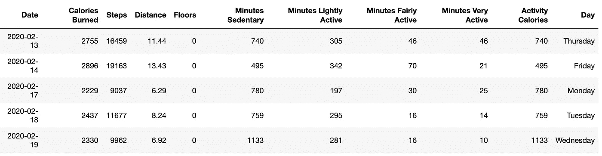
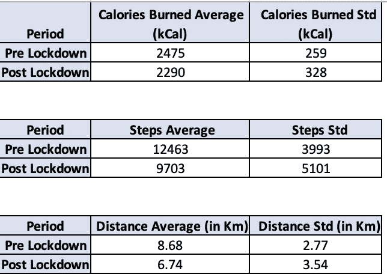
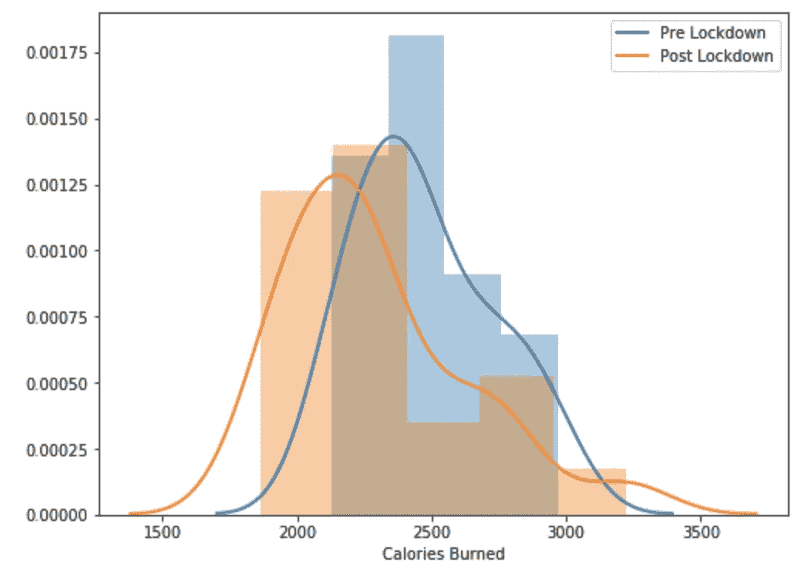
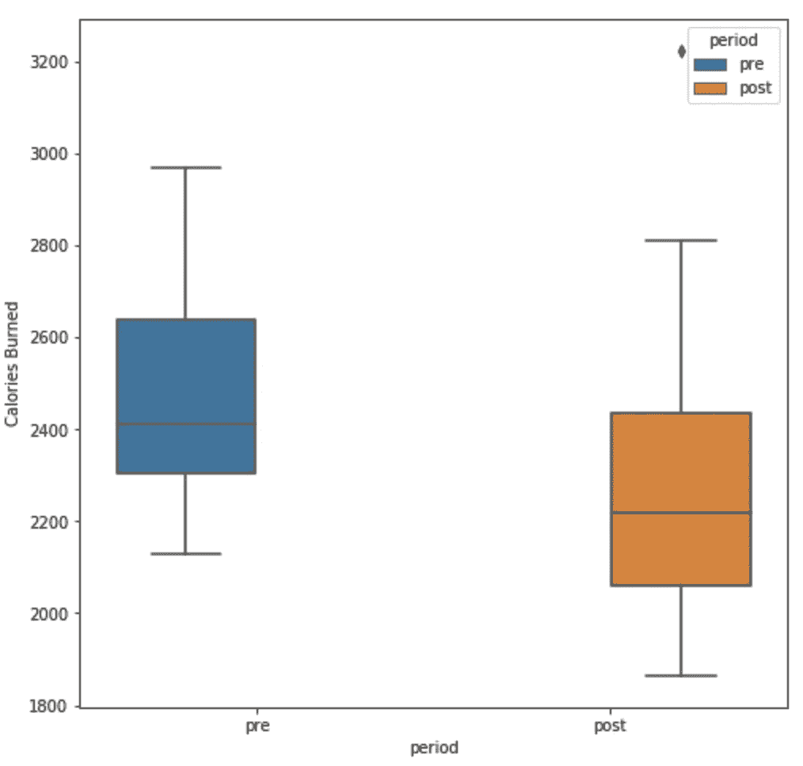
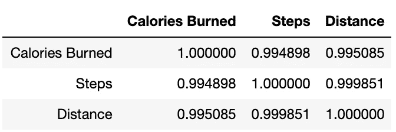
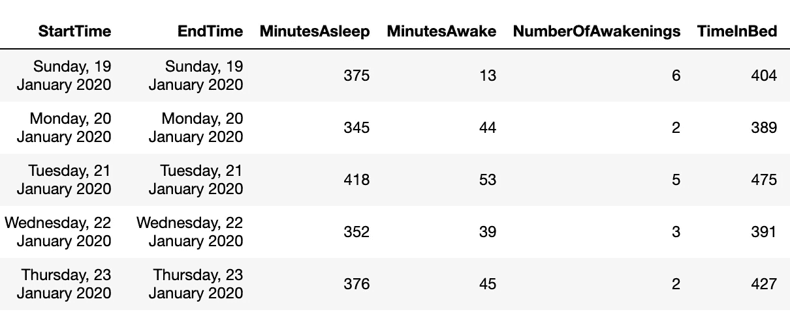
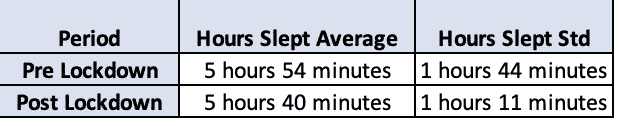
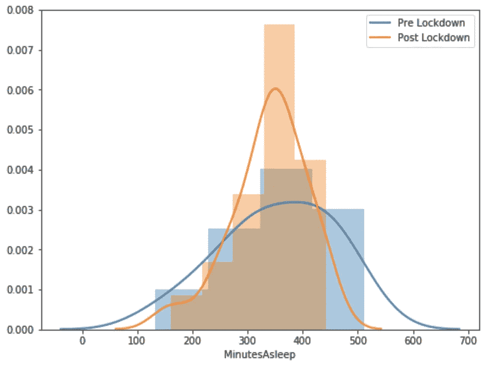
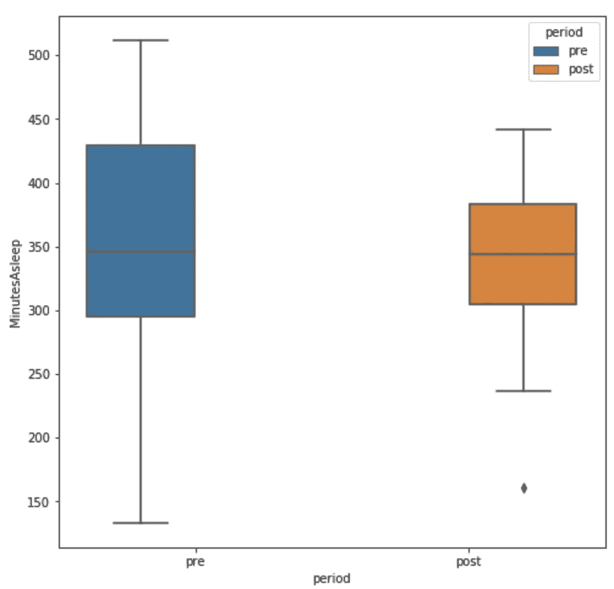
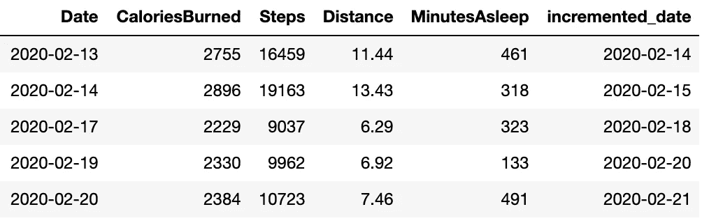

# 分析 Fitbit 数据，揭开疫情封锁期间身体模式变化的神秘面纱

> 原文：<https://towardsdatascience.com/analyzing-fitbit-data-to-demystify-bodily-pattern-changes-amid-pandemic-lockdown-5b0188fec0f0?source=collection_archive---------21----------------------->

## 健康分析:了解锻炼、睡眠、卡路里燃烧模式，并朝着正确的方向优化


疫情禁闭后在家锻炼

在过去的四年里，我一直定期锻炼。由于疫情的局势，这是我第一次这么长时间不能去健身房或使用任何设备。希望我们大多数人都面临着同样的问题。我们都知道呆在家里[拉平疫情曲线](https://www.nytimes.com/article/flatten-curve-coronavirus.html)有多重要。

然而，我们仍然可以通过呆在家里来尽力保持健康。我一直在我的阳台/露台上锻炼，用楼梯作为引体向上的杠，一根长杆作为我的重量(幸运的是我找到了它)，做几个俯卧撑和一个阻力管，这是我过去在旅行中买的。

为了量化家庭锻炼的效果，我下载了我的 [Fitbit](https://en.wikipedia.org/wiki/Fitbit) 数据，做了一些预处理，并将其标记为锁定前后的数据。主要目的是了解:

> 什么是不同的 Fitbit 度量？他们之间有什么关系吗？
> 
> 我在禁闭前后消耗的卡路里是怎样的？
> 
> 我能在家燃烧/达到同样的强度吗？
> 
> 这两个时期我的睡眠模式有什么变化？
> 
> 我可以根据这一分析创建智能推荐吗？比如我的身体需要睡几个小时才能恢复？
> 
> 作为分析的结果，我可以进一步优化什么？

通过这篇博文，我打算对数据进行分析，找到上述问题的答案。这篇文章也是一个很好的例子，告诉我们如何利用分析来变得健康和健美。我们如何从数据中获得洞察力，并创建关于睡眠、锻炼提醒、锻炼赞赏徽章等的智能建议。我已经在这里提供了数据和代码[。让我们开始有趣的东西。](https://github.com/samread81/Fitbit-Health-Analytics)

# 在家锻炼时面临的挑战

> 在跳到代码和找到见解之前，我想指出我在家庭锻炼中面临的挑战，这些挑战使我深入挖掘并进行这一分析。

我一直在尽最大努力用我能找到的任何东西来保持我的健康。我面临的主要挑战是-

## 1.重量和设备的缺失

在健身房，我做了 110 公斤(242 磅)的深蹲，120 公斤(265 磅)的 T2，硬拉等等。在家里，我不能设法得到这样的重量级人物。所以，我用我得到的更轻的竿增加了重复次数。

我没有合适的引体向上或引体向上杆，所以我只能在楼梯上做。我在大部分练习中使用阻力管。重量/张力变小了，所以我再次增加了重复次数。但是，缺少重量和设备仍然是一个挑战。

我发现了一篇[有趣的文章](https://www.verywellfit.com/are-you-lifting-enough-weight-1231071)，文章称举重会导致肌肉增长，从而燃烧更多的卡路里。所以，举重是关键。

[](https://www.verywellfit.com/are-you-lifting-enough-weight-1231071) [## 为什么举重是减肥的关键

### 如果你曾经举过重物，你可能不止一次想知道你应该举多少重量。你是…

www.verywellfit.com](https://www.verywellfit.com/are-you-lifting-enough-weight-1231071) 

## 2.空间不足

我不能出去跑步或散步，因为现在很危险。为此，我在瑜伽垫上做有氧运动。

这里是我在家做的一些锻炼来保持我的健康。下面你可以观察到的一件事是我一直戴着一个 Fitbit。


在家锻炼:俯卧撑


在家锻炼:引体向上和阻力管


在家锻炼:二头肌弯曲和深蹲

# 需要注意的重要事项

一个人的卡路里摄入量取决于他们的性别、年龄、身高和体重。有在线计算器可以用来计算。人们也可以使用性别、年龄、身高和体重信息来计算身体质量指数(身体质量指数)。

同样，燃烧的卡路里数量取决于性别、年龄、身高和体重因素。[在线计算器](https://nutritiondata.self.com/tools/calories-burned)可用于计算。

[](https://nutritiondata.self.com/tools/calories-burned) [## 身体质量指数和卡路里计算器

### 这个计算器估计你在运动和日常生活中燃烧的卡路里数量。报告生成了…

nutritiondata.self.com](https://nutritiondata.self.com/tools/calories-burned) 

# 活动数据分析和有趣的见解

Fitbit 提供的两个重要文件是活动数据和睡眠数据。让我们看一看它



活动数据

我将数据分别标记为锁定前(2020 年 3 月 15 日之前)和锁定后(2020 年 3 月 15 日当天和之后)。我还删除了周末的数据，因为我通常不会在周六和周日锻炼，给我的身体休息和恢复时间。

## 度量分析



锁定前后指标的变化

我们来看看[散点图](https://pythonbasics.org/seaborn-distplot/) ( [柱状图](https://en.wikipedia.org/wiki/Histogram))和[箱线图](https://en.wikipedia.org/wiki/Box_plot)。有时，平均值可能是一个有偏差的参数，因此应该查看百分位数[分布。](https://en.wikipedia.org/wiki/Percentile)

```
metric = 'Calories Burned'
#Equally dividing Pre-Post Data into 21 Percentile buckets
bins = 21
percentile_bins = np.linspace(0,100,bins)
pre_bins = np.percentile(df_exercise_preLockdown[metric], percentile_bins)
post_bins = np.percentile(df_exercise_postLockdown[metric], percentile_bins)
sns.distplot(pre_bins,kde_kws={ "lw": 2, "label": "Pre Lockdown"},axlabel=metric)
sns.distplot(post_bins,kde_kws={ "lw": 2, "label": "Post Lockdown"})
plt.show()
```



锁定前和锁定后消耗的卡路里散点图(直方图和 Kde 图的组合)



锁定前和锁定后消耗的卡路里箱线图

在封锁期后，燃烧的平均卡路里从 2475 千卡减少到 2290 千卡。大约下降了 7.5%。

```
5-Days with Minimum Calories Burned during Pre-Lockdown Period
**2128, 2154, 2203, 2229, 2330**
5-Days with Maximum Calories Burned during Pre-Lockdown Period
**2597, 2755, 2755, 2896, 2969**5-Days with Minimum Calories Burned during Post-Lockdown Period
**1864, 1921, 1935, 1959, 1962**
5-Days with Maximum Calories Burned during Post-Lockdown Period
**2688, 2729, 2777, 2827, 3224****All units in Kcalorie*
```

另一件有趣的事情是一致性也降低了。与封锁前相比，封锁后燃烧的卡路里有显著的差异。从图和计算的标准偏差可以清楚地看出这一点。我有点知道原因了。在办公室，我经常从办公桌走到会议室，午饭后也会和同事一起散步。在封锁前，我的健身时间是一致的，但现在在家里，我偏离了固定的日程，有时开始得晚，结束得快。 ***宾果！！我发现了改进的余地。一致性是关键。***

## 度量之间的关系

我还想找出所走的步数、走过的距离和燃烧的卡路里之间的关系。无论从直觉上还是从数据上看，它们似乎都是正相关的。让我们来验证相关性的数量或强度。



度量之间的相关性

> 所有指标都与相关系数为 1 的[完全相关。这基本上意味着，如果我们知道 Fitbit 使用的正确公式，我们就可以使用消耗的卡路里精确地推导出步数和距离。也表示关系/公式为](https://en.wikipedia.org/wiki/Correlation_and_dependence)[线性](https://en.wikipedia.org/wiki/Linear_function)。

# 睡眠数据分析和有趣的见解

我们来看看睡眠数据。我已经标记了封锁前后的数据。



睡眠数据

## 度量分析



锁定前后睡眠指标的变化

我们来看看[距离图](https://pythonbasics.org/seaborn-distplot/) ( [直方图](https://en.wikipedia.org/wiki/Histogram))和[箱线图](https://en.wikipedia.org/wiki/Box_plot)。有时，平均值可能是一个有偏差的参数，因此我们可以查看百分位数分布。

```
metric = 'MinutesAsleep'
#Equally dividing Pre-Post Data into 21 Percentile buckets
bins = 21
percentile_bins = np.linspace(0,100,bins)
pre_bins = np.percentile(df_sleep_preLockdown[metric], percentile_bins)
post_bins = np.percentile(df_sleep_postLockdown[metric], percentile_bins)
sns.distplot(pre_bins,kde_kws={ "lw": 2, "label": "Pre Lockdown"},axlabel=metric)
sns.distplot(post_bins,kde_kws={ "lw": 2, "label": "Post Lockdown"})
plt.show()
```



锁定前和锁定后的睡眠分钟数分布图(直方图和 Kde 图的组合)



锁定前和锁定后期间的睡眠分钟数(以分钟为单位)箱线图

这些年来，我的身体一直在训练自己减少睡眠，同时保持活跃。有一些文章围绕着睡眠需求因人而异的主题。这取决于基因和身体多年来的训练方式等因素。这里有一篇有趣的文章。

[](https://www.ninds.nih.gov/Disorders/Patient-Caregiver-Education/Understanding-Sleep) [## 大脑基础:理解睡眠

### 睡眠解剖学睡眠阶段睡眠机制你需要多少睡眠？梦想基因的作用和…

www.ninds.nih.gov](https://www.ninds.nih.gov/Disorders/Patient-Caregiver-Education/Understanding-Sleep) 

在封锁期后，我燃烧的平均卡路里下降了 7.5%。平均睡眠时间也减少了 14 分钟。但是，好的一面是，在锁定后，差异非常小。我的睡眠时间更稳定。 ***太棒了！！这是我感到高兴的事情，甚至在封锁结束后我也想这么做。***

# 智能推荐

接下来，我想进行智能推荐，根据我燃烧的卡路里数量，根据我的身体需求推荐适量的睡眠。

> 有些日子我会因为睡眠不足或高强度锻炼而感到懒惰，但大多数时候我会因为充足的睡眠而感到精力充沛、精神焕发。
> 
> 其次，我晚上锻炼，晚上睡觉大多在 12 点以后。所以，我对第一天燃烧的卡路里数和第二天的睡眠时间感兴趣。我将使用这些信息创建一个数据集，其中我将记录第一天燃烧的卡路里和第二天的睡眠时间。

> 根据您的锻炼和睡眠模式，您可以创建不同的数据集。

```
#Find Day2
df_exercise['incremented_date']= df_exercise.Date + datetime.timedelta(days=1)#Joining Activity Dataset with Sleep Dataset
query = """
            select 
                a.*,
                b.MinutesAsleep
            from
                df_exercise a
            join 
                df_sleep_agg b
            on
                a.incremented_date = b.Date
            order by
                a.Date

        """
df_join = sqldf(query,globals())
```

这是最终连接数据集的外观



活动和睡眠数据集的连接

接下来，我会试着找到燃烧的卡路里和一分钟睡眠之间的理想关系。我将使用回归，因为它给出系数值，并且结果是直观的。此外，由于我只是在消耗卡路里方面退步，保持模型简单是明智的。

```
cols = ['CaloriesBurned']
clf = LinearRegression()
clf.fit(df_join[cols],df_join['MinutesAsleep'])
```

回归模型的截距和系数为

```
Intercept = 253.77
Coefficient = 0.0441
```

让我们看看我的推荐引擎会根据燃烧的卡路里量给出什么建议

```
Calories Burnt: **2100 Kcalorie**
Amount of Ideal sleep needed for your body-type: **5 hours 47 minutes**Calories Burnt: **2200 Kcalorie**
Amount of Ideal sleep needed for your body-type: **5 hours 51 minutes**Calories Burnt: **2500 Kcalorie**
Amount of Ideal sleep needed for your body-type: **6 hours 5 minutes**Calories Burnt: **2600 Kcalorie**
Amount of Ideal sleep needed for your body-type: **6 hours 9 minutes**Calories Burnt: **2700 Kcalorie**
Amount of Ideal sleep needed for your body-type: **6 hours 13 minutes**Calories Burnt: **2969 Kcalorie**
Amount of Ideal sleep needed for your body-type: **6 hours 25 minutes**Calories Burnt: **3000 Kcalorie**
Amount of Ideal sleep needed for your body-type: **6 hours 27 minutes**
```

注意事项:

1.  该关系仅在消耗的卡路里数在 3000 千卡限制内时有效，因为在训练集中，很少有我消耗超过 3000 千卡的情况。
2.  在 3000 千卡之后，这种关系很可能是非线性的。也就是说，如果我燃烧 3000+千卡热量，我做了一些我的身体不习惯的事情，燃烧这么多热量需要我的身体采取适量的饮食和休息来恢复。所以，一旦我们得到更多的数据，我们就能更好地发现这种关系。
3.  3000 千卡范围内的关系也可能是非线性的。可以应用非线性算法来进一步微调推荐。我使用回归只是因为它的简单和直观。

# 结论

通过这篇博文，我分享了我如何使用 Fitbit 数据来了解我在疫情情况下的身体模式变化。主要见解可以总结为:

> 由于缺乏适当的设备、运动较少以及无法遵循严格的作息时间，在锁定后的时间里，燃烧的卡路里减少了 7.5%。但是，通过家庭锻炼，我已经能够燃烧大量的卡路里。
> 
> 在锁定后期间，平均睡眠时间减少了 14 分钟，但睡眠时间的一致性增加了，变化很小，对此我很高兴，并希望继续下去。
> 
> 我们还发现了关于 Fitbit 指标及其相关性的重要见解。
> 
> 我们还创建了一个智能推荐引擎，根据燃烧的卡路里数和个人的睡眠要求，推荐所需的睡眠时间。

**我已经在这里** **做好了数据和代码** [**。**](https://github.com/samread81/Fitbit-Health-Analytics)

> 如果你有任何疑问，请联系我。我也很想知道你是否对健康分析有兴趣。

***我的 Youtube 频道获取更多内容:***

[](https://www.youtube.com/channel/UCg0PxC9ThQrbD9nM_FU1vWA) [## 阿布舍克·蒙戈利

### 嗨，伙计们，欢迎来到频道。该频道旨在涵盖各种主题，从机器学习，数据科学…

www.youtube.com](https://www.youtube.com/channel/UCg0PxC9ThQrbD9nM_FU1vWA) 

> ***关于作者-:***
> 
> Abhishek Mungoli 是一位经验丰富的数据科学家，拥有 ML 领域的经验和计算机科学背景，跨越多个领域并具有解决问题的思维方式。擅长各种机器学习和零售业特有的优化问题。热衷于大规模实现机器学习模型，并通过博客、讲座、聚会和论文等方式分享知识。
> 
> 我的动机总是把最困难的事情简化成最简单的版本。我喜欢解决问题、数据科学、产品开发和扩展解决方案。我喜欢在闲暇时间探索新的地方和健身。在 [**中**](https://medium.com/@mungoliabhishek81) 、**[**Linkedin**](https://www.linkedin.com/in/abhishek-mungoli-39048355/)**或**[**insta gram**](https://www.instagram.com/simplyspartanx/)**关注我，查看我[以前的帖子](https://medium.com/@mungoliabhishek81)。我欢迎反馈和建设性的批评。我的一些博客-********

*   ******每个数据科学家都应该避免的 5 个错误******
*   ******[以简单&直观的方式分解时间序列](/decomposing-a-time-series-in-a-simple-and-intuitive-way-19d3213c420b?source=---------7------------------)******
*   ******[GPU 计算如何在工作中真正拯救了我？](https://medium.com/walmartlabs/how-gpu-computing-literally-saved-me-at-work-fc1dc70f48b6)******
*   ******信息论& KL 分歧[第一部分](/part-i-a-new-tool-to-your-toolkit-kl-divergence-5b887b5b420e)和[第二部分](/part-2-a-new-tool-to-your-toolkit-kl-divergence-736c134baa3d)******
*   ******[使用 Apache Spark 处理维基百科，创建热点数据集](/process-wikipedia-using-apache-spark-to-create-spicy-hot-datasets-1a59720e6e25)******
*   ******[一种基于半监督嵌入的模糊聚类](/a-semi-supervised-embedding-based-fuzzy-clustering-b2023c0fde7c)******
*   ******[比较哪种机器学习模型表现更好](/compare-which-machine-learning-model-performs-better-4912b2ed597d)******
*   ******[确定您的数据分布](/identify-your-datas-distribution-d76062fc0802)******