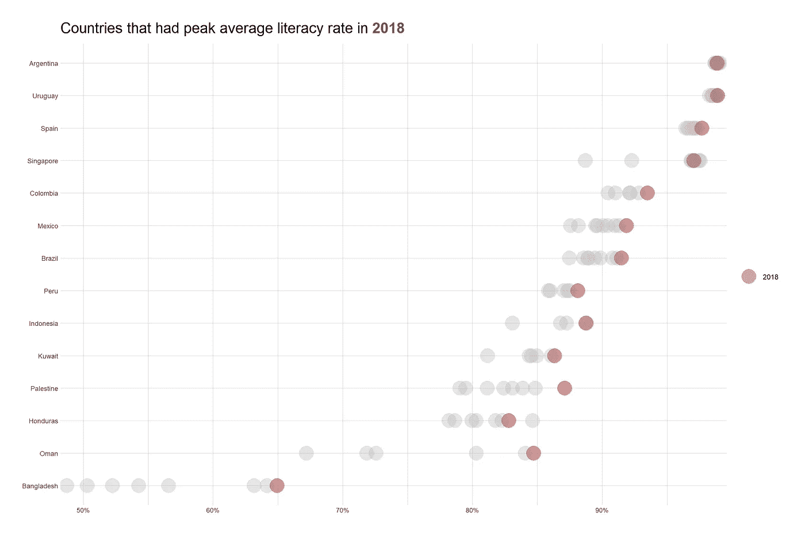
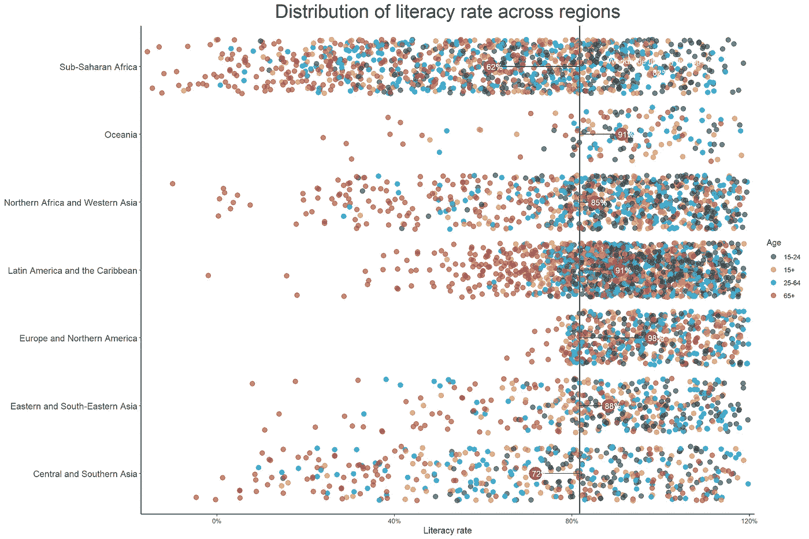
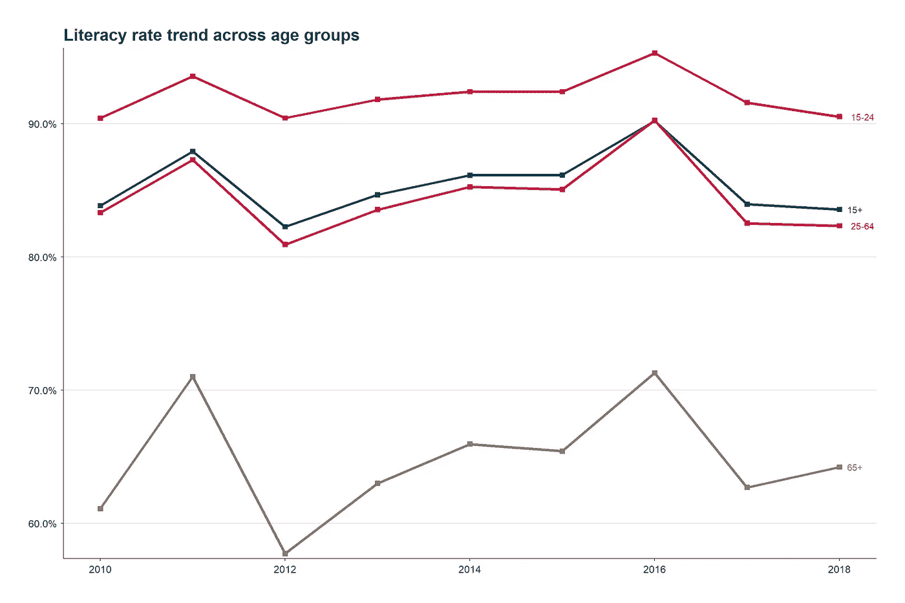
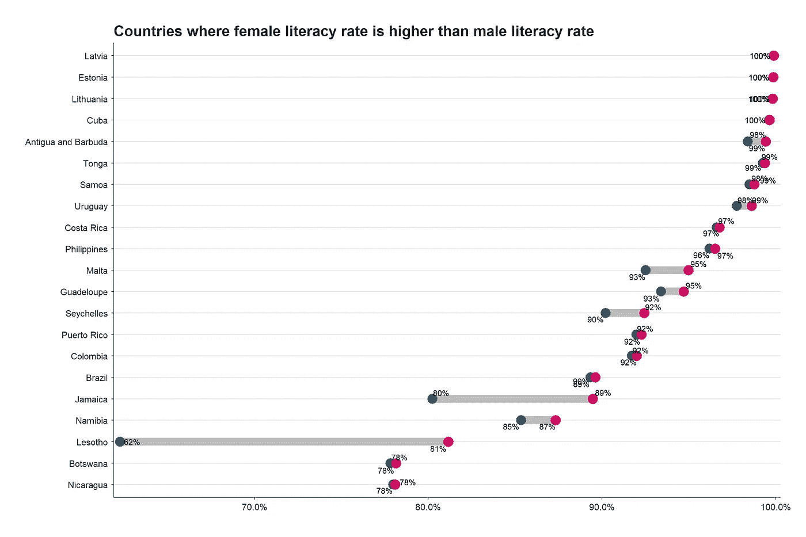
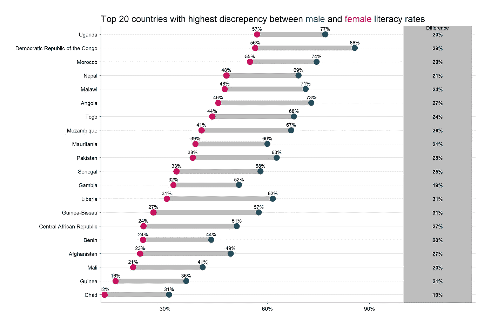
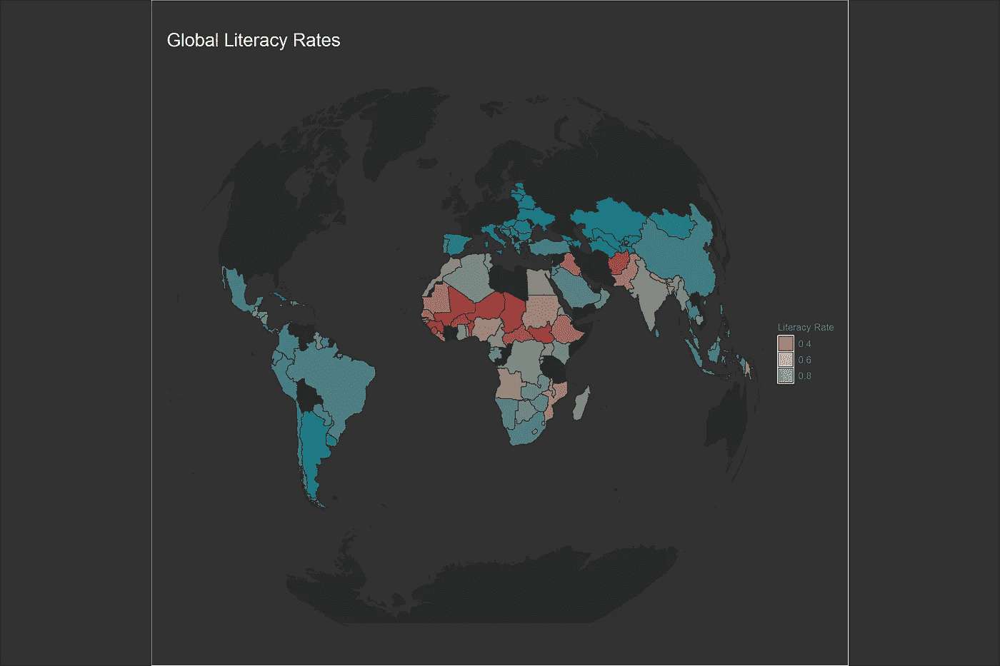
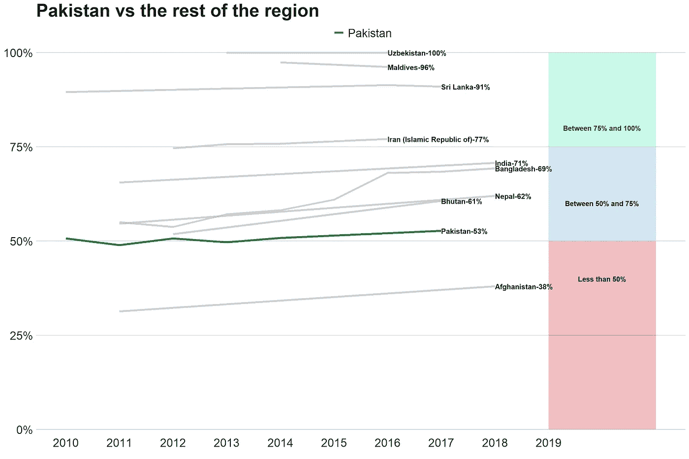

# 分析巴西的全球识字率数据

> 原文：<https://towardsdatascience.com/analyzing-global-literacy-rates-data-in-r-88062f813ad2?source=collection_archive---------29----------------------->

# 数据

我在 [data.world](https://data.world/) 上偶然发现了一些非常有趣的数据集，其中引起我注意的是这个关于 2011 年至 2018 年全球识字率的数据集，按年龄组和性别进行了细分。如果你读过我以前的博客，那么所有的分析都将在 r 中完成。这次我不会解释我的代码，所以如果你想理解代码，最好有一些 r 的工作知识。

# 设置

```
**library**(tidyverse)
**library**(lubridate)
**library**(httr)
**library**(readxl)
**library**(extrafont)
**library**(hrbrthemes)
**library**(gghighlight)
**library**(ggtext)
**library**(ggmap)
**library**(scales)
**loadfonts**(device = "win")

**GET**("https://query.data.world/s/ethf3e5hs6lv52vzvegp3g3qeeeloj", **write_disk**(tf <- **tempfile**(fileext = ".xlsx")))literacy_data <- **read_excel**(tf)
```

# 分析

## 2018 年女性平均识字率最高的国家

```
literacy_data **%>%** 
  **filter**(Gender**==**"female") **%>%**
  **group_by**(Country) **%>%**
  **filter**(**max**(Year)**==**2018**&n_distinct**(Year)**>=**5,
         **mean**(`Literacy rate`[Year**==**2018],na.rm = T)**>mean**(`Literacy rate`[Year**!=**2018],na.rm = T)) **%>%** 
  **group_by**(Country,Year) **%>%** 
  **summarise**(Average_literacy_rate = **mean**(`Literacy rate`,na.rm = T)) **%>%**
  **ggplot**(**aes**(**reorder**(Country,Average_literacy_rate,mean),Average_literacy_rate,color=**factor**(Year)))**+**
  **geom_point**(size=9,alpha=0.4)**+**
  **coord_flip**()**+**
  **gghighlight**(Year**==**2018)**+**
  **scale_y_percent**()**+**
  **scale_color_manual**(values = **c**("2018"="firebrick"))**+**
  **theme_minimal**()**+**
  **labs**(x=NULL,y=NULL,title = "Countries that had peak average literacy rate in <span style='color:firebrick'>**2018**</span>",
       color=NULL)**+**
  **theme_ipsum_ps**()**+**
  **theme**(plot.title = **element_markdown**(size=20,margin = **margin**(b = 10)))
```



该图显示了与以往所有年份的平均水平相比，2018 年女性平均识字率最高的国家。南美洲的一些国家和阿根廷保持在 90%左右。其他拉美国家如巴西、墨西哥和哥伦比亚也显示出良好的增长势头。孟加拉国的女性识字率显著提高。[这可能是由于政府将教育支出增加了一倍，从 2008 年的 20 亿美元增加到 2016 年的 43 亿美元](https://www.dhakatribune.com/bangladesh/education/2018/03/21/unesco-bangladesh-literacy-rate-reaches-time-high-72-76-2016)

## 各地区识字率的分布

```
world_avg <- literacy_data **%>%**
  **summarise**(avg=**mean**(`Literacy rate`,na.rm = T)) **%>%** 
  **pull**(avg)

literacy_data **%>%**
  **group_by**(Region) **%>%** 
  **mutate**(region_avg= **mean**(`Literacy rate`,na.rm = T)) **%>%** 
  **ungroup**() **%>%** 
  **ggplot**(**aes**(Region,`Literacy rate`,color=Age))**+**
  **geom_jitter**(alpha=0.7,size=3,height  = 0.2)**+**
  **geom_hline**(**aes**(yintercept=world_avg),color="grey40",size=0.9)**+**
  **geom_segment**(**aes**(x=Region,xend=Region,y=world_avg,yend=region_avg),color="black")**+**
  **coord_flip**()**+**
  ggsci**::scale_color_jama**()**+**
  **stat_summary**(fun.y = mean, geom = "point", size = 8,color="firebrick")**+**
  **geom_text**(**aes**(x=Region,y=region_avg,label=scales**::percent**(region_avg)),color="white",hjust=0.5,nudge_y = 0.01)**+**
  **theme_classic**()**+**
  **theme**(text = **element_text**(family = "Roboto Condensed"),axis.title = **element_text**(size = 12),
        axis.text.y = **element_text**(family = "Roboto Condensed", size = 12),
        panel.grid = **element_blank**(),
        plot.title = **element_text**(size = 25,hjust = 0.5,family = "Roboto Condensed"))**+**
  **annotate**(geom = "text",x=7,y=1,label=**paste0**("Worldwide literacy average of\n",scales**::percent**(world_avg)),color="white")**+**
  **scale_y_percent**()**+**
  **labs**(x=NULL,title = "Distribution of literacy rate across regions")
```



灰色垂直线代表全球平均识字率，红色大圆圈突出显示每个地区的平均识字率。与全球平均水平和其他地区相比，撒哈拉以南非洲、北非和西非、中亚和南亚等地区的平均识字率较低。毫不奇怪，年龄较大的人识字率普遍较低。

## 各年龄组的识字率趋势

```
avg_year <- literacy_data **%>%** 
  **group_by**(Year,Age) **%>%**
  **summarise**(avg=**mean**(`Literacy rate`,na.rm = T)) **%>%**
  **ungroup**()

avg_year **%>%** 
  **ggplot**(**aes**(Year,avg,color=Age))**+**
  **geom_line**(size=1.5)**+**
  **geom_point**(size = 2.6, **aes**(color = Age), shape = 15) **+**
  **geom_text**(data=avg_year **%>%** **group_by**(Age) **%>%** **filter**(Year**==max**(Year)),**aes**(label=Age),hjust=**-**0.5)**+**
  **scale_color_manual**(values = **c**("15-24"="#d20962","15+"="#005670","25-64"="#ce181e","65+"="#8a7967"))**+**
  **scale_y_percent**()**+**
  **labs**(y=NULL,x=NULL,title = "Literacy rate trend across age groups")**+**
   **theme**(
    text = **element_text**(family = "Roboto Condensed"),
    plot.margin = **unit**(**rep**(1.2, 4), "cm"),
    plot.title = **element_text**(size = 20, 
                              color = "#22292F",
                              face = "bold",
                              margin = **margin**(b = 5)),
    plot.subtitle = **element_text**(size = 15, 
                                 margin = **margin**(b = 35)),
    plot.caption = **element_text**(size = 10,
                                margin = **margin**(t = 25),
                                color = "#606F7B"),
    panel.background = **element_blank**(),
    axis.text = **element_text**(size = 12, color = "#22292F"),
    axis.text.x = **element_text**(margin = **margin**(t = 5)),
    axis.text.y = **element_text**(margin = **margin**(r = 5)),
    axis.line = **element_line**(color = "#3D4852"),
    axis.title = **element_text**(size = 14),
    axis.title.y = **element_text**(margin = **margin**(r = 15),
                                hjust = 0.5),
    axis.title.x = **element_text**(margin = **margin**(t = 15),
                                hjust = 0.5),
    panel.grid.major = **element_line**(color = "#DAE1E7"),
    panel.grid.major.x = **element_blank**(),
    legend.position = "none"
  )
```



除了 2012 年所有年龄组的识字率急剧下降之外，这里没有什么有趣的东西可看

## 女性平均识字率高于男性平均识字率的国家

```
countries_female <- literacy_data **%>%** 
  **group_by**(Country) **%>%** 
  **filter**(**mean**(`Literacy rate`[Gender**==**"female"],na.rm = T)**>mean**(`Literacy rate`[Gender**==**"male"]))

literacy_data **%>%** 
  **semi_join**(countries_female) **%>%** 
  **group_by**(Country) **%>%** 
  **summarise**(avg_ltrcy_male = **mean**(`Literacy rate`[Gender**==**'male'],na.rm = T),
            avg_ltrcy_female=**mean**(`Literacy rate`[Gender**==**'female'],na.rm = T)) **%>%**
  **ungroup**() **%>%** 
  **ggplot**(**aes**(y=**reorder**(Country,avg_ltrcy_female),x=avg_ltrcy_male,xend=avg_ltrcy_female))**+**
  ggalt**::geom_dumbbell**( size=5, colour="grey",colour_x = "#005670",colour_xend = "#d20962")**+**
  ggrepel**::geom_text_repel**(**aes**(x=avg_ltrcy_female,label=**percent**(avg_ltrcy_female,accuracy = 1)))**+**
  ggrepel**::geom_text_repel**(**aes**(x=avg_ltrcy_male,label=**percent**(avg_ltrcy_male,accuracy = 1)))**+**
  **labs**(x=NULL,y=NULL,title = "Countries where female literacy rate is higher than male literacy rate")**+**
  **scale_x_percent**()**+**
  **theme_classic**()**+**
  **theme**(
    text = **element_text**(family = "Roboto Condensed"),
    plot.margin = **unit**(**rep**(1.2, 4), "cm"),
    plot.title = **element_text**(size = 20, 
                              color = "#22292F",
                              face = "bold",
                              margin = **margin**(b = 5)),
    plot.subtitle = **element_text**(size = 15, 
                                 margin = **margin**(b = 35)),
    plot.caption = **element_text**(size = 10,
                                margin = **margin**(t = 25),
                                color = "#606F7B"),
    panel.background = **element_blank**(),
    axis.text = **element_text**(size = 12, color = "#22292F"),
    axis.text.x = **element_text**(margin = **margin**(t = 5)),
    axis.text.y = **element_text**(margin = **margin**(r = 5)),
    axis.line = **element_line**(color = "#3D4852"),
    axis.title = **element_text**(size = 14),
    axis.title.y = **element_text**(margin = **margin**(r = 15),
                                hjust = 0.5),
    axis.title.x = **element_text**(margin = **margin**(t = 15),
                                hjust = 0.5),
    panel.grid.major = **element_line**(color = "#DAE1E7"),
    panel.grid.major.x = **element_blank**(),
    legend.position = "none")
```



我很好奇哪些国家的女性平均识字率高于或等于男性平均识字率。这张图表上的大多数国家都是南美和非洲地区的小国，这确实令人惊讶。

## 男女识字率差距最大的国家

```
countries_male <- literacy_data **%>%** 
  **group_by**(Country) **%>%** 
  **filter**(**mean**(`Literacy rate`[Gender**==**"female"],na.rm = T)**<mean**(`Literacy rate`[Gender**==**"male"]))

literacy_data **%>%** 
  **semi_join**(countries_male) **%>%** 
  **group_by**(Country) **%>%** 
  **summarise**(avg_ltrcy_male = **mean**(`Literacy rate`[Gender**==**'male'],na.rm = T),
            avg_ltrcy_female=**mean**(`Literacy rate`[Gender**==**'female'],na.rm = T),
            diff= avg_ltrcy_male**-**avg_ltrcy_female) **%>%** 
  **top_n**(20,diff)**%>%** 
  **ggplot**(**aes**(y=**reorder**(Country,avg_ltrcy_female),x=avg_ltrcy_male,xend=avg_ltrcy_female))**+**
  ggalt**::geom_dumbbell**( size=5, colour="grey",colour_x = "#005670",colour_xend = "#d20962")**+**
  **geom_text**(**aes**(x=avg_ltrcy_female,label=**percent**(avg_ltrcy_female,accuracy = 1)),vjust=**-**1)**+**
  **geom_text**(**aes**(x=avg_ltrcy_male,label=**percent**(avg_ltrcy_male,accuracy = 1)),vjust=**-**1)**+**
  **geom_rect**(**aes**(xmin=1,xmax=1.2,ymin=**-**Inf,ymax=Inf),fill="grey")**+**
  **geom_text**(**aes**(label=**percent**(diff,accuracy = 1), y=Country, x=1.1), fontface="bold", size=4)**+**
  **geom_text**(**aes**(x=1.1,y=20.5,label="Difference"))**+**
  **labs**(x=NULL,y=NULL,title = "Top 20 countries with highest discrepency between <span style='color:#005670'>male</span> and <span style='color:#d20962'>female</span> literacy rates")**+**
  **scale_y_discrete**()**+**
  **scale_x_percent**(breaks = **c**(0.3,0.6,0.9),labels = **c**("30%","60%","90%"))**+**
  **theme_classic**()**+**
  **theme**(
    text = **element_text**(family = "Roboto Condensed"),
    plot.margin = **unit**(**rep**(1.2, 4), "cm"),
    plot.title = **element_markdown**(size = 20,margin = **margin**(b = 5)),
    plot.subtitle = **element_text**(size = 15, 
                                 margin = **margin**(b = 35)),
    plot.caption = **element_text**(size = 10,
                                margin = **margin**(t = 25),
                                color = "#606F7B"),
    panel.background = **element_blank**(),
    axis.text = **element_text**(size = 12, color = "#22292F"),
    axis.text.x = **element_text**(margin = **margin**(t = 5)),
    axis.text.y = **element_text**(margin = **margin**(r = 5)),
    axis.line = **element_line**(color = "#3D4852"),
    axis.title = **element_text**(size = 14),
    axis.title.y = **element_text**(margin = **margin**(r = 15),
                                hjust = 0.5),
    axis.title.x = **element_text**(margin = **margin**(t = 15),
                                hjust = 0.5),
    panel.grid.major = **element_line**(color = "#DAE1E7"),
    panel.grid.major.x = **element_blank**(),
    legend.position = "none")
```



接下来，我想看看男女识字率差异最大的国家。对于审美，我只是根据两性差异的数值，可视化了前 20 名。同样，我们也可以在这里看到许多非洲国家和一些亚洲国家，比如巴基斯坦——我来自那里。非常有趣的是，在非洲有些国家，女性的平均识字率高于男性，但同时，在非洲有些国家，男性的识字率远远高于女性。

## 在地图上将其可视化

```
world <- **map_data**(map = "world") **%>%**
  **filter**(region**!=**"Antartica")

long_lat <- literacy_data **%>%**
  **group_by**(Country) **%>%** 
  **summarise**(`Literacy rate`=**mean**(`Literacy rate`,na.rm = T)) **%>%** 
  **ungroup**() **%>%** 
  **left_join**(world,by = **c**("Country"="region")) **%>%** 
  **filter**(**!is.na**(lat))

p <- **ggplot**() **+** 
  **geom_map**(data = world, map = world,
           **aes**(long, lat, group = group, map_id = region),
           fill = "#282828", color = "#282828") **+**
  **geom_map**(data = long_lat, map = world,
           **aes**(fill = `Literacy rate`, map_id = Country),
           color = "#282828", size = 0.5, alpha = .8) **+**
  **scale_fill_gradient2**(low = "#be0027", high = "#0a8ea0",mid = "#b4a996",midpoint = 0.6) **+**
  **scale_y_continuous**(breaks=**c**()) **+**
  **scale_x_continuous**(breaks=**c**()) **+**
  **labs**(x = "", y = "") **+**
  **guides**(
    fill = **guide_legend**(title = "Literacy Rate")
  ) **+**
  **coord_map**("gilbert", xlim = **c**(**-**300, 300)) **+**
  **labs**(
    title = "Global Literacy Rates"
  ) **+**
  **theme**(
    text = **element_text**(family = "Roboto Condensed"),
    plot.title = **element_text**(color = "#ffffff",
                              margin = **margin**(t = 30, b = 10),
                              size = 20),
    plot.subtitle = **element_text**(color = "#ababab",
                              margin = **margin**(b = 10),
                              size = 15,
                              hjust = 0.7),
    plot.background  = **element_rect**(fill  = "#323232"),
    panel.background = **element_rect**(fill  = "#323232", 
                                    color = "#323232"),
    legend.position = "right",
    legend.title = **element_text**(color = "#6d6d6d",
                                size = 10),
    legend.background = **element_rect**(fill = "#323232"),
    legend.text = **element_text**(color = "#6d6d6d",
                               size = 10)
  )

cowplot**::ggdraw**(p)**+**
  **theme**(plot.background = **element_rect**(fill = "#323232"))
```



我想尝试可视化地图上的数据，因为我从来没有这样做过。在深入研究细节之前，这有助于从全局层面了解数据

## 近距离观察巴基斯坦

```
south_asia <-literacy_data **%>%** 
  **filter**(Region**==**"Central and Southern Asia") **%>%** 
  **group_by**(Year,Country) **%>%** 
  **summarise**(avg_ltrcy=**mean**(`Literacy rate`)) **%>%** 
  **ungroup**() **%>%** 
  **group_by**(Country) **%>%** 
  **filter**(**n**()**>**1)

south_asia **%>%**
  **ggplot**(**aes**(Year,avg_ltrcy))**+**
  **geom_line**(size=1.5,**aes**(color=Country))**+**
  **gghighlight**(Country**==**"Pakistan",use_direct_label = F,use_group_by = F)**+**
  **scale_color_manual**(values = **c**("Pakistan"="#11862f"))**+**
  **geom_text**(data = south_asia **%>%** **group_by**(Country) **%>%**
              **filter**(Year**==max**(Year)) **%>%** **ungroup**(),**aes**(label=**paste0**(Country,"-",**percent**(avg_ltrcy,accuracy = 1))),size=4,hjust=0,fontface="bold")**+**
  **scale_x_continuous**(breaks = **seq**(2010,2019,by = 1),limits = **c**(2010,2021))**+**
  **annotate**(geom = "text",x=2020,y=0.8,label="Between 75% and 100%",color="black",fontface="bold")**+**
  **geom_rect**(**aes**(xmin=2019,xmax=2021,ymin=0.75,ymax=1),fill="#3be8b0",alpha=0.05)**+**
  **geom_rect**(**aes**(xmin=2019,xmax=2021,ymin=0.5,ymax=0.75),fill="#56a0d3",alpha=0.05)**+**
  **annotate**(geom = "text",x=2020,y=0.6,label="Between 50% and 75%",color="black",fontface="bold")**+**
  **geom_rect**(**aes**(xmin=2019,xmax=2021,ymin=0,ymax=0.5),fill="#c90f23",alpha=0.05)**+**
  **annotate**(geom = "text",x=2020,y=0.4,label="Less than 50%",color="black",fontface="bold")**+**
  **scale_y_percent**()**+**
  **labs**(color=NULL,title = "Pakistan vs the rest of the region",x=NULL,y=NULL)**+**
  **theme**(legend.position = "none")**+**
  bbplot**::bbc_style**()**+**
  **theme**(text = **element_text**(family = "Roboto Condensed"))
```



因为我来自巴基斯坦，我想看看我的国家与同一地区的其他国家相比如何。虽然总体趋势略有上升，但令人失望的是，巴基斯坦仅好于阿富汗，落后于其邻国，如印度、孟加拉国和伊朗。

# 结论

在这篇文章中，我试图让我的可视化更有创造性，而不是依赖于典型的条形图。我很惊讶地发现，有很多“较穷”的国家拥有很高的识字率。我希望有更多的数据可以帮助我们了解哪些因素影响一个国家的识字率，我们可以根据这些数据建立一个基于某种回归分析的模型。