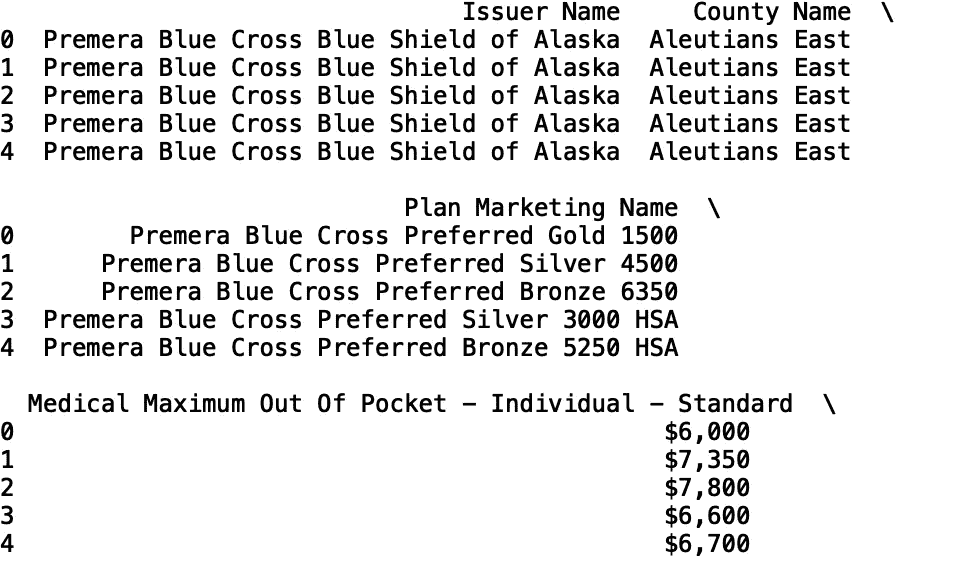
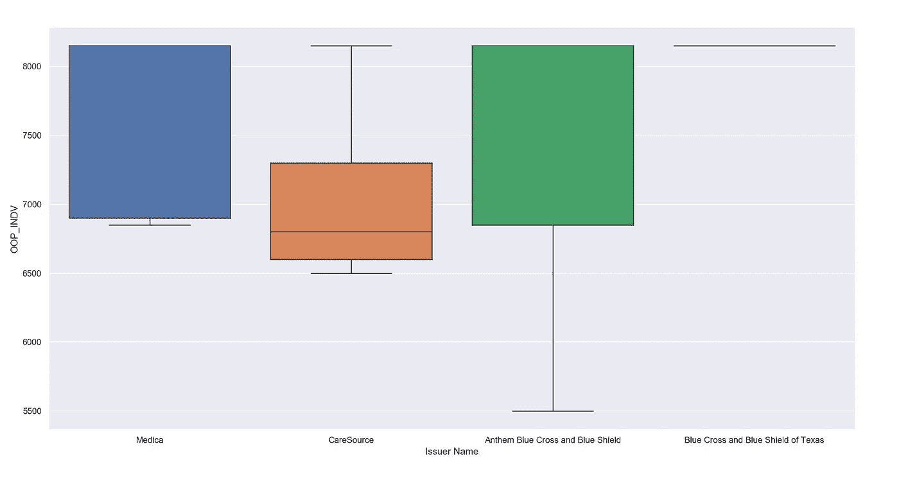

# 分析健康保险市场数据

> 原文：<https://towardsdatascience.com/analyzing-health-insurance-market-data-71b1cf00e97d?source=collection_archive---------21----------------------->

## 健康保险数据的探索性数据分析


照片由[像素](https://www.pexels.com/photo/blue-and-silver-stetoscope-40568/)上的 [Pixabay](https://www.pexels.com/@pixabay) 拍摄

Healthcare.gov 向公众提供合格健康计划(QHP)景观数据。这些数据集包括联邦政府运营市场的各州的个人和家庭健康计划。对医疗保险计划以及其他一般医疗保健服务的可用数据进行定量分析，可能有助于在定价和基于价值的护理方面使我们的医疗保健系统更加透明。

在本帖中，我们将对 QHP 景观数据进行探索性数据分析。数据可在[这里](https://data.healthcare.gov/dataset/QHP-Landscape-Individual-Market-Medical/b8in-sz6k)获得。它也可以作为一个。我的 [GitHub](https://github.com/spierre91/medium_code) 上的‘CSV’文件。

我们开始吧！

首先，让我们将数据存储在 pandas 数据框中，并打印列的列表:

```
import pandas as pd
df = pd.read_csv("QHP_landscape_2020.csv")
print(df.columns)
```


我们还可以打印完整的列列表:

```
print(list(df.columns))
```


如你所见，有 128 列。我们将把我们的分析限制在以下几列:

1.  发行人名称
2.  县名
3.  计划营销名称
4.  医疗最高自付费用-个人-标准
5.  医疗免赔额—个人—标准
6.  初级保健医生—标准
7.  急诊室—标准
8.  专家—标准

```
df = df[['Issuer Name', 'County Name', 'Plan Marketing Name',   
         'Medical Maximum Out Of Pocket - Individual - Standard',
         'Medical Deductible - Individual - Standard', 'Primary Care Physician - Standard', 'Specialist - Standard', 'Emergency Room - Standard']]

print(df.head())
```



我们可以看到有几个分类列。让我们定义一个将数据框、列名和限制作为输入的函数。当被调用时，它打印分类值的字典以及它们出现的频率:

```
def return_counter(data_frame, column_name, limit):
   from collections import Counter    print(dict(Counter(data_frame[column_name].values).most_common(limit)))
```

让我们将函数应用于“发行人名称”列，并将结果限制为五个最常见的值:

```
return_counter(df, 'Issuer Name', 5)
```


我们可以看到发行者名称“Medica”的记录最多。

让我们将函数应用于“County Name”列:

```
return_counter(df, 'County Name', 5)
```


正如您所看到的，这是一个有用的快速测试，可以查看数据中是否有任何明显的不平衡，这通常是建模时需要处理的一个关键问题。

接下来，从数字列(如“医疗最高自付费用-个人-标准”)中生成汇总统计数据会很有用。首先，我们需要将字符串值的美元金额转换成浮点类型。

```
OOP_INDV = []
for i in list(df['Medical Maximum Out Of Pocket - Individual - Standard'].values):
    try:
        OOP_INDV.append(float((str(i)[1] + str(i)[3:])))
    except(ValueError):
        OOP_INDV.append(np.nan)

df['OOP_INDV'] = OOP_INDV
```

让我们确保转换成功:

```
print(df[['Medical Maximum Out Of Pocket - Individual - Standard', 'OOP_INDV']].head())
```


看起来不错！

现在，让我们定义一个采用数据框、分类列和数值列的函数。每个类别的数字列的平均值和标准偏差存储在数据框中，并且数据框根据平均值以降序排序。如果您想要快速查看特定类别对于特定数字列是否具有更高或更低的平均值和/或标准偏差值，这将非常有用。

```
def return_statistics(data_frame, categorical_column, numerical_column):
    mean = []
    std = []
    field = []
    for i in set(list(data_frame[categorical_column].values)):
        new_data = data_frame[data_frame[categorical_column] == i]
        field.append(i)
        mean.append(new_data[numerical_column].mean())
        std.append(new_data[numerical_column].std())
    df = pd.DataFrame({'{}'.format(categorical_column): field, 'mean {}'.format(numerical_column): mean, 'std in {}'.format(numerical_column): std})
    df.sort_values('mean {}'.format(numerical_column), inplace = True, ascending = False)
    df.dropna(inplace = True)
    return df
```

我们可以查看“开证人姓名”和“医疗最高自付费用-个人”的汇总统计数据:

```
stats = return_statistics(df, 'Issuer Name', 'OOP_INDV')
print(stats.head(15))
```


“德州蓝十字和蓝盾”的个人最高自付费用和跨计划类型的零标准差。

接下来，我们将使用箱线图来显示基于最小值、最大值、中值、第一个四分位数和第三个四分位数的数值分布。如果您对它们不熟悉，可以看看文章[了解 Boxplots](/understanding-boxplots-5e2df7bcbd51) 。

与汇总统计函数类似，此函数采用数据框、分类列和数值列，并根据限制显示最常见类别的箱线图:

```
def get_boxplot_of_categories(data_frame, categorical_column, numerical_column, limit):
    import seaborn as sns
    import matplotlib.pyplot as plt
    keys = []
    for i in dict(Counter(df[categorical_column].values).most_common(limit)):
        keys.append(i)
    print(keys)

    df_new = df[df[categorical_column].isin(keys)]
    sns.boxplot(x = df_new[categorical_column], y = df_new[numerical_column])
```

让我们在 5 个最常见的发行者名称中为 OOP_INDV 生成箱线图:

```
get_boxplot_of_categories(df, 'Issuer Name', 'OOP_INDV', 5)
```



我们可以对“医疗免赔额—个人—标准”进行类似的分析。让我们将字符串值的美元金额转换为浮点类型:

```
DEDUCT_INDV = []
for i in list(df['Medical Deductible — Individual — Standard'].values):
    try:
        DEDUCT_INDV.append(float((str(i)[1] + str(i)[3:])))
    except(ValueError):
        DEDUCT_INDV.append(np.nan)

df['DEDUCT_INDV'] = DEDUCT_IND
```

让我们确保转换成功:

```
print(df[['Medical Deductible - Individual - Standard', 'DEDUCT_INDV']].head())
```


我们可以查看“发行人名称”和“医疗免赔额—个人—标准”的汇总统计数据:

```
stats = return_statistics(df, 'Issuer Name', 'DEDUCT_INDV')
print(stats.head(15))
```


“Wellmark Value Health Plan，Inc .”和“Wellmark Health Plan of Iowa，Inc .”的平均“医疗免赔额—个人—标准”最高。

让我们为 5 个最常出现的发行人名称中的 DEDUCT_INDV 生成箱线图:

```
get_boxplot_of_categories(df, 'Issuer Name', 'DEDUCT_INDV', 5)
```


最后，让我们定义一个函数，它将一个数据框、分类列、分类值和两个数值列作为输入，并显示一个散点图:

```
def get_scatter_plot_category(data_frame, categorical_column, categorical_value, numerical_column_one, numerical_column_two):
    import matplotlib.pyplot as plt
    import seaborn as sns
    df_new = data_frame[data_frame[categorical_column] == categorical_value]
    sns.set()
    plt.scatter(x= df_new[numerical_column_one], y = df_new[numerical_column_two])
    plt.xlabel(numerical_column_one)
    plt.ylabel(numerical_column_two)
```

让我们为 Medica 生成一个 OOP_INDV 与 DEDUCT_INDV 的散点图:

```
get_scatter_plot_category(df, ‘Issuer Name’, ‘Medica’, ‘DEDUCT_INDV’, ‘OOP_INDV’)
```


我就讲到这里，但是请随意处理数据并自己编码。我鼓励你对急诊室、专科医生和初级保健列进行类似的分析。例如，了解初级保健的共同保险百分比在不同的发行人名称之间的差异是很有趣的。

概括地说，我回顾了几种分析健康保险市场数据的方法。这包括用箱线图和散点图显示数据。我们还定义了用于生成汇总统计数据的函数，比如平均值、标准差和分类值的计数。我希望这篇文章有趣。这篇文章的代码可以在 [GitHub](https://github.com/spierre91/medium_code) 上找到。感谢您的阅读！