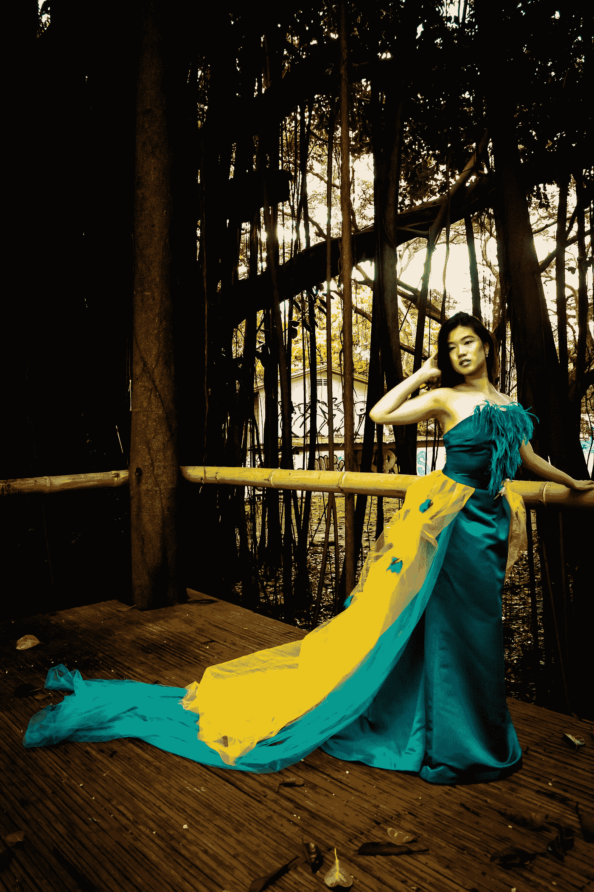
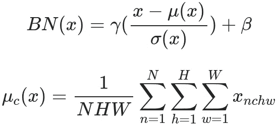
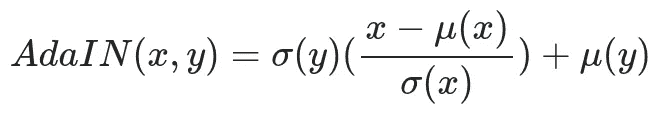
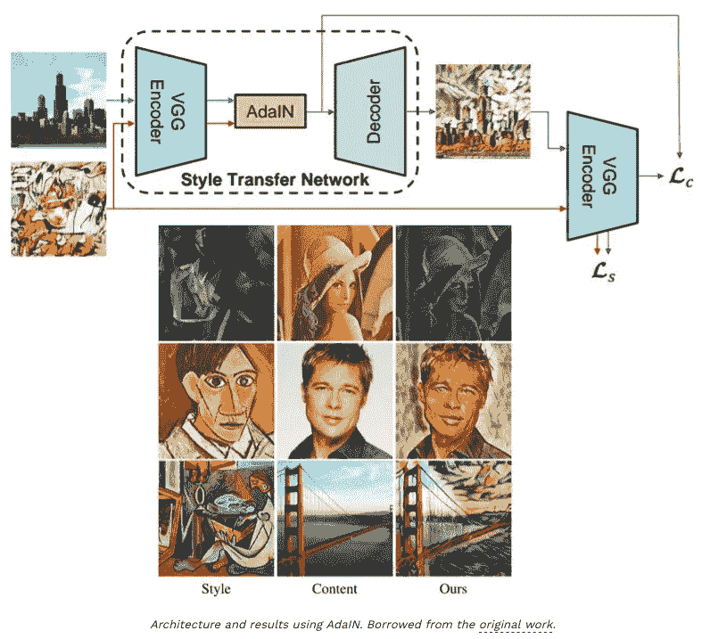
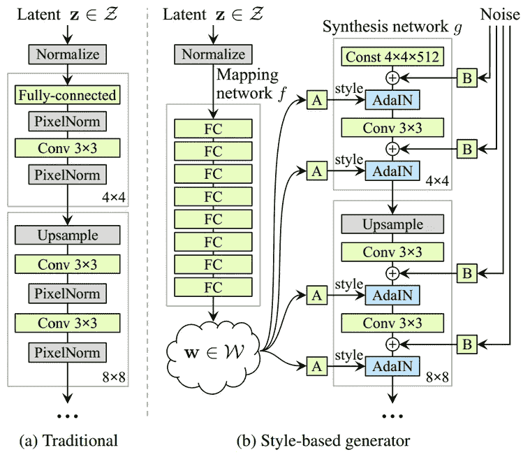
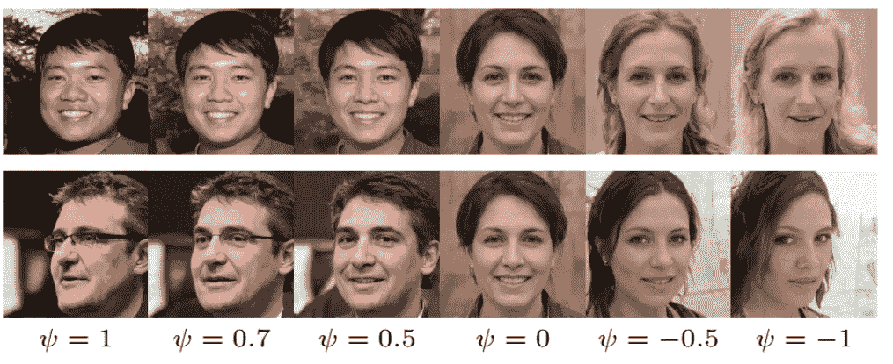
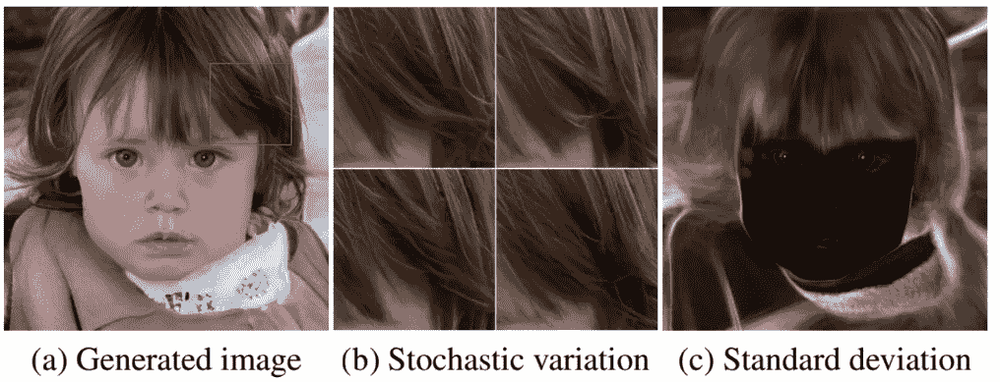
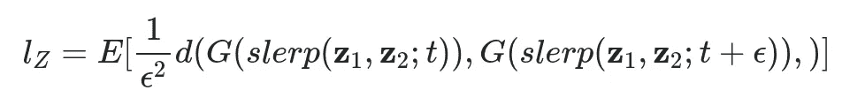
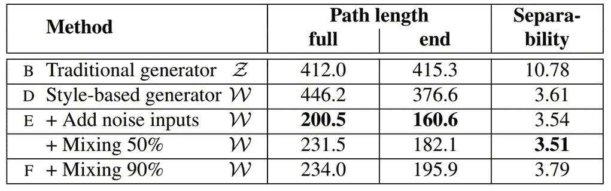

# 分析 StyleGAN 如何工作:高质量图像生成中的样式合并

> 原文：<https://towardsdatascience.com/analyzing-how-stylegan-works-style-incorporation-in-high-quality-image-generation-80a29227075b?source=collection_archive---------15----------------------->

## [入门](https://towardsdatascience.com/tagged/getting-started)

## 在之前的[帖子](https://theaisummer.com/gan-computer-vision-video-synthesis/)中，我们讨论了 2K 图像到图像的翻译、视频到视频的合成以及大规模的类条件图像生成。即 pix2pixHD、vid-to-vid 和 BigGAN。

但是我们离生成基于真实风格的图像还有多远呢？快速浏览一下真实照片的时尚程度:

照片由 [anabelle carite](https://unsplash.com/@anacariteph?utm_source=medium&utm_medium=referral) 在 [Unsplash](https://unsplash.com?utm_source=medium&utm_medium=referral) 拍摄

为此，在这一部分中，我们将关注通过**自适应实例规范化**的**风格合并**。为此，我们将重温层内规范化的概念，这将被证明对我们理解 GANs 非常有用。

> 没有风格，就没有派对！

# [StyleGAN](https://arxiv.org/abs/1812.04948) (基于风格的生成对抗网络生成器架构 2018)

基于我们对甘的理解，我们现在将能够**控制他们的风格**，而不仅仅是生成图像！多酷啊。但是，等一下。我们已经看到， [InfoGAN](https://theaisummer.com/gan-computer-vision/#info-gan-representation-learning-by-information-maximizing-generative-adversarial-nets-2016) 可以控制依赖于**去纠缠表示**的图像生成。

这项工作严重依赖于渐进式 GANs、自适应实例规范化( [AdaIN](https://arxiv.org/abs/1703.06868) )和[风格转移](https://www.tensorflow.org/tutorials/generative/style_transfer)。我们已经在前面的[部分](https://theaisummer.com/gan-computer-vision-incremental-training/#progressive-gan-progressive-growing-of-gans-for-improved-quality-stability-and-variation-2017)中介绍了渐进式 gan，所以在我们专注于理解这项工作之前，让我们深入了解它们的其余部分。

# 1.了解特征空间规范化和样式转换

人类视觉系统对图像统计非常敏感。众所周知，[空间不变的](https://stats.stackexchange.com/questions/208936/what-is-translation-invariance-in-computer-vision-and-convolutional-neural-netwo)统计，如通道方式的均值和方差可靠地**编码图像的风格。**同时，**空间变化**特征**编码具体实例**。

## 批量标准化

图片由作者提供，最初用 Latex 编写

在所描绘的等式中， **N** 是图像批次的数量 **H** 高度和 **W** 宽度。希腊字母 **μ** ()表示平均值，希腊字母 **σ** ()表示标准差。类似地， **γ** 和 **β** 对应于导致线性/仿射变换的可训练参数，对于所有通道来说**是不同的。具体来说 **γ** 、 **β** 是具有通道维度的向量。批次特征是形状为[N，C，H，W]的 **x** ，其中索引 **c** 表示每个通道的平均值。值得注意的是，空间维度以及图像批次被平均。这样，我们将我们的特征集中在一个紧凑的空间，这通常是有益的。**

但是，就风格和全局特征而言，所有个体通道都共享羞耻学习特征，即γ、β。因此，BN 可以直观地理解为将一批图像归一化为以单一样式为中心。尽管如此，卷积层能够了解一些批内风格的差异。因此，每个样品可能仍然有不同的风格。例如，如果您想将所有图像转换为**相同的共享风格**(即梵高风格)，这是不可取的。

但是如果我们**不混合特性批次特性**呢？

## [实例规范化](https://arxiv.org/abs/1607.08022)

与 BN 层不同，实例归一化(IN)仅在特征空间维度上计算**，但对于每个通道**(和每个样本)再次独立计算**。从字面上看，我们只是在前面的等式中去掉了对 **N** 的求和。令人惊讶的是，实验验证了 IN **中的仿射参数可以完全改变输出图像的风格**。与 BN 相反，IN 中的**可以将每个单独样本的样式标准化为目标样式**(由γ和β建模)。由于这个原因，训练一个模型转换到一个特定的风格是比较容易的。因为网络的其余部分可以将其学习能力集中在内容操作和局部细节上，同时丢弃原始的全局细节(即风格信息)。**

以这种方式，通过引入由多个γ组成的集合，可以设计一个网络来模拟过多的有限样式，这正是条件实例规范化的情况。

## [自适应实例规范化(AdaIN)](https://arxiv.org/abs/1703.06868)

另一个图像的风格转移的想法开始变得自然。如果γ，β是从另一幅图像的特征统计中注入的呢？通过这种方式，我们将能够通过给定我们期望的特征图像**均值为β，方差为γ来对任意风格建模。** AdaIN 正是这样做的:它接收输入 x(内容)和样式输入 y，并简单地调整 x 的通道均值和方差以匹配 y 的均值和方差。数学上:

图片由作者提供，最初用 Latex 编写

仅此而已！那么，我们可以做些什么呢？只需一个小改动的单层？让我们看看！

来源:[https://arxiv.org/abs/1703.06868](https://arxiv.org/abs/1703.06868)

在上半部分，您可以看到一个简单的编码器-解码器网络架构，其中有一个额外的 AdaIN 层用于样式对齐。在下半部分，你会看到这个惊人想法的一些结果！总之，AdaIN 通过对齐一阶统计量(μ和σ)来执行风格转移(在特征空间中)，在复杂性方面没有额外的成本。如果你想玩这个想法，代码可以在这里找到[(官方)](https://github.com/xunhuang1995/AdaIN-style)和[(非官方)](https://github.com/naoto0804/pytorch-AdaIN)

# 2.基于样式的生成器

让我们回到我们最初理解风格的目标——甘。基本上，NVIDIA 在这项工作中完全抓住了我们对 GANs 中大多数发电机的理解和设计。让我们看看怎么做。

在一个普通的 GAN 发生器中，采样的输入潜在空间向量 z 被投影和整形，因此它将通过[转置卷积](http://d2l.ai/chapter_computer-vision/transposed-conv.html)或[上采样](https://stats.stackexchange.com/questions/252810/in-cnn-are-upsampling-and-transpose-convolution-the-same)进行进一步处理，有或没有卷积。在这里，潜在向量由一系列完全连接的层进行变换，即所谓的**映射网络 f** ！这导致了另一个学习向量 **w** ，叫做中间潜在空间 w。但是为什么有人会这样做呢？

图片由 StyleGAN paper 提供，来源:[https://arxiv.org/abs/1812.04948](https://arxiv.org/abs/1812.04948)

## 映射网络 f

这种选择的主要原因是中间潜在空间 **W** 不必支持根据任何固定分布的采样。通过连续映射，导出其采样密度。这种映射 f“打开”了 W 的空间，因此它隐含地实施了一种**解开的表示**。这意味着变异因素变得更加线性。作者认为**与纠缠的图像相比，基于非纠缠的图像更容易生成真实的图像。有了这个完全无人监管的把戏，我们至少期望 **W** 比 **Z** 空间纠缠度小。让我们看一下图中所示的 A。**

## 街区:风格特征

## b 区:噪音

此外，作者为 **G** 提供了明确的噪声输入，作为建模随机细节的直接方法。 **B** 块是由不相关的高斯噪声组成的单通道图像。它们作为附加噪声图像被馈送到合成网络的每一层。单一噪声图像被广播到所有特征地图。

## 合成网络 g

除了初始块之外，每一层都从上采样层开始，以使空间分辨率加倍。然后，添加卷积块。在每次卷积之后，2D 每像素噪声被添加到模型随机性中。最后用魔法 **AdaIN 层**注入与风格对应的已学中间潜空间。

## 风格混合和截断技巧

不是像 BigGAN 那样截断潜在向量 z，而是在中间潜在空间 **W** 中使用它。这实现为:w ' = E(**w**)—ψ*(**w**—E(**w**))，其中 E(w)= E(f(z))。ε表示预期值。控制样品质量的重要参数是ψ。当它接近 0 时，我们粗略地得到收敛到数据集的平均图像的采样面。如下图所示，在 W 空间中截断似乎效果很好:

图片由 StyleGAN paper 提供，来源:[https://arxiv.org/abs/1812.04948](https://arxiv.org/abs/1812.04948)

正如原论文所完美描述的:

> “有趣的是，各种高级属性经常在对立面之间翻转，**包括观点、眼镜、年龄、颜色、头发长度，通常还有性别。** " ~泰罗·卡拉斯等人

引入的另一个技巧是**风格混合**。从潜在空间 Z 采样 2 个样本，它们生成对应于两种风格的两个中间潜在向量 w1、w2。w1 应用于交叉点之前，w2 应用于交叉点之后。这可能是在块内部执行的。这种正则化技巧防止网络假设相邻的样式是相关的。一定比例的生成图像(通常为 90%)使用了这种技巧，并且每次都随机应用于网络中的不同位置。

# 3.浏览基于样式的生成器的设计选择

每个注入的风格和噪声**(块 A 和 B)** 被定位在网络中。这意味着当修改样式/噪声的特定子集时，预计只会影响图像的某些方面。

风格:我们来看看这种本土化的原因，从风格说起。我们广泛地看到，AdaIN 操作首先将每个通道归一化为零均值和单位方差。然后，它**应用基于风格的尺度和偏差**。以这种方式，用于后续卷积运算的特征统计被改变。更确切地说，**先前的统计/样式在下一个 AdaIN 层中被丢弃**。因此，在被下一个 AdaIN 操作覆盖之前，每个样式只控制一个卷积。

**噪声**:在传统的发生器中，潜在向量 z 被馈入网络的输入端。这被认为是次优的，因为它消耗了发电机的学习能力。这是合理的，因为网络需要发明一种方法来从早期激活生成空间变化的数字。

通过在每次卷积后添加每像素噪声，实验验证了**噪声的影响出现在网络的局部。与 BigGAN 类似，每个层都有新的噪声，因此没有动力从先前的激活中产生随机效果。**

以上都可以举例说明如下:

图片由 StyleGAN paper 提供，来源:【https://arxiv.org/abs/1812.04948 

在左边，我们有生成的图像。在中间，4 种不同的噪声应用于所选的子区域。右边可以观察到一大组不同噪声的样本的标准差。

# 4.量化空间的解开

令人惊叹的是，他们第一次能够量化空间的解缠。因为如果你数不过来，它就不存在！为此，他们引入了两种新的方法**来量化空间的混乱**。

## 感知路径长度

如果你对纠缠和不纠缠的表示感到不舒服，你可以重新访问 [InfoGAN](https://theaisummer.com/gan-computer-vision/#info-gan-representation-learning-by-information-maximizing-generative-adversarial-nets-2016) 。用非常简单的术语来说，纠缠是混合的，解纠缠与编码相关，但在某种程度上是可分离的。我喜欢把解开的表征称为一种低维度数据的解码信息。

假设我们有两个潜在的空间向量，我们想在它们之间进行插值？我们怎么可能确定“潜在空间的行走”对应于一个纠缠或不纠缠的表象？直观上，不太清晰的潜在空间应该导致在图像中观察到的感觉上平滑的过渡。

潜在空间向量的插值可以告诉我们很多。例如，图像中可能出现非线性、不平滑和急剧的变化。你怎么称呼这样的代表？例如，在任一端点都不存在的要素可能会出现在线性插值路径的中间。这是一个混乱世界的标志，即纠缠表象。

量化是根据潜在空间中的小步长ε来进行的。如果我们把一个潜在的空间插值路径细分成小段，我们就可以测量距离。后者在两个步骤之间测量，具体为 t，其中 t 在[0，1]中，t+ε。然而，基于生成的图像来测量距离是有意义的。因此，人们可以将所有步骤的距离相加，以穿过两个随机的潜在空间样本 **z1** 和 **z2** 。注意，距离是在图像空间中测量的。实际上，在这项工作中，他们测量了两个 VGG 网络嵌入之间的成对距离。数学上这可以描述为(slerp 表示[球面插值](https://tiborstanko.sk/lerp-vs-slerp.html)):

图片由作者提供，最初用 Latex 编写

有趣的是，他们发现通过添加噪声，路径长度(平均距离)大约减半，而混合风格略有增加(+10%)。此外，这一测量证明，8 层全连接架构显然产生了一个中间潜在空间 W，它比 z 更不纠缠。

## 线性可分性

让我们看看这是如何工作的。抓紧了！

1.  我们首先用**z**∾P(**z**)生成 200K 幅图像，并使用标签为 **Y** 的辅助分类网络对它们进行分类。
2.  我们保留 50%具有最高置信度得分的样本。这导致 100k 高分自动标记( **Y** )潜在空间向量 **z** 用于渐进 GAN，w 用于风格 GAN。
3.  我们拟合一个线性的 [SVM](https://ranvir.xyz/blog/svm-support-vector-machines-in-machine-learning/) 来预测标签 **X** 仅基于潜在空间点( **z** 和 **w** 用于样式-GAN)并且通过这个平面分类这些点。
4.  我们计算条件熵 H( **Y** | **X** )，其中 **X** 表示由 SVM 预测的类别， **Y** 是由分类器确定的类别。
5.  我们按照 exp(σ(H(Y | X))计算**可分性得分**，对数据集的所有给定属性求和。我们基本上为每个属性拟合一个模型。请注意，CelebA 数据集包含 40 个属性，如性别信息。

定量结果可在下表中观察到:

图片由 StyleGAN paper 提供，来源:[https://arxiv.org/abs/1812.04948](https://arxiv.org/abs/1812.04948)

本质上，给定 SVM 标签 **X** ，条件熵 **H** 告诉我们需要多少额外信息来确定样本的真实类别。理想的线性 SVM 将导致完全确定地知道 **Y** ，导致熵为 0。高熵值意味着高不确定性，因此基于线性 SVM 模型的标签根本不能提供信息。不夸张的说，**熵 H 越低越好。**

# 结论

GANs 上提出的工程解决方案一直让我惊叹不已。在本文中，我们看到了一个令人兴奋的设计，它通过自适应实例规范化来注入参考图像的样式。风格-甘绝对是该领域最具革命性的作品之一。最后，我们强调了所提出的线性可分性的度量，这使得我们在本系列中深入到越来越多的高级概念。

一如既往，我们专注于直觉，我们相信你不会气馁，开始尝试甘。如果你想开始用一堆模型进行实验以重现最先进的结果，你绝对应该检查 Tensorflow 中的这个开源[库](https://github.com/google/compare_gan)或者 Pytorch 中的这个 [one](https://github.com/unit8co/vegans) 。

[下一部](https://theaisummer.com/gan-computer-vision-semantic-synthesis/)AI Summer 上有！

# 参考

[1]t .卡拉斯、s .莱恩和 t .艾拉(2019 年)。一种基于风格的生成对抗网络生成器体系结构。在*IEEE 计算机视觉和模式识别会议论文集*(第 4401–4410 页)中。

[2]伊奥费和塞格迪(2015 年)。批量标准化:通过减少内部协变量转移加速深度网络训练。 *arXiv 预印本 arXiv:1502.03167* 。

[3]乌里扬诺夫博士、韦达尔迪博士和莱姆皮茨基博士(2016 年)。实例规范化:快速风格化缺少的要素。 *arXiv 预印本 arXiv:1607.08022* 。

[4]t .宫户，t .片冈，Koyama，m .，& Yoshida，Y. (2018)。生成对抗网络的谱归一化。arXiv 预印本 arXiv:1802.05957 。

*原载于 2020 年 5 月 9 日 https://theaisummer.com**的* [*。*](https://theaisummer.com/gan-computer-vision-style-gan/)