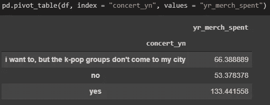

# 使用机器学习分析韩国流行音乐|第 2 部分—探索性数据分析(EDA)

> 原文：<https://towardsdatascience.com/analyzing-k-pop-using-machine-learning-part-2-exploratory-data-analysis-eda-61f0cbf95a2a?source=collection_archive---------62----------------------->

## [K-POP 机器学习教程系列](https://towardsdatascience.com/tagged/kpop-ml-tutorial)

## **这是教程的第二部分，我从变量中发现了有趣的见解。**

在 [Unsplash](https://unsplash.com/?utm_source=unsplash&utm_medium=referral&utm_content=creditCopyText) 上 [Saveliy Bobov](https://unsplash.com/@dandycolor?utm_source=unsplash&utm_medium=referral&utm_content=creditCopyText) 拍摄的照片

带解释的视频版本

第一部分—本教程的数据收集和数据清理可以在 这里找到 [**。**](/analyzing-k-pop-using-machine-learning-part-1-data-collection-cleaning-4b407baf7bce?source=friends_link&sk=5ea63fc8ed4f2ed6e55d1530b0ee9b61)

现在让我们做一些探索性的数据分析这个项目的一部分！

我的**完整代码**可以在 [**这里**](https://github.com/importdata/kpop-analysis/blob/master/K_pop_Exploratory_Data_Analysis.ipynb) 找到。

# 正在完成数据清理

在上一个教程中，我意识到我忘记了清理三个列(变量)-“性别 _ 偏好”，“原因”和“工作”，所以我很快先清理了它们。

*   对于“gender_pref”，我把它们重新贴上“男性”、“女性”、“两者皆有”、“是关于音乐”的标签，以简化它们。
*   对于“原因”，我按照“独特的音乐风格”、“独特的编舞”、“有魅力的偶像”、“很多原因”、“其他原因”来分类。
*   对于“工作”，我把他们分为“学生”、“全职工人”和“失业者”

# 分析连续变量

首先，我检查连续变量的描述——“yr _ listened”、“daily_music_hr”、“daily_MV_hr”、“yr _ merch _ spent”、“age”、“num_gr_like”。

## 检查连续变量的描述

连续变量的描述

我们可以看到，粉丝平均年龄为 18 岁，他们听 k-pop 的时间大约为 3 年。他们每天花 4.3 小时听 k-pop，花 1.95 小时看 k-pop 音乐视频。他们平均在韩国流行商品上花费 85 美元。

## 检查连续变量的直方图

*   您可以看到由于一些异常值,“yr_listened”变量的分布有点向右倾斜。

“yr_listened”直方图

*   “每日 _ 音乐 _hr”正态分布

“每日 _ 音乐 _ 小时”直方图

*   《daily_MV_hr》有点右倾

“每日 MV 小时”直方图

*   “年销售额”接近正态分布

“年销售额”直方图

*   “年龄”呈正态分布

“年龄”直方图

*   “num_gr_like”是右偏的

“数量类”直方图

## 检查箱线图以检测异常值

绘制箱线图可以帮助您检测异常值。

*   我们看到“yr_listened”和“yr _ merch _ spent”中有一些异常值。

“每日音乐小时”、“每日音乐小时”、“年听音乐小时”和“年消费”的方框图

*   “num_gr_like”有很多离群值

“数量 _ 类别”的箱线图

## 移除异常值并再次检查分布

让我们从“yr_listened”和“num_gr_like”中删除异常值，并检查直方图，看看分布中是否有任何变化。

“yr_listened”和“num_gr_like”的直方图

我们可以明确的看到“yr_listened”现在是正态分布，而“num_gr_like”不是。太多的人只喜欢 1 或 2 组，所以去除离群值不会对分布产生太大影响。

## 检查连续变量之间的相关性

检查相关性很重要，因为我们想知道哪些变量是相关的。在模型构建过程中，我们不希望出现多重共线性——当自变量高度线性相关时。这可能会在拟合回归模型时导致问题。

修复多重共线性的方法有哪些？*欢迎在*下方的评论区回答这个问题！

检查关联矩阵和关联热图

根据相关矩阵，我们看到连续变量之间不存在多重共线性——没有相关性接近于 0。

我们可以看到这些关系:

*   他们听 k-pop 的年数与他们听 k-pop 的小时数、他们在商品上的花费和年龄正相关。
*   k-pop 粉丝看 k-pop youtube 音乐视频的小时数与听 k-pop 的小时数呈正相关。
*   他们花在听 k-pop 上的时间越多，他们花在购买 k-pop 商品上的钱就越多。
*   他们看的 k-pop youtube 视频越多，听的 k-pop 越多，他们喜欢的组合就越多。
*   年龄越小，花在听 k-pop 和看 k-pop 视频上的时间越多。
*   年龄与他们每年花多少钱购买 k-pop 商品无关。

# 分析分类变量

现在，让我们分析分类变量。

制作分类变量的数据框架

## 条形图

让我们绘制柱状图来展示分类变量。以下是一些发现。

*   BTS 显然是最著名的团体

收藏夹组的条形图

*   韩国流行音乐在许多国家越来越受欢迎

k-pop 流行度条形图

*   很多粉丝喜欢 K-pop 是多重原因，其次是“独特的音乐风格”。不是很多人听 K-pop 只是因为偶像的外表。

原因条形图

*   很多粉丝既喜欢男团也喜欢女团，其次是重男轻女和“是关于音乐的”。没有多少人只喜欢女团。

性别偏好条形图

*   240 人中大约有 90 人因为喜欢韩国流行音乐而被取笑。大约 70 人说他们的睡眠时间减少了。

生活变化条形图

*   超过 120 人说他们通过听 k-pop 减轻了压力/焦虑/抑郁。这对我来说非常有趣，因为我认为鉴于很多人被取笑，不会有很多积极的影响。大约 80 人通过韩国流行音乐交了朋友。

正面效果条形图

*   有很多美国 k-pop 粉丝，其次是英国、其他欧洲国家和加拿大。

国家条形图

## 使用数据透视表查找关系

让我们也用数据透视表找出变量之间的一些关系。

*   听 k-pop 和看 k-pop YouTube 视频有助于粉丝减轻压力，并帮助他们结交更多朋友

听/看 kpop 与积极效果的关系

*   大部分钱都花在了购买音乐会门票上

去听音乐会和他们花在韩国流行商品上的钱之间的关系

*   年长的 K-pop 粉丝(24 岁左右)因为喜欢 K-pop 而被取笑。年轻的 K-pop 粉丝通过 K-pop 交朋友。

年龄与积极效果和生活变化的关系

就是这样！当然，在数据科学周期的探索性数据分析部分，您总是可以更深入地找到更多见解。一旦你很好地理解了你想在模型构建过程中做什么，那么你就可以在那里停下来。

我在我的代码中有更多的发现，所以如果你想检查一下，请到我的 GitHub 链接。

感谢您的阅读！