# 使用机器学习分析韩国流行音乐|第 3 部分—建模

> 原文：<https://towardsdatascience.com/analyzing-k-pop-using-machine-learning-part-3-model-building-c19149964a22?source=collection_archive---------83----------------------->

## [K-POP 机器学习教程系列](https://towardsdatascience.com/tagged/kpop-ml-tutorial)

## 这是本教程的第 3 部分，我构建了不同的预测模型并比较了结果。


[萨维里·博博夫](https://unsplash.com/@dandycolor?utm_source=unsplash&utm_medium=referral&utm_content=creditCopyText)在 [Unsplash](https://unsplash.com/?utm_source=unsplash&utm_medium=referral&utm_content=creditCopyText) 上的照片

可以在这里 找到之前的教程 [**。**](https://towardsdatascience.com/tagged/kpop-ml-tutorial)

*注意:你可以在这篇文章的底部找到我的全部代码的链接。*

现在让我们做一些模型建设！

# 对数据框进行子集划分，并将分类变量转换为虚拟变量

对于模型构建，我删除了“fav_grp”列，因为我们在探索性数据分析中看到有太多的组，而 BTS 是主导组。

```
df_model = df[['popl_by_co_yn', 'reason', 'yr_listened',     'gender_pref','daily_music_hr', 'watch_MV_yn', 'daily_MV_hr', 'obsessed_yn','news_medium', 'pursuit', 'time_cons_yn', 'life_chg', 'pos_eff','yr_merch_spent', 'money_src', 'concert_yn', 'crazy_ev', 'age','country', 'job', 'gender', 'num_gr_like', 'bts_vs_others']]
```

然后，我得到虚拟数据，将分类变量转换为回归模型的虚拟/指示变量。

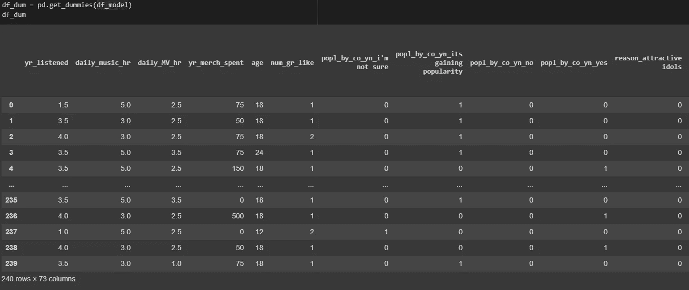

获取虚拟数据以转换分类变量

# 训练和测试分割

主要目标是使用其他独立变量预测“每日音乐小时数”——K-pop 粉丝听 K-pop 的小时数。

设 X 为除“每日 _ 音乐 _hr”之外的所有其他变量，设 Y 为“每日 _ 音乐 _hr”。然后我们用 80%作为训练集，剩下的 20%作为测试集。

# 多元线性回归

由于我们有一个小数据集(只有 240 行)，我们希望避免使用复杂的模型。所以我们从多元线性回归开始。

```
from sklearn.linear_model import LinearRegressionfrom sklearn.metrics import mean_absolute_error# initialize the linear regression modellm = LinearRegression()# train the modellm.fit(X_train, y_train)# perform predicion on the test datay_pred = lm.predict(X_test)# performance metricsprint('Coefficients:', lm.coef_)print('Intercept:', lm.intercept_)print('Mean absolute error (MAE): %.2f' % mean_absolute_error(y_test, y_pred))
```

对于指标，我们将使用 MAE(平均绝对误差)来检查模型的准确性。

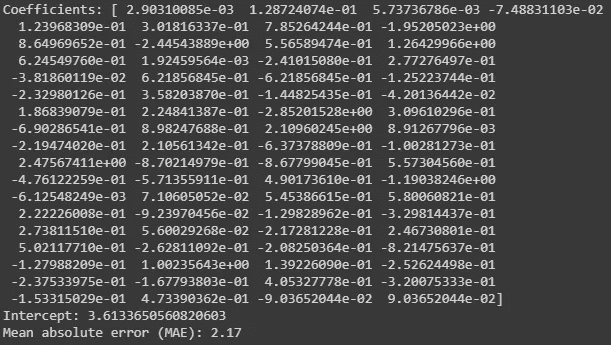

多元线性回归的系数和平均误差

多元线性回归(MLR)模型的 MAE 为 2.17。这意味着平均来说，我们的预测有 2.17 小时的误差。由于 K-pop 粉丝听 K-pop 的小时数从 0 到 10 不等，这是相当合理的。但是让我们看看我们是否能做得更好。

在同一个多元线性回归模型上，我们将应用 10 重交叉验证来概括数据。10 折交叉验证的工作原理是这样的——它在数据中创建了 10 个组，留下 1 个组进行验证，并使用剩余的 9 个组进行训练。最终，它创造了 10 种不同的 Mae。

然后我们取它们的平均值，得到一个单一的 MAE-1.98。

我们可以看到比上面的稍微好一点。

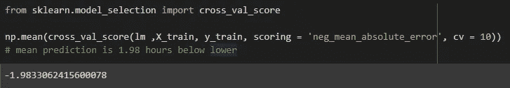

使用 10 重交叉验证的 MLR 的 MAE

# 套索回归

构建模型时处理小数据的另一种方法是使用正则化模型。Lasso ( **L** 东**A**b solute**S**hrinkage 和**S**election**O**operator)使用收缩(alpha)。收缩是指数据值向中心点收缩，如平均值。

它应用 L1 正则化，这增加了等于系数幅度绝对值的惩罚。

套索的 MAE 是 1.58。

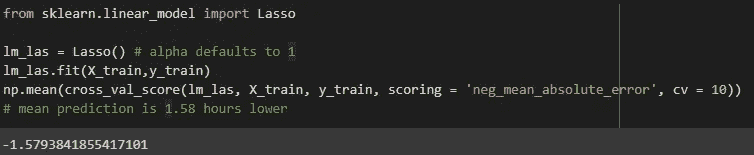

拉索回归的 MAE

我们也可以尝试寻找最优的 alpha 来找到最佳的套索模型。

我们看到最佳 alpha 值是 0.09，MAE 现在稍微好一点，为 1.57。

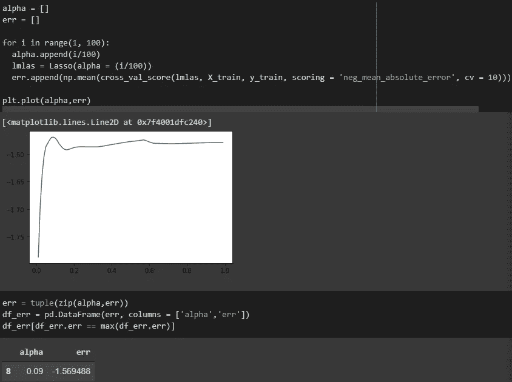

寻找套索回归的最佳α

# 里脊回归

与 Lasso 类似，岭回归也增加了惩罚。它使用 L2 正则化。与 Lasso 回归的唯一区别是，它使用系数的平方大小，而不是绝对值。

岭回归的 MAE 为 1.85，与 lasso 相比并不算大。

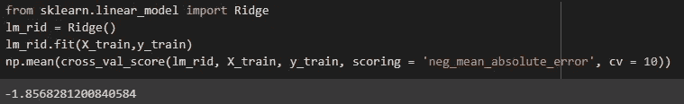

岭回归的 MAE

我们也可以尝试找到最佳收缩参数，但根据图，看起来我们已经有了最佳收缩参数。

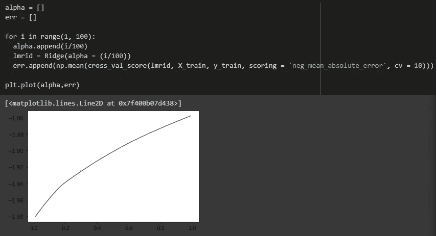

看我们是否能找到最佳收缩率

# 随机森林回归量

基于树的模型可以是好的模型，只要它们不太深。

我们可以看到 RF 的 MAE 为 1.61。

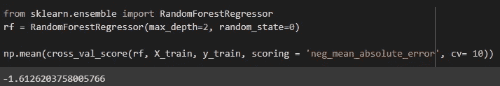

随机森林回归的 MAE

我们还可以尝试调整随机森林模型的超参数。使用 GridsearchCV 是调优参数的好方法。

下面是调整随机回归参数的一种方法。

```
from sklearn.model_selection import GridSearchCVparams = {'n_estimators':range(10,100,10), 
          'criterion':('mse','mae'), 
          'max_features':('auto','sqrt','log2')}gs_rf = GridSearchCV(rf, params,
                     scoring = 'neg_mean_absolute_error', cv = 10)gs_rf.fit(X_train, y_train)
```

使用最佳估计量，最佳 MAE 为 1.51。

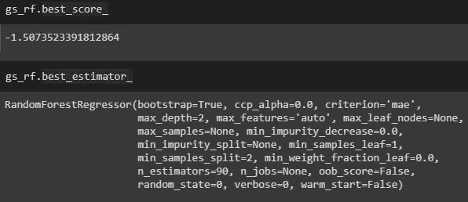

调谐随机森林

# XGBoost

另一个基于树的模型是 XGBoost。

XGBoost 的 MAE 为 1.54。

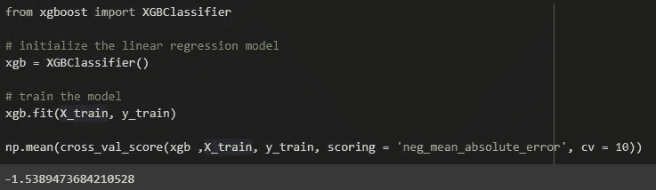

XGBoost 的 MAE

我们还可以尝试调整超参数，就像我们对随机森林模型所做的那样。

```
params = {'min_child_weight': [3, 5, ], 
          'gamma': [0.5, 1], 
          'subsample': [0.8, 1.0],
          'colsample_bytree': [0.6, 0.8], 
          'max_depth': [1,2]}gs_xgb = GridSearchCV(xgb, params,
                      scoring = 'neg_mean_absolute_error', cv = 10)gs_xgb.fit(X_train, y_train)
```

调优后的 XGBoost 的 MAE 为 1.33。

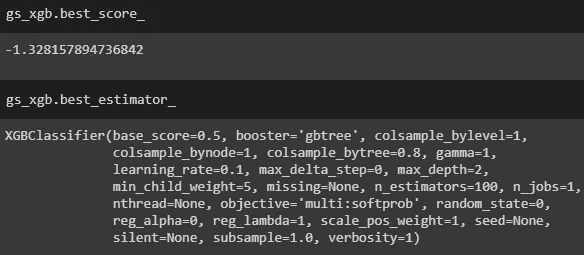

调优的 XGBoost

# 比较所有型号的性能

作为本教程的总结，我们将比较我们构建的所有模型的性能。

```
lm_pred = lm.predict(X_test)lm_las_pred = lm_las.predict(X_test)lm_rid_pred = lm_rid.predict(X_test)rf_pred = gs_rf.best_estimator_.predict(X_test)xgb_pred = gs_xgb.best_estimator_.predict(X_test)
```

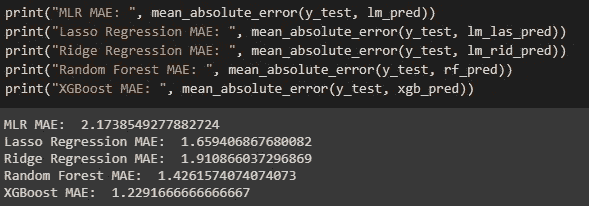

比较模型性能

我们看到 XGBoost 是最好的模型！平均而言，预测误差为 1.23 小时。

当然，你可以花几天时间去寻找“最好”的模型，但同时，我们也希望有效率。

感谢您的阅读！接下来的教程，我要讲的是模型制作！

我的**全码**就是这里的[](https://github.com/importdata/kpop-analysis/blob/master/K_pop_Model_Building.ipynb)**。**