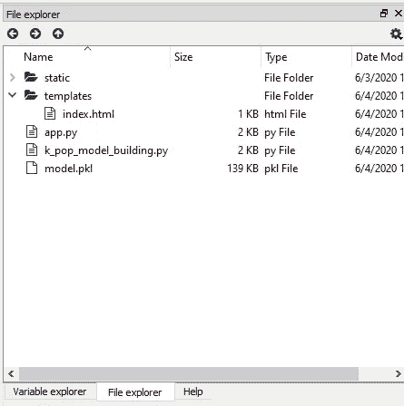

# 使用机器学习分析 K-Pop |第 4 部分—生产模型(模型部署)

> 原文：<https://towardsdatascience.com/analyzing-k-pop-using-machine-learning-part-4-productionizing-the-model-model-deployment-a9fc2e703d95?source=collection_archive---------58----------------------->

## [K-POP 机器学习教程系列](https://towardsdatascience.com/tagged/kpop-ml-tutorial)

## 这是教程的第 4 部分，我使用 FLASK 将预测模型投入生产。


[萨维里·博博夫](https://unsplash.com/@dandycolor?utm_source=unsplash&utm_medium=referral&utm_content=creditCopyText)在 [Unsplash](https://unsplash.com/?utm_source=unsplash&utm_medium=referral&utm_content=creditCopyText) 上的照片

可以在这里 找到之前的教程 [**。**](https://towardsdatascience.com/tagged/kpop-ml-tutorial)

视频版本

*注意:你可以在这篇文章的底部找到整个 GitHub 库的链接。*

在本教程中，我将向您展示如何将一个模型投入生产(又名。模型部署)。

什么是模型部署？模型部署是将机器学习模型集成到现有的生产环境中，以根据数据做出实际的业务决策。

我们将使用 Python web API 和 FLASK 来部署模型。因此，我们的最终目标是创建一个网站，一旦用户输入了输入值，它就会向您提供预测结果。

# 从 GitHub 下载我的文件

首先，去我的 GitHub 页面上的 K-Pop 库下载[模型部署文件夹](https://github.com/importdata/kpop-analysis/tree/master/K-Pop%20Model%20Deployment)。

我们将使用名为 [GitZip](https://kinolien.github.io/gitzip/) 的网站，该网站允许您下载回购中的特定文件夹。您所需要做的就是将链接复制并粘贴到我的模型部署文件夹中。


在这里复制并粘贴我的文件夹链接

您可以随意命名文件夹。我将把我的命名为“K-Pop 模型部署”

# 使用 Spyder IDE

在本教程中，我们将使用 Spyder IDE。

如果你还没有安装，你可以从[这里](https://www.anaconda.com/products/individual)下载(你需要从 Anaconda 网站下载)。请务必下载 3.7 版本，因为这是最新版本。


安装 Anaconda (Python 3.7)

安装后，打开 Spyder IDE，导航到“文件资源管理器”并选择您刚刚下载的文件夹。

打开模板文件夹下的 app.py、k_pop_model_building.py 和 index.html。



Spyder 的文件浏览器

# 仅选择连续变量

在上一篇教程中，我们使用. pd.get_dummies(df_model)将分类变量转换为虚拟/指示变量。我意识到这产生了太多额外的变量，我认为这不是很用户友好(我们不想让用户输入 73 个答案)。因此，我们将只选择连续变量—这样用户只需输入五个变量(“yr_listened”、“daily_MV_hr”、“yr _ merch _ spent”、“age”、“num_gr_like”)来预测“daily _ music _ HR”—他们每天听 K-pop 的小时数。

```
df_real = df[[“yr_listened”, “daily_music_hr”, “daily_MV_hr”, 
              “yr_merch_spent”, “age”, “num_gr_like”]]
```

然后，运行列车并再次测试分离。

```
from sklearn.model_selection import train_test_splitX = df_real.drop('daily_music_hr', axis = 1)
y = df_real.daily_music_hr.valuesX_train, X_test, y_train, y_test = train_test_split(X, y, 
                                   test_size = 0.2, 
                                   random_state = 1)
```

# 运行 XGBoost 模型

从上一个教程中，我们看到 XGBoost 模型是最好的一个。因此，我们将部署这种模式。

```
import xgboost as xgb# initialize the linear regression model
xgb_clf = xgb.sklearn.XGBClassifier(nthread = -1, seed = 1)# train the model
xgb_clf.fit(X_train, y_train)# Tune XGBoost using GridSearchCVfrom sklearn.model_selection import GridSearchCVparams = {'min_child_weight': [5], 'gamma': [1], 
          'subsample': [0.8, 1.0],
          'colsample_bytree': [0.6, 0.8], 
          'max_depth': [1,2]}gs_xgb = GridSearchCV(xgb_clf, params ,
                      scoring = 'neg_mean_absolute_error', 
                      cv = 10)gs_xgb.fit(X_train, y_train)gs_xgb.best_score_xgb_best = gs_xgb.best_estimator_
xgb_bestxgb_best.fit(X_train, y_train)
```

# 保存已训练的模型

我们可以使用 pickle 将训练好的模型保存到磁盘上。它可以在以后重新加载，就像我们训练过的一样使用。

```
# save the model to disk
with open('model.pkl', 'wb') as file:
    pickle.dump(xgb_best, file)
```

# 使用 FLASK 创建 Web 应用程序

首先，我们需要这两样东西来创建一个 web 应用程序。

1.  Python 脚本将加载训练好的模型，要求用户将输入值放在网站上，执行预测，并返回结果。
2.  HTML 模板是网站的格式。这将允许用户输入他们的数据，并将呈现结果。

其结构如下所示:

web app/
index.html├──model/
│└──model . pkl—训练好的模型
├──模板/
│└──—网站格式
└── app.py —托管模型

# 创建 app.py 来托管模型

app.py 将成为网络应用的主干。它会发送网页，从用户那里获取数据来进行预测。

```
# use flask to host the modelimport flask
import pickle
import pandas as pd# Use pickle to load in the pre-trained model
with open(f'model.pkl', 'rb') as f:
    model = pickle.load(f)# initialize the flask app
app = flask.Flask(__name__, template_folder='templates')# set up the main route
[@app](http://twitter.com/app).route('/', methods=['GET', 'POST'])
def main():
    if flask.request.method == 'GET':
        # rendering the initial form, to get input
        return(flask.render_template('index.html'))

    if flask.request.method == 'POST':
        # extracting the input values
        yr_listened = flask.request.form['yr_listened']
        daily_MV_hr = flask.request.form['daily_MV_hr']
        yr_merch_spent = flask.request.form['yr_merch_spent']
        age = flask.request.form['age']
        num_gr_like = flask.request.form['num_gr_like']

        # making dataframe for model
        input_variables = pd.DataFrame([[yr_listened, daily_MV_hr, yr_merch_spent, age, num_gr_like]],
                                       columns=['yr_listened', 'daily_MV_hr', 'yr_merch_spent', 'age', 'num_gr_like'],
                                       dtype=float,
                                       index=['input'])

        # get the model's prediction
        prediction = model.predict(input_variables)[0]
        output = float(round(prediction, 2))

        # render the form again, but add in the prediction and remind user of the values they input before
        return flask.render_template('index.html',
                                     original_input={'yr_listened':yr_listened,
                                                     'daily_MV_hr':daily_MV_hr,
                                                     'yr_merch_spent':yr_merch_spent,
                                                     'age':age,
                                                     'num_gr_like':num_gr_like},
                                     result=float(output)
                                     )

if __name__ == "__main__":
    app.run(debug=True)
```

# 创建 index.html 来格式化我们的网站

这是这个项目的前端部分。它将要求用户输入值，执行预测，并给我们输出。这是很基础的风格。我试着玩 CSS，但无法真正让它工作。如果你了解 CSS 或者想尝试一下样式，请随意！

```
<!doctype html>
<html>
<style>
form {
    margin: auto;
    width: 35%;
}.result {
    margin: auto;
    width: 35%;
    border: 1px solid #ccc;
}
</style><head>
    <title>Predicting Daily K-Pop Listening Hours</title>
</head>
<form action="{{ url_for('main') }}" method="POST">
    <fieldset>
        <legend>Input values:</legend>
        Number of years you listened to K-Pop:
        <input name="yr_listened" type="number" step=".01" required>
        <br>
        <br> Number of hours you watch K-Pop MV per day:
        <input name="daily_MV_hr" type="number" step=".01" required>
        <br>
        <br> How much money you spend on K-Pop merchandise a year:
        <input name="yr_merch_spent" type="number" step=".01" required>
        <br>
        <br> Your age:
        <input name="age" type="number" step=".01" required>
        <br>
        <br> Number of groups you like:
        <input name="num_gr_like" type="number" step=".01" required>
        <button type="submit" class="btn btn-primary btn-block btn-large">Predict!</button>
    </fieldset>
</form>
<br>
<div class="result" align="center">
    
     
      <b>{{ variable }}</b> : {{ value }}
     
  <br>
     <br> Predicted Daily K-Pop Listening Hours:
     <p style="font-size:50px" step=".01">{{ result }}</p>
    
</div></html>
```

# 运行 Web 应用程序

现在我们终于可以测试看看是否一切都按照我们想要的方式工作了！

1.  转到 Anaconda 提示符
2.  将目录更改为您的工作文件夹(即 cd 桌面-> cd K-Pop 模型部署)
3.  运行 app.py(即 python app.py)
4.  将你得到的链接复制并粘贴到浏览器上
5.  输入值，检查它是否给出了预测

Anaconda 提示符命令示例

```
cd Desktop
cd K-Pop Model Deployment
python app.py
```


工作 Web 应用程序

我们完了。希望你觉得这个教程有用！

在下一个教程中，我将向你展示如何通过创建一个作品集网站来记录这个项目！敬请关注。

我的 **GitHub 库**就是这里的[](https://github.com/importdata/kpop-analysis)**。**