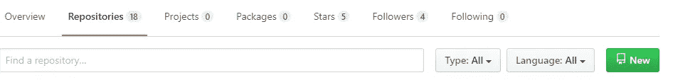
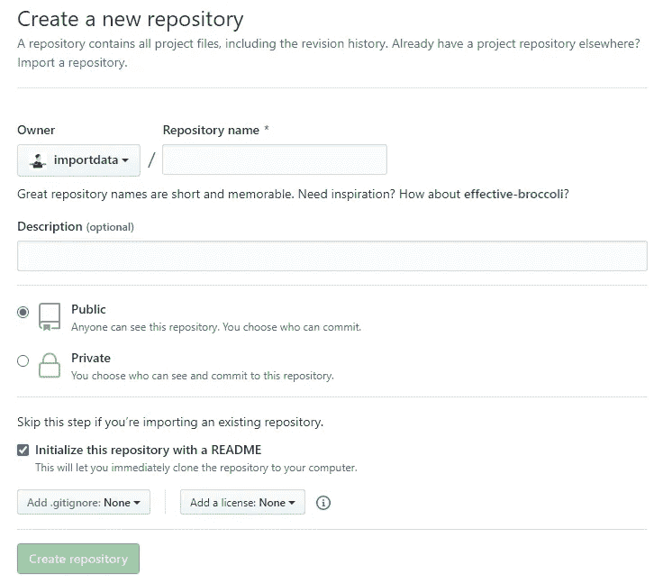
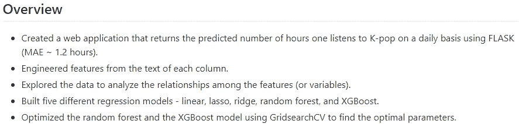
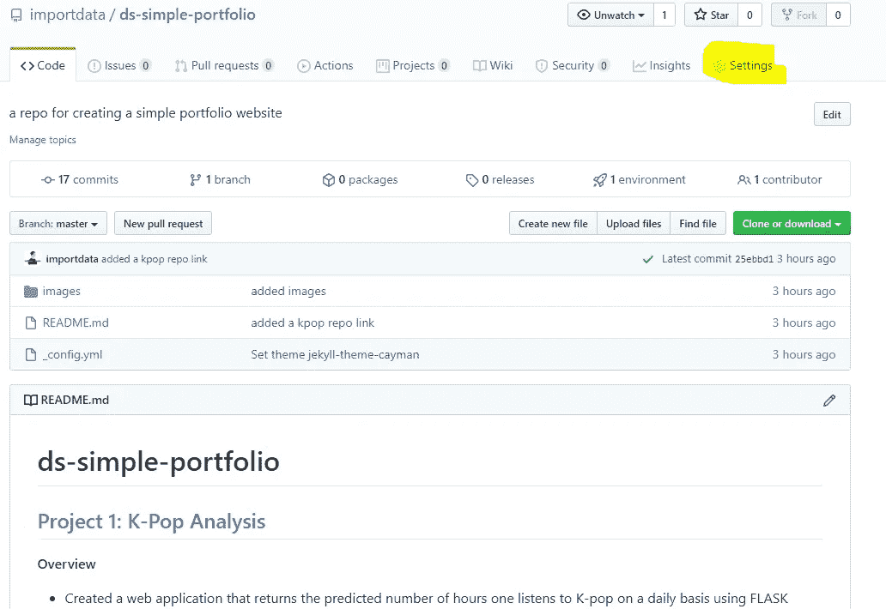
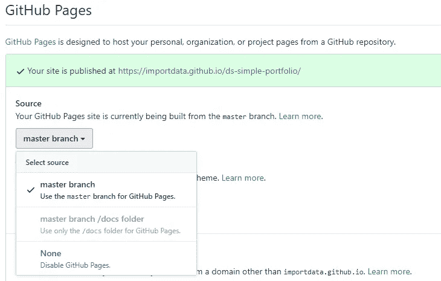
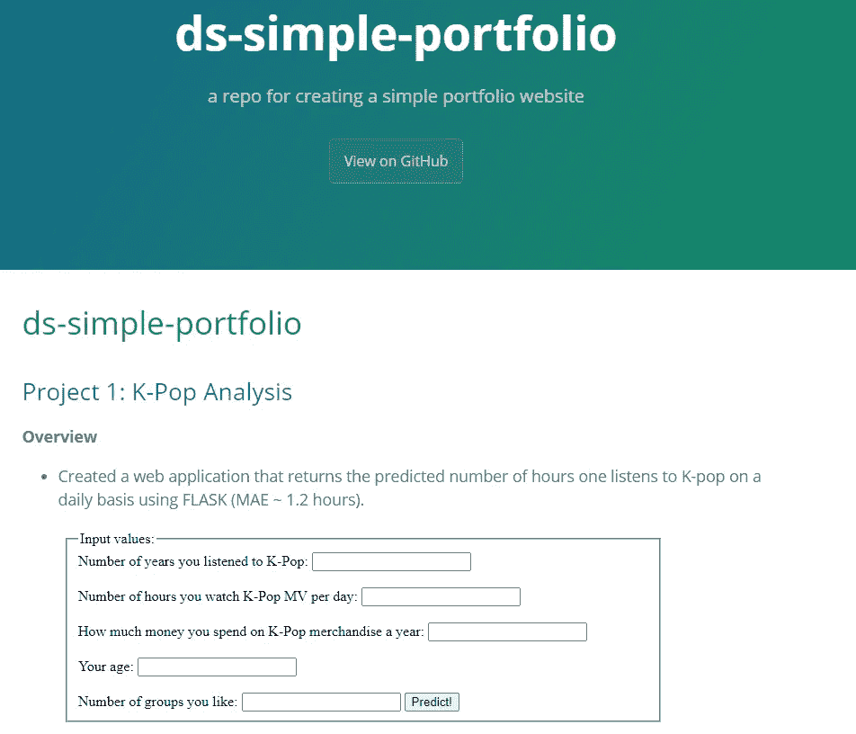

# 使用机器学习分析 K-Pop |第 5 部分— GitHub 文档和作品集网站

> 原文：<https://towardsdatascience.com/analyzing-k-pop-using-machine-learning-part-5-github-documentation-portfolio-website-a88afd8ff2c?source=collection_archive---------55----------------------->

## [K-POP 机器学习教程系列](https://towardsdatascience.com/tagged/kpop-ml-tutorial)

## 这是本教程的最后一部分，我将展示如何在 GitHub 上记录您的工作，以及如何使用 GitHub 托管一个简单的作品集网站。


[萨维里·博博夫](https://unsplash.com/@dandycolor?utm_source=unsplash&utm_medium=referral&utm_content=creditCopyText)在 [Unsplash](https://unsplash.com/?utm_source=unsplash&utm_medium=referral&utm_content=creditCopyText) 上的照片

可以在这里 找到之前的教程 [**。**](https://towardsdatascience.com/tagged/kpop-ml-tutorial)

视频版本

*注意:你可以在这篇文章的底部找到整个 GitHub 库的链接。*

我想通过在 GitHub 上记录它并使用 GitHub 创建一个简单的作品集网站来结束这篇教程。特别感谢 [Ken Jee](https://medium.com/@kenneth.b.jee) 提供的关于如何创建简单投资组合网站的[视频](https://www.youtube.com/watch?v=1aXk2RViq3c)。

# **在 K-Pop 回购中增加概述部分**

```
Overview
- Created a web application that returns the predicted number of hours one listens to K-Pop on a daily basis (MAE ~ 1.2 hours).
- Engineered features from the text of each column.
- Explored the data to analyze the relationships among the features.
- Built five different regression models — linear, lasso, ridge, random forest, and XGBoost.
- Optimized the random forest and the XGBoost models using GridSearchCV to find the optimal parameters.
```

# 为投资组合网站创建回购

创建新的存储库

存储库->新建->用 README.md 初始化



我把我的命名为“ds-简单-投资组合”。

# 在 README.md 文件中添加内容

我将为 K-Pop 分析项目添加如下描述。



我还将在这里添加一些图像——一个用于 web 应用程序的图像和一些用于探索性数据分析的图像。

在 README.md 文件中添加完内容后，请转到“设置”。



向下滚动到“GitHub Pages”，打开“Source”下的“Master Branch”。



一旦你点击它，它会给你一个网址，这是你的工作组合网站！

你也可以选择你喜欢的主题。



最终作品集网站

感谢您在本教程中调谐！向所有晋级到最后一轮的人致敬。我个人很享受这个旅程，因为我学到了以前没有用过的技术。我学会了如何使用 GridSearchCV 寻找最佳参数，还学会了如何部署模型和创建 web 应用程序。

[**完成了简单的作品集网站**](https://importdata.github.io/ds-simple-portfolio/)

我的 **GitHub 库**就是这里的[](https://github.com/importdata/kpop-analysis)**。**