# 分析 MacBook GPU 性能；使用 MLflow 和弹性 Kibana 进行可视化

> 原文：<https://towardsdatascience.com/analyzing-macbook-gpu-performance-visualizing-with-mlflow-and-elastic-kibana-40e7bc494260?source=collection_archive---------43----------------------->

## 使用 AMD GPU、英特尔 UHD 和英特尔 CPU 加速深度学习的各种 MacBook PlaidML 配置的比较；用 Databricks MLflow 和 Elastic Kibana 可视化。

 [## plaidml/plaidml

### 首先，我们要感谢您选择 PlaidML。无论您是新用户还是多年的老用户，我们都非常…

github.com](https://github.com/plaidml/plaidml) 

一名观众对我的 YouTube 视频发表了评论，该视频展示了如何在 MacBook 上为 Keras 启用 AMD GPU 加速。

非常正确

评论指出我选择的 OpenCL 库不如 Metal 库性能好。这激起了我的好奇心。金属永远比 OpenCL 快吗？快了多少？AMD GPU 比英特尔 UHD 和英特尔 CPU 快多少？我 MacBook 中的三个计算设备是:

1.  镭龙 Pro 560X 4 GB
2.  英特尔 UHD 显卡 630 1536 MB
3.  2.3 GHz 英特尔酷睿 i9，16 个线程，32 GB 主内存

## TL；速度三角形定位法(dead reckoning)

DavidVilla147BVB 懂他的东西！在 MacBook 上加速深度学习，Metal 库绝对比 OpenCL 库快。在下图中，Y 轴是网络架构，从下到上依次为:IMDB_LSTM、MobileNet、NasNet Mobile、VGG16、VGG19。X 轴从左到右是以下计算配置:英特尔 CPU、OpenCL-UHD、金属 UHD、OpenCL-GPU、金属 GPU。

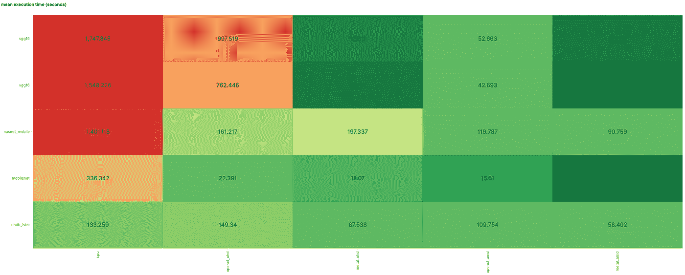

Y =网络架构；X =设备/库

一位同事最近提出了 MFflow，这个小实验似乎是检验它的完美借口。在这个实验中，我发现 PlaidML 有自己的一套称为 Plaidbench 的性能测试。Plaidbench 将其结果写成 JSON。拥有一堆需要分析的 JSON 文档引发了我对 Elastic 和 Kibana 的思考。以下是对 MFLow 和 Elastic 的 Kibana 的分析和可视化。我的设置如下。

# PlaidML 与 Python 虚拟环境(venv)

我的第一步是用 pip 安装 PlaidML。最近，我一直在为新项目创建 python 虚拟环境，并将它们全部放在 NFS 的一个位置，以便在任何计算机上使用。以前，我只是在我的 Conda 环境或默认环境中运行。如果我感觉像青蛙，我会用 Docker 容器…我想这是我应该一直做的。

PlaidML venv & pip(与 asciinema.org 一起录制)

# PlaidML 安装脚本

PlaidML 有一个简单的设置脚本，可以创建一个 JSON 文件，~/.plaidml。

要尝试所有可能的配置，而不仅仅是 AMD 的 Metal，您必须复制~/。plaidml 文件到另一个位置。否则，您只会覆盖之前的~/。plaidml 文件。我选择将该文件复制到一个更具描述性的文件名中，以指示其内容，然后为我想要测试的每个配置重新运行‘plaidml-setup’脚本。这看起来是这样的:

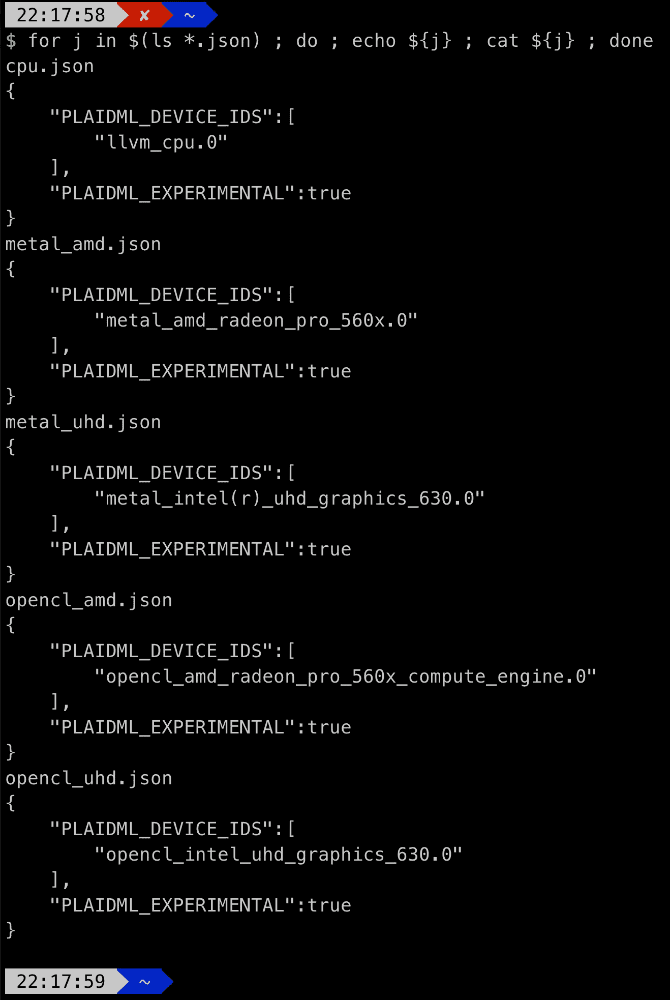

然后，对于每个试验，我将所需的测试配置文件复制到~/.plaidml 中。例如，要使用 OpenCL 测试英特尔 UHD，我会将“opencl_uhd.json”复制到“~/”。因为这是 Plaidbench 期望这个配置文件所在的位置。我可以修改代码，但我发现交换文件很容易。

# 数据块 MLflow

 [## MLflow —机器学习生命周期的平台

### 机器学习生命周期的开源平台 MLflow 是一个管理机器学习生命周期的开源平台

mlflow.org](https://mlflow.org/) 

mlflow

我一直在寻找一个借口来测试 MLflow，这似乎是一个完美的用例。我运行了许多 ML 试验，这个开源软件很容易安装、使用和探索它的 web UI。

MLflow 安装和 UI 启动

UI 运行后，可以通过本地主机上的浏览器在端口 5000 上访问它:[http://locah host:5000](http://HTTP://locahost:5000)

# 运行我的试验

现在，我已经准备好开始开发和运行我的基准代码了。由于 PlaidML 库附带了一个基准测试系统，所以只需要用正确的计算机硬件和库调用基准测试系统。使用的五种硬件和软件加速器配置是:

1.  带 AMD 的金属
2.  带 AMD 的 OpenCL
3.  金属带英特尔 UHD
4.  OpenCL 与英特尔 UHD 合作
5.  英特尔 CPU

我选择了五种网络架构进行测试，以便在合理的时间内完成测试。这些网络是:

1.  MobileNet
2.  纳斯特移动
3.  IMDB
4.  VGG16
5.  VGG19

由于每个基准测试都调用 PlaidML 中的' exit()'，所以我创建了一个 bash 脚本来重复调用我的 Python 脚本。Python 脚本验证试验尚未运行，然后运行试验。对于这样一个简单的项目，在 MLflow 中调用这三个基本函数。

1.  **mlflow.start_run()** #表示单次试验的开始
2.  **ml flow . log _ param(' param _ name '，value)** #零到多个您希望跟踪的参数，~个独立值
3.  **ml flow . log _ metric(' metric _ name '，value)** #要分析的结果，~相关值

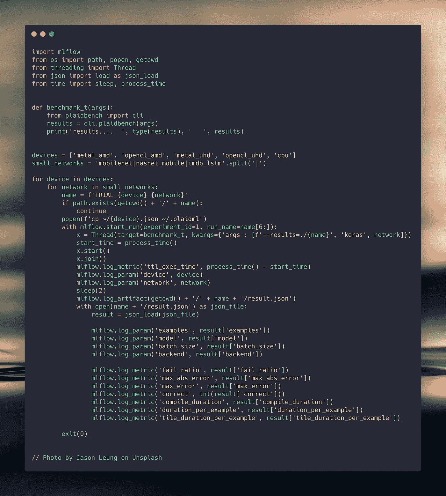

trial.py(已创建 w/ [carbon.now.sh](https://carbon.now.sh/) )

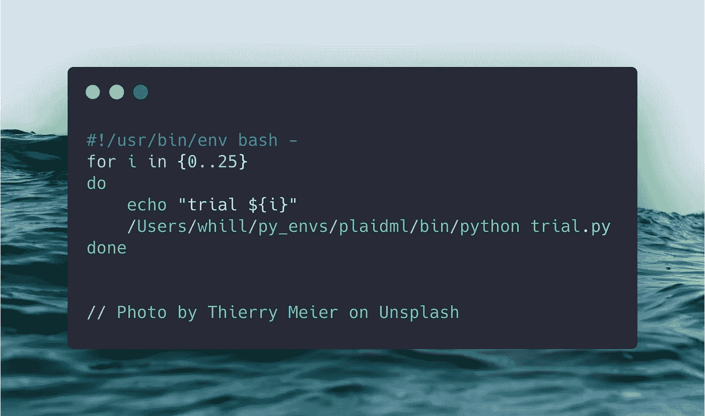

trial_driver.sh

# MLflow 中的结果

我检查了 MLflow 中的原始数据，然后深入研究了网络架构。我发现用简单的查询语法深入数据很容易，但是我发现绘图系统有点初级。为了深入研究 IMDB LSTM 网络的结果，我简单地用*params . network = ' IMDB _ lstm '*进行了查询，然后进行了基本的绘图。这里是一个快速查看一对夫妇的图表明，AMD 的金属库 GPU 确实是最快的设置。

情节 1

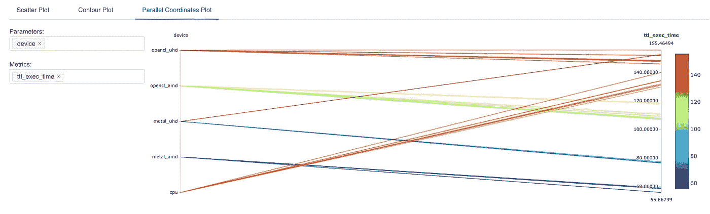

情节 2

这里有一个动画 GIF 演示如何创建前两个情节。

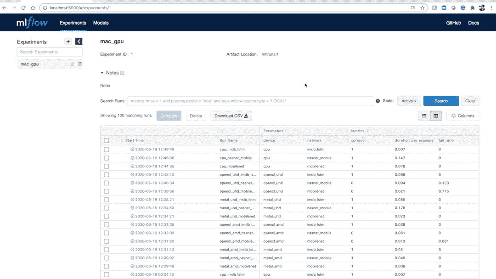

mlflow 演示

## MLflow 摘要

MLflow 是一个不错的工具。我喜欢它入门的简单性，简单的 API，以及漂亮而简单的 web UI。我认为 Databricks 最终会把它建成更有价值的东西。最重要的是，我喜欢它是开源的，而不是像 Spark 一样绑定(或锁定)在一个单一的技术上。我也喜欢它有一个 Python API。

# 基巴纳的结果

 [## 基巴纳

### 刚到基巴纳？这是你开始工作所需要的一切。观看视频，了解使用 Kibana 进行数据分析的核心概念…

www.elastic.co](https://www.elastic.co/kibana) 

这里是我的 Kibana 仪表板的一个演示，展示了 plaidbench 设置的各种总执行时间。

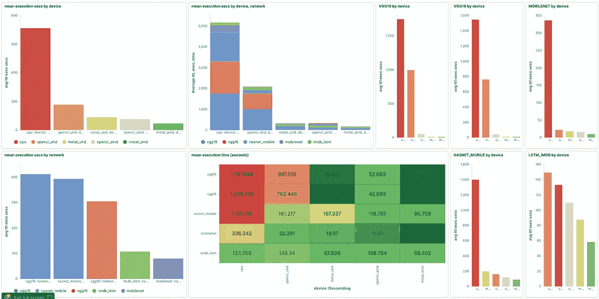

## 基巴纳设置

要让 Kibana 快速运行，您可以运行一个 ElasticSearch Docker 映像，然后运行一个 Kibana Docker 映像。一旦您的容器运行，几行 Python 代码将索引所有基准 JSON 文件。

## 在 Docker 中创建 ElasticSearch + Kibana“集群”

## 用 Python 索引原始数据

要将数据输入 ElasticSearch，你需要一个“索引”然后这个索引需要一个“映射”我认为映射是索引数据的模式。Elastic 的一个很好的特性是你可以简单地开始索引数据，Elastic 会为你创建一个默认的索引和映射。这就是你搜索所需要的一切。除了搜索，还需要做更多的工作。在我的例子中，我想用 Kibana 进行可视化分析，所以我为我的数据创建了一个自定义映射。

Elastic 在所有主要语言中都实现了一个干净的 API，或者你可以使用他们各种*Stash 应用程序中的一个来代替编码。我用 Python 做了我的自定义映射。我的代码根据值是否可以转换为数字来自动创建我的映射(即模式)。如果没有，我将字段类型设置为“keyword”而不是“text ”,这样我就可以在 Kibana 中执行聚合。

## 我的自动映射 Python 代码

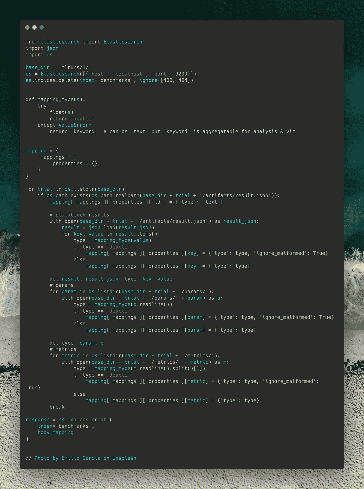

Python 中的自动弹性映射

## 我的弹性索引代码

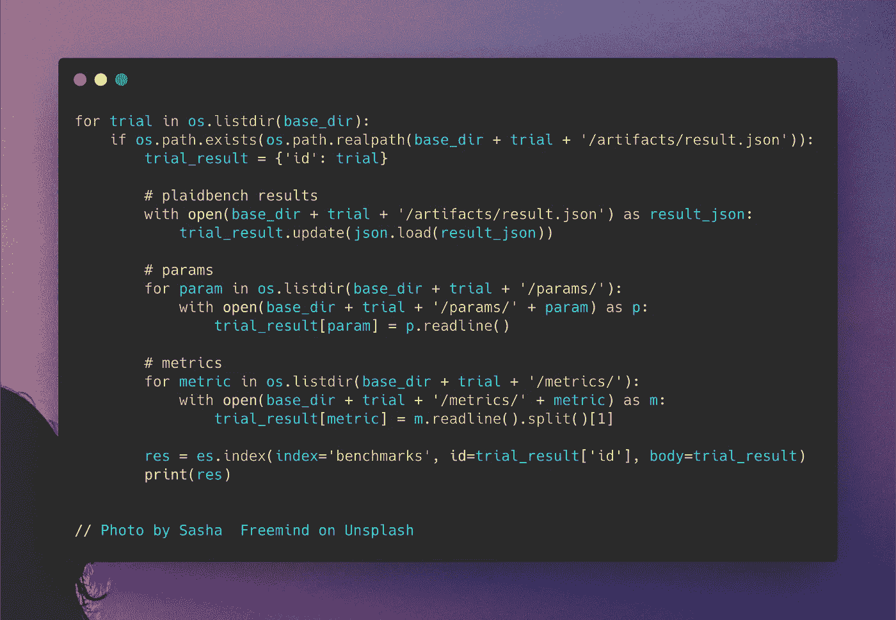

Python 弹性索引

## 基巴纳可视化

在我索引我的代码之后，我构建了我的 Kibana 仪表板。

这一部分总是令人愉快的。我还没有从 Kibana 的“镜头”功能中得到任何东西，但公平地说，它仍处于测试阶段。各个可视化效果是同步的，这样，如果您深入查看一个小部件，整个仪表板都会更新。您还可以添加一个客户小部件，让查看者能够执行深入分析。选择您的各种范围和过滤器并单击“应用更改”按钮将更新整个仪表板。

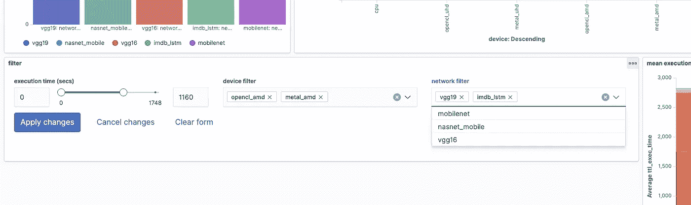

自定义深入小部件

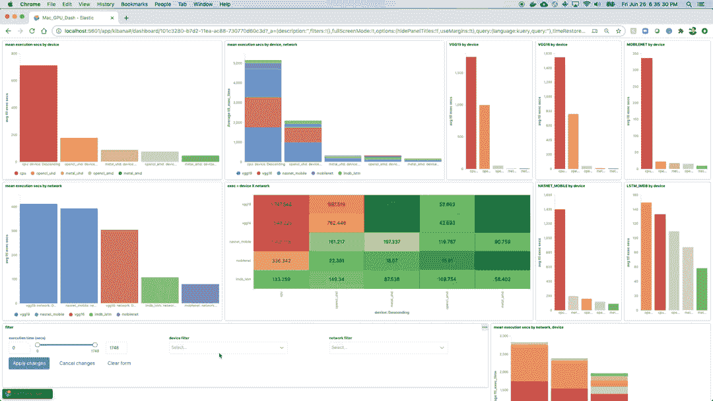

自定义小部件的演示

# 摘要

MLflow 有潜力，但我认为需要以简单性为代价增加一点功能。在我的下一篇文章中，我将分享如何在 Kibana 中创建一个仪表板。不难，但和大多数事情一样，细节的微调也不简单。但大多数情况下，如果你试图在 Mac 或 MacBook 上加速你的深度学习，请始终使用金属库。谢谢 DavidVilla147BVB。