# 用 Python 分析医疗保险数据

> 原文：<https://towardsdatascience.com/analyzing-medicare-data-in-python-9417eaa140a6?source=collection_archive---------41----------------------->

## 使用 BigQuery 在 Python 中提取和分析医疗保险数据


照片由[像素](https://www.pexels.com/photo/20-mg-label-blister-pack-208512/)上的 [Pixabay](https://www.pexels.com/@pixabay) 拍摄

医疗保险是为 65 岁及以上的美国人提供的单一付款人国家社会健康保险计划。它还包括一些有残疾状况的年轻人、ALS 患者和终末期肾病患者。医疗保险和医疗补助服务中心向公众提供医疗保险数据。可以通过 Google BigQuery 访问数据。

您可以使用数据集来回答以下问题:

1.  每个州开出的药物总数是多少？
2.  每个州最常开的药物是什么？
3.  每个城市和州的住院和门诊治疗的平均费用是多少？
4.  在美国，哪些是最常见的住院诊断疾病？
5.  对于每种诊断条件，哪些城市的病例数最多？
6.  这些城市在这些条件下的平均费用是多少，与全国平均水平相比如何？

在本帖中，我们将对医疗保险数据库中的数据进行一些简单的探索性数据分析。虽然我们不会回答上面所有的问题，但这篇文章将为感兴趣的读者提供一个良好的开端。

首先，要访问数据，你需要创建一个谷歌云账户。接下来，您需要安装 Google BigQuery 并生成认证凭证。你可以在这里找到操作说明[。](https://cloud.google.com/bigquery/docs/bigquery-storage-python-pandas)

我们开始吧！

首先，让我们导入必要的 google 身份验证和 BigQuery 包:

```
from google.oauth2 import service_account
from google.cloud import bigquery
```

接下来，我们需要导入熊猫并将列设置定义为“None”。我们这样做是为了显示所有的列，因为 pandas 默认情况下会截断它们。

```
import pandas as pd
pd.set_option("display.max_columns", None)
```

接下来，我们定义密钥路径、客户端凭证和客户端对象:

```
key_path = "key_path/key.json"credentials = service_account.Credentials.from_service_account_file(
    key_path,
    scopes=["[https://www.googleapis.com/auth/cloud-platform](https://www.googleapis.com/auth/cloud-platform)"],
)client = bigquery.Client(
    credentials=credentials,
    project=credentials.project_id,
)
```

接下来，我们定义数据集引用，其中我们传入数据库的名称“medicare”和项目的名称“bigquery-public-data”:

```
dataset_ref = client.dataset("medicare", project="bigquery-public-data")
```

我们可以看看 12 个可用的表:

```
columns = [x.table_id for x in client.list_tables(dataset_ref)]
print(columns)
```

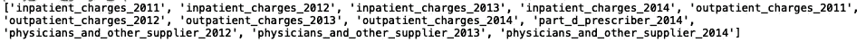

让我们来看看列表中的第一个元素，“住院 _ 费用 _2011”:

```
table_ref = dataset_ref.table('inpatient_charges_2011')
table = client.get_table(table_ref)
```

我们可以将结果存储在数据帧中，并打印列名:

```
df = client.list_rows(table).to_dataframe()
print(df.columns)
```

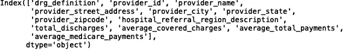

我们还可以查看数据帧的长度:

```
print(len(df))
```

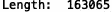

我们还可以打印数据帧的前五行:

```
print(df.head())
```

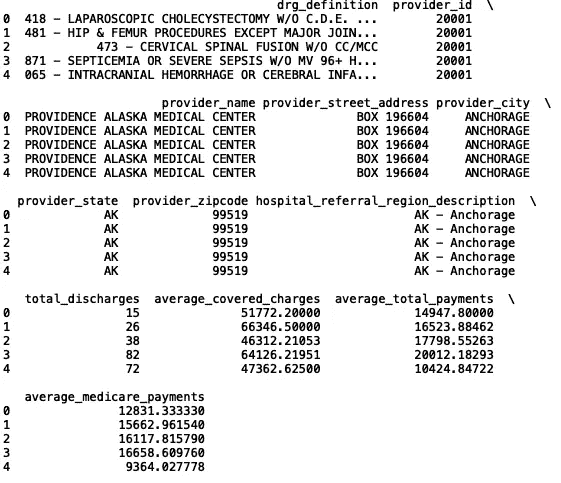

我们可以从 python 中的 collections 模块导入 counter 方法来分析一些分类变量的分布。让我们看看“提供商名称”列:

```
from collections import Counter
print(dict(Counter(df['provider_name'].values).most_common(20)))
```

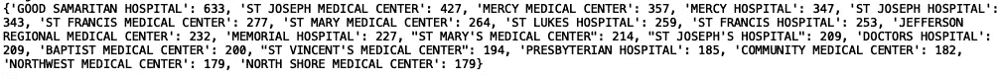

我们也可以将这些输出可视化。让我们定义一个函数，它将类别字符串作为输入，并显示四个最常见值的条形图:

```
import matplotlib.pyplot as plt
import seaborn as sns
def plot_most_common(category):
    sns.set()
    bar_plot = dict(Counter(df[category].values).most_common(4))
    plt.bar(*zip(*bar_plot.items()))
    plt.show()
```

现在让我们用“provider_name”调用函数:

```
plot_most_common('provider_name')
```

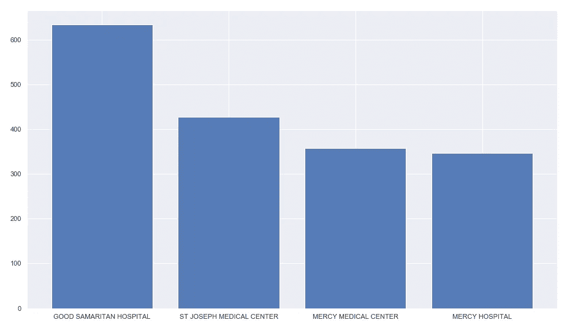

我们还可以看看“drg_description”的四个最常见的值:

```
plot_most_common('drg_description')
```

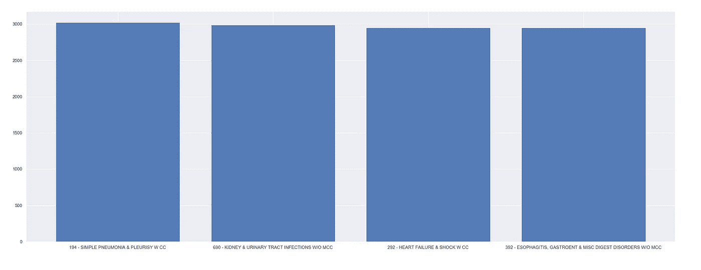

我们还可以定义一个函数来生成跨分类值的箱线图。我们使用箱线图来显示基于最小值、最大值、中值、第一个四分位数和第三个四分位数的数值分布。如果你对它们不熟悉，可以看看文章[了解盒子情节](/understanding-boxplots-5e2df7bcbd51)。

该函数采用数据框、分类列和数值列，并根据限制显示最常见类别的箱线图:

```
def get_boxplot_of_categories(data_frame, categorical_column, numerical_column, limit):
    keys = []
    for i in dict(Counter(df[categorical_column].values).most_common(limit)):
        keys.append(i)
    print(keys)

    df_new = df[df[categorical_column].isin(keys)]
    sns.boxplot(x = df_new[categorical_column], y = df_new[numerical_column])
```

让我们为 5 个最常出现的提供者名称中的平均 medicare 付款生成箱线图:

```
get_boxplot_of_categories(df, 'provider_name', 'average_medicare_payments', 5)
```

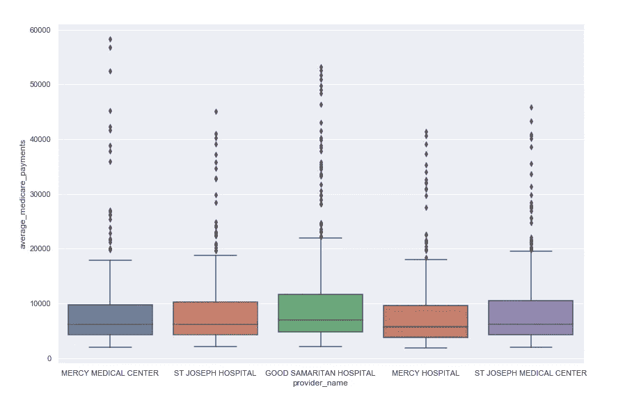

我们可以为“总排放量”生成一个类似的曲线图:

```
get_boxplot_of_categories(df, 'provider_name', 'total_discharges', 5)
```

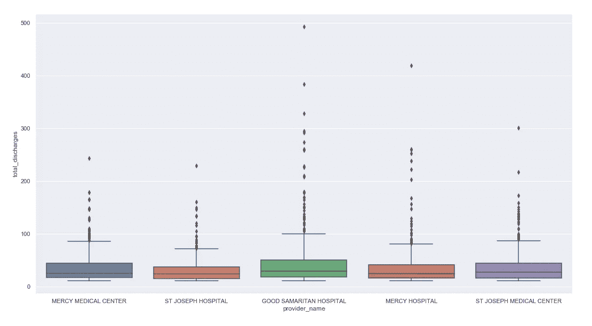

我们还可以构建一个散点图函数。此函数将一个数据框、分类列、分类值和两个数字列作为输入，并显示一个散点图:

```
def get_scatter_plot_category(data_frame, categorical_column, categorical_value, numerical_column_one, numerical_column_two):
    import matplotlib.pyplot as plt
    import seaborn as snsdf_new = data_frame[data_frame[categorical_column] == categorical_value]
    sns.set()
    plt.scatter(x= df_new[numerical_column_one], y = df_new[numerical_column_two])
    plt.xlabel(numerical_column_one)
    plt.ylabel(numerical_column_two)
```

让我们为“好撒马利亚人医院”生成一个平均医疗保险付款与总出院人数的散点图:

```
get_scatter_plot_category(df, 'provider_name', 'GOOD SAMARITAN HOSPITAL', 'average_medicare_payments', 'total_discharges')
```

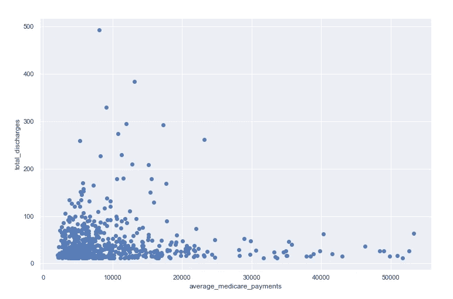

我们也可以看看“北岸医疗中心”的同一个图:

```
get_scatter_plot_category(df, 'provider_name', 'NORTH SHORE MEDICAL CENTER', 'average_medicare_payments', 'total_discharges')
```

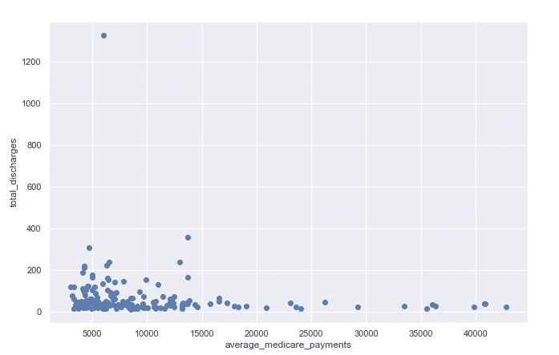

概括地说，在这篇文章中，我对医疗保险数据集进行了简单的探索性数据分析。我分析了提供者名称的分类值的分布。我还生成了条形图，用于可视化数据集中提供者名称的出现频率。最后，我定义了用于生成跨类别值的箱线图和可视化数值散点图的函数。我希望这篇文章有趣。

这篇文章的代码可以在 [GitHub](https://github.com/spierre91/medium_code) 上找到。感谢您的阅读！