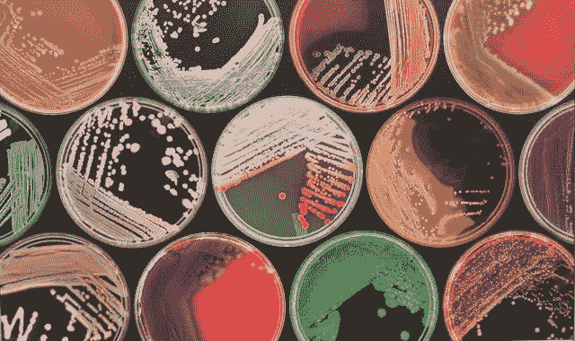
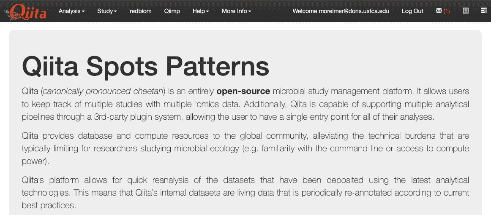
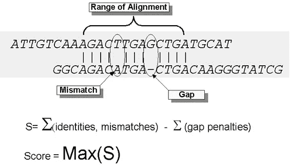
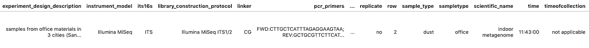
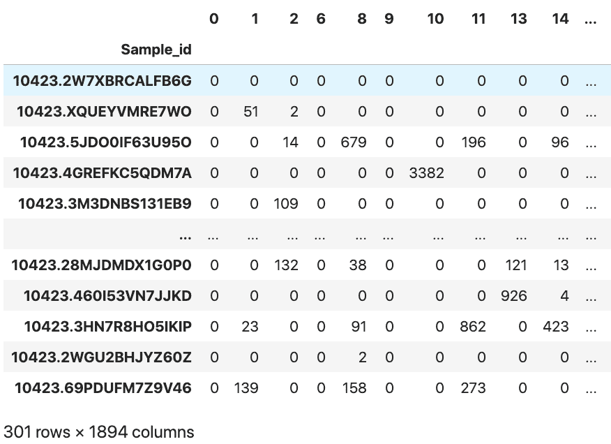
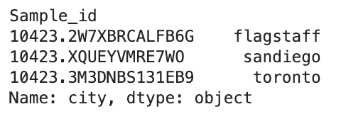

# 分析微生物组数据

> 原文：<https://towardsdatascience.com/analyzing-microbiome-data-320728b56b8e?source=collection_archive---------52----------------------->


来源: [DNA 壁纸洞穴](https://wallpapercave.com/dna-background)

## 第 1 部分—基因组数据科学系列

本文是将机器学习应用于生物信息学数据的系列教程的一部分:

第 1 部分—数据采集和预处理

[第二部分——可视化高维数据](/visualizing-high-dimensional-microbiome-data-eacf02526c3a)

为了跟进，你可以下载我们的 [Jupyter 笔记本](https://github.com/njparker1993/Microbiome_Machine_Learning/blob/master/Microbiome_Data_Acquisition.ipynb)，或者继续阅读并输入下面的代码。

# 介绍

我们许多人大部分时间都在室内度过，但很少有人意识到我们接触的每一个表面都是寄居在这些空间的特殊有机体的家园——门把手、厨房柜台、桌子、椅子、浴室、冰箱等。当我们想到不同的生态系统，如沙漠、雨林、草原或珊瑚礁时，我们知道不同的生物群落专门生活在世界上的这些地区。同样，我们可以推断不同组成或不同类群的微生物和真菌可能专门生活在我们周围的不同位置或表面。我们称这些特殊的微生物群落为 [*微生物群*](https://en.wikipedia.org/wiki/Microbiota) 。



来源:[2012 年隐形世界展览，地理](https://www.geograph.org.uk/photo/2815842)

如果我们只知道这些生物群落之间的基因差异会怎么样？我们也许可以逆向工程这些生物体的来源？在接下来的系列教程中，我们将向您展示我们如何从简单表面拭子的基因序列数据出发，在事先不知道拭子来源位置的情况下，使用一些数据科学检测工作，找出如何区分这些拭子的来源位置。

为了研究微生物组之间的遗传差异，我们能够使用 [*Qiita*](https://qiita.ucsd.edu/static/doc/html/index.html) 找到一个数据集。



来源:[qi ta 文档](https://qiita.ucsd.edu/)

Qiita(发音为“ *cheetah* ”)是一个多组学软件包和数据库，包含微生物生态学数据集，并提供一个良好的界面来搜索不同类型的组学数据，从论文中找到参考数据，甚至提供关于文件类型和相关元数据的信息。它基于[*qime*](https://en.wikipedia.org/wiki/QIIME)生物信息学管道，将原始测序数据转换和处理为有利于数据分析的通用格式。其他常见的生物信息学管道有*方法*、*数据 2* 、*使用原型*等。不同管道的比较，[见此处](https://journals.plos.org/plosone/article?id=10.1371/journal.pone.0227434)。

# 获取我们的数据

要访问这些数据，您需要创建一个帐户，然后[点击左侧的*所有 QIIME 地图和 BIOMs* 下载北亚利桑那大学病原体&微生物研究所](https://qiita.ucsd.edu/study/description/10423) [Caporaso 实验室](https://caporasolab.us/)收集的数据。


资料来源: [Qiita，Caporaso 实验室项目](https://qiita.ucsd.edu/study/description/10423)

一旦完成，你需要解压文件，把它放在一个名为 *data* 的文件夹中，然后把数据转换成我们可以处理的格式。为此，我们首先需要安装一个名为 *biom-format* 的软件包，方法是在您的终端上键入:

```
pip install biom-format
```

完成后，我们可以在终端中运行以下命令:

```
biom convert -i data/BIOM/60899/all.biom -o data/BIOM/60899/feature_table.tsv — to-tsv
```

此命令将转换我们的。biom 文件到更熟悉的。tsv 格式，这样我们就可以进入我们的 *Jupyter* 笔记本，并通过以下方式读入 *Pandas* 数据帧:

[BIOM 文件格式](http://biom-format.org/)常见于*-组学*数据集中，用于表示 *OTU* 表格。OTUs 代表 [*可操作的分类单位*](https://en.wikipedia.org/wiki/Operational_taxonomic_unit) ，可认为是由基因组特定区域的遗传序列相似性分组的生物集群。本质上，当生物集群未知时，它们在不同的分类水平上充当“物种”的代理。该表中的观察值或行是 OTU，相应的矩阵记录了在每个样品中观察到每个 OTU 的次数。

由于最初收集这些数据的科学家最有可能在不同的表面和位置采集拭子，然后对拭子采集的微生物和真菌的 DNA 进行测序，我们不一定事先知道实际物种的组成。我们所拥有的是不同组的 DNA 串(由 *A，T，C，Gs* 组成)，然后我们可以通过对其运行 [*BLAST*](https://en.wikipedia.org/wiki/BLAST_(biotechnology)) 局部比对搜索算法来与参考数据库进行比较。



来源:[爆炸词汇](https://www.ncbi.nlm.nih.gov/books/NBK62051/)

这样的工具可以在这里找到。在我们的例子中，这一步已经为我们完成了。

# 数据预处理

幸运的是，我们的数据集已经带有相应的元数据文件，其中包含有关样本 id、测序执行位置、数据来自的实验类型、使用的测序机器、拭子收集的时间戳、地理位置等信息。我们可以通过以下操作在 pandas 中打开我们的元数据文件:



来源:作者图片

然后，我们可以创建一个助手函数，它从我们的。biom 文件，并将其转换为更容易处理的格式，我们称之为*特征表*:

然后，我们可以在之前的原始表上运行上面的 helper 函数，并重命名我们的索引:

我们可以看到，我们从一个有 1，497 行和 25，756 列的表开始。因为每一列代表一个特定的基因序列或 OTU(对应于我们的特征或维度)，所以我们可以看到我们正在处理难以置信的高维数据。这在处理宏基因组数据集时很常见，并提出了传统数据科学技术可能无法应对的新挑战。

为了帮助我们处理这种高维度，我们使用我们的助手函数将每个最初标记有基因序列的列重命名为相应的整数，这样我们就没有真正长的基因序列字符串作为列名。这些列中的每一列包含每行的特定 OTU 的频率或计数。每一行代表一个样本 id，其可以识别例如特定的拭子。

从这里，我们可以经历一些用于清理生物信息学数据的常见实践。通过确保每个序列有 20，000 个以上的相关读数，并且在至少 3 个不同的样本中出现过(本质上，应用一系列阈值)，我们可以对数据进行子集化，这样我们现在有 301 行和 1，894 列。

请注意，这一步还有很多可以改进的地方，许多科学论文都是关于这一点的。我们正从快速和肮脏的角度来处理这个问题。



来源:作者图片

因为我们应用了阈值来减少我们的要素表，所以我们也将从元数据表中删除那些对应的条目:

从这里，我们现在可以使用我们的元数据来仔细检查，看看我们有来自 3 个不同城市的样本:



来源:作者图片

# 后续步骤…

我们已经完成了解释微生物组宏基因组数据的性质的步骤，如何获得它，如何加载它，以及如何预处理它并将其转换成我们现在可以进行分析的格式。在[我们的下一篇文章](https://medium.com/@njparker_8716/visualizing-high-dimensional-microbiome-data-eacf02526c3a)中，我们将向您展示如何应用各种机器学习算法和降维技术来帮助可视化和解释高维数据，以便我们可以从数据中推断出潜在的地理结构，而不必求助于通过元数据提供的标签。

参见:[第二部分——可视化高维数据](/visualizing-high-dimensional-microbiome-data-eacf02526c3a)

本教程系列的两位合著者是[尼古拉斯·帕克](https://medium.com/u/76a19323c6b6?source=post_page-----320728b56b8e--------------------------------) & [蒙迪·雷默](https://medium.com/u/65f1193d859e?source=post_page-----320728b56b8e--------------------------------)，他们都是旧金山大学数据科学硕士项目[的毕业生。](https://www.usfca.edu/arts-sciences/graduate-programs/data-science)

如果您想联系我们，请联系我们:

**蒙迪·雷默** [领英](https://www.linkedin.com/in/mundyreimer)
[推特](https://twitter.com/MondayRhymer)
[个人博客](https://mundyreimer.github.io/)

**尼克·帕克** [Linkedin](https://www.linkedin.com/in/nicholas-j-parker)
[个人博客](https://medium.com/@njparker_8716)