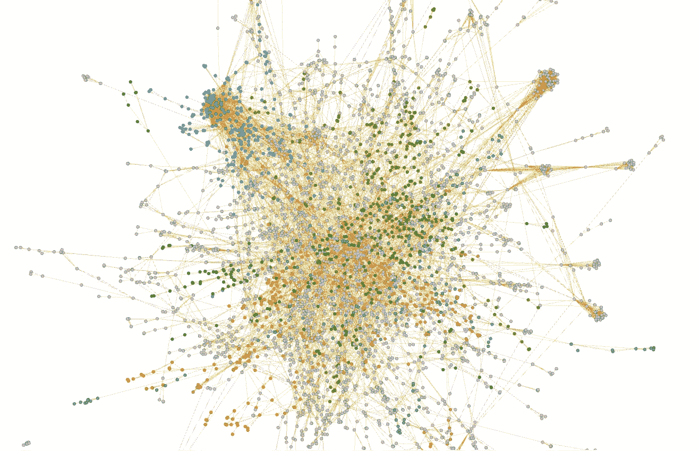
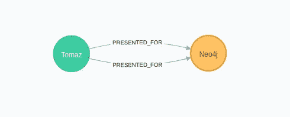
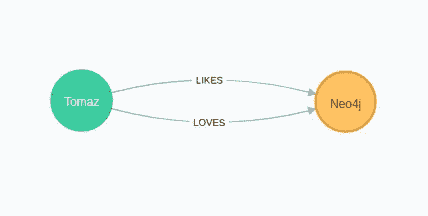
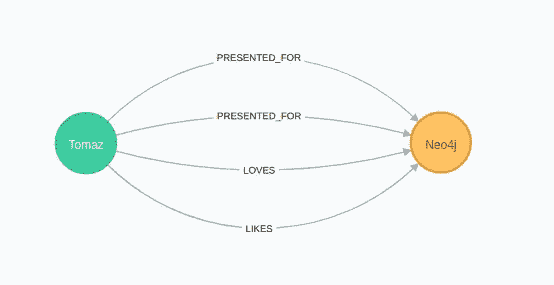

# Neo4j 图形数据科学库中多重图形的分析

> 原文：<https://towardsdatascience.com/analyzing-multigraphs-in-neo4j-graph-data-science-library-35c9b6d20099?source=collection_archive---------19----------------------->

## 了解如何使用 Neo4j 分析多重图以及如何快速将多重图简化为单一图



当时局艰难时，我认为关注我们的关系是至关重要的。我们中的一些人更关注社会交往。其他人喜欢摆弄[神经元](https://github.com/connectome-neuprint/neuPrint)，而有些人只想看看可爱的[动物](http://networkrepository.com/asn.php)。不管你的网络偏好是什么，我都愿意帮助你反思那些关系，并找到更多关于它们的(积极的)见解。为此，我们将戴上数据科学的帽子，研究一个简单的网络，以了解 [Neo4j 图形数据科学库](https://github.com/neo4j/graph-data-science)如何处理多重图形以及如何分析它们。我必须警告你，这将是一篇更长的博文，并且更多地关注技术细节。

到底什么是多重图？让我们来看看[维基百科的定义](https://en.wikipedia.org/wiki/Multigraph):

> *在数学中，更具体地说是在图论中，一个* ***多图*** *是一个允许有多条边(也称为*平行边*)的图，即具有相同端节点的边。因此，两个顶点可以由一条以上的边连接。*
> 
> *多重边缘有两种截然不同的概念:*
> 
> - *没有自己身份的边*:一条边的身份只由它连接的两个节点定义。在这种情况下，术语“多条边”意味着同一条边可以在这两个节点之间出现多次。
> 
> *-有自己身份的边*:边是像节点一样的基本实体。当多条边连接两个节点时，它们是不同的边。

总结定义，多重图允许给定节点对之间的多重关系。换句话说，这意味着在一对节点之间可以有许多相同类型的连接，例如:



或者一对节点之间不同类型的连接，如:



例如，在知识图中，我们可能会遇到两者的组合。



用 Neo4j 浏览器创建的可视化

我们将使用上面的示例图来演示 GDS 图书馆如何处理投影多重图，寻找什么，以及期待什么。我已经为关系添加了权重，因为我们将需要它们来演示属性聚合，但稍后会有更多内容。

# 导入图表

```
CREATE (t:Entity{name:'Tomaz'}),
       (n:Entity{name:'Neo4j'})
CREATE (t)-[:LIKES{weight:1}]->(n),
       (t)-[:LOVES{weight:2}]->(n),
       (t)-[:PRESENTED_FOR{weight:0.5}]->(n),
       (t)-[:PRESENTED_FOR{weight:1.5}]->(n);
```

您可以期待深入研究 GDS 多图投影，而很少或根本没有关注实际的图形算法。我们将只使用[度中心性](https://neo4j.com/docs/graph-data-science/1.0/algorithms/degree-centrality/)来检查投影图。

# 没有自我认同的关系

在 GDS 图书馆的上下文中，没有自己身份的关系意味着我们在设计图表的过程中忽略了关系的类型。

# 自然投影

我们将从[原生投影](https://neo4j.com/docs/graph-data-science/1.0/management-ops/native-projection/)的例子开始。如果我们使用通配符操作符`*`来定义我们想要投射的关系，我们会忽略它们的类型并将它们捆绑在一起。这可以理解为失去了自己的身份(Neo4j 语境下的类型)。

## 默认聚合策略

在第一个例子中，我们将观察图形投影过程的默认行为。

```
CALL gds.graph.create('default_agg','*','*', 
    {relationshipProperties: ['weight']})
```

默认的聚合策略不执行任何聚合，并将所有的关系从存储的图投影到内存中，而不进行任何转换。如果我们检查`relationshipCount`，我们观察到有四个关系被投射。我们还可以看一看`relationshipProjection`:

```
{
  "*": {
    "orientation": "NATURAL",
    "aggregation": "DEFAULT",
    "type": "*",
    "properties": {
      "weight": {
        "property": "weight",
        "defaultValue": null,
        "aggregation": "DEFAULT"
      }
    }
  }
}
```

任何时候你看到一个`type:'*'`，你可以确定所有的关系在投射过程中都失去了它们的类型。这也意味着我们在执行算法时不能进行额外的过滤。为了仔细检查投影图，我们可以使用度中心性。

```
CALL gds.alpha.degree.stream('default_agg')
YIELD nodeId, score
RETURN gds.util.asNode(nodeId).name AS name, 
       score AS degree
ORDER BY degree DESC
```

结果

```
╔═══════════╦════════════╗
║   name    ║   degree   ║
╠═══════════╬════════════║
║ Tomaz     ║   4.0      ║
║ Neo4j     ║   0.0      ║
╚═══════════╩════════════╝
```

正如我们所料，所有四种关系都已被预测。为了将来有个参考，我们也来计算一下加权度中心性。通过添加`relationshipWeightProperty`参数，我们表明我们想要使用算法的加权变体。

```
CALL gds.alpha.degree.stream('default_agg', 
    {relationshipWeightProperty:'weight'})
YIELD nodeId, score
RETURN gds.util.asNode(nodeId).name AS name, 
       score AS weighted_degree
ORDER BY weighted_degree DESC
```

结果

```
╔═══════════╦════════════════════╗
║   name    ║   weighted_degree  ║
╠═══════════╬════════════════════║
║ Tomaz     ║        4.0         ║
║ Neo4j     ║        0.0         ║
╚═══════════╩════════════════════╝
```

结果是所有考虑的关系的权重之和。我们不再使用这个投影图，所以请记住从内存中释放它。

```
CALL gds.graph.drop('default_agg');
```

## 单图策略

根据用例，在投影过程中，我们可能希望将多图简化为一个图。这可以通过`aggregation`参数轻松实现。我们必须为关系定义使用配置映射变量。

```
CALL gds.graph.create('single_rel_strategy','*',
   {TYPE:{type:'*', aggregation:'SINGLE'}})
```

通过查看`relationshipCount`，我们注意到只有一个关系被投影。如果我们愿意，我们可以用程度中心性来复查结果。

```
CALL gds.alpha.degree.stream('single_rel_strategy')
YIELD nodeId, score
RETURN gds.util.asNode(nodeId).name AS name,
       score AS degree
ORDER BY degree DESC
```

结果

```
╔═══════════╦════════════╗
║   name    ║   degree   ║
╠═══════════╬════════════║
║ Tomaz     ║   1.0      ║
║ Neo4j     ║   0.0      ║
╚═══════════╩════════════╝
```

完成后，别忘了放下投影图。

```
CALL gds.graph.drop('single_rel_strategy');
```

## 资产聚集策略

到目前为止，我们已经看了未加权的多重图。现在是时候看看当我们处理一个加权多重图时会发生什么，我们想把它简化成一个单一的图。对于资产聚合策略，我们可以选择三种不同的策略:

*   MIN:投影所有权重的最小值
*   最大值:投影所有权重的最大值
*   总和:投影所有权重的总和

在我们的下一个例子中，我们将使用`MIN`属性聚合策略将一个加权的多重图简化为一个单一的图。通过提供 property aggregation 参数，我们表明我们希望在投影过程中将存储的图形减少为单个图形。

```
CALL gds.graph.create('min_aggregation','*','*',
    {relationshipProperties: {weight: {property: 'weight',
                                       aggregation: 'MIN'}}})
```

我们可以观察到`relationshipCount`为 1，这意味着我们的多重图已经成功地简化为单个图。让我们来考察一下`relationshipProjection`。

```
{
  "*": {
    "orientation": "NATURAL",
    "aggregation": "DEFAULT",
    "type": "*",
    "properties": {
      "weight": {
        "property": "weight",
        "defaultValue": null,
        "aggregation": "MIN"
      }
    }
  }
}
```

在这里，我们可以看到有两个聚合配置选项，一个在关系级别，另一个在属性级别。据我所知，您应该在处理未加权网络时使用关系级聚合，在处理加权网络时使用属性级聚合。我们将再次用程度中心性仔细检查结果。

```
CALL gds.alpha.degree.stream('min_aggregation')
YIELD nodeId, score
RETURN gds.util.asNode(nodeId).name AS name,
       score AS degree
ORDER BY degree DESC
```

结果

```
╔═══════════╦════════════╗
║   name    ║   degree   ║
╠═══════════╬════════════║
║ Tomaz     ║   1.0      ║
║ Neo4j     ║   0.0      ║
╚═══════════╩════════════╝
```

为了验证`MIN`属性聚合，让我们也计算加权度中心性。

```
CALL gds.alpha.degree.stream('min_aggregation',
    {relationshipWeightProperty:'weight'})
YIELD nodeId, score
RETURN gds.util.asNode(nodeId).name AS name,
       score AS weighted_degree
ORDER BY weighted_degree DESC
```

结果

```
╔═══════════╦════════════════════╗
║   name    ║   weighted_degree  ║
╠═══════════╬════════════════════║
║ Tomaz     ║        0.5         ║
║ Neo4j     ║        0.0         ║
╚═══════════╩════════════════════╝
```

正如我们对`MIN`属性聚合策略的预期，单个缩减权重具有所考虑权重的最小值。同样，在我们完成示例时，不要忘记删除投影图。

```
CALL gds.graph.drop('min_aggregation');
```

# Cypher 投影

让我们用 [cypher projection](https://neo4j.com/docs/graph-data-science/1.0/management-ops/cypher-projection/) 重现上面的例子。为了丢失关系的身份并将它们捆绑在一起，我们避免在关系语句的返回中提供`type`列。

## 默认聚合策略

与本机投影类似，cypher projection 中的默认设置是在投影过程中投影所有关系，而不进行任何转换。

```
CALL gds.graph.create.cypher(
  'cypher_default_strategy',
  'MATCH (n:Entity) RETURN id(n) AS id',
  'MATCH (n:Entity)-[r]->(m:Entity)
   RETURN id(n) AS source, id(m) AS target'
)
```

通过查看`relationshipCount`，我们观察到所有四个关系都按照预期进行了设计。我们也来仔细看看`relationshipProjection`。

```
{
  "*": {
    "orientation": "NATURAL",
    "aggregation": "DEFAULT",
    "type": "*",
    "properties": {

    }
  }
}
```

记住，之前我们说过`type:"*"`表示关系在投射过程中失去了身份(类型)。这同样适用于 cypher projection。为了验证投影图，我们运行度中心性。

```
CALL gds.alpha.degree.stream('cypher_default_strategy')
YIELD nodeId, score
RETURN gds.util.asNode(nodeId).name AS name, 
       score AS degree
ORDER BY degree DESC
```

结果

```
╔═══════════╦════════════╗
║   name    ║   degree   ║
╠═══════════╬════════════║
║ Tomaz     ║   4.0      ║
║ Neo4j     ║   0.0      ║
╚═══════════╩════════════╝
```

## 单一关系策略

使用 cypher projection，我们无法访问关系级别的聚合策略。这完全没有问题，因为只使用 cypher 查询语言将多重图简化为单一图是非常简单的。我们简单的在关系语句的返回中加上`DISTINCT`子句，应该就好走了。如果你需要更多关于 cypher 的帮助，我建议你看看 [Neo4j Graph Academy](https://neo4j.com/graphacademy/) 。

```
CALL gds.graph.create.cypher(
  'cypher_single_strategy',
  'MATCH (n:Entity) RETURN id(n) AS id',
  'MATCH (n:Entity)-[r]->(m:Entity) 
   RETURN DISTINCT id(n) AS source, id(m) AS target'
)
```

关系计数是 1，这意味着我们已经成功地简化了多重图。记得放下投影图。

```
CALL gds.graph.drop('cypher_single_strategy')
```

## 资产聚集策略

另一方面，有了 cypher projection，我们就可以访问资产级别的聚合策略。我们并不真的“需要”它们，因为我们只用 cypher 就可以完成所有的转换。为了向您展示我的意思，我们可以使用简单的密码应用最低资产策略聚合，如下所示:

```
CALL gds.graph.create.cypher(
  'cypher_min_strategy',
  'MATCH (n:Entity) RETURN id(n) AS id',
  'MATCH (n:Entity)-[r]->(m:Entity)
   RETURN id(n) AS source, id(m) AS target, min(r.weight) as weight'
)
```

但是，如果我们看一下[官方文档](https://neo4j.com/docs/graph-data-science/1.0/management-ops/cypher-projection/#cypher-projection-relationship-aggregation):

> 这种方法的一个缺点是我们给 Cypher 执行引擎施加了更多的压力，并且查询结果会消耗额外的内存。另一种方法是使用 `*relationshipProperties*` *作为可选配置图的一部分。语法与本机投影中使用的属性映射相同。*

因此，为了节省内存，我们可以在配置图中使用属性级聚合策略。

```
CALL gds.graph.create.cypher(
  'cypher_min_improved',
  'MATCH (n:Entity) RETURN id(n) AS id',
  'MATCH (n:Entity)-[r]->(m:Entity)
   RETURN id(n) AS source, id(m) AS target, r.weight as weight',
   {relationshipProperties: {minWeight: {property: 'weight', 
                                         aggregation: 'MIN'}}})
```

`relationshipCount`是 1，这证实了我们成功的多图归约。为了确保万无一失，我们可以运行加权中心性并验证结果。

```
CALL gds.alpha.degree.stream('cypher_min_improved',
    {relationshipWeightProperty:'minWeight'})
YIELD nodeId, score
RETURN gds.util.asNode(nodeId).name AS name, 
       score AS weighted_degree
ORDER BY weighted_degree DESC
```

结果

```
╔═══════════╦════════════════════╗
║   name    ║   weighted_degree  ║
╠═══════════╬════════════════════║
║ Tomaz     ║        0.5         ║
║ Neo4j     ║        0.0         ║
╚═══════════╩════════════════════╝
```

一切就绪后，我们可以从内存中释放两个投影图。

```
CALL gds.graph.drop('cypher_min_improved');
CALL gds.graph.drop('cypher_min_strategy);
```

# 与自己身份的关系

我们还可以选择在预测过程中保留关系类型。其中，这允许我们在执行图算法时执行额外的过滤。然而，我们必须小心，因为在多重图的上下文中，用保留类型来投影关系有点不同。

# 自然投影

使用原生投影，很容易声明我们想要保留关系的类型。我们所要做的就是指定我们要考虑的关系类型，GDS 引擎会自动将关系捆绑到特定的关系类型下。让我们来看一些例子，以便更好地理解。

## 默认聚合策略

从前面的例子中，我们已经知道默认的聚合策略不执行任何转换。通过定义关系类型，我们向 GDS 库表明，我们希望在投影过程之后保留它们的类型。

```
CALL gds.graph.create('type_default','*',
    ['PRESENTED_FOR','LIKES','LOVES'])
```

不出所料，`relationshipsCount`是 4。让我们仔细看看`relationshipProjection`。

```
{
  "LIKES": {
    "orientation": "NATURAL",
    "aggregation": "DEFAULT",
    "type": "LIKES",
    "properties": {}
  },
  "LOVES": {
    "orientation": "NATURAL",
    "aggregation": "DEFAULT",
    "type": "LOVES",
    "properties": {}
  },
  "PRESENTED_FOR": {
    "orientation": "NATURAL",
    "aggregation": "DEFAULT",
    "type": "PRESENTED_FOR",
    "properties": {}
  }
}
```

我们可以看到我们有三个不同的关系束或组。每个包由一个关系类型组成，这个关系类型是用`type`参数定义的。查看`relationshipProjection`来验证我们投射了什么类型的图，以及关系类型是否被保留，这是很方便的。与这个内存中的图形没有太多关系。

```
CALL gds.graph.drop('type_default');
```

## 单一关系策略

像以前一样，我们可以用关系等级`aggregation`参数将未加权的多重图简化为单一图。我们必须分别为每种关系类型提供聚合参数。

```
CALL gds.graph.create('type_single','*',
   {LIKES:{type:'LIKES',aggregation:'SINGLE'},
    LOVES:{type:'LOVES',aggregation:'SINGLE'},
    PRESENTED_FOR:{type:'PRESENTED_FOR',aggregation:'SINGLE'}})
```

好的，所以我们简化为一个单一的图形，但是`relationshipCount`是 3。为什么会这样呢？多图归约过程在关系类型级别上工作，因为我们有三种不同的关系类型，所以每种类型都有一个单独的关系。我们来计算一下整个内存图的度中心性。

```
CALL gds.alpha.degree.stream('type_single')
YIELD nodeId, score 
RETURN gds.util.asNode(nodeId).name AS name, 
       score AS degree
ORDER BY degree DESC
```

结果

```
╔═══════════╦════════════╗
║   name    ║   degree   ║
╠═══════════╬════════════║
║ Tomaz     ║   3.0      ║
║ Neo4j     ║   0.0      ║
╚═══════════╩════════════╝
```

正如我们所解释的，即使我们已经分别减少了每种关系类型，我们仍然在整体上处理一个多重图。当运行图算法时，您必须密切关注您是否正在处理多重图，您是否投影了多个关系类型，以及您是否在投影期间执行了任何转换，因为所有这些都将影响算法结果。

我们现在可以放下这张图表了。

```
CALL gds.graph.drop('type_single');
```

## 资产聚集策略

财产聚集策略与我们以前处理没有身份的关系时非常相似。唯一的变化是现在聚合是按关系类型分组的。

```
CALL gds.graph.create('type_min','*',
    ['PRESENTED_FOR','LIKES','LOVES'],
    {relationshipProperties: {weight: {property: 'weight', 
                                       aggregation: 'MIN'}}})
```

我们预测了 3 个关系，因为我们知道聚合发生在关系类型级别。我们将用加权度对结果进行复查。

```
CALL gds.alpha.degree.stream('type_min',
    {relationshipWeightProperty:'weight'})
YIELD nodeId, score
RETURN gds.util.asNode(nodeId).name AS name, 
       score AS weighted_degree
ORDER BY weighted_degree DESC
```

结果

```
╔═══════════╦════════════════════╗
║   name    ║   weighted_degree  ║
╠═══════════╬════════════════════║
║ Tomaz     ║        3.5         ║
║ Neo4j     ║        0.0         ║
╚═══════════╩════════════════════╝
```

我现在感觉像一个破纪录，但不要忘记放弃图表:)

```
CALL gds.graph.drop('type-min');
```

# 结论

为了缩短这篇博文，我跳过了保留关系类型的 cypher projection 的例子。基本上，您所要做的就是在 relationship 语句中添加列`type`，它的行为应该与原生投影示例相同。我希望你在投影过程中更好地了解了 [Neo4j 图形数据科学](https://github.com/neo4j/graph-data-science)库下面发生的事情，这将有望帮助你找到更多更好的见解。总而言之，所有关系级别或属性级别的聚合都是按关系类型分组的。

感谢阅读，一如既往，代码可在 [GitHub](https://github.com/tomasonjo/blogs/blob/master/GDS_Multigraph/GDS%20multigraph.ipynb) 上获得。