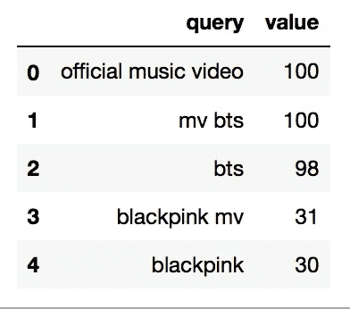
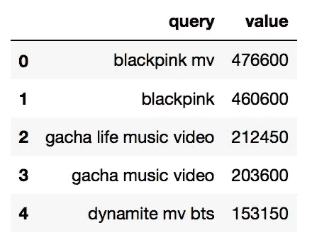
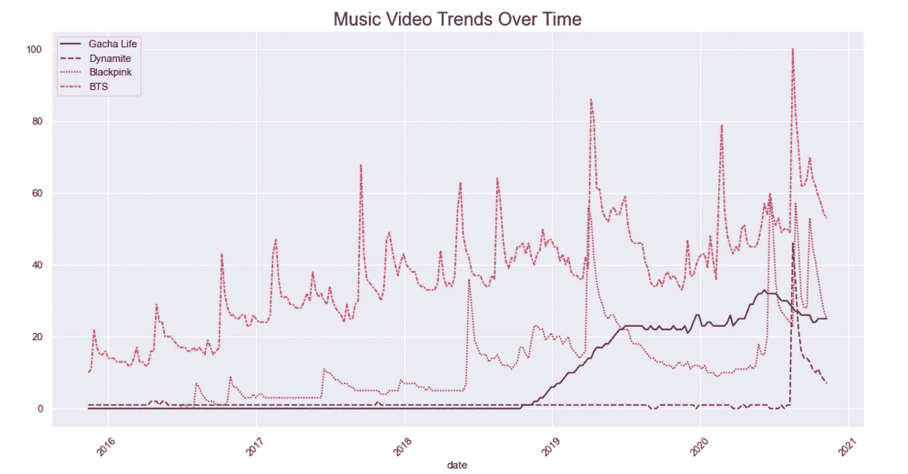
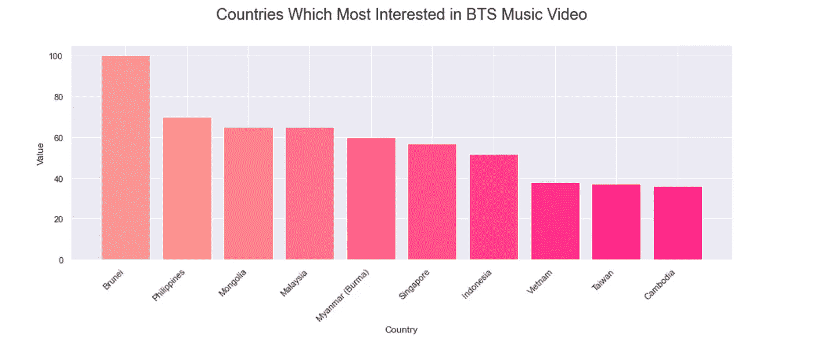
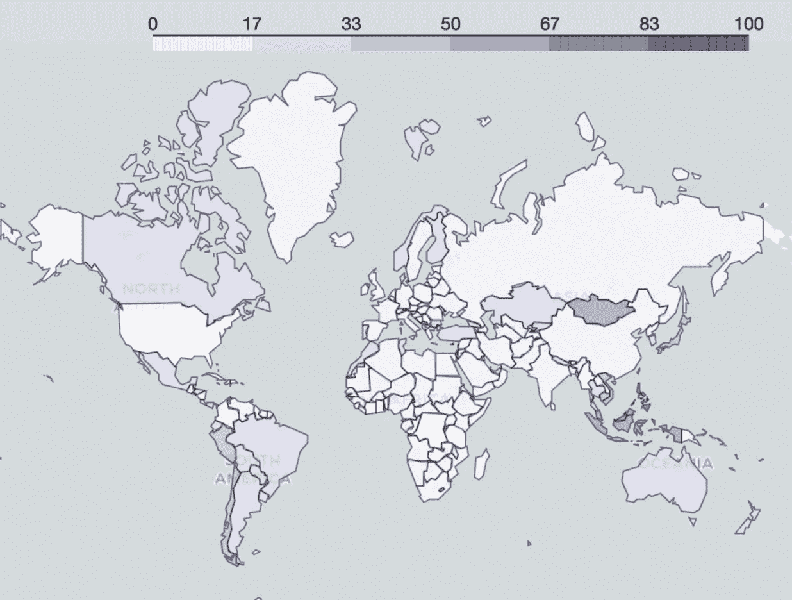

# 使用 Python 分析 Youtube 上的音乐视频趋势

> 原文：<https://towardsdatascience.com/analyzing-music-video-trends-in-youtube-using-python-11e5750709bd?source=collection_archive---------27----------------------->

## 根据 Youtube 搜索趋势找出最受欢迎的音乐视频。


雅各布·欧文斯在 [Unsplash](https://unsplash.com?utm_source=medium&utm_medium=referral) 上的照片

音乐视频在音乐产业中有着巨大的作用。不仅仅是为了宣传的目的，音乐视频也是为了表现艺术家的形象和形象化的诠释歌曲而制作的。

在这个数字时代，Youtube 已经成为全球最主要的流媒体平台。Youtube 上有很多不同风格的音乐视频。不可否认，了解音乐行业受欢迎程度的方法之一是查看 Youtube 上的音乐视频趋势。

*你有没有好奇过 Youtube 上搜索次数最多的音乐视频是什么？*因为我一直。这就是为什么我试图通过 Pytrends 找出 Youtube 的搜索趋势。Pytrends 是 Google Trends 的 API，允许你在 Google 搜索引擎上检索趋势，包括 Youtube。在本教程中，我将向您展示如何深入了解 Python 中的 Youtube 搜索趋势。

# 项目设置

您需要做的第一件事是通过 [pip](https://pip.pypa.io/en/stable/installing/) 安装 Pytrends 和 leav 包。

```
pip install pytrends
pip install folium
```

安装 API 后，打开 Jupyter 笔记本，然后导入必要的库，包括:

1.  熊猫来处理数据帧，
2.  Seaborn 和 Matplotlib 来制作图表，
3.  [叶子](https://python-visualization.github.io/folium/)创建可视化的地图。

```
from pytrends.request import TrendReq
import pandas as pd
import seaborn as sns
import matplotlib.pyplot as plt
import folium
```

接下来的步骤是连接到 Google，并确定我们想从 Pytrends 获得什么样的数据。

```
pytrends = TrendReq(hl='en-US', tz=360)kw_list = ["music video", "mv"]
pytrends.build_payload(kw_list, cat=0, timeframe='today 5-y', geo='', gprop='youtube')
```

在这种情况下，我使用了**【音乐视频】**和**【MV】**作为主要关键字。此外，我用它作为一个时间框架来检索过去 5 年的数据。要查看参数选项，可以在这里查看 Pytrends [的文档。](https://pypi.org/project/pytrends/)

# 相关查询

要查看大多数人感兴趣的术语—与音乐视频相关，我们可以使用相关查询。在 Pytrends 中，有一个功能可以找到其他用户搜索过的关键字的相关术语。

```
df_queries = pytrends.related_queries()
```

有两种度量结果， **Top** 和 **Rising** 。

**热门**—**最受欢迎的**搜索查询，按谷歌趋势分值(0-100)排序

**上升—** 具有最大**的查询在一段时间内增加**搜索频率。如果您想查看最近的命中查询，您可以查看此指标。

我结合了音乐视频或 MV 的最高结果，并用下面的代码选择了 5 个最高值。

```
top_music_video = df_queries.get("music video").get("top")
top_mv = df_queries.get("mv").get("top")
df_top = pd.concat([top_music_video, top_mv] )df_top.sort_values(['value'], ascending = False).head(5).reset_index(drop = True)
```



音乐视频热门查询

此外，我用下面的代码选择了上升结果的前 5 名。

```
rising_music_video = df_queries.get("music video").get("rising")
rising_mv = df_queries.get("mv").get("rising")
df_rising = pd.concat([rising_music_video, rising_mv] )df_rising.sort_values(['value'], ascending = False).head(5)
```



不断上升的对音乐视频的质疑

## 分析

从上面的结果，我们可以看到，在过去的 5 年里，音乐视频的趋势是由韩国流行音乐行业主导的。


乔尔·穆尼斯在 [Unsplash](https://unsplash.com?utm_source=medium&utm_medium=referral) 上的照片

**Blackpink** (一个 K-pop 女子乐队)和 **BTS** (一个 K-pop 男子乐队)是其音乐视频在 Youtube 上被搜索次数最多的艺术家。从上升的结果，我们发现有一个 BTS 的音乐视频叫做**炸药**成为一个巨大的打击和搜索了许多互联网用户。

还有 **Gacha Life** ，这是一个促进孩子创造力和讲故事的游戏。Gacha Life 的用户喜欢根据 Gacha 动画制作音乐视频，许多 Youtube 用户对此感兴趣。

# 长期利息

从相关查询的结果中，我们发现了 4 个与音乐视频或 MV 相关的主要术语，它们是 BTS、Blackpink、Gacha Life 和 Dynamite。

为了了解这些术语在 Youtube 上的受欢迎程度，我们可以使用`Interest Over Time`。

```
kw_list = ["Gacha Life", "Dynamite", "Blackpink", "BTS"]pytrends.build_payload(kw_list, cat=0, timeframe='today 5-y', geo='', gprop='youtube')df_interest = pytrends.interest_over_time().drop(columns='isPartial') 
```

得到 DataFrame 形式的数据后，我们可以使用 Seaborn 和 Matplotlib 来可视化，如下图所示。

```
plt.figure(figsize=(16, 8))
plt.xticks(rotation=45)
sns.set(style="darkgrid", palette = 'rocket')
ax = sns.lineplot(data=df_interest)
ax.set_title('Music Video Trends Over Time', fontsize=20)
```



## **分析**

在这四个词之间，“BTS”从 2016 年开始流行。人气一直持续到现在，排在第二位的是《Blackpink》。“炸药”本身在 2020 年中期开始蓬勃发展。与此同时，“嘎查生活”在 2018 年底开始流行。

# 按地区划分的利息

从上面的结果来看，我个人对 BTS 更感兴趣，因为他们的音乐视频在其他人中占主导地位。所以在这种情况下，我想知道全球范围内 BTS 观众在 Youtube 上的传播情况。

```
kw_list = ["BTS"]pytrends.build_payload(kw_list, cat=0, timeframe='today 5-y', geo='', gprop='youtube')df_interest_region = pytrends.interest_by_region(resolution='COUNTRY', inc_low_vol=False)df = df_interest_region.sort_values(by='BTS', ascending=False).head(10).reset_index()
```

我试图创建一个对 BTS 音乐视频最感兴趣的 10 个国家的图表。

```
fig = plt.figure(figsize=(15,5))
plt.bar( df['geoName'],
         df['BTS'],
         color = ['#fa9d96','#fa928a','#ff828a','#ff728a','#ff628a','#ff528a','#ff428a',
                  '#ff328a','#ff228a','#ff028a'])plt.xticks(rotation=45,ha='right')
plt.title('Countries Which Most Interested in BTS Music Video',y=1.1,fontsize=20)
plt.xlabel('Country')
plt.ylabel('Value')
```



条形图

如果您有兴趣查看地图可视化，可以尝试创建由 leav 提供的 Choropleth 地图。Choropleth 图以阴影颜色显示区间数据，其中较浅的阴影代表较低的数字，较深的阴影代表较高的数字。尝试下面的代码。

```
url = '[https://raw.githubusercontent.com/python-visualization/folium/master/examples/data'](https://raw.githubusercontent.com/python-visualization/folium/master/examples/data')
country_shapes = f'{url}/world-countries.json'the_map = folium.Map(tiles="cartodbpositron")
the_map.choropleth(
    geo_data=country_shapes,
    name='choropleth',
    data=df_interest_region,
    columns=['geoName', 'BTS'],
    key_on='properties.name',
    fill_color='Purples',
    nan_fill_color='white',
    fill_opacity=0.8,
    line_opacity=0.5,
)the_map
```

然后，我们来看结果。



等值区域图

## 分析

从上面的柱状图我们可以看出，BTS 最大的观众来自文莱，其次是另一个亚洲国家，如菲律宾、蒙古、马来西亚和缅甸。这一点得到了地图的支持，地图显示亚洲出现了较暗的阴影。美国和澳大利亚等其他大陆也成为 BTS 观众的一部分，尽管不像亚洲国家那样大胆。

# 结论

作为最受欢迎的视频搜索引擎平台之一，Youtube 可以让我们了解到世界各地的人们最好奇的是什么样的音乐视频。Pytrends 可以利用这些数据，甚至通过使用 Seaborn、Folium 和 Matplotlib 来创建这些数据的可视化效果。因为这些工具，现在我们知道在过去的 5 年里，K-pop 在世界音乐产业中占据了主导地位。这种趋势会持续下去吗？我们走着瞧。