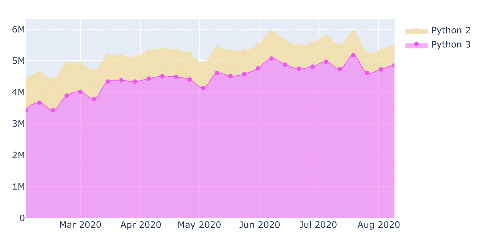

# 分析 PyPI 包下载统计数据并构建数据应用程序

> 原文：<https://towardsdatascience.com/analyzing-pypi-package-download-statistics-and-building-a-data-application-c30f4f708e38?source=collection_archive---------39----------------------->

## 使用数据堆栈构建数据应用程序

使用数据堆栈构建的最终数据应用程序

尽管 Jupyter 笔记本对于编写代码和与数据进行交互是必不可少的，但仍然需要为非技术受众构建应用程序。幸运的是，Python 生态系统提供了一个广泛而活跃的开源生态系统，不仅用于数据分析，还用于使用数据和可视化库构建数据应用程序。

在这篇文章中，我将尝试向您概述如何使用 [dstack](https://github.com/dstackai/dstack) 构建交互式数据应用程序。我们还将学习如何使用 Python、pandas 和 [plot.ly](http://plot.ly/) 分析和可视化数据，以及使用 Python 和`pandas`查询来自 Google 的 BigQuery 的数据。

出于教学目的，我们将分析 Python 包的下载统计数据，并使我们的应用程序可视化以下内容:

*   下载次数最多的软件包
*   过去一个月、六个月和十二个月的下载次数
*   每个版本的包、操作系统和 Python 版本的下载次数

我们将使用 [dstack](https://github.com/dstackai/dstack) 构建一个交互式应用程序，以仪表板的形式可视化这些统计数据。本教程中构建的应用程序可以在[这里](https://dstack.ai/gallery/pypi/downloads)找到。

对于渴望在分析数据的背景下学习 Python 的初级数据科学家来说，本教程可能会很有意思。

注意，本笔记本中的分析仅用于教育目的。如果您发现错误或对代码或结果有疑问，请发送电子邮件至 [team@dstack.ai](mailto:team@dstack.ai) 。

本教程最初灵感来自 [pepy.tech](http://pepy.tech/) 。

# 关于 Python 包下载统计数据集

为什么在本教程中使用 Python 包下载统计？首先，因为数据是公开的。其次，因为 PyPI 提供了方便地访问这些数据的方法。第三，制作一个应用程序来可视化这些数据可能是用 Python 构建数据应用程序的一个很好的例子。

该分析的数据来自哪里？Python 包的下载数据由 PyPI 存储在 Google 的 BigQuery 中。每天的下载数据存储在与模式`the-psf:pypi.downloadsYYYYMMDD`匹配的单独的表中。这些表有[这个](https://s.caremad.io/lPpTF6rxWZ/Screen-Shot-2016-05-21-14-17-45.png)模式。

注意，BigQuery 中的这些数据只有在你有自己的 Google Cloud 账号的情况下才能访问。要访问这些数据，您必须按照 BigQuery 的定价(每 TB 5.00 美元)付费。考虑到数据量，查询可能非常昂贵。你查询的越多，扫描的数据就越多，你支付的费用也就越多。

# 传递谷歌云凭证

要连接到 Google 的 BigQuery，我们必须进行身份验证。BigQuery 是 Google Cloud 的一部分，用于身份验证，需要通过 OAuth 2.0 传递 Google 凭证。

可以通过多种方式从 Python 连接到 BigQuery。在本教程中，我们将使用 pandas，这是使用 BigQueryusing [pandas_gbq](https://pandas-gbq.readthedocs.io/) 最简单的方法。

对于认证，`pandas_gbq`集成了 [google-auth](https://google-auth.readthedocs.io/en/latest/) 库。

为了开始使用 pandas_gbq，您必须传递凭证以及与凭证相关联的项目名称。

在本教程中，我们将使用服务帐户凭据。这种类型的凭证必须通过 Google Cloud 控制台创建。一旦创建了凭证，就必须下载相应的 JSON 文件，以便在这个笔记本上使用。

注意，带有凭证的 JSON 文件必须只存储在安全的环境中。

我们将使用以下代码从 Python 加载凭证:

现在，我们必须用获得的凭证和项目名称初始化`pandas_gbq`的上下文:

在使用`pandas_gbq`之前，请确保您已经为此项目启用了 BigQuery API，并且与获取的凭证相关联的服务角色具有访问 BigQuery 和运行 BigQuery 作业的权限。

现在，我们已经准备好从 Python 查询 PyPI 包下载统计数据。

# 在我们将要构建的应用程序上

在这个例子中，我们将使用`dstack`来构建一个应用程序，它显示按项目版本、Python 版本和操作系统分组的各个项目的下载。为了使教程足够简单，我们将限制它只显示下载最多的前 100 个项目的数据。

为什么是`dstack`？首先，与其他框架相比，构建和部署`dstack`应用程序需要几天时间。其次，`dstack`不要求你做 web 编程，写 UI 脚本，或者其他开发和部署应用程序通常需要的事情。不用编写应用程序，您可以将数据推送到一个`dstack`服务器，并提供一个声明性的逻辑，说明它应该如何与用户输入交互。开始时，你会对这种方法感到惊讶，但后来你会发现它是多么简单而强大。

应用程序将如何工作？在我们的应用程序中，我们将使用`pandas_gbq`查询数据，使用“plotly”进行可视化，并推送与以下参数相关的结果可视化:

*   项目的名称
*   时间段(例如，过去 30 天、过去 6 个月、过去 12 个月)
*   数据的维度(例如，按项目版本、Python 版本或操作系统分组)

一旦我们推送带有所有参数的可视化效果，`dstack`会自动将其编译到一个仪表板中。本教程中构建的应用程序可以在这里找到[。](https://dstack.ai/gallery/pypi/downloads)

本教程的大部分内容都是一个简单步骤的重复:

1.  运行 SQL 查询，聚合`X`期间的下载，按项目名称、`Y`和`Z`分组，其中
2.  `X` / `Y`可能是`30 days` / `day`、`6 months` / `week`、`12 months` / `month`
3.  `Z`可以是`project version`、`python version`和`operational system`
4.  制作一个情节
5.  用相应的参数如`project name`、`X`、`Z`到`dstack`将图推送到`dstack`

# 放弃

请注意，下面的一些查询可能会查询超过 6 个月或更长时间的 BigQuery 数据。避免在不必要的时候运行整个笔记本。阅读关于如何避免对 BigQuery 运行不必要的查询的章节`Optimization` 。

# 获得 100 个下载量最高的 PyPI 项目

在本教程中，我们将只关注下载次数最多的前 100 个项目。我们要做的第一件事是获取这 100 个项目的名称。为此，我们将按项目汇总过去 30 天的下载量，按降序排列，并取前 100 个。

下面是我们如何用`pandas_gbq`来做这件事:

如您所见，`pandas_gbq.read_gbq`函数的结果是一个`pandas.DataFrame`。

查询中最重要的部分是表名`the-psf.pypi.downloads*`和使用`_TABLE_SUFFIX`的`WHERE`子句。它是做什么的？它只扫描从`the-psf.pypi.downloads`开始到当前日期的最后 30 天内结束的表中的数据。这样，我们可以确保查询只扫描最近 30 天内的数据。为什么这很重要？这很重要，因为我们使用 BigQuery，我们按每 TB 扫描数据付费。为了优化查询成本，限制被扫描的数据量总是很重要的。在这篇文章的后面，我们将再次回到定价因素，并看看优化它的其他方法。

同时，让我们声明一个变量`top_projects`，并将其分配给下载量最高的前 100 个项目的名称列表:

# 获取过去 30 天每个项目版本的下载量

下面是第一个 SQL 查询:

现在我们已经有了一个包含我们需要的数据的数据框，我们将为项目的每个版本制作一个下载图。前五个版本将作为单独的图表。剩下的将是一个名为`Other`的图表。下面是项目`pandas`的一个例子:

过去 30 天每个项目版本的下载量

# 获取过去 30 天每个 Python 版本的下载量

下面是与上面几乎相同的查询，但是现在它按照主要 Python 版本(`REGEXP_EXTRACT(details.python, r'^\d*')`)对数据进行分组:

项目的样本地块`pandas`:

过去 30 天每个 Python 版本的下载量

# 获取过去 30 天每个操作系统的下载量

下面是另一个查询，现在按`operational system`分组:

项目的样本地块`pandas`:

过去 30 天每个操作系统的下载量

# 获取过去 6 个月每个项目版本的下载量

在下面的单元格中，我们将重复上述步骤，但现在是针对不同的`X`、`Y`、`Z`。

项目的样本地块`pandas`:

获取过去 6 个月每个项目版本的下载量

# 获取过去 6 个月每个 Python 版本的下载量

项目的样本地块`pandas`:

过去 6 个月每个 Python 版本的下载量

这段代码最有趣的部分是对`fig.update_xaxes`的调用。为了确保图表中显示的所有数据在给定的一周内都是完整的，我们将图的边界相应地向右和向左移动一周，以排除可能具有不完整数据的周。

# 获取过去 6 个月每个操作系统的下载量

项目的样本地块`pandas`:

过去 6 个月每个操作系统的下载量

# 获取过去 12 个月每个项目版本的下载量

项目的样本地块`pandas`:

过去 12 个月每个项目版本的下载量

# 获取过去 12 个月每个 Python 版本的下载量

过去 12 个月每个 Python 版本的下载量

# 获取过去 12 个月每个操作系统的下载量

过去 12 个月每个操作系统的下载量

# 设置数据堆栈

现在我们已经有了数据和可视化，我们准备设置一个`dstack`服务器并构建应用程序。

`dstack`是一个开源框架，可以通过 pip 安装

或者使用 conda:

`dstack`有两个组件:

1.  托管数据并运行已发布应用程序的服务器
2.  将数据推送到服务器的客户端 Python 包

服务器可以在本地启动，也可以在专用服务器上启动。为了在本地启动 dstack 服务器，必须运行以下命令:

一旦服务器启动，用户就可以使用 Python 客户端包来推送数据。

# 最佳化

现在我们已经设置了一个`dstack`服务器，这里有一个重要的说明，关于如何使用 BigQuery 或类似的按扫描数据量收费的服务。使用此类服务的最佳方式是避免重新运行不必要的查询，这可能会非常昂贵。这可以通过在盘上本地缓存数据或其他方式来容易地完成。如果您必须定期更新可视化效果，这一点尤其重要。

有趣的是，您也可以使用`dstack`来存储缓存数据。这可以通过以下方式实现:

这里发生的是日期被放入两个“堆栈”:`"pypi/top-projects"`和`"pypi/raw-data"`。这个“堆栈”的概念概括了`dstack`是如何建造的。每个栈都被版本化(意味着它在被更新时存储所有的修订)，并且可以包含一个或多个与参数相关联的工件。这样的工件可以包括数据帧、ML 模型或可视化。在上面的代码中，我们使用堆栈来存储数据帧。一旦发布了工件，就可以通过`dstack`的 web 界面访问它，或者通过 Python 代码获取它。下面是实现这一点的代码:

因此，变量被赋予我们存储的实际数据帧。推送时，提取的数据框具有完全相同的方案。当按计划以自动化方式进行处理时，这种方法特别有用。

# 使用数据堆栈制作数据应用程序

既然我们已经介绍了如何设置一个`dstack`服务器以及如何在那里缓存数据，那么让我们把所有的东西放在一起，最终构建一个应用程序。您会惊讶地发现，从头开始构建一个应用程序所需要做的工作是如此之少。

下面是构建整个应用程序的代码:

我们在这段代码中做的是:

1.  创建一个框架(功能`dstack.create_frame`
2.  对于每个可视化，在框架内创建一个附件以及可视化图形和相关参数，如`"Project"`、`"Period"`和`"Group by"`(函数`dstack.StackFrame.commit`)
3.  推动框架(功能`dstack.StackFrame.push`)

如果将构建可视化效果的代码移动到单独的函数中，可以显著简化该代码:

正如你所看到的，与应用程序本身相关的代码甚至比专用于绘图的代码还要少。

将这些数据推送到`dstack`服务器后会发生什么？服务器动态构建一个交互式应用程序，您可以在其中更改`Project`、`Period`和`Group by`的值，并查看与所选值相对应的可视化效果。由于数据是预先计算的，因此可以从缓存中提供，从而在高负载下高效扩展(例如，如果应用程序由大型团队使用)。

使用数据堆栈构建的最终数据应用程序

# 计划常规作业

正如您在上面看到的，在`dstack`中的数据应用程序可以是一个静态报告，可以定期手动或自动更新。

自动化将要求您设置运行上述代码的常规作业。虽然 12 个月和 6 个月的数据可以按月计划，但每日作业可以每天或每周运行。这样，您可以优化成本，并确保数据始终是最新的。

[Docker](https://hub.docker.com/repository/docker/dstackai/dstack) 版本的`dstack`以及 [in-cloud](https://dstack.ai/) 版本确实提供内置工作。使用这些作业，您可以按照需要的节奏安排更新堆栈。

暂时就这样了。希望这篇文章能帮助你学习如何用 Python 和 stack 构建数据应用。感谢您抽出时间阅读本文。

`dstack`是一个非常新的工具，目前提供非常基本的功能，他们计划在接下来的几个月内推出更多高级功能。欢迎您查看他们的[公共路线图](https://trello.com/b/CJOnEjrr/public-roadmap)，向他们的[问题跟踪者](https://github.com/dstackai/dstack/issues/)提交特性请求，当然，也可以在他们的[不和谐聊天](https://discord.gg/8xfhEYa)中分享您的反馈。

# 资源

以下是您可能会发现有用的资源列表:

*   [分析 PyPI 包下载量](https://packaging.python.org/guides/analyzing-pypi-package-downloads/)
*   [使用云控制台的 BigQuery 快速入门](https://cloud.google.com/bigquery/docs/quickstarts/quickstart-web-ui)
*   [PyPi 下载双查询表](https://console.cloud.google.com/bigquery?pli=1&p=the-psf&d=pypi&t=downloads&page=table)
*   [熊猫-gbq 的文件](https://pandas-gbq.readthedocs.io/en/latest/)
*   google-auth 的文档
*   [dstack 的文档](http://docs.dstack.ai/)
*   [GitHub 上的源代码](https://github.com/dstackai/dstack-tutorials-py/blob/master/pypi-downloads.ipynb)
*   [dstack . ai 上的最终应用](https://dstack.ai/gallery/pypi/downloads)