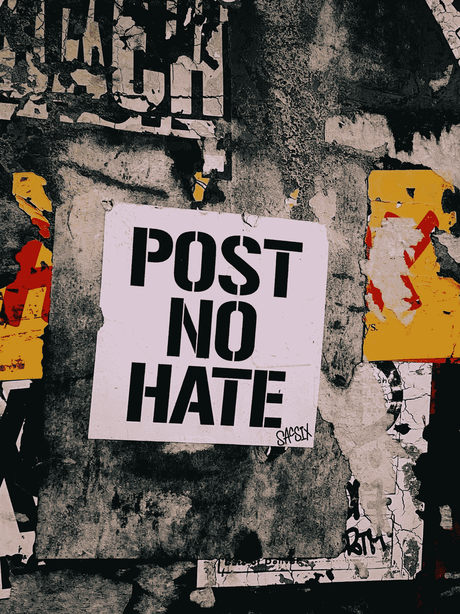
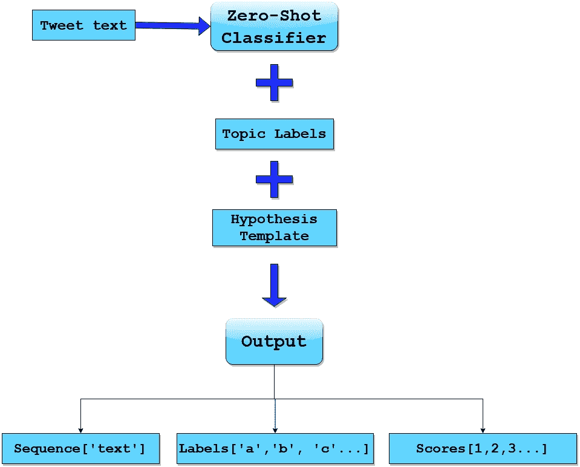

# 用零镜头分类法分析 Twitter 上的 QAnon

> 原文：<https://towardsdatascience.com/analyzing-qanon-on-twitter-with-zero-shot-classification-13ad73d324fc?source=collection_archive---------37----------------------->

## 使用革命性的、无监督的零镜头文本分类机器学习技术，将 QAnon 推文标记为主题类别的教程



乔恩·泰森在 [Unsplash](https://unsplash.com?utm_source=medium&utm_medium=referral) 上的照片

最近，脸书在拖延了三年之后，终于在其平台上禁止了极右的阴谋论 QAnon。在他们的带领下，Twitter 和 Youtube 也纷纷效仿。从白人至上的根源开始，曾经的理论已经演变成一场咄咄逼人的运动，寻求[发动信息战](https://www.wired.com/story/qanon-deploys-information-warfare-influence-2020-election/)，以此作为影响即将到来的美国总统大选的一种手段，支持唐纳德·特朗普。联邦调查局已经将 QAnon 认定为国内恐怖主义威胁，今年早些时候，Twitter 采取行动封禁了数千个 QAnon 附属账户。然而，许多亲卡农的账户继续发推文，更阴险的是，特朗普有一个通过不负责任地转发他们的恶意内容来放大这些声音的[被证明的历史](https://www.mediamatters.org/twitter/fbi-calls-qanon-domestic-terror-threat-trump-has-amplified-qanon-supporters-twitter-more-20)。他还拒绝公开谴责这一理论，回避关于恋童癖的评论，进一步传播有毒的不确定性。

我认为调查这些账户在推特上发布了什么会很有趣。具体来说，我很好奇极右翼讨论的最受欢迎的话题，以及我是否可以利用机器学习的最新发展来分析 Twitter 上当前活跃的已知 QAnon 帐户的推文。我决定尝试[零距离学习](/applications-of-zero-shot-learning-f65bb232963f)将推文分类成我选择的主题类别:*政治、公共卫生、气候变化、宗教、争议*和*假新闻*。在这个实验中，我使用了 Twitter API 来收集推文，并使用了[humping Face 的开箱即用的文本分类零镜头学习实现(2020 年 8 月发布)](https://huggingface.co/transformers/master/main_classes/pipelines.html#transformers.ZeroShotClassificationPipeline)。根据无监督学习方法，未标记的推文被分类到社会相关主题中，没有任何特定任务的训练或注释推文进行微调。为了使我的 zero-shot 分类器可以访问，我用 Python 框架 Streamlit 构建了一个 web 应用程序，用于一个交互式界面，在那里我可以拖放大量存储为 csv 或 json 文件的未处理的 tweets。

使用 Streamlit 对推文进行批量零镜头分类的机器学习 web 应用程序。图片作者。

# 为什么要零拍学习？

在机器学习领域，零镜头学习是一种无监督学习，其目标是让模型在不依赖标记数据的情况下完成尚未明确训练的任务。在过去的三年中，自然语言处理(NLP)的趋势是创建非常大的预训练语言模型，允许从无监督模型进行迁移学习，然后在下游监督任务中进行微调，从而需要标记数据。与监督学习所需的高质量注释数据相比，从社交媒体获取原始未标记推文的资源成本较低。因此，在需要更少的资源和没有额外的训练时间，零射击学习有明显的优势。此外，零触发分类的实施允许选择标签的多样性。由于标签的选择并不局限于分类器被微调的标签，因此可以根据特定的任务任意选择标签。

上个月，我发现 Python 库 Hugging Face transformers 发布了一个用于零镜头文本分类的管道模型。像往常一样，拥抱脸使这个分类器变得容易使用。它很容易修改，我只用了一个下午就可以用 Streamlit 围绕它构建一个简单的 web 应用程序。拥抱脸研究工程师乔·戴维森写的这篇出色的博文给了我灵感。他简要解释了零起点学习的历史，并详细讨论了两种常用的方法:潜在嵌入法和自然语言推理(NLI)。拥抱脸管道模型利用了后一种方法。

# 什么是自然语言推理？

NLI 提到了一个 NLP 任务，其中考虑了两个句子:一个*前提*和一个*假设。任务是确定前提对假设的影响。结果是由前提确定的假设的标签，它可以是真(蕴涵)，假(矛盾)或不相关(中性)。对于零镜头分类，抱脸使用[尹等(2019)](https://arxiv.org/abs/1909.00161) 在一篇论文中介绍的方法。在这种方法中，前提将是要被标记的序列(tweet 的文本)，假设将代表候选标签(主题类别)。一个序列和所有可能的候选标签被嵌入到同一个潜在空间中，从而可以测量嵌入之间的距离。此外，这允许评估两种不同序列的相容性。为每条推文预测的主题标签代表具有最高蕴涵可能性的假设/候选标签。*

拥抱脸的实现涉及一个预训练的 BART 模型，该模型在[多体裁自然语言推理(MNLI)语料库](https://huggingface.co/datasets/multi_nli)上进行微调，以构建一个序列对分类器，然后用作零镜头分类器。一个 [BART 模型](https://arxiv.org/abs/1910.13461)是指一个 seq2seq 机器翻译架构，带有一个双向编码器(像 [BERT](https://arxiv.org/abs/1810.04805) )和一个左右解码器(像 [GPT-3](https://arxiv.org/abs/2005.14165) )。预训练使用一种新颖的填充方案随机打乱原始句子的顺序，其中文本的跨度由单个掩码标记代替。令人欣慰的是，拥抱脸使得使用他们的零射击分类器只需几行代码成为可能。整个过程可以被简化和可视化描述。我下面的图表显示了这个过程的概要:



拥抱脸变形金刚管道推文零镜头文本分类。图片作者。

# 实验设置

出于实用性和我的硬件限制，我不得不选择一天来分析。因此，我选择查看 10 月 2 日以来的所有推文，这一天川普宣布他对新冠肺炎的检测呈阳性。我从哈佛大学 Shorenstein 中心精心挑选的 QAnon 关联 Twitter 账户样本中收集了大约 5300 条推文。我将推文保存为 csv 文件，然后可以拖放到我用 Streamlit 构建的机器学习 web 应用程序中。在后端，我编写了一个 Python 脚本来预处理并对一批推文应用零命中率分类器，将每条推文分类到我任意选择的六个类别中的一个。我对关于政治、公共卫生、气候变化、宗教、争议和假新闻的对话很感兴趣。在稍后的场合，我打算对分类后的推文进行进一步的情感分析，并跨类别进行比较，以便对话语有更细微的理解。

如上图所示，我需要三样东西来进行分类:分类器、主题标签和假设模板。如下面的代码片段所示，我使用来自 Hugging Face 的管道构建了一个只有一行的零镜头分类器，一个主题标签列表被分配给一个变量，并且我为一个假设模板添加了一行前导文本。

输出有三个组成部分:一个单个文本条目的序列、一组六个标签和一组六个介于 0 到 1 之间的相应分数，代表蕴涵可能性的概率分布。请参见下面的示例:

```
{'sequence': 'FYI President Trump says he has been taking Hydroxychloroquine to combat COVID Coronavirus ', 'labels': ['misinformation', 'public health', 'controversial opinion', 'politics', 'climate change', 'religion'], 'scores': [0.5967247545719147, 0.2244514465332031, 0.09179548919200897, 0.07029037922620773, 0.010313253849744797, 0.006424691993743181]}
```

在样本输出中，该推文的主题被标记为“误传”，第一个也是最高的分数 0.59 代表该推文属于误传类别的置信度。

接下来，我编写了一个函数来迭代熊猫推文的数据帧，对结果进行预处理、分类和存储。

为了可视化结果，我使用了我最喜欢的 Python 图形库 Plotly 来绘制一个交互式条形图，显示主题的分布。

# 我发现了什么？

显示零镜头分类 QAnon 推文主题分布的条形图。图片作者。

在 5300 条推文中，约有 5000 条对某个特定标签的评分超过 50%，因此被分类。其余人在所有标签上的分数都太低，很可能会被归类为“其他”，这表明我选择的标签并不完全包容。最受欢迎的话题是争议，其次是政治。最不受欢迎的话题是气候变化，其次是假新闻和公共卫生。鉴于关于当前疫情的错误信息应该是一个严重的问题，我对被归类为公共卫生的推特数量之少感到惊讶。我从争议类别中随机选择了一些推文，因为它是最大的，我担心分类的准确性。

```
***# Sample tweet 1:***
'text': '*Screenshot all of the tweets that are wishing death to POTUS amp FLOTUS There will be a reckoning I reckon*'
'label': ['controversy'] 
'score': [0.7567790150642395]***# Sample tweet 2:***'text': '*Joe Biden still has not denounced pedophilia*'
'label': ['controversy'] 
'score': [0.9125083088874817]***# Sample tweet 3:***
'text': '*RT I m not antivaxx I m anti some paid off quack injecting me poison*'
'label': ['controversy'] 
'score': [0.5249272654056549]***# Sample tweet 4:***
'text': '*This senile, drunkin snatchbag is admitting she's going to do whatever it takes to steal the oval office. They R evil & corrupt down to the bone! They ONLY care about themselves!Especially Nasty Nancy Pelosi*'
'label': ['controversy'] 
'score': [0.6447234153747559]
```

我认为争议是一个太广泛的话题标签，我应该添加具体的阴谋类别作为话题标签，如医疗，政府，媒体，或其他阴谋。第三个样本推文，在我看来，因为它反对疫苗接种，应该更好地归类为“公共卫生”，或者更准确地说是“医疗错误信息”。最后一条有争议的样本推文更适合“仇恨”这个主题，这是我的疏忽，因为我没有在最初的实验中把“仇恨”这个主题作为一个标签。

此外，快速浏览标签为“政治”的推文，会出现以下推文:

```
***# Sample tweet 5:***
'text': '*Everygreen was Hilary Clinton's secret service name Googling that name you ll see these containers*' 
'label': ['politics'] 
'score': [0.502316071033478]
```

这条推文的标签分数只有 50.2%，这意味着它勉强被归类为“政治”，我觉得它更适合“政府阴谋”的主题标签。因此，对于未来的测试，我将修改主题标签，以更具体地说明争议或阴谋的类型，并包括“仇恨”作为一个主题。

隐藏在众多有争议的推文中的，是颠覆性的组织尝试；含糊威胁的声明，以及混淆视听的笨拙尝试。

```
***# Sample tweet 6:***
{'text': '*Anons, if things go like we hope they’re going to go; we are going to be needed now more than ever. Be ready.*'
'label': ['controversy'] 
'score': [0.7214859127998352] ***# Sample tweet 7:***
'text': '*Be prepared TRUST the plan Conspiracy NO MORE We are in full control PAIN wakeUp thinkForYourself pub read 1425*'
'label': ['controversy']
'score': [0.6223780512809753]
```

考虑到这种类型的推文的流行，另一个可能明智的话题是“组织”或“煽动”。

对结果的初步观察让我相信，来自 QAnon 附属账户的大多数推文都是有争议的，所以“争议”作为一个话题模糊了结果。然而，我相信这些结果显示了阴谋趋同的证据，我在观看众议院情报常设特别委员会(HPSCI)关于错误信息和阴谋主题的虚拟公开听证会时熟悉了这个术语。在听证会上，[妮娜](https://www.wilsoncenter.org/video/nina-jankowicz-testifies-house-intel-committee-misinformation-conspiracy-theories-and)是指，

> "当一种理论的追随者接触到并被鼓励传播其他理论时，就是共谋收敛."

最初的 QAnon 阴谋已经和许多其他的边缘阴谋纠缠在一起，比如反 vaxxers，平地球论者，或者大屠杀否认者。社交媒体平台未能保护用户免受错误信息的影响，这意味着加入一个庆祝 Vinyasa 瑜伽的脸书团体，可能会让你接触到有害的医疗错误信息。

在这个信息时代的中心是一群有影响力的人，他们不成比例地运用权力对现实产生负面影响，带来危险和破坏性的后果。几个月前，世卫组织举行了他们在 T4 的第一次信息学术会议，这清楚地表明了将错误信息视为对公共健康的威胁的重要性。世卫组织网站上写道:

> “就像流行病中的病原体一样，错误信息传播得更远更快，增加了卫生应急响应的复杂性。”

尽管存在错误信息的危险，但极有可能的是，QAnon 将继续利用社交媒体达到邪恶的目的，如破坏公民社会，传播有害的医疗谎言，并将所有这些与仇恨议程联系起来。物理学家尼尔·约翰逊在今年早些时候发表的一篇论文中谈到了反疫苗团体中种族主义观点的扩散，

> “围绕新冠肺炎的恐惧和错误信息的增加，使得恶意事件和仇恨的推动者能够围绕共同感兴趣的话题与主流受众接触，并有可能将他们推向仇恨的观点”

我的零枪击分类实验突然出现了几条反疫苗接种的推文，足以让我相信我需要一个特定的医学错误信息主题标签，或许还需要一个疫情阴谋的额外标签。

# 总结想法

我尝试使用零镜头分类对推文进行主题标注，结果很有希望。就目前而言，尝试其他主题标签和策划其他调查数据集将会很有趣。由于更改主题标签非常简单，我的下一组测试将是尝试其他主题标签并调整类别的数量。为了在保持交互性的同时在生产规模上使用我的零射击分类器，我当前的 web 应用程序将需要进一步的工作，以通过缓存加快预测，并集成更多的探索性数据分析工具，使其更加有用。

在测试零枪击分类时，我遇到的最有趣的概念是用流行病学家用来跟踪致病传播的机器学习方法来跟踪错误信息的想法。一个有趣的探险想法！

希望我的实验能启发你尝试一种新的、无监督的、开箱即用的机器学习方法的零镜头分类。我鼓励你们思考潜在的社会意识，公平信息研究的应用。

有兴趣合作吗？在 [Linkedin](https://www.linkedin.com/in/haaya-naushan-a4b5b61a5/) 上联系我