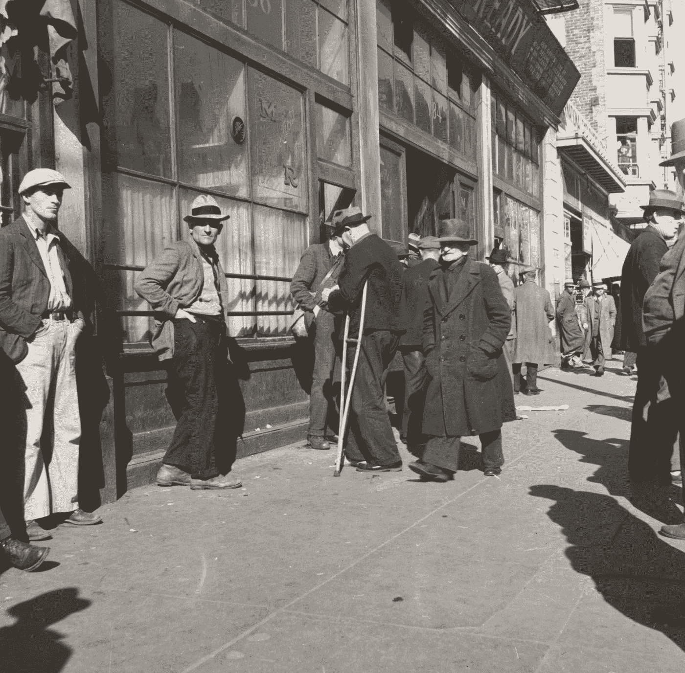
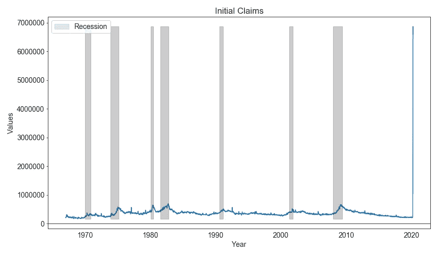
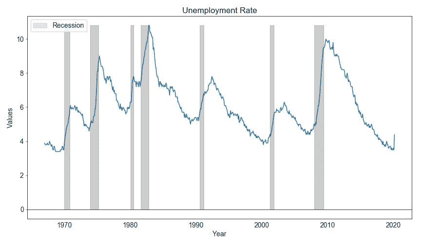
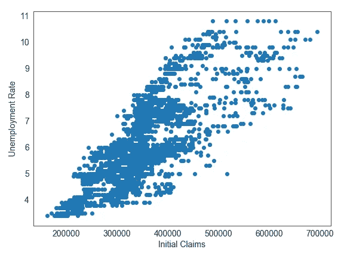
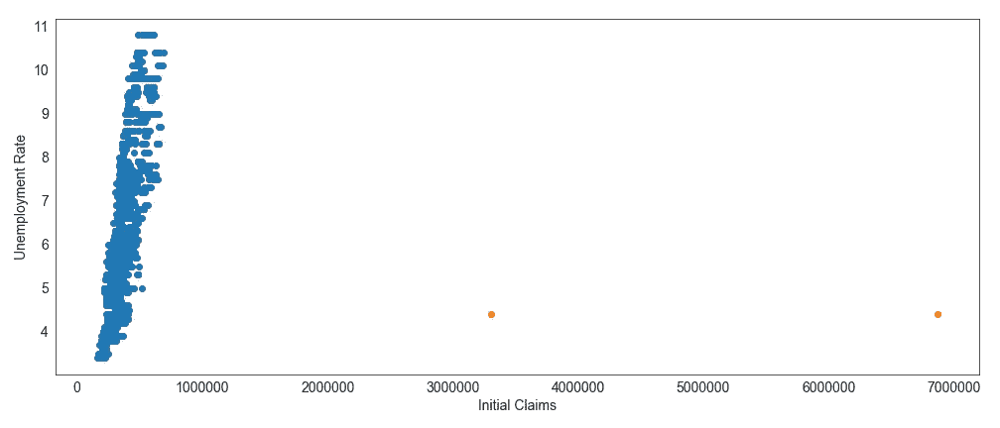
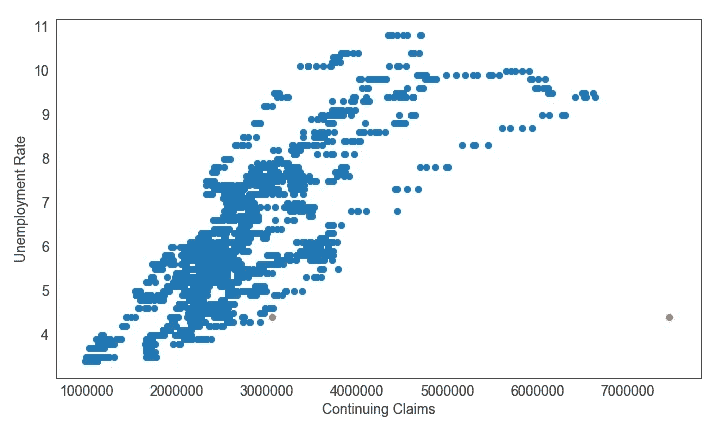
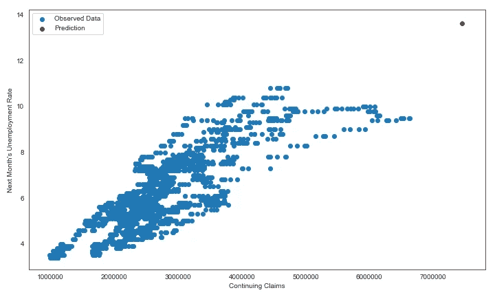
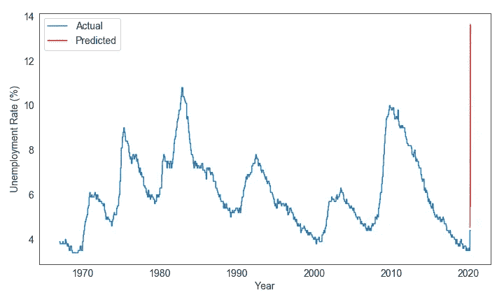

# 分析最近的失业数据

> 原文：<https://towardsdatascience.com/analyzing-recent-unemployment-data-f4d1ff7da2b1?source=collection_archive---------41----------------------->

纽约公共图书馆在 [Unsplash](https://unsplash.com?utm_source=medium&utm_medium=referral) 拍摄的照片

## 使用一些图表和统计数据来更好地理解现在就业市场的情况

如果你最近一直在关注经济新闻，那么你可能已经看到了这张首次申领失业救济金的图表:

首次失业索赔(资料来源:圣路易斯美联储银行)

这是一个巨大的增长，使得 2008 年的大金融危机(当时金融系统几乎结束)看起来像一个小丘。看到这张图表，我可以想象出三种不同的反应:

1.  哦，太棒了，创纪录地高了一英里！这一定是大萧条 2.0。
2.  这都是暂时的；一旦疫情曲线变平，一切都会好起来。
3.  什么是首次失业索赔？

先回答最后一个问题。**首次申请失业救济人数(有时也称为新申请失业救济人数)是某一周首次申请失业救济的总人数。**所以你可以想象，它与裁员高度相关(如果有大量裁员和/或解雇，那么许多最近失业的人将首次申请失业救济金)。

正确的答案可能介于反应 1 和反应 2 之间。是的，最初的失业索赔高得惊人。但是，请记住以下几点:

*   众所周知，首次申领失业救济金是不稳定的(看一下 4 周的滚动平均值，而不仅仅是最近的数字，通常会有所帮助)。此外，看看持续申领失业救济金的人也很有帮助。
*   首次申领失业救济金人数不是一个净数字，这意味着它代表了申请失业的新人数，但它没有扣除等式的另一个关键部分:找到工作和享受失业救济的人数。例如，如果上周首次申请失业救济人数增加了 80 万，本周增加了 20 万，这并不意味着美国新增了 100 万失业人口。本周增加的 20 万没有告诉我们上周申请失业救济的 80 万人发生了什么(有些人可能已经找到工作，离开了劳动力队伍，等等)。)
*   当前的危机异常尖锐——许多大城市的经济在几天之内从正常运转到关闭。没有公司通常有的那种“在开始裁员之前，让我们等一等，看看我们是否处于衰退之中”的态度。相反，从关闭开始的那一天起，很明显，经济将受到重大打击。因此，从数据的角度来看，这次衰退也是独一无二的。通常系统会受到冲击(抵押贷款违约、油价飙升等)。)，然后每个人都等着看这种冲击如何逐渐影响到就业市场。**这一次一切都反过来了:疫情迫使大多数人停止工作，现在我们等着看所有减少工时、休假和裁员将如何继续损害全球经济增长。**
*   CARES 法案(美国政府最近通过的刺激方案)为零工经济工人、自由职业者和其他个体经营者打开了获得失业救济的大门。以前，他们没有资格。因此，有资格享受福利的人的基数暂时增加了很多。
*   根据《关怀法案》,工资大幅下降的休假工人也有资格领取失业救济金。与过去的衰退相比，这也增加了符合条件的人的基数。此外，这些人仍然是技术上的雇员，一旦封锁结束，他们可以无缝地恢复工作(并获得报酬)。

因此，尽管首次申领失业救济金的数据预示着失业率和经济的坏消息，但它可能并不像看起来那么糟糕。让我们使用一些统计数据来试图弄清楚最近的数据如何影响失业率(这是经济结果的一个非常重要的驱动因素)。

*如果你想知道:“如果他们已经公布了就业率，为什么我们还需要建模？”问得好，* ***这是因为失业率数据是按月发布的，通常比失业救济数据的变化要慢。因此，我们想看看使用申领失业救济金的数据(每周在周四公布)是否能让我们提前了解最终公布时失业率可能达到的水平。***

# 失业索赔与失业率

让我们从目测失业索赔和失业率之间的关系开始。有两种类型的索赔数据:初始数据和持续数据。前者就像我上面解释的那样，仅限于新的申请人，换句话说就是最近被解雇的人。后者继续计算超过第一周仍在领取失业救济金的人数。**在这两者中，首次申领失业救济金更及时，而持续申领失业救济金的波动性更小，与失业率的联系也更紧密。**你可以把它想象成首先发生首次申领，然后其中一部分流入持续申领，形成失业人口的基础(但不是全部)。

## 为什么我们如此关心失业率？

消费者支出约占国内生产总值的 70%。这是驱动美国经济其他部分的引擎。但是我们只有被雇佣了才能消费。没有就业，支出就会下降，导致企业利润(对商品和服务的需求减少)、税收(给政府预算带来压力)和资产价格(购买股票和房屋的人减少)下降。这也造成了一个负反馈循环，失业人数的增加削弱了经济，这反过来又导致更多的失业。

我在下面画出了失业率。不出所料，它在衰退期间会增加(灰色阴影)。在疫情之前，失业率接近历史低点，然后在 3 月份急剧上升。

失业率(资料来源:圣路易斯美联储银行)

## 一些图和数字

让我们来看看这两类索赔与失业率的关系。首先，让我们绘制一个首次申领失业救济金人数与失业率的散点图。我排除了最近的首次索赔高峰，以便我们可以看到这种关系通常是什么样子:

首次申领失业救济金人数与失业率(无峰值)

存在近似线性的关系。现在让我们添加最近的峰值。让我们看到的是一生一次的论点变得可信，增加过去 2 周的数据点(橙色点)打破了我们的散点图。

首次申领失业救济金人数与失业率(有峰值)

即使我们试图使用蓝点(以及初始申领人数和它们所暗示的失业率之间的最佳拟合线)来推断预测的失业率，结果也不会有意义。它将大于 100%，这是不可能的。

那么，我们如何使最近的数据与历史(峰值前)统计关系相一致呢？我的猜测是，“实时真实”失业率目前非常高，甚至可能高于 2008 年衰退最严重时期。但是，它并不像最初的申请数据让我们相信的那样高，因为前面提到的《关怀法案》(CARES Act)的影响(该法案将失业救济开放给更广泛的人群，包括只是暂时休假的人)，最初的申请数据的内在波动性，以及就业反弹的可能性(如果下周封锁就这样结束，那么本周首次申请失业救济的很大一部分人将重返工作岗位)。

重要的是要记住，并非所有的失业都是平等的。暂时但急剧的需求减少导致的失业(就像现在)比公司或整个行业永久破产导致的失业(这些工作或多或少已经一去不复返)更糟糕。当我们试图衡量失业时，我们更想抓住后者(长期类型)而不是前者。我猜想，截至目前，很大一部分初始索赔数据是高度临时性的。当然，如果封锁持续下去，更多的企业因此倒闭，那么目前看似暂时的失业将越来越成为长期甚至永久的失业。

回到数据上来，我认为持续的失业申请比首次申请更真实地反映了实际失业情况。这是至少两周前申请失业救济的人数。这意味着数据有点滞后(相对于最初的索赔 1 周)——通常不太好，因为我们通常更喜欢及时的数据。但这对我们的目的来说很好，因为我们对首次申请失业救济人数的波动性以及他们实际上会有多少流入失业率持怀疑态度。让我们画出散点图。和之前一样，峰值前的数据是蓝色的，最近 2 周的数据是橙色的。

持续申领与失业率(有峰值)

橙色的点仍然是异常值，但比最初的声明要少得多。这是有道理的，因为持续索赔有点像初始索赔的滞后和平滑版本。我们可以利用这个。

有趣的是，这个图实际上暗示了数据中可能有不止一条趋势线(每条都有自己的斜率)。换句话说，一些其他变量(可能是通货膨胀或利率)定义了我们所处的制度，而制度定义了持续申请和失业率之间的β(斜率)。在我的下一篇博客中，我将建立一个更深入的失业率模型，我保证会进一步探讨这个问题。但今天，我们只是想利用持续申领数据来猜测实时真实失业率。

# 预测未来

我们可以使用简单的线性趋势外推法(单变量线性回归)来了解当前的失业率应该是多少。我们其实并不想拿当月的失业率和当月的申领数据做比较。相反，我们希望将未来的失业率(前移 1 个月)与当前的申领数据进行比较。请记住，持续的(初始的)申领失业救济金意味着未来的失业率——例如，2020 年 4 月的申领失业救济金数据(已经公布)背后的人是 5 月初几周后最终公布的失业率的一大驱动力。支持这一假设的事实是，持续失业申请人数实际上与下个月的失业率(0.82)的相关性略高于同月的失业率(0.80)。

因此，我们可以建立以下线性回归，使用连续索赔来预测失业率:

> Y = B0 + B1*(本月第 m 个连续索赔)
> 
> 其中 Y =下个月的失业率

让我们绘制未来(下个月)失业人数与本月持续申领失业救济金人数的散点图(蓝色部分)。我们还将使用之前的线性回归方程计算出的预测值(红色)添加到图中。我们的简单模型预测，2020 年 5 月的失业率将为 13.6%。

失业率预测

13.6%是一个相当高的数字。如果模型是正确的，这肯定是我们在过去 50 年中看到的最高失业率。但这仍远低于美国在大萧条最严重时期经历的 25%的失业率。因此，尽管情况很糟糕，但目前与大萧条的比较看起来有些夸张。

失业率和预测

# 结论

我真的希望被证明是错的。13.6%的失业率可不是闹着玩的，如果封锁持续的时间比预期的长，更多负债的企业将会倒闭，更多的人将会失业。这就是为什么政府和美联储如此努力地保持目前的经济现状。**拯救一家企业(现在就给它钱)比让它倒闭并希望它被新企业取代的成本要低得多。**即使考虑到在管理不善的企业上浪费的资金，这种情况也很有可能是真的，这些企业或许应该被允许违约。当然，这种类型的支出不会永远持续下去，所以我们必须在政策制定者耗尽资金之前将曲线变平。

下一次，我们将构建一个更好的回归模型，并深入研究代码。在那之前，干杯，祝大家平安！