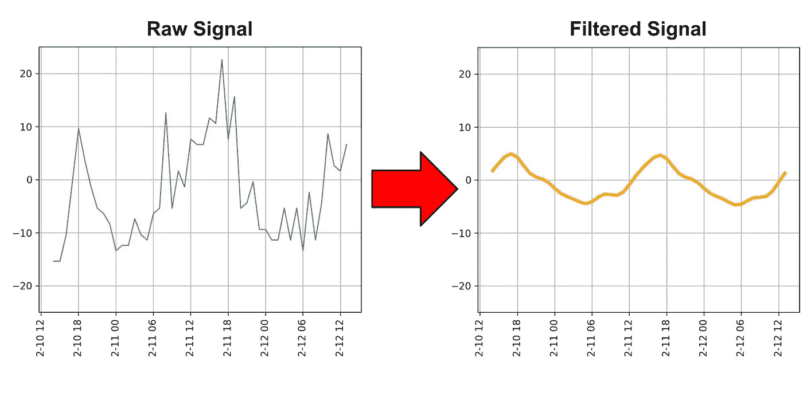
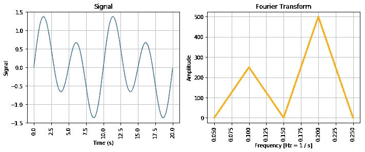
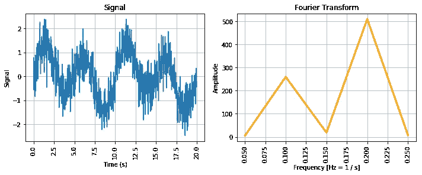
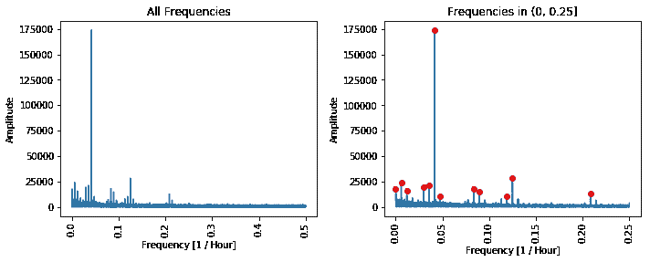
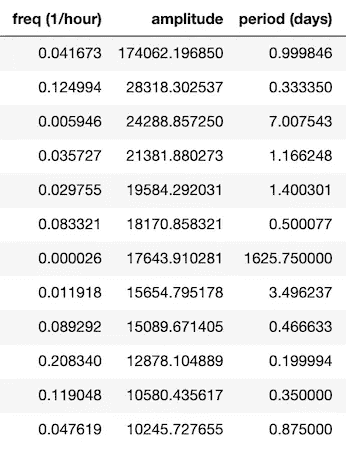
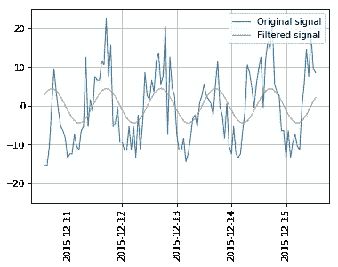
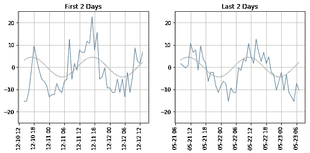

# 使用 Python 和 SciPy 通过傅立叶变换分析季节性

> 原文：<https://towardsdatascience.com/analyzing-seasonality-with-fourier-transforms-using-python-scipy-bb46945a23d3?source=collection_archive---------8----------------------->

## 通过寻找 911 电话数据中的季节性趋势，学会从噪音中分离信号

最后，你将能够用你自己的数据做到这一点

## 分析 911 电话呼叫的季节性

俗话说，历史重演。理解这些模式有助于我们做出更明智、更有准备的决策。挑战在于将图案从周围的噪音中分离出来。我们可以使用工程师常用的傅立叶变换来实现这一点——从噪声中分离出信号。

今天，我们来分析一下宾夕法尼亚州蒙哥马利县的 911 电话数据。我们希望回答在以下时间段内 911 报警电话的数量是高还是低:

*   一天中的特定时间？
*   一周中的某些日子？
*   一年中的某些月份？

根据调查结果，我们可以决定如何为 911 呼叫中心配备人员。例如，如果我们发现周五晚上的呼叫量最高，我们可以在周五晚上提供更多的班次，这样我们的呼叫中心就可以处理更高的呼叫量。

## 傅立叶变换有什么作用？

傅立叶变换允许您将时间和信号的函数转换为频率和功率的函数。这告诉你什么频率组成你的信号，以及它们有多强。在我们的例子中，信号是电话的数量，我们可能期望某种每周或每天的频率。

在左侧，我们绘制了两个正弦波的和，一个周期为 5，频率为 1/5=0.2，另一个频率为 1/10=0.1。在傅立叶变换中，我们可以清楚地看到，我们有两个频率为 0.2 和 0.1 的波，通过查看峰值对应的频率。

真实数据通常包含噪声，傅立叶变换让我们看穿噪声，并了解哪些频率真正重要。

我们从之前的信号中加入随机噪声，我们仍然可以在傅立叶变换中清楚地看到信号的相同频率。这就是傅立叶变换从噪声中分离信号的方法。

本文在这里不深究傅里叶变换的数学和推导。如果你有兴趣，我推荐你在完成这个练习后观看 3Blue1Brown 的[傅立叶变换的可视化介绍](https://www.youtube.com/watch?v=spUNpyF58BY)。我建议先做这个练习，因为傅立叶变换是这样一种概念，从一个实际例子开始会帮助你理解它背后的数学。

## 数据准备

首先，让我们导入并准备呼叫数据。为了跟进，您可以克隆这个 [Github repo](https://github.com/Kommandat/seasonality-fourier-analysis) 并按照那里的说明进行操作。这里的代码是。原始数据来自 [Kaggle](https://www.kaggle.com/mchirico/montcoalert) 。

对于数据准备，让我们转换原始数据来计算每小时的调用次数。我们在小时级别上汇总呼叫数，因为分钟级别的呼叫量太低，我们不希望看到小时级别以下的任何季节性。根据经验，您希望采样频率是信号中预期最高分量频率的两倍。如果你的频率再低一点，一种叫做混叠的情况就会发生，并扭曲你的结果。满足“2 倍最高元件频率”规则的最小频率称为[奈奎斯特速率](https://en.wikipedia.org/wiki/Nyquist_rate)。直觉上，这个概念是有意义的，因为我们不能通过计算每天的电话数量来回答一天中的某个时间是如何影响电话数量的。

此外，我们需要确保用零填充任何丢失的小时(没有 911 呼叫的地方)。最后，对于信号，让我们用图表来表示与平均调用计数的差异，而不是调用计数本身。这样，我们的数据以 0 为中心，就像一个真正的正弦波。

第一周的数据绘制在右侧。这里肯定有一些季节性，所以看起来我们的分析很有希望。

## 傅里叶变换

我们将使用 SciPy 软件包中的傅立叶变换子模块— `scipy.fft`。我们将使用 SciPy 快速傅立叶变换(`scipy.fft.fft`)函数来计算傅立叶变换。如果您熟悉排序算法，可以将快速傅立叶变换(FFT)视为傅立叶变换的快速排序。FFT 是一种更有效的计算傅立叶变换的方法，也是大多数软件包的标准。

只需将输入数据传递给函数，它就会输出转换的结果。对于振幅，取结果的绝对值。为了得到相应的频率，我们使用`scipy.fft.fftfreq`。我们可以绘制振幅和频率的图表。振幅最高的频率表示季节性模式。低振幅的频率是噪声。此外，scipy 的[周期图](https://docs.scipy.org/doc/scipy/reference/generated/scipy.signal.periodogram.html)功能也可以让你看到类似的图表。让我们标记出我们可以清楚地看到振幅峰值的频率。

如果我们查看那些振幅最高的频率，并将其转换为小时和天，我们会看到顶部季节模式有一个每日频率(周期约为 1 天)。

之后，振幅急剧下降，我们看到 8 小时和 7 天的季节性。前者表明一天有 3 次通话量高峰(可能是早上、晚上和深夜？).后者表明通话量在一周中的某一天达到峰值。

其他频率很难联系上下文，但鉴于它们的低振幅，它们不是很重要。

## **傅里叶逆变换**

我们的分析目前还不太可行。我们知道每天都有季节性，但不知道一天中的哪个时间实际上有更高的季节性。为了解决这个问题，我们可以使用傅立叶逆变换。理论上，这可以让我们转换滤波结果，只查看信号。

如果我们针对前 5 天的数据将滤波后的信号与原始信号进行对比，结果会是这样。

看起来很有希望！过滤信号中的峰值在下午 5 点左右与原始信号对齐。问题是，当我们将这延伸到最后一周的数据时，峰值反而在上午 11 点开始出现。

那么是什么原因呢？问题是我们的频率不是每 24 小时一次。实际上是每 23.996 小时一次，在整个数据集的过程中，这个小的偏差累积起来。

## 我们能做什么？

因此，我们已经回答了最初关于数据中的季节性的问题，但我们还不能准确回答季节性何时达到峰值。为了让我们的分析更上一层楼，我们需要将季节性纳入我们的回归模型。

这将有助于我们通过尝试受傅立叶结果启发的不同输入来找出季节性高峰的时间。此外，这将允许我们在回归模型中结合季节性和其他变量，以便我们可以更准确地预测未来的呼叫量。我们还将看到季节性是如何被用来解释回归模型中的残差的。

要了解更多关于分析季节性的信息，请查看下面链接的文章，在这篇文章中，我讲述了如何在回归模型中使用傅立叶分析。

 [## 如何将傅立叶项添加到回归和季节性分析中(使用 Python 和 SciPy)

### 使用傅立叶项将季节性包括在回归中

towardsdatascience.com](/how-to-add-fourier-terms-to-your-regression-seasonality-analysis-using-python-scipy-99a94d3ae51) 

## 有用的链接

*   [傅立叶变换的直观介绍](https://www.youtube.com/watch?v=spUNpyF58BY)
*   [如何解释 FFT 结果——获取幅度和相位信息](https://www.gaussianwaves.com/2015/11/interpreting-fft-results-obtaining-magnitude-and-phase-information/)
*   [可汗学院——傅立叶系列](https://www.khanacademy.org/science/electrical-engineering/ee-signals/ee-fourier-series/v/ee-fourier-series-intro)

## [Github 上的项目代码](https://github.com/Kommandat/seasonality-fourier-analysis/blob/master/notebooks/Part%201%20-%20Seasonality%20Analysis%20with%20scipy.fft.ipynb)