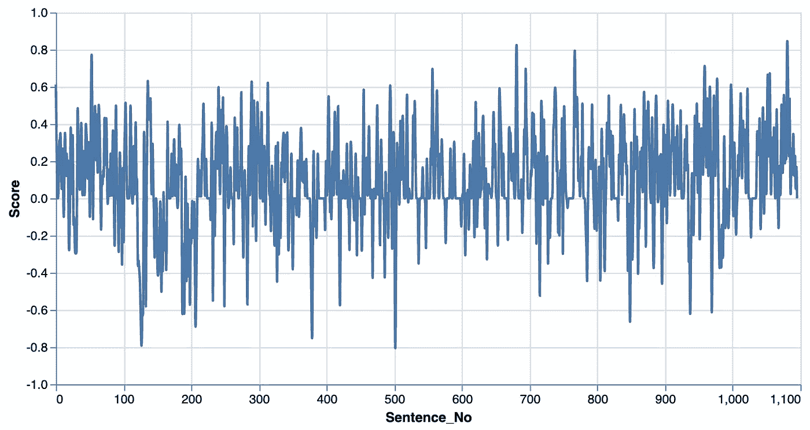
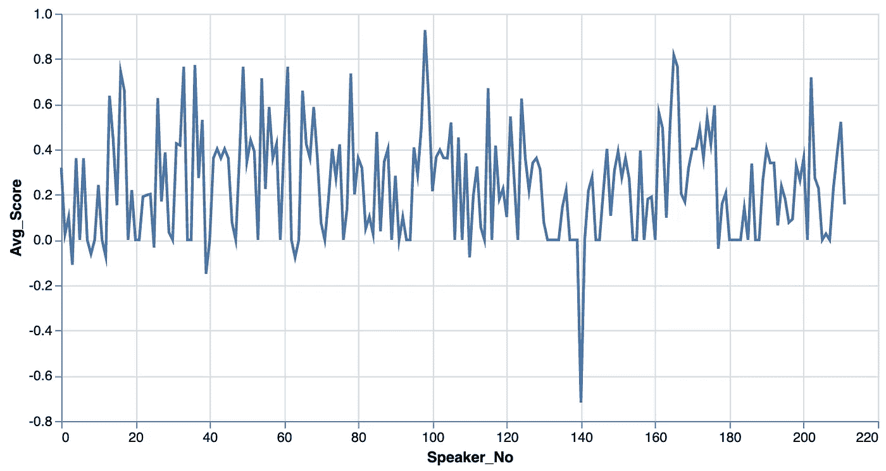

# 分析市议会会议的情绪

> 原文：<https://towardsdatascience.com/analyzing-sentiment-of-city-council-meetings-462214d2dbc6?source=collection_archive---------44----------------------->

## 情绪能表明会议中值得注意的部分吗？


来自 [Pixabay](https://pixabay.com/?utm_source=link-attribution&amp;utm_medium=referral&amp;utm_campaign=image&amp;utm_content=719963) 的[凯文·诺里斯](https://pixabay.com/users/kevincnorris-371456/?utm_source=link-attribution&amp;utm_medium=referral&amp;utm_campaign=image&amp;utm_content=719963)的图片

上周末，我参加了我的第一次黑客马拉松:2020 年圣黑客日，由[民主实验室](https://www.democracylab.org/)的伟大人物举办。这真是一次丰富的经历，我开始着手一个非常酷的项目！

委员会数据项目的目的是通过使市议会的活动不仅被立法者发现和理解，从而赋予公民和记者权力。这里是西雅图的现场直播。西雅图不提供他们会议的文本记录(只有视频记录),委员会数据项目自动创建文本记录，将其编入索引，然后在线提供。我一直想探索情感分析，并认为这是一个绝佳的机会！

**情感分析**是“文本的上下文挖掘，识别并提取源材料中的主观信息。” [](/sentiment-analysis-concept-analysis-and-applications-6c94d6f58c17) 具体来说，就我们的目的而言，我想探究每个发言者的情绪，看看情绪的变化，或情绪的总体高/低时期，是否表明发言者之间的辩论中有有趣的部分或时期。

在当前形式下，文本副本数据是无标签的，这意味着数据只是没有附加分类器的文本。这将我们可以使用的模型限制为无监督的模型。我确定了两个模型来尝试——NLTK 的 VADER 和 TextBlob。也有 IBM 的 Watson，但是它有价格标签，并且不能很好地扩展。在这个例子中，我将只使用 VADER，但我想很快用 TextBlog 试试。VADER 预先接受了社交媒体方面的训练，因此它不是这种情况下的完美工具。

我们来看看笔录！首先，我们需要导入我们将使用的所有模块，并从 CDP 下载数据:

```
**import** **pandas** **as** **pd**
**import** **nltk**
**from** **nltk.sentiment.vader** **import** SentimentIntensityAnalyzer
**from** **cdptools** **import** CDPInstance, configs
**import** **altair** **as** **alt**
**import** **numpy** **as** **np**
**import** **json**# connect to Council Data Project database
seattle = CDPInstance(configs.SEATTLE)*# Download a specific event, save the JSON*
manifest = seattle.get_transcript_manifest()found_event = manifest.loc[manifest.event_id == "bb35a74c-53db-40f7-9af0-c0b296c2696a"].iloc[0]save_path = seattle.file_store.download_file(found_event.filename)# Load transcript JSON file
**with** open(save_path, "r") **as** read_in:
    transcript = json.load(read_in)
    **for** s **in** transcript["data"][:2]:
        print(s){'speaker': '', 'data': [{'start_time': 12.679, 'end_time': 20.186, 'text': 'Good morning, and welcome to the February 11, 2020, meeting of the public safety and human services committee.'}, {'start_time': 20.186, 'end_time': 41.808, 'text': "It's 9:36A.M., and I am Lisa Herbold, the chair of this Committee and Councilmember to District 1\. I call the meeting to order, welcome to my Cocommittee members, council member Morales and Councilmember Lewis."}, {'start_time': 41.808, 'end_time': 45.178, 'text': 'I want to go over the agenda, quickly.'}, {'start_time': 45.178, 'end_time': 47.914, 'text': 'Today we will start with approval of agenda.'}, {'start_time': 47.914, 'end_time': 86.453, 'text': "Followed by public comment and the items of business include, appoint of two members of the community police Commission, hearing from the office of the inspector general about her 2020 work plan, and also a presentation from the human services Department that will include a focus on the Hsd, the human services director's report, and then a focus exclusively on the Nonhomelessness investments side of the human services side of the portfolio."}, {'start_time': 86.453, 'end_time': 92.225, 'text': 'If there are no objections, I would like to approve the agenda.'}]}
```

每当有人说话时，它会列出他们说的每一句话，以及开始和结束的时间。它目前不知道实际上是谁在说话(这就是为什么 speaker 是一个空字符串)。我编写了一个函数来解析这个 JSON，并将每个发言者及其句子存储在一个列表列表中。现在让我们来看看这种情绪！

```
# Download vader lexicon, and instatiate a SentimentIntensityAnalyzer objectnltk.download('vader_lexicon')
sid = SentimentIntensityAnalyzer()def get_vader_score(sent: str) -> list:
    # takes in a string and then outputs VADER sentiment score
    ss = sid.polarity_scores(sent)
    out_list = []
    for k in sorted(ss):
        out_list.append([k, ss[k]])
    return out_list# Let's look at the eighth speaker's first sentence
get_vader_score(transcript[7][0])> [['compound', 0.6486], ['neg', 0.0], ['neu', 0.361], ['pos', 0.639]]
```

分数范围从-1 到 1，表示该分数的极性。1 为正，-1 为负(为了明确起见)。就我的目的而言，我们实际上只需要复合分数，所以我重写了上面的函数，只输出复合分数。如果你有兴趣了解更多，这里有一篇关于 VADER 如何计算分数的深入文章。

我最初计算了每个句子的情感，得到的图形非常嘈杂。



VADER 在市议会会议上每句话的综合得分

接下来，我画出了每个演讲者句子的平均情绪。这被证明是非常有用的。请注意，可视化来自单独的会议。



市议会会议中每位发言人的平均 VADER 综合得分

看到那个巨大的向下的尖峰让我们非常兴奋——就是它了！现在让我们来看看提供这一结果的扬声器模块:

> “你可能会受到房东的欺负。我被房东欺负了。我们被房东欺负了。”

然而，考虑到这个模型是如何运作的，这个结果是有意义的。欺凌是不好的(它被提到了三次),所以模型会反映这一点，但它对我们的目的并不真正有用。

# 结论

总的来说，当你看许多会议时，情绪总是很高。这是有道理的，因为理事会成员通常是热情和专业的，议会程序加强了这一点。

因此，VADER 对我们的目的来说并不太有用。我想试试 TextBlob 的情感分析包，但我不认为它会更有用。一个没有接触过市议会会议的独特语言的模型将不能正确地分析这种语言。

展望未来，我认为探索这一点的下一步将是手动标记论点或辩论的要点，然后使用监督学习技术。祝我好运！

来源:

1.  [https://towards data science . com/opinion-analysis-concept-analysis-and-applications-6c 94d 6 f 58 c 17](/sentiment-analysis-concept-analysis-and-applications-6c94d6f58c17)