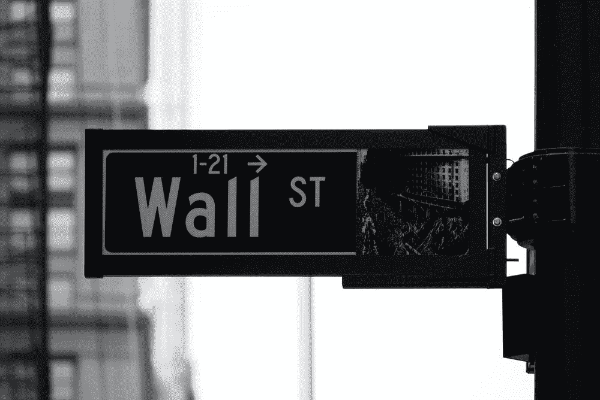
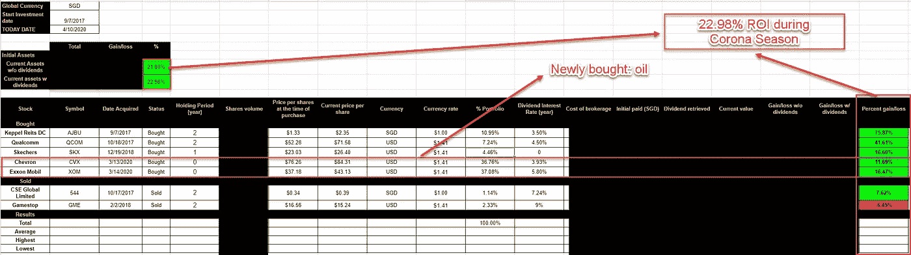
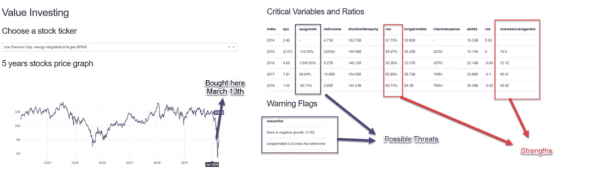
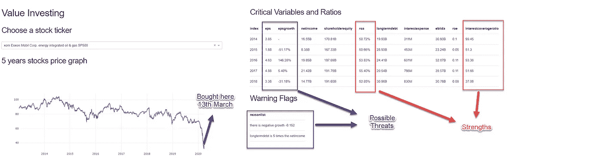

# 分析股票投资组合

> 原文：<https://towardsdatascience.com/analyzing-stocks-portfolio-d6035711dfc7?source=collection_archive---------26----------------------->

## 价值投资分析入门指南

## 电晕大流行期间的数据即和讲故事(2020 年 4 月)

[来源(Unsplash)](https://unsplash.com/photos/uJhgEXPqSPk)

# 更新我的价值投资股票组合

2019 年 5 月 22 日，我部署了[我的投资仪表板](https://value-investing.herokuapp.com/)，创建了我自己的投资组合，[写了进度](/value-investing-dashboard-with-python-beautiful-soup-and-dash-python-43002f6a97ca)。

 [## 价值投资仪表盘，配有 Python Beautiful Soup 和 Dash Python

### 价值投资的 Web 抓取与快速 Dash 可视化概述

towardsdatascience.com](/value-investing-dashboard-with-python-beautiful-soup-and-dash-python-43002f6a97ca) 

我一直用这个仪表板收集重要的比率和数字来计算股票价值。从那以后，我收到了更新我的股票投资组合的请求，尤其是在疫情时间。

值得庆幸的是，随着我目前的硕士学期即将结束，我慢慢养成了在家工作(WFH)的好习惯。我有时间重新评估和更新我的个人股票投资组合，尤其是在冠状病毒大流行的艰难时刻。这次疫情将是一次压力测试，看看我的投资组合表现如何。

> **免责声明**:本分析是在 4 月 10 日进行的，这不是 3 月初科罗纳病毒疫情声明期间的股市低谷。我不是金融专业人士，也从未在投资机构工作过。相反，我是一名数据从业者，试图分析和交流想法，以解决问题并带来影响。我所做的所有投资组合和股票购买纯粹是为了我自己的个人利益和对我自己的价值投资工具和方法的评估。

# 结果

**Tl:DR:在这次科罗纳疫情(2020 年 4 月 10 日)期间，我的投资组合收益是 22.98% (w/股息)和 21.02%(w/o 股息)。**

这份投资组合分析包括我最近在低谷期(冠状病毒被标记为疫情——2020 年 3 月 13 日)购买的石油。然而，令人惊讶的是，如果你关注我在 2017 年和 2018 年期间的旧购买。我仍然从*吉宝 DC 房地产投资信托基金*和**高通***获得了 75.87%*** *的巨额股票收益。我分别在比特币崩盘和苹果诉讼后买了这些股票。***

***我很惊讶我的投资组合仍然表现良好，尽管整个电晕病毒在股票市场大流行。这个数字表明，用保守的折扣率和风险计算，我在正确的安全边际(15%)内购买强劲的股票是正确的。***

> ***当你以便宜的价格买入强劲的股票时，你就不用那么担心市场了***

# ***为什么我在 2020 年 3 月 13 日买了石油股票***

***2020 年 3 月 11 日，世卫组织宣布冠状病毒为疫情，导致[石油股票市场跌至 17 年低点](https://www.cnbc.com/2020/03/18/oil-markets-coronavirus-pandemic-in-focus.html)，原因是现有的疫情以及沙特和俄国建立的价格竞争。这表明人们非常担心疫情会大幅降低石油股票价格。请随意在这里找到我部署的[仪表盘](https://value-investing.herokuapp.com/)。***

## ***雪佛龙(CVX)***

******

## ***埃克森美孚(XOM)***

******

## ***强项***

1.  *****资产回报率高:**资产回报率(ROA)是一个公司相对于其总资产盈利多少的指标。ROA 让经理、[投资者、](https://www.investopedia.com/terms/i/investor.asp)或分析师了解一家公司的管理层在利用其资产产生收益方面有多有效。雪佛龙和埃克森美孚的高 ROA(>50%)表明与其基础设施投资( [Investopedia](https://www.investopedia.com/terms/r/returnonassets.asp) )相比收入强劲。在这种情况下，CVX 更有资格享有居留权。***
2.  *****利息保障率远远超过 20 倍**:利息保障率是一个债务比率和盈利率比率，用于确定一家公司支付其未偿债务利息的难易程度。利息保障率超过 20 倍这一事实意味着，该公司不太可能无法偿还其投资的利息债务。***

***简而言之，我认为这些都是成熟的公司，它们甚至会在未来 10 年继续存在。石油消费将永远是需要的，而且不存在即将到来的类似可再生能源的威胁。***

## ***潜在威胁:***

1.  *****每股收益增长率波动**:每股收益增长率表明，随着时间的推移，公司的盈利能力越来越强。对投资者来说，这将是一项有用的措施。在这种情况下，我们发现每股收益的同比增长率是波动的。但是，当我用行业比率匹配它时，它似乎是 2018 年美中贸易战发生时经济的反映。***
2.  ***净收入和长期债务之间的安全边际似乎很小:经过更多的研究，我意识到这是石油行业的典型特征。石油行业是基础设施重工业，在炼油厂或采矿的重型设备方面有大量投资。因此，这似乎是一个常见的场合。一个更好的指标是利息保障率，以观察公司多年来的健康状况。***

***总的来说，以下是一些警告信号和关键财务比率供您参考:***

> ****给定公司名单，找出投资的可行性
> 进入市场最少 10 年
> 有业绩记录(每年每股收益)
> 有效率(净资产收益率> 15%) —净收入/股东权益
> 确定操纵(ROA > 7%) —净收入/总资产
> 有小额长期债务(长期债务< 5*总收入)
> 低负债权益比
> 支付利息能力:(利息保障比率> 3) — EBIT /总资产****

# ***过度非持续性恐惧的好股票***

*****油价低谷时的恐惧有很多原因，但我相信这种恐惧不会持续很久:*****

1.  *****油价将随着经济复苏而回升:**随着旅游和经济生产的停止，[石油市场需求减少 25%](https://www.nytimes.com/2020/04/08/business/oil-markets.html) 。然而，我相信从长远来看，科罗纳疫情赛季将会过去。随着经济复苏，会有大量的作品和旅游。油价就像一个被压缩的弹簧，一旦经济繁荣，就准备跳起来，比如在美中贸易战期间。航空、旅游和生产行业将从航班和生产低迷中复苏。油价长期不会被打压。***
2.  ***战争的代价是不可持续的。三月初，沙特和俄罗斯之间的石油价格战导致两国向全球能源市场供应廉价原油，使价格超过 50 美元/桶( [Motley Fool](https://www.fool.com/investing/2020/04/08/timesensitive-3-top-oil-stocks-to-buy-in-april.aspx) )。这是非常低的，但我认为俄罗斯和沙特阿拉伯仍然无法维持这一水平。一旦这场争斗结束(很可能是石油输出国组织)，我确信一切都会很快过去。***

***由于强势股票价格低，我决定将我的现金储备投入石油，目前我在 CVX 获得了 **11.69%** 的股票收益，在 XOM 获得了 **16.47%** 的股票收益，只有在经济完全复苏后，时间才能知道确切的总收益是多少。***

# ***投资作为分析和讲故事的工具***

***我认为，每个家庭都需要大量投资，才能对自己的财务状况做出明智的决定。在这个人们被解雇的艰难的疫情，拥有个人投资组合的风险非常高。希望这篇文章能成为你从定量和定性的角度思考投资的起点。***

***我个人喜欢看这些数字，并从这些数字中构思故事。此外，作为一名数据从业者，投资对我来说是一个很好的实践，可以锻炼我在分析和讲故事方面的技能和技能。[NYU 大学教授估值的阿斯莫斯·达莫达兰在他的书](https://www.amazon.sg/Little-Book-Valuation-Company-Profit/dp/1118004779/ref=asc_df_1118004779/?tag=googleshoppin-22&linkCode=df0&hvadid=389066266933&hvpos=&hvnetw=g&hvrand=18383116087073625294&hvpone=&hvptwo=&hvqmt=&hvdev=c&hvdvcmdl=&hvlocint=&hvlocphy=9062531&hvtargid=pla-436014111593&psc=1)中谈到了这种重要性。此外，请随意看看我的基础教程。***

*** [## 12 分钟:熊猫和 Scikit 的股票分析-学习

### 使用 Python 快速分析、可视化和预测股票价格

towardsdatascience.com](/in-12-minutes-stocks-analysis-with-pandas-and-scikit-learn-a8d8a7b50ee7) 

我希望在我整理完股票投资组合后，每个月都能发布这些更新。希望这些更新能激励你开始特别分析你的投资组合。

> 规则 1: **永远不要赔钱**。
> 
> 规则 2: **永远不要忘记规则 1**
> 
> [—沃伦·巴菲特— Investopedia](https://www.investopedia.com/financial-edge/0210/rules-that-warren-buffett-lives-by.aspx)

# 最后…

我真的希望这是一本很棒的读物，是你发展和创新的灵感来源。

这个想法是从我的几个大学朋友开始的，他们热衷于管理自己的金融投资组合。他们给了我很多反馈，让我了解技术术语和家庭投资的常见问题。作为一名打算投资收入的应届毕业生，他们是我应该学习的合适人选。

请在下面的**评论**提出建议和反馈。就像你一样，我也在学习如何成为一名更好的数据科学家和工程师。请帮助我改进，以便我可以在后续的文章发布中更好地帮助您。

谢谢大家，编码快乐:)

# 关于作者

Vincent Tatan 是一名数据和技术爱好者，拥有在 Google LLC、Visa Inc .和 Lazada 实施微服务架构、商业智能和分析管道项目的相关工作经验。

Vincent 是土生土长的印度尼西亚人，在解决问题方面成绩斐然，擅长全栈开发、数据分析和战略规划。

他一直积极咨询 SMU BI & Analytics Club，指导来自不同背景的有抱负的数据科学家和工程师，并为企业开发他们的产品开放他的专业知识。

最后，请通过[**LinkedIn**](http://www.linkedin.com/in/vincenttatan/?source=post_page---------------------------)**[**Medium**](https://medium.com/@vincentkernn?source=post_page---------------------------)**或** [**Youtube 频道**](https://www.youtube.com/user/vincelance1/videos?source=post_page---------------------------) 联系文森特*****