# 如何评价 Sweet Maria 的咖啡杯度量标准，以便更好地进行比较

> 原文：<https://towardsdatascience.com/analyzing-sweet-marias-coffee-cupping-metrics-3be460884bb1?source=collection_archive---------45----------------------->

## 咖啡数据科学

## 检查 Sweet Maria's 的数据，帮助了解他们对咖啡的选择

完整声明:我喜欢甜甜玛利亚的咖啡，在过去的 6 年里，我经常从他们那里购买大部分的生咖啡。

我查看了他们咖啡等级的次级指标，以便更好地理解它们在咖啡相互比较中的作用。我用箱线图、相关性和主成分分析(PCA)来理解这些咖啡等级。这项工作是对大型 Q 级 CQI 数据库进行比较的另一个扩展，以了解他们的咖啡分级指标在区分咖啡方面有多有用。

# 杯突评分(修正的 Q 评分)

Sweet Maria 的[与下面总结的 SCA 标准](https://library.sweetmarias.com/the-evolution-of-sweet-marias-cupping-descriptions/)略有不同。很想看看甜度、均匀性和干净的杯子与其他[数据](/grading-the-usefulness-of-q-scores-for-coffee-grading-8ff2e8439572)相比如何。SCA 量表的这 3 个指标一开始都很完美，并且扣分，Sweet Maria 的指标让我们对咖啡有了更多的了解。

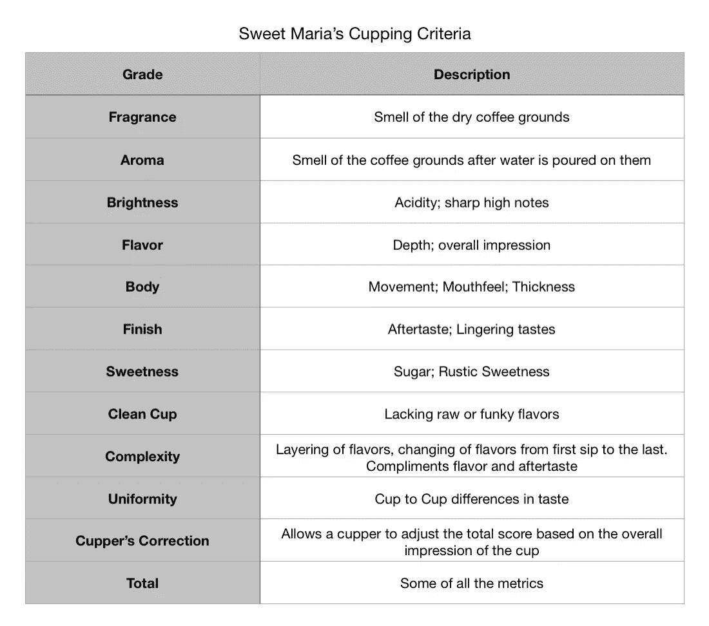

# 原始数据

从甜甜的玛丽亚那里提取数据并不容易。他们没有数据库可以提取，但是他们有 300 多种豆子的档案。正如在[这篇文章](/coffees-by-region-process-grade-and-price-7e17c3c44baf)中所讨论的，我手动提取了部分数据，通过这种方式提取数据，我为每种咖啡绘制了一个蜘蛛图。

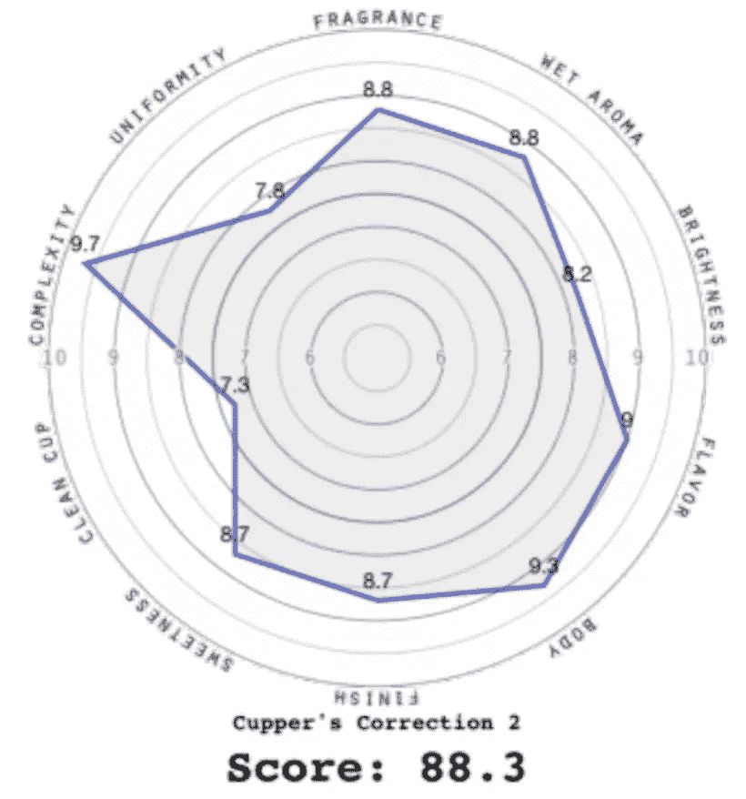

来自[https://www . sweet marias . com/Burundi-dry-process-gate Rama-aga hore-6431 . html](https://www.sweetmarias.com/burundi-dry-process-gaterama-agahore-6431.html)经其许可

我编写了一个[脚本来从这些蜘蛛图](/extracting-data-from-a-spider-graph-99dd12abda4c)中提取子指标，并且我还能够检查数据的准确性。我将这些数据用于指标的相互比较分析。

# 分析

除了中美洲的一些异常值之外，非洲咖啡豆的得分分布具有最高的偏移。我想说这是由于加工类型，特别是干加工，但干加工的分布如此之广，我对此表示怀疑。

对于不熟悉[盒图](https://www.mathworks.com/help/stats/boxplot.html)的人来说，这是一个图例:

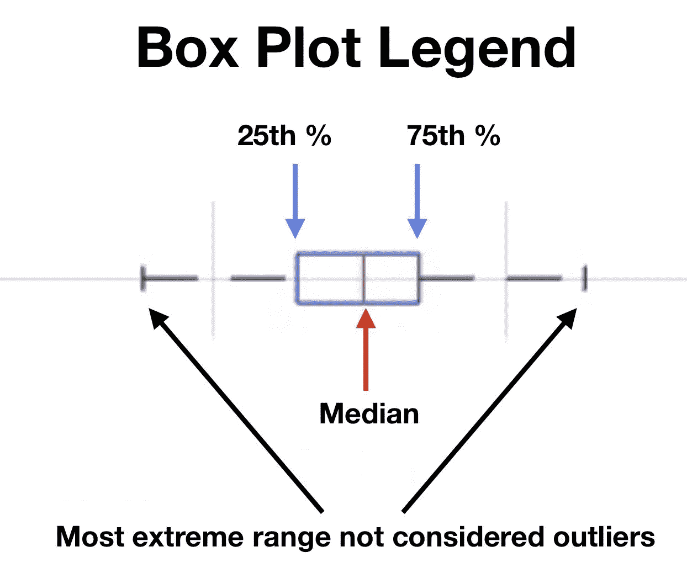

作者的图片和其他图片一样

以下是区域和处理的总体指标。非洲的分数明显更高。就处理而言，干式处理的数据比其他数据具有更大的分布。

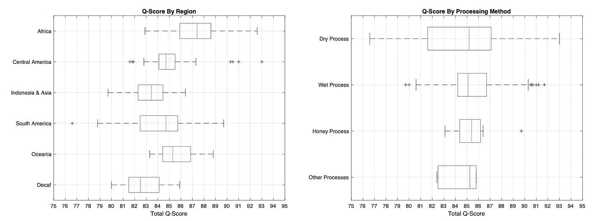

我们可以将 Q 值分解为分布广泛的子指标。希望这意味着他们能更好地辨别咖啡。

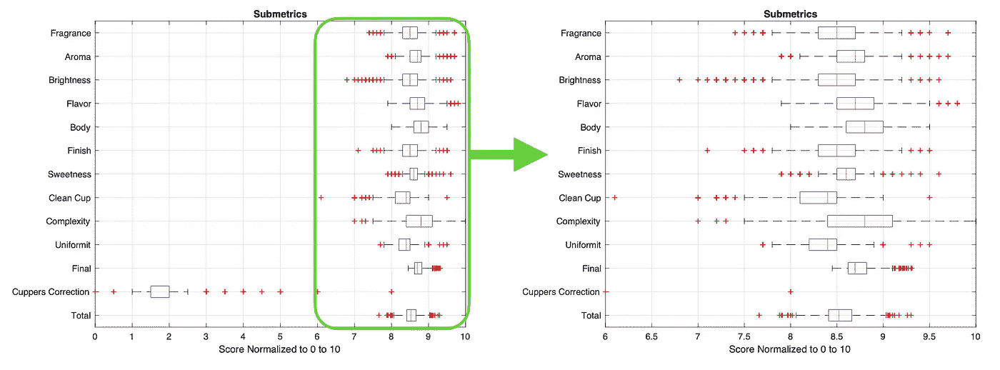

# 相互关系

[相关性](https://en.wikipedia.org/wiki/Correlation_coefficient)是衡量两个变量彼此相似程度的指标。高相关性并不意味着一个变量会引起另一个变量，而是当情况发生变化时，两个变量的涨跌幅度相同。我从一开始就假设一些分级变量会有很高的相关性，因为它们是从不同的时间点来看味道的。相关性可以是正的(趋势相同)或负的(趋势相反)。0 表示没有相关性。

我们可以查看每个参数以及它们之间的相互关系。看起来身体和一致性与其他任何指标甚至总分都没有什么关系。库珀的修正似乎与总分呈负相关，但考虑到库珀的修正是针对总分应该高于得分的咖啡，这是有道理的。香味和香气相互关联，这是意料之中的。香气和余味也一样。复杂性看起来比其他的更独立，但仍然对整体有用。

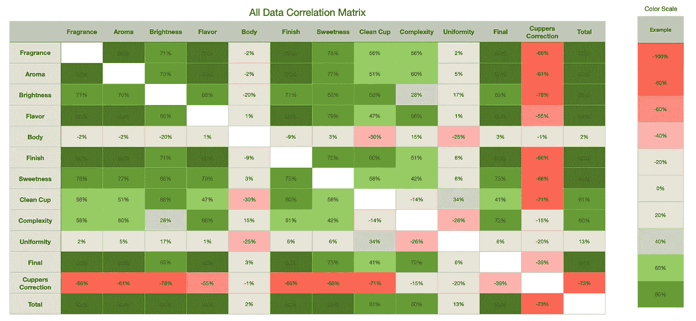

让我们按地区和方法对此进行细分，以了解每个分级指标与给定地区或处理指标的总分之间的相关性。区域之间肯定存在一些差异，在这些区域中，某些区域的均匀体或均匀性比其他区域具有更高的相关性。这意味着它们不是没有价值的指标，因为它们确实有助于区分咖啡的差异。

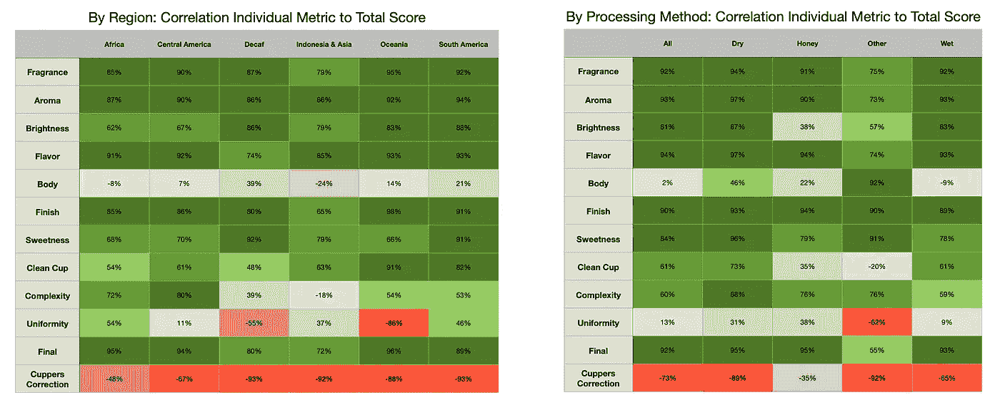

我们还可以看到处理对这些指标的评分有多大影响。这可以按地区和流程进一步细分。样本较少，所以遗漏了几个区域。

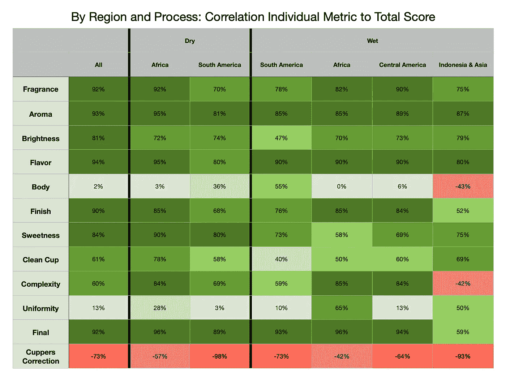

在这种情况下，均匀性对于非洲湿法比干法或其他方法更重要。南美咖啡和印度尼西亚咖啡的身体影响得分不同，因为它们分别呈正相关和负相关。

这在一定程度上肯定了我自己的非洲和南美咖啡豆混合策略有利于平衡不同的咖啡豆。我想知道使用这种类型的信息是否有助于发现新的混合物，而不是试错法。

我们可以用图表来比较南美和非洲的湿豆和干豆。他们大多是趋势，但他们有一些有趣的差异，特别是因为非洲豆不会像南美豆一样区分干湿。

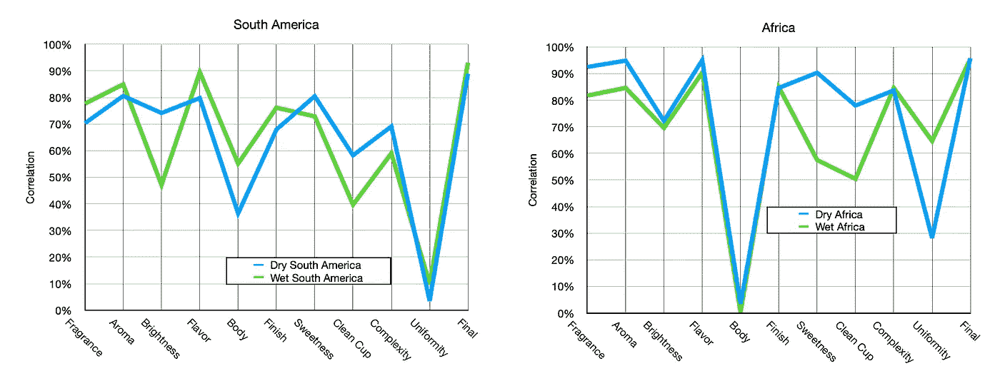

# 主成分分析

[PCA](https://en.wikipedia.org/wiki/Principal_component_analysis) 意在将一组变量转换到一个新的空间，其中新的维度按照它们组成原始维度的可变性排序。一个简单的数据集可以在不损失保真度的情况下减少维数；在这种情况下，每个 Q-分数(甜玛丽亚的分级)由 11 个维度表示，但也许你不需要这么多来表示总分。也许你只需要三个主要部件或电脑。

从 PCA 空间来看，大部分指标对前 3 个 PC 的可变性有贡献，前 3 个 PC 包含了几乎 90%的可变性。

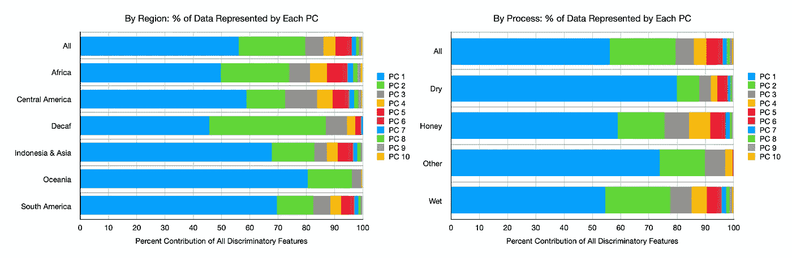

不同的地区和过程有各种各样的可变性。干法加工相对于其他加工似乎缺乏变化。大洋洲的情况类似，但样本量较小，因此这可能不是该指标的恰当用途。大多数地区都有很大的差异，这可以通过需要多少台电脑来捕捉差异来看出。

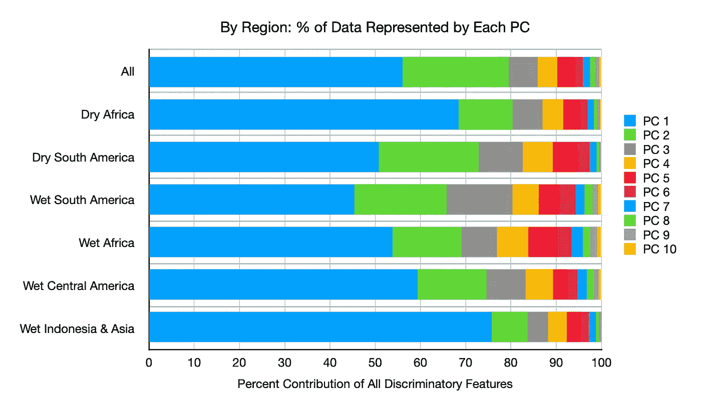

同样，我们可以查看 PC 的区域，并处理具有足够数据的区域。在非洲和南美洲，潮湿和干燥似乎是相似的。

# 与 CQI 的快速对比

我快速浏览了一下 CQI 和甜甜玛利亚的电脑，我的目标是稍后进行更全面的比较。所以我画出了前两个包含大部分辨别能力的 PC。CQI 的数据库比甜甜玛利亚的少得多。比起甜蜜的玛利亚，似乎更难看到 CQI 地区的分离。

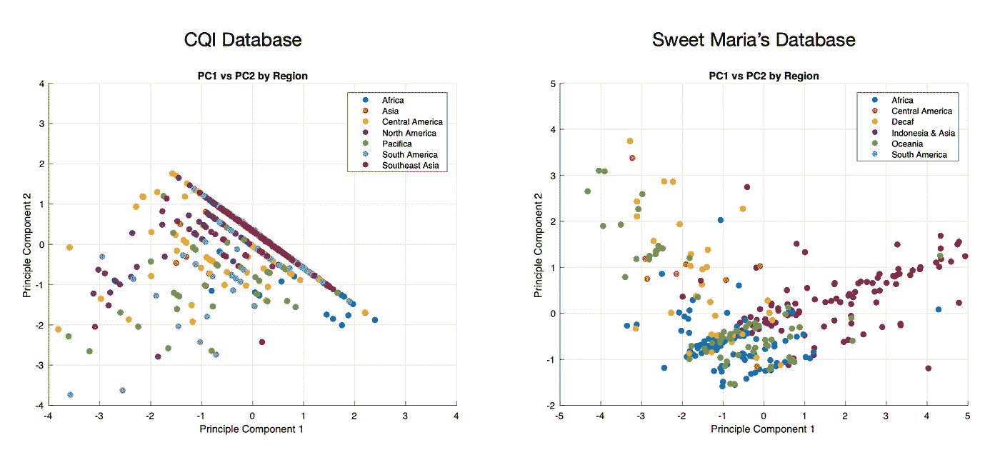

总的来说，我发现 Sweet Maria 的指标包含了很好的可变性和辨别能力。每个指标对总分的贡献都是有价值的，这对于咖啡的分级非常重要。这与 CQI 的衡量标准或者更确切地说是 SCA 的衡量标准形成了对比，因为他们的三个衡量标准对于描述咖啡本身没有任何意义。

就个人而言，这让我非常兴奋，因为我在选择咖啡豆时依赖于他们的分级分数，所以这再次证明了他们是一家优质企业。有时，当人们有不同的口味分级系统时，你不知道这些指标在区分口味方面有多好，所以下一个有趣的练习是对 CQI 和甜甜玛利亚的分数进行更彻底的比较。

如果你愿意，可以在 [Twitter](https://mobile.twitter.com/espressofun?source=post_page---------------------------) 和 [YouTube](https://m.youtube.com/channel/UClgcmAtBMTmVVGANjtntXTw?source=post_page---------------------------) 上关注我，我会在那里发布不同机器上的浓缩咖啡照片和浓缩咖啡相关的视频。你也可以在 [LinkedIn](https://www.linkedin.com/in/robert-mckeon-aloe-01581595?source=post_page---------------------------) 上找到我。

# 我的进一步阅读:

[按地区、工艺、等级和价格分类的咖啡](/coffees-by-region-process-grade-and-price-7e17c3c44baf)

[家庭烘焙咖啡的经济学](/the-economics-of-home-roasting-coffee-93003ea31ee8)

[咖啡豆脱气](/coffee-bean-degassing-d747c8a9d4c9)

[解构咖啡:分割烘焙、研磨、分层以获得更好的浓缩咖啡](/deconstructed-coffee-split-roasting-grinding-and-layering-for-better-espresso-fd408c1ac535)

[浓缩咖啡的预浸:更好的浓缩咖啡的视觉提示](/pre-infusion-for-espresso-visual-cues-for-better-espresso-c23b2542152e)

[咖啡的形状](/the-shape-of-coffee-fa87d3a67752)

[搅拌还是旋转:更好的浓缩咖啡体验](https://towardsdatascience.com/p/8cf623ea27ef)

[香辣浓缩咖啡:热磨，冷捣以获得更好的咖啡](/spicy-espresso-grind-hot-tamp-cold-36bb547211ef)

[断续浓缩咖啡:提升浓缩咖啡](https://link.medium.com/vmI2zVeQabb)

[用纸质过滤器改进浓缩咖啡](/the-impact-of-paper-filters-on-espresso-cfaf6e047456)

[浓缩咖啡中咖啡溶解度的初步研究](/coffee-solubility-in-espresso-an-initial-study-88f78a432e2c)

[断奏捣固:不用筛子改进浓缩咖啡](/staccato-tamping-improving-espresso-without-a-sifter-b22de5db28f6)

[浓缩咖啡模拟:计算机模型的第一步](https://towardsdatascience.com/@rmckeon/espresso-simulation-first-steps-in-computer-models-56e06fc9a13c)

[更好的浓缩咖啡压力脉动](/pressure-pulsing-for-better-espresso-62f09362211d)

[咖啡数据表](https://towardsdatascience.com/@rmckeon/coffee-data-sheet-d95fd241e7f6)