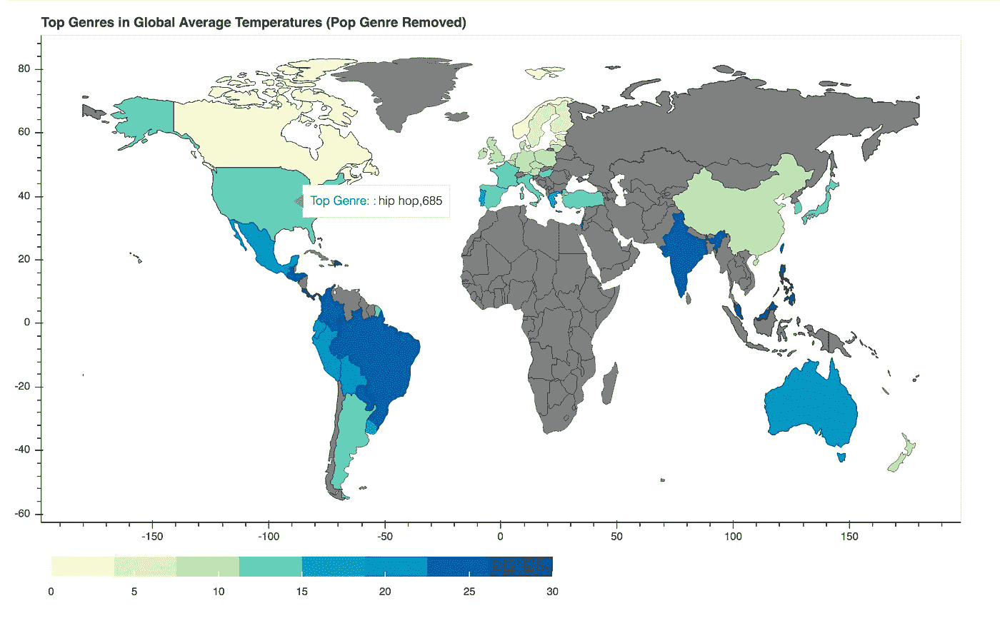

# 温度如何影响音乐偏好

> 原文：<https://towardsdatascience.com/analyzing-temperature-and-music-preference-with-spotify-data-eabf68762f97?source=collection_archive---------38----------------------->

## 用 Spotify 数据分析一个国家的气温如何影响听众偏好。

sgcdesignco 在 [Unsplash](https://unsplash.com?utm_source=medium&utm_medium=referral) 上拍摄的照片

> 本报告是哥本哈根 DIS 大数据计算分析课程的最终项目成果。小组成员是迈克尔·达茨、姬满·金和我自己。
> 
> 如果你想自己探索这些数据，请点击这里查看 GitHub:【https://github.com/brp616/Spotify-Temperature-Project/】T4。

# 介绍

来自斯堪的纳维亚的金属——来自拉丁美洲的舞曲——来自美国的嘻哈。这些只是我们在音乐流派和它们的发源地之间建立的一些联系。作为狂热的音乐爱好者，我们想探究这些流行观念是否在数据中得到证实。更深入地研究，我们想知道当地温度是否会在人们的听力偏好中发挥重要作用。毕竟，只有在寒冷的冬天躲在家里的丹麦人会喜欢一些焦虑的摇滚或平静的民谣，而在炎热的沙滩上跳舞的人会想听流行音乐或电子音乐，这才有意义。

为了说明这一点，我们决定使用不同国家顶级音乐流派的 Spotify 数据来构建一个交互式地图，并提供按温度显示全球听众趋势的视觉效果。在我们开始精彩内容之前，我们将向您展示我们是如何实现的，以便您更好地了解我们是如何获得我们的结果、我们的发现的潜在缺陷以及基础数据科学项目是如何执行的！

# 先决条件和定义

数据科学新手？这里有一些我们将会抛出的名称和术语，在继续之前你应该知道。

Python: 非常流行的数据科学编程语言，我们用它来获取和分析我们的数据。

NumPy，Pandas: 这些和其他你可能不认识的名字是我们引入 Python 的不同的库，它们允许我们轻松地执行强大的任务，而不必从头开始构建我们所有的系统。

**数据抓取:**将信息从网站导入保存在您电脑上的本地文件的过程。我们不得不在这个项目中收集一些数据，因为这些数据在现成的数据集中是不可用的。

**API:** 应用程序编程接口，基本上是数据科学家在请求数据时用于与网站或应用程序通信的语言。在我们的例子中，我们使用 Spotify 的特定 API 来获取各种歌曲的流派信息。

如果还有什么让你困惑，就在 Medium 上看看这里，或者谷歌一下你的答案！数据科学有很多很好的资源，我，写这篇文章的人，能够很快自学基础知识，你也可以。

# 数据收集和清理

数据清理，2020(彩色)

我们在这个项目中使用了 3 个主要的数据源，我将逐一解释。它们是:

温度数据

来自 Kaggle 的 Spotify 数据集

从 Spotify 抓取的流派数据

## 温度数据:

 [## 气候变化:地球表面温度数据

### 探索 1750 年以来的全球气温

www.kaggle.com](https://www.kaggle.com/berkeleyearth/climate-change-earth-surface-temperature-data/data#GlobalLandTemperaturesByCountry.csv) 

为了在我们的分析中获得国家的温度，我们使用了 Kaggle 的气候变化数据集，这基本上是伯克利地球表面温度研究数据的重新包装版本，该研究汇编了来自 16 个档案的超过 100 万个数据点。在我们的分析中，我们从 2013 年(该组中最后一个完整年份)的一系列日子中获取数据点，并对它们进行平均，以获得一个国家的温度指数。这种方法的一个潜在缺点是，通过将每个国家的热门歌曲与全国平均气温进行匹配，我们忽略了音乐偏好的区域差异，这些差异可能与美国等大国的气温相一致。

## Spotify 数据集:

 [## Spotify 的全球每日歌曲排名

### 53 个国家/地区每日播放量最高的 200 首歌曲

www.kaggle.com](https://www.kaggle.com/edumucelli/spotifys-worldwide-daily-song-ranking) 

虽然 Spotify 听众数据的数据集都不完美，但这是最好的。Spotify 不发布任何关于地理听众的直接信息，即使在他们的 API 中也是如此，所以我们使用了退而求其次的东西——53 个国家的全球歌曲流行度排名。该数据集包含曲目名称、艺术家、Spotify 参考编号、图表日期和图表的国家代码。这是一个非常大的数据集，被证明是难以处理的，特别是在检索和匹配流派与曲目时(见 scraped data 部分)。时间根本不允许我们和整套设备一起工作。因此，我们通过创建一个新的数据框架，从每隔一个月的第一天开始创建排行榜，来对这一年进行快照。这个数据帧是我们分析的基础，因为正是从这里，我们将国家代码与温度数据进行匹配，并检索曲目信息，如流派和节奏。

## 抓取的数据:

这部分需要一些独创性。虽然我们的 Kaggle 数据给了我们关于曲目名称和艺术家的信息，但它并没有告诉我们关于音乐本身的更多信息。为此，我们必须找到源头——Spotify API。在 SpotiPy 库的帮助下，我们能够轻松地获取我们需要的东西，但有一些(大的)警告。虽然 Spotify 确实保存了流派数据，但它将流派分配给艺术家，而不是歌曲，所以我们必须使用 Spotify 来获取音轨的标记，从标记中获取艺术家，然后检索与该艺术家相关联的所有流派，然后将这些流派与歌曲配对。Spotify 的 API 也不喜欢你使用太多他们的带宽，所以他们在一个小时后切断你与他们服务器的连接，并让你再次请求访问。而且，每天过后，你都需要一个全新的请求。是的，这花了一天多的时间来运行，即使数据集有限。经过多次反复试验，我们通过将抓取过程分成几个步骤，并对触发周期性新 API 访问请求的已分析磁道数进行计数，解决了这个问题。这使我们能够获取每首歌曲的流派信息和音乐指标(速度、舞蹈性和声学)。请看下面，了解我们如何发出初始 API 请求以获取跟踪标记的过程，我们使用略有不同的请求重复该过程以获取我们需要的所有数据:

# 数据存储和操作

将音乐信息与国家和温度相匹配:

虽然我们最初试验了一个保存每首歌的流派和音频特征的单词矩阵包，但处理这种数据格式所需的内存几乎不可能，因为加载数据文件要么需要一天时间，要么会使我的编码笔记本崩溃。

相反，我们使用了 Python 内置的两种更简单的格式，列表和字典。为了对流派做到这一点，我们构建了一个字典，将数据集中每个唯一的曲目作为键，将流派列表作为值。然后，我们遍历原始数据框中的每首曲目，并添加了一个包含每首曲目流派的列。从这里，我们检查了数据框中的每个国家代码，并统计了每个流派出现的次数，以获得我们正在寻找的新词典-每个国家及其最受欢迎的流派，以及世界上最受欢迎的流派，以进行比较。在这本字典和另一本字典中，计数被转换为一个国家图表中所有歌曲的比例，我们只是用平均温度替换每个国家的名称，以构成我们热图和交互式地图的基础。

对于音频功能，我们使用了类似的程序，但在用国家名称代替温度之前，只是简单地对每个国家的速度、舞蹈性和声音进行了平均。

这个要点显示了我们是如何为每个国家建立流派计数的字典的。

## 构建交互式地图:

交互式地图显示了全球特定国家的平均气温，并将其与每个特定国家的最高气温进行比较。为了创建这张地图，我们从 Kaggle 收集了温度数据，并将其与 Geopandas(我们用来生成这张地图的库)可以读取的国家形状文件一起使用。

在清理数据以仅包含最近的温度数据之后，我们必须将温度数据与 shapefile 合并，以便它可以由 Geopandas 输出。合并这两个文件给了我们一个全球平均气温的地图，这只是我们想要看的一半。

然后，我们使用从 Spotify 收集的流派数据——一个几千兆字节大小的数据集，并对其进行解析，以获得每个国家的热门流派。还应该提到的是，地图上的许多国家都没有 Spotify 数据，所以我们不得不将这些数据排除在分析之外。我们使用 Spotify 数据重复了合并过程，并将其输入到 Geopandas 中，使用 Bokeh Python 库为我们提供了输出结果——这是一个交互式地图，显示了世界各地与天气数据相比的顶级流派。然而，在查看数据后，我们意识到，由于 Spotify 的流派分类系统，几乎每个国家的顶级流派都是“流行”，所以我们从数据集中剔除了这一点，并根据其余流派生成了我们的结果。结果就是你现在看到的这张交互式地图，上面有来自世界不同气候和地区的数据。

# 结果

## A.交互式地图

我们的互动地图截图。显示美国的顶级流派。

看一看重新构建地图的代码，并使用交互式元素。正如你所看到的——从 Spotify 的类型数据来看，我们没有太多的相关性可以区分。流行音乐似乎在全世界都很流行，而地区偏好与温度几乎没有关联。

## B.流派流行热图

此图显示了在各种不同气候下，与全球前 20 大最受欢迎的流派相关的最受欢迎的歌曲所占的份额，以及按国家组织的最受欢迎的流派，以供比较。暖色表示歌曲比例较高，因此受欢迎程度较高，而冷色表示歌曲较少。虽然很有趣，但这张图显示温度和流派偏好之间没有什么强有力的关系。在非常高的温度范围内，像 EDM、latin 和 reggaeton 这样的舞曲风格可能稍微更受欢迎，但是只有 dance-pop 显示出线性趋势，这可能表明明显的显著差异。这与大多数温暖国家的流行音乐比例略低(相对于其更高节奏的变体)相对应。事实上，流派和温度之间很少出现强线性联系。这将由线性垂直梯度表示。这表明，文化、语言和与艺术家的接近程度等其他因素可能决定流派偏好，而不仅仅是温度。

## C.节奏与舞蹈性分析

这些图表上的每一个点都代表了一个国家以及可舞性、听觉、语速或节奏的水平。摘自 Spotify API: Danceability 根据音乐元素的组合(包括速度、节奏稳定性、节拍强度和整体规律性)描述了一首曲目是否适合跳舞。值 0.0 最不适合跳舞，1.0 最适合跳舞。声音度是音轨是否是声音的置信度，从 0.0 到 1.0。1.0 表示音轨是声学的高置信度。语音检测音轨中是否存在语音单词。越是类似语音的录音(例如脱口秀、有声读物、诗歌)，属性值就越接近 1.0。高于 0.66 的值描述可能完全由口语单词组成的轨道。介于 0.33 和 0.66 之间的值描述可能包含音乐和语音的轨道，可以是分段的，也可以是分层的，包括说唱音乐。低于 0.33 的值很可能代表音乐和其他非语音类轨道。轨道的总体估计速度以每分钟节拍数(BPM)为单位。在音乐术语中，速度是给定作品的速度或节奏，直接来源于平均节拍持续时间。我们可以从温度数据与国家平均音频特征的比较分析中得出结论，平均国家温度和音频特征之间实际上没有相关性，因为它们都落在相同的值附近。一个很酷的实验是看看在不同的季节是否有轻微的偏差。

# 6.最后的想法

尽管我们在数据中看不到气候和收听习惯之间的任何关联，但这个项目仍然是寻找数据模式的一个很好的练习，因为它涉及到我们都喜欢的东西——音乐。

我们现在的情况表明，无论气候如何，流行音乐在全世界都很受欢迎，这并不是什么新鲜事。我们认为 Spotify 的数据是有缺陷的，因为它只给出了基于艺术家的流派标签，如果流派是基于歌曲给出的，我们的数据可能会有更多的差异，因为它会提供更深层次的分类。还有一种可能性是，Spotify 将更多的优先权和营销放在流行音乐之后，这可能会扭曲数据，使流行歌曲保持流行。

我们也可以把这个项目更进一步，根据季节比较听音乐的习惯，这样我们可以看到更正常的流派分布。总的来说，这个项目是一个新颖的想法，如果有一个更加平衡的数据集，可以提供一些有见地的结果。