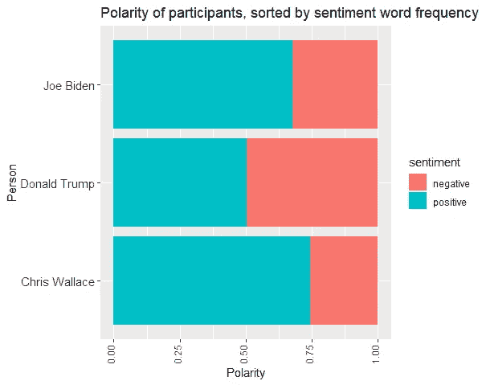

# 用文本挖掘技术分析 2020 年总统辩论

> 原文：<https://towardsdatascience.com/analyzing-the-chaotic-presidential-debate-2020-with-text-mining-techniques-238ed09d74c1?source=collection_archive---------30----------------------->

## 审视与数据科学的争论


查尔斯·德鲁维奥在 [Unsplash](https://unsplash.com?utm_source=medium&utm_medium=referral) 上拍摄的照片

多亏了互联网，现在全世界都知道了失去控制的 2020 年总统辩论。所有主要的新闻站都在报道参与者是如何相互打断和攻击的。

我决定整理一篇文章，重点分析事件中使用的词语，看看是否有什么隐藏的见解。

这篇文章的重点是找出每个发言人使用最多的词，并对发言进行情感分析。


作者图片:2020 年第一次总统辩论中使用最多的词——“人民”

## 第一次 2020 年总统辩论概述

**在** :
-现任总统唐纳德·川普
-前副总统乔·拜登(民主党提名人)之间

**主持人**:
——克里斯·华莱士

**涵盖的主题**:

1.  候选人的政治记录
2.  最高法院
3.  冠状病毒
4.  经济
5.  城市中的种族和暴力
6.  选举的公正性

## 清理数据集

在这次活动中，总共使用了近 20，000 个单词。在去掉名字和常用的停用词后，剩下大约 6000 个词用于分析。

```
#tokenize
text_df <-  text %>%
  unnest_tokens(word, Text)#Remove stop words
my_stop_words <- tibble(
  word = c("chris","wallace","trump","donald","joe","biden","vice","president"))#Prepare stop words tibble
all_stop_words <- stop_words %>%
  bind_rows(my_stop_words)textClean_df <- text_df %>%
  anti_join(all_stop_words, by = "word")
```


作者图片:分析中使用的 2020 年总统辩论的总字数

## 简而言之，第一次总统辩论

单词相关网络图说明了在辩论中单词是如何在同一个句子中使用的，或者是如何在相邻的句子中使用的。我将一些可能与辩论主题相关的单词进行了归类:

*   美国经济话题包括“负担得起”、“工作”、“行动”等词汇。
*   最高法院话题包括‘正义’、‘理性’、‘法官’等词汇。
*   种族和暴力城市主题包括“和平”和“抗议”等词
*   选举话题包括“选票”、“管理”、“邮件”等词汇。


作者图片:单词的共现

## 用相应的词性对辩论进行分类

我们还可以用词类(名词、专有名词、形容词、副词等)来标记每个参与者的单词。).本节将特别关注特朗普和拜登使用最多的专有名词、名词和形容词。

*   “中国”是特朗普使用最多的专有名词
*   特朗普和拜登在辩论中各使用了 60 多次“人民”
*   有趣的是，特朗普使用最多的形容词是乔·拜登的“错误”和“正确”

```
library(udpipe)
udmodel <- udpipe_download_model(language = "english")
udmodel <- udpipe_load_model(file = udmodel$file_model#annotate data frame
tidy_text <- udpipe_annotate(udmodel, x = text$Text,doc_id = text$ï..Spokeperson)
tidy_text <- as.data.frame(tidy_text)library(igraph)
library(ggraph)
library(ggplot2)

#how many times nouns and adjectives are used in the same sentence
cooc <- cooccurrence(x = subset(textClean_df, upos %in% c("NOUN", "ADJ")), 
                     term = "lemma", 
                     group = c("doc_id", "paragraph_id", "sentence_id"))wordnetwork <- head(cooc, 50)
head(wordnetwork)
wordnetwork <- graph_from_data_frame(wordnetwork)
ggraph(wordnetwork, layout = "fr") +
  #geom_edge_link(aes(width = cooc, edge_alpha = cooc), edge_colour = "#FF62BC") +
  geom_edge_link(aes(edge_alpha = cooc), edge_colour = color2) +
  geom_node_point(color = color1, size = 1) +
  geom_node_text(aes(label = name), col = color1, size = 5, repel = TRUE) +
  theme_graph(base_family = "Arial") +
  theme(legend.position = "none") +
  labs(title = "First Presidential Debate 2020: Cooccurrences within sentence", subtitle = "Nouns & Adjective")ggsave("C:/Users/fengyueh/Documents/data analysis/R/17 presidential debate/cooccurence N&A 50.png",
       width = 6, height = 6, dpi = 1500)
```


按作者分类的图像:词性条形图

```
library(lattice)tidy_textToUse <- textClean_df %>%
#filter(doc_id == "Donald Trump")
#filter(doc_id == "Chris Wallace")
#filter(doc_id == "Joe Biden")#stats <- subset(tidy_textToUse, upos %in% c("PROPN"))
#stats <- subset(tidy_textToUse, upos %in% c("NOUN"))
#stats <- subset(tidy_textToUse, upos %in% c("VERB"))
#stats <- subset(tidy_textToUse, upos %in% c("ADJ")) 
#stats <- subset(tidy_text, upos %in% c("ADV")) 
stats <- txt_freq(stats$token)
stats$key <- factor(stats$key, levels = rev(stats$key))
barchart(key ~ freq, data = head(stats, 20), col = color1, labels = stats$freq,
         main = "First Presidential Debate 2020: 
         Most occurring nouns - Joe Biden", xlab = "Freq")
```

## 辩论的极端性

情感分析的基本任务之一是理解给定文本的极性，无论文本中表达的观点是积极的、消极的还是中性的。

下面的第一个图显示了辩论活动中每个发言人的发言文本的极性。蓝色勾号表示使用了负面意见，红色勾号表示正面意见。有趣的是，特朗普的第 1500-2500 句之间有一个空白。

下面的第二个图显示了总统辩论发言人使用的负面、中性和正面词汇的数量。


作者图片:发言人分组的 2020 年第一次总统辩论的极性

总体而言，拜登和特朗普似乎表达了几乎等量的正面和负面意见。

## 总统辩论中每个参与者的积极性

下面的堆积条形图显示了每位发言人的总体极性，将他们的发言分为积极或消极两类。

根据图表，与特朗普相比，拜登在辩论中似乎使用了更多积极的词语。接下来，我们将看看发言人的原话，带有极性/积极色彩。



作者图片:发言人的极性

```
word_sentiment <- word_counts %>%
  inner_join(get_sentiments("nrc"))word_sentiment %>%
  count(ï..Spokeperson, sentiment, sort = TRUE)# Count by person & sentiment
words_person_count <- word_counts %>%
  inner_join(get_sentiments("nrc")) %>% 
  filter(grepl("positive|negative", sentiment)) %>% 
  count(ï..Spokeperson, sentiment)data_pos <- words_person_count %>%
  group_by(ï..Spokeperson) %>% 
  mutate(percent_positive = 100 * n / sum(n) )ggplot(data_pos, aes(x = reorder(ï..Spokeperson, n), y = n, fill = sentiment)) +
  # Add a col layer
  geom_col(position = "fill") +
  coord_flip() +
  theme(axis.text.x = element_text(angle = 90, vjust = 0.1)) +
  ggtitle("Polarity of participants, sorted by sentiment word frequency ") +
  xlab("Person") +
  ylab("Polarity") +
  My_Theme
```

## 每个发言人的正面词汇云

在单词云中，消极情绪的单词用蓝色表示，积极情绪的单词用红色表示。单词的大小取决于它们各自的频率。

特朗普用得最多的正面词是“赢了”，拜登用得起。两位参与者都经常使用“错误”这个词。“支持”这个词也出现在所有的单词云中。


作者图片:积极词汇云——唐纳德·特朗普和乔·拜登


作者图片:积极词汇云——克里斯·华莱士

接下来，我们来看看辩论中的一些情绪分析。

## 2020 年第一场总统辩论的情感分析

下面的条形图显示了与每种情绪相关的辩论中使用的字数。在辩论中，与“信任”这种积极情绪相关的词汇出现得最多，而与“厌恶”这种消极情绪相关的词汇出现得最少。

```
textClean_df %>%
#  filter(ï..Spokeperson == "Chris Wallace")  %>%
#  filter(ï..Spokeperson == "Donald Trump")  %>%
#  filter(ï..Spokeperson == "Joe Biden")  %>%
  inner_join(get_sentiments("bing")) %>%
  count(word, sentiment, sort = TRUE) %>%
  acast(word ~ sentiment, value.var = "n", fill = 0) %>%
  comparison.cloud(colors = c(color1, color2),title.size=1.0,
                   max.words = 50)
```


作者图片:2020 年第一次总统辩论的情感分析

```
text_nrc_sub %>%
  count(ï..Spokeperson, sentiment, ï..Spokeperson) %>%
  mutate(sentiment = reorder(sentiment, n), Spokeperson = reorder(ï..Spokeperson, n)) %>%
  ggplot(aes(sentiment, n, fill = sentiment)) +
  geom_col() +
  facet_wrap( ~ ï..Spokeperson, scales = "free_x", labeller = label_both) +
  theme(panel.grid.major.x = element_blank(),
        axis.text.x = element_blank()) +
  labs(x = NULL, y = NULL) +
  ggtitle("NRC Sentiment Analysis - First Presidential Debate 2020") +
  coord_flip()
```

接下来，我们将看看与每种情绪相关的确切词汇，由每位发言人进行分类:

华莱士最常用的词是“先生”，在辩论中出现了 40 多次。


作者图片:情感词频——克里斯·华莱士在 2020 年第一场总统辩论中

根据下面的图表，包括“投票”、“交易”和“税收”在内的词汇被拜登提到的频率很高。


作者图片:情感词频——2020 年第一次总统辩论中的乔·拜登

特朗普高度提到了一些词，包括“军事”、“法律”和“工作”。


作者图片:情感词频——唐纳德·特朗普 2020 年首次总统辩论

```
nrc_words %>%
  # Count by word and sentiment
#  filter(ï..Spokeperson == "Donald Trump") %>%
#  filter(ï..Spokeperson == "Joe Biden") %>%
#  filter(ï..Spokeperson == "Chris Wallace") %>%
  count(word, sentiment) %>%
  # Group by sentiment
  group_by(sentiment) %>%
  # Take the top 10 words for each sentiment
  top_n(10) %>%
  ungroup() %>%
  mutate(word = reorder(word, n)) %>%
  ggplot(aes(word, n, fill = sentiment)) +
  geom_col(show.legend = FALSE) +
  facet_wrap(~ sentiment, scales = "free") +
  coord_flip() +
  ggtitle("First Presidential Debate: Sentiment word frequency - Joe Biden") +
  My_Theme
```

## 结论

这场辩论在网上引起了不小的轰动，我觉得分析事件的发言会很有趣。在分析中，一个特别的词引起了我的注意——“人”这个词被两个参与者高度提及，似乎是他们唯一认同的话题。People 还延伸到其他词，如 job、affordable、court 等。，与讨论的主题相关。