# 法国和韩国冠状病毒疫情分析

> 原文：<https://towardsdatascience.com/analyzing-the-coronavirus-outbreak-in-france-and-south-korea-8f467ef385de?source=collection_archive---------56----------------------->


我们目前正在经历新型冠状病毒的负面影响。这种病毒迅速改变了我们的生活，并让我们许多人对即将发生的事情感到困惑和恐惧。

作为工程师和数据科学家，我们希望帮助理解海量的可用数据。我们认为，我们有责任分享我们的见解，以便集体找到解决办法，防止疾病进一步爆发。

本文的重点是分析这种疾病最初在法国和韩国的传播。我们的分析涵盖了截至 2020 年 3 月 12 日收集的所有数据。多亏了我们的数据科学家蜜琪拉·皮萨尼的工作，它才得以整合。

***编者按:*** [*走向数据科学*](http://towardsdatascience.com/) *是一份以数据科学和机器学习研究为主的中型刊物。我们不是健康专家或流行病学家，本文的观点不应被解释为专业建议。想了解更多关于疫情冠状病毒的信息，可以点击* [*这里*](https://www.who.int/emergencies/diseases/novel-coronavirus-2019/situation-reports) *。*

## 我们的数据来源

Kaggle 为数据科学家提供不同的数据集。它们可以用来练习和解决机器学习问题。

以下链接包含来自世界各国的最新数据集，提供了感染冠状病毒的患者的统计数据:

*   [https://www.kaggle.com/kimjihoo/coronavirusdataset](https://www.kaggle.com/kimjihoo/coronavirusdataset)
*   [https://www.kaggle.com/lperez/coronavirus-france-dataset](https://www.kaggle.com/lperez/coronavirus-france-dataset)
*   [https://www . ka ggle . com/imdevskp/corona-virus-report # covid _ 19 _ clean _ complete . CSV](https://www.kaggle.com/imdevskp/corona-virus-report#covid_19_clean_complete.csv)
*   [https://www.kaggle.com/sudalairajkumar/covid19-in-italy](https://www.kaggle.com/sudalairajkumar/covid19-in-italy)

更多信息资源可以在这里找到。

# 问题

此时此刻，科学界的问题远多于答案。提出问题很容易，但大多数答案都需要等待。

我们可以很容易地编造其中的一些，比如:

*   数据中是否有某种模式，第一次感染是如何发生的？有容易识别的集群吗？
*   阳性病例和死亡病例的比例是多少？
*   我们能预测未来的阳性病例吗？
*   病毒轨迹是怎样的？随着时间的推移，病毒是如何传播的？

如前所述，在本文中，我们将探讨该病毒最初是如何在法国和韩国传播的，并通过聚类分析对两者进行比较。

聚类分析的任务是对一组对象进行分组，使同一组(称为聚类)中的对象比其他组(聚类)中的对象更相似(在某种意义上)。

# 步骤 1 —我们的数据集

有两个数据集分别包含法国和韩国的类似信息。所以，我们的想法是合并这些数据集，看看我们是否能找到有意义的聚类。
我们可以在这里找到数据的链接:

*   法兰西🇫🇷:[https://www.kaggle.com/lperez/coronavirus-france-dataset](https://www.kaggle.com/lperez/coronavirus-france-dataset)
*   南韩🇰🇷:[https://www.kaggle.com/kimjihoo/coronavirusdataset](https://www.kaggle.com/kimjihoo/coronavirusdataset)

让我们首先对我们将在这里使用的库进行一些初始设置。

```
import pandas as pd
import numpy as np
import random
from sklearn import preprocessing
from sklearn.cluster import KMeans
import matplotlib.pyplot as plt
from kneed import KneeLocator
from matplotlib import cm
from mpl_toolkits.mplot3d import Axes3D
```

我推荐你看看这篇关于熊猫图书馆和数据清理的文章。

# 步骤 2 —检查数据质量

在深入挖掘之前，我们必须探索我们的数据集，看看它看起来像什么，以及我们希望如何开始我们的分析。

首先，我们将检查空值。我们将加载两个数据集，并查看找到多少空(NA)值。

***NA*** *值对应缺失或空信息。*

根据我们的发现，我们可能需要为每个特定的列做出一些决定，以便为分析准备数据。

```
def load_data(data_path):
    df = pd.read_csv(data_path + '/patient.csv')
    df['released_date'] = pd.to_datetime(df['released_date'])
    df['confirmed_date'] = pd.to_datetime(df['confirmed_date'])
    df['month'] = df['confirmed_date'].dt.month
    df['day'] = df['confirmed_date'].dt.day
    return dfdf_france = load_data('coronavirusdataset_france')
df_france.isnull().sum()
```

我们会得到:

```
id                  2067
sex                 1851
birth_year          1936
country                1
region                 1
department          195
city                1804
group               1905
infection_reason    1906
infection_order     2068
infected_by         2056
contact_number      2073
confirmed_date         4
released_date       2064
deceased_date       2048
status              1481
health              1849
source               199
comments            1637
month                  4
day                    4
dtype: int64
```

接下来，我们将检查韩国。

```
df_south_korea = load_data('coronavirusdataset_south_korea')
df_south_korea.isnull().sum()
```

我们发现以下数据

```
patient_id             0
sex                 7190
birth_year          7203
country                0
region              7432
disease             7841
group               7783
infection_reason    7715
infection_order     7833
infected_by         7799
contact_number      7816
confirmed_date         0
released_date       7813
deceased_date       7833
state                  0
month                  0
day                    0
dtype: int64
```

# 步骤 3-解决缺失值

为了只保留必要的数据，应该删除一些列，比如 department、comments 和 health，因为它们对于这个特定的分析并不重要。

我们将填充出生年份的缺失值。这个过程被称为数据插补。

通过使用出生日期，我们可以创建年龄变量，将其减去实际日期。缺失的信息将用从分布中抽取的随机数来填充。考虑到每个国家的人口统计数据，可以填写与人口年龄分布相关的信息:

*   法兰西🇫🇷: [人口统计](https://www.indexmundi.com/south_korea/demographics_profile.html)
*   南韩🇰🇷: [人口统计](https://www.indexmundi.com/south_korea/demographics_profile.html)

创建“simulate_age”函数是为了根据可用数据模拟人口年龄。在这种情况下，有了每个年龄的范围和占总人口的百分比，我们可以使用均匀分布来模拟每个范围的年龄分布。

```
df_france.drop(['departement','region','comments', 'id', 'infected_by','health','city','source'],axis=1,inplace=True)df_south_korea.drop(['region','disease','patient_id','infected_by'], axis=1, inplace=True)def simulate_age(ranges, percents, total_pop):
    simulated_pop = np.array(0)
    for (low, high), percent in zip(ranges, percents):
        simulated_pop = np.append(simulated_pop, 
                  np.random.randint(low=low, high=high, size=int(total_pop*percent/100)))
return simulated_pop*#France*
france_population = 67364357
'''
0-14 years: 18.48% 
15-24 years: 11.8% 
25-54 years: 37.48% 
55-64 years: 12.42%
65 years and over: 19.82%
'''
ranges = [(0,14),(15,24),(25,54),(55,64),(65,90)]
percents = [18.48,11.8,37.48,12.42,19.82]
france_simulated_pop = simulate_age(ranges, percents, france_population) f, (ax1, ax2) = plt.subplots(1, 2, figsize=(15,5))
ax1.hist(france_simulated_pop,bins=20, color='mediumaquamarine', edgecolor='k', alpha=0.5)ax1.set_title('France - Simulated age distribution')#South Korea
south_korea_population = 51418097
'''
0-14 years: 13.03% 
15-24 years: 12.19%
25-54 years: 45.13%
55-64 years: 15.09% 
65 years and over: 14.55% 
'''
percents = [13.03,12.19,45.13,15.09,14.55]
south_korea_simulated_pop = simulate_age(ranges, percents, south_korea_population)
ax2.hist(south_korea_simulated_pop,bins=20, color='mediumaquamarine', edgecolor='k', alpha=0.5)
ax2.set_title('South Korea - Simulated age distribution')plt.show()
```

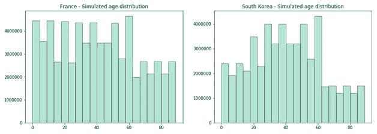

现在，我们可以在数据框中创建一个年龄列，并用从我们刚刚模拟的分布中选择的随机值填充缺失值。

```
import math
actual_year = pd.to_datetime('today').yeardef calculate_age(x):
    if math.isnan(x):
        return x
    else:return int(actual_year - x)#France
df_france['age'] = df_france['birth_year'].apply(calculate_age)
df_france.fillna({'age':int(random.choice(france_simulated_pop))}, inplace=True)
df_france.drop(['birth_year'], axis=1, inplace=True)#South Korea
df_south_korea['age'] = df_south_korea['birth_year'].apply(calculate_age)
df_south_korea.fillna({'age':int(random.choice(south_korea_simulated_pop))}, inplace=True)
df_south_korea.drop(['birth_year'], axis=1, inplace=True)
```

对于缺失的性别值，我们可以根据每个人群的性别比例，用一个概率值来画一个随机数。

```
'''
Considering m as men and w as women. 
m/w=ratio -> m=ration*w
m+w=total_pop
'''
def calculate_values(ratio, total_pop):
    w = (france_population/(1+ratio))/total_pop
    m = 1 - w
    return (w,m)# 0 (woman) and 1 (man) with the calculated probabilities
# France
# total population: 0.96 male(s)/female (2018 est.)w,m = calculate_values(0.96, france_population)
df_france['sex'] = df_france['sex'].str.lower()
df_france["sex"].replace({"male\xa0?": "male"}, inplace=True)
df_france.fillna({'sex': np.random.choice(['female','male'],p=[w,m])}, inplace=True)# South Korea
# total population: 1 male(s)/female (2018 est.)w,m = calculate_values(1, south_korea_population)
df_south_korea['sex'] = df_south_korea['sex'].str.lower()
df_south_korea["sex"].replace({"male\xa0?": "male"}, inplace=True)
df_south_korea.fillna({'sex': np.random.choice(['female','male'],p=[w,m])}, inplace=True)# France
# total population: 0.96 male(s)/female (2018 est.)w,m = calculate_values(0.96, france_population)
df_france['sex'] = df_france['sex'].str.lower()
df_france["sex"].replace({"male\xa0?": "male"}, inplace=True)
df_france.fillna({'sex': np.random.choice(['female','male'],p=[w,m])}, inplace=True)# South Korea
# total population: 1 male(s)/female (2018 est.)w,m = calculate_values(1, south_korea_population)
df_south_korea['sex'] = df_south_korea['sex'].str.lower()
df_south_korea['sex'].replace({"male\xa0?": "male"}, inplace=True)
df_south_korea.fillna({'sex': np.random.choice(['female','male'],p=[w,m])}, inplace=True)
```

由于法国数据集的 status 列和韩国数据集的 state 列具有相同的含义，我们可以重命名其中一个数据集的列，并将值更新为相同的类别。

```
df_france.rename({'status':'state'}, axis=1, inplace=True)
df_france['state'] = df_france['state'].apply(lambda x: 'isolated' if (x=='hospital' or x=='home isolation') else x)
```

此外:

*   国家变量的空值将分别用法国或韩国填充。
*   将为感染原因、组、状态变量创建一个新类别“未知”
*   为 infection_order 添加了一个新类别，代码为 0
*   联系号码的空值将用 0 填充

```
df_france.fillna({'country':'France','infection_reason':'Unknown','group':'Unknown', 'state':'Unknown','infection_order':0, 'contact_number':0} , inplace=True)df_south_korea.fillna({'infection_reason':'Unknown','group':'Unknown', 'infection_order':0, 'contact_number':0, 'state':'Unknown'} , inplace=True)
```

现在，让我们检查一下是否还有需要解决的缺失值。

```
df_france.isnull().sum()sex                    0
country                0
group                  0
infection_reason       0
infection_order        0
contact_number         0
confirmed_date         4
released_date       2064
deceased_date       2048
state                  0
month                  4
day                    4
age                    0
dtype: int64 df_south_korea.isnull().sum()sex                    0
country                0
group                  0
infection_reason       0
infection_order        0
contact_number         0
confirmed_date         0
released_date       7813
deceased_date       7833
state                  0
month                  0
day                    0
age                    0
dtype: int64
```

干得好！我们剩下的不多了。现在我们需要解析 released_date 和 dead _ date 空值。

*   如果 released_date 为空，则意味着此人仍携带病毒。
*   如果 dead _ date 为空，则表示此人没有死亡。

我们可以计算感染持续时间(以天为单位)并去除其他 3 个变量。此外，我们希望将 death _ date 转换为一个二进制列，指示该人是否已经死亡。

```
df_france['released_date'] = df_france[['released_date','deceased_date']].fillna(df_france['deceased_date'])
df_france['released_date'] = df_france[['released_date']].fillna(pd.to_datetime('today'))
df_france['infection_duration'] = pd.to_datetime(df_france['released_date']).sub(df_france['confirmed_date'], axis=0)df_france = df_france[df_france['infection_duration'].dt.days>=0]
df_france['infection_duration'] = df_france['infection_duration'].dt.days
df_france.drop(['released_date','confirmed_date','deceased_date'], axis=1, inplace=True)
df_south_korea['released_date'] = df_south_korea[['released_date','deceased_date']].fillna(df_south_korea['deceased_date'])
df_south_korea['released_date'] = df_south_korea[['released_date']].fillna(pd.to_datetime('today'))df_south_korea['infection_duration'] = pd.to_datetime(df_south_korea['released_date']).sub(df_south_korea['confirmed_date'], axis=0)
df_south_korea = df_south_korea[df_south_korea['infection_duration'].dt.days>=0]df_south_korea['infection_duration'] = df_south_korea['infection_duration'].dt.daysdf_france.columns
Index(['sex', 'country', 'group', 'infection_reason',
'infection_order','contact_number', 'state', 'month', 
'day', 'age', 'infection_duration'], dtype='object')df_south_korea.columns
Index(['sex', 'country', 'group', 'infection_reason',
'infection_order', 'contact_number', 'state', 'month', 
'day', 'age', 'infection_duration'], dtype='object')
```

# 步骤 4 —数据融合

最后，我们准备将两个数据集放在一起，开始我们的分析。

最后，我们准备将两个数据集放在一起，开始我们的分析。

```
df = df_france.append(df_south_korea, sort=False)
df.isnull().sum()sex                   0
country               0
group                 0
infection_reason      0
infection_order       0
contact_number        0
state                 0
month                 0
day                   0
age                   0
infection_duration    0
dtype: int64
```

# 虚拟编码

模型的输入必须是数值。因此，我们必须将分类变量转换成数字。由于类别没有顺序，我们将把每个类别值转换成一个二进制列(0 或 1 值)。这种技术被称为虚拟编码。

```
df = pd.concat([df, pd.get_dummies(df['sex'])], axis=1)
df = pd.concat([df, pd.get_dummies(df['country'])], axis=1)
df = pd.concat([df, pd.get_dummies(df['state'], drop_first=True)], axis=1)
df = pd.concat([df, pd.get_dummies(df['infection_reason'], drop_first=True)], axis=1)
df = pd.concat([df, pd.get_dummies(df['group'], drop_first=True)], axis=1)
```

# 降维

当我们应用哑编码时，我们最终会有更多的变量，因为每个类别都被转换成一个列。

因为我们有太多的变量，所以很难在聚类中找到模式。首先，我们可以通过分组相似的类别来减少分类变量的数量。第二，我们可以应用降维技术来减少输入变量的数量，使模型更容易解释。

```
df = df_france.append(df_south_korea, sort=False)
```

Transform infection_reason:我们将列出这个变量所有可能的值，并对它们进行分组。之后，我们会将类似的原因分组，并将其转换为虚拟变量。最后，我们将删除原来的列。

```
df.infection_reason.unique()array(['visit to Italy', 'contact with patient', 'visit to Mulhouse religious gathering', 'Unknown', 'contact with person who visited Italy', 'visit to Egypt', 'unknown', 'Visit to Venice, Italy', 'contact with patient in Auray', 'visit to Mulhouse', 'visit to Milan', 'Italian', 'visit to Lombardy', 'parishioner', 'Creil military base\xa0?', 'visit to Senegal', 'visit to Alsace', 'visit in Lombardy', 'visit to Bretagne', 'Visit in Italy', 'In contact with someone contamitaminated in Oise', 'Religious Meeting in Mulhouse', 'work in a medical environment ', 'Visit family in Oise', 'health professional', 'visit to Wuhan', 'contact with patient in Japan', 'residence in Wuhan', 'visit to Thailand', 'contact with patient in Singapore', 'visit to China', 'visit to Daegu', 'pilgrimage to Israel', 'contact with patient in Daegu', 'visit to Vietnam', 'visit to Japan', 'visit to ooo'], dtype=object)def transform_reason(value):
    if ('religious' in value or 'parishioner' in value):
        return 'religious'
    elif ('visit' in value or 'residence' in value):
        return 'visit'
    elif ('contact' in value):
        return 'contact'
    elif ('medical' in value or 'health professional' in value):
        return 'medical'
    elif ('militar' in value):
        return 'militar'
    elif ('italian' in value):
        return 'italian'
    elif ('pilgrimage' in value):
        return 'pilgrimage'
    else:
        return 'unknown'df['infection_reason'] = df['infection_reason'].str.lower()
df['infection_reason'] = df['infection_reason'].apply(transform_reason)  
df = pd.concat([df, pd.get_dummies(df['infection_reason'], prefix='infection_reason', prefix_sep='_')], axis=1)
df.drop(['infection_reason_unknown'], axis=1, inplace=True)
```

此外,“group”变量提供了与 infection_reson 类似的信息。我们可以很容易地移除它。

```
df.drop(['group'], axis=1, inplace=True)
```

现在，我们可以将其他分类变量转换成虚拟变量:国家、州和性别。

```
df = pd.concat([df, pd.get_dummies(df['country'])], axis=1)
df = pd.concat([df, pd.get_dummies(df['state'], prefix='state', prefix_sep='_')], axis=1)
df = pd.concat([df, pd.get_dummies(df['sex'])], axis=1)
```

# 主成分分析

现在，我们将为一项非常强大的技术准备数据:主成分分析(PCA)。

这种技术找到解释数据的原始变量的线性组合。主要目标是通过寻找新的变量“组件”来减少变量的数量。它基于正交向量，这使得这些分量不相关。

我们需要定义哪些变量是输入，并删除我们从中创建虚拟变量的变量(它们是多余的)。

此外，有必要将我们的数据标准化，为此我们使用 StandardScaler。标准化数据意味着将所有变量放在同一尺度上，以避免累积的数值误差。只有这样，我们才能比较数据点之间的距离。

```
features = df.drop(['country','state','sex','infection_reason'], axis=1)
from sklearn.preprocessing import StandardScaler
from sklearn.decomposition import PCA
x = StandardScaler().fit_transform(features.values)
pca = PCA(random_state=20)
pca.fit(x) PCA(copy=True, iterated_power='auto', n_components=None, random_state=20, svd_solver='auto', tol=0.0, whiten=False)
```

为了确定组件的数量，我们需要查看每个组件的解释方差。
以解释最大方差的方式计算组件。例如，我们将添加组件，直到达到解释的方差的定义阈值。典型地，阈值在 0.7 和 0.9 之间。这意味着它解释了 70%到 90%的差异。

在这种情况下，我们将选择 0.8 作为阈值。

```
# determine number of components with threshold=0.8n_components=np.where(np.cumsum(pca.explained_variance_ratio_)>0.8)[0][0]+1# explained variance
v = round(np.cumsum(pca.explained_variance_ratio_)[n_components-1]*100,1)
print(f'It is needed {n_components} components to explain {v}% variance of the data')
```

我们需要 12 个分量来解释数据的 83.1%的方差

现在我们有了一些组件，我们可以计算这些新变量的值。

```
pca = PCA(n_components=n_components, random_state=20)
pcs = pca.fit(x)
components_name = list(range(0, n_components))
components_name = list(map(lambda x: 'PC' + str(x), components_name))
pd.DataFrame(data=pcs.components_, columns = features.columns, index=components_name)
```


我们可以用一个矩阵来显示每个变量对每个组成部分的重要性。

```
components_range = np.arange(1, n_components+1, 1)
components_names = list(map(lambda x: 'PC' + str(x), components_range))
plt.matshow(pcs.components_,cmap='viridis')
plt.yticks(range(0,n_components), components_names,fontsize=10)
plt.colorbar()
plt.xticks(range(0,len(features.columns)),features.columns,rotation=90,ha='left')plt.show()
```


变量的值越高，意味着主成分的影响越大。较低的值意味着对主成分的负面影响。
因此，根据热图，主成分分析的一种可能解释是:

*   PC1:男性不是孤立的，也不是朝鲜人
*   PC2:第一个月
*   PC3:国家释放
*   PC4:状态死者
*   PC5:感染原因宗教
*   PC6:感染原因访问
*   PC7:感染原因意大利语
*   PC8:感染原因军事
*   PC9:感染原因医疗
*   PC10:感染原因朝圣
*   PC11:高感染顺序
*   PC12:来自蒙古国

# 步骤 5 — K 均值聚类

K-means 试图将数据分成 k 个组，其中一个组的元素彼此接近。该方法基于数据点之间的距离。
因此，目标是最小化点到质心的距离。质心是每个簇/组的“中间”点。

该算法从随机选择的质心开始，在每次迭代中，它重新计算质心的位置。

为了确定 k，即组的数量，我们使用了一个图来显示数据相对于分类数量的失真。这种方法被称为肘测试。失真被定义为到聚类中心的平均距离。扭曲开始以线性方式减少的点是肘部，这表示最佳的群集数量。这意味着添加另一个集群不会改变太多的失真。

让我们根据主成分得分创建一个数据框架，并将其用于聚类分析。

```
pca_df = pd.DataFrame(data = pca.fit_transform(x), columns = components_names)
pca_df.head()
```

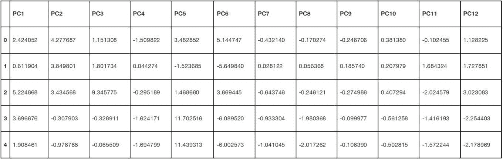

使用弯头测试来确定最佳聚类数。

```
def elbow_test(df, n_init, max_clusters, max_iter):
    distortions = []
    for i in range(1, max_clusters):
        km = KMeans(
            n_clusters=i, init='random',
            n_init=n_init, max_iter=max_iter,
            tol=1e-04, random_state=20
        )
        km.fit(df)
        distortions.append(km.inertia_)
plt.plot(range(1, max_clusters), distortions, marker='o')
    plt.xlabel('Number of clusters')
    plt.ylabel('Distortion')
    plt.show()kn = KneeLocator(
        range(1, max_clusters),
        distortions,
        curve='convex',
        direction='decreasing',
        interp_method='interp1d',
    )
    return kn.kneen_clusters = elbow_test(pca_df, 10, 20, 300)
print(f'the optimal number of clusters is {n_clusters}')
```

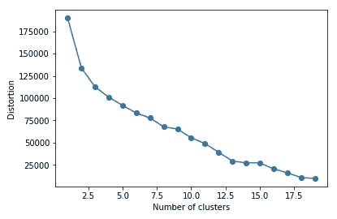

根据我们的分析，最佳的聚类数是 4

我们将知道用四个集群运行 K-means 算法，看看我们会发现什么！

```
km = KMeans(n_clusters=n_clusters, random_state=20)
y = km.fit_predict(pca_df)
idx = np.argsort(km.cluster_centers_.sum(axis=1))
lut = np.zeros_like(idx)
lut[idx] = np.arange(n_clusters)
pca_df['cluster'] = lut[km.labels_]
df['cluster'] = lut[km.labels_]
```

我们可以用下面的代码保存/加载我们的模型:

```
import pickle   
pickle.dump(km, open('kmeans_model.sav', 'wb'))# Load
km = pickle.load(open('kmeans_model.sav', 'rb'))pca_df[pca_df['cluster']==3]
```

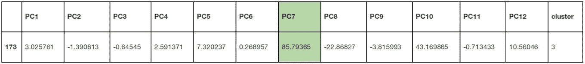

我们可以看到 PC7 值很高。它对应于感染原因“意大利语”。我们可以通过查看实际数据来证实这一点:

```
df[df['cluster']==3]
```

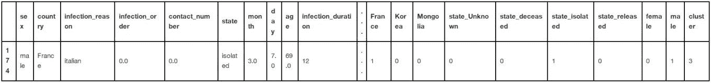

以下函数将绘制我们的数据。

第一个是散点图，用于比较两个主成分，并查看它们之间的聚类分布情况。第二个创建了一个 3d 图来比较由聚类着色的三个主成分。

这些图表将帮助我们确定聚类的含义。

```
def draw_scatter(df, col_1, col_2, cluster_column, num_clusters, title):
    fig = plt.figure(figsize=(10,10))
    ax = fig.add_subplot(111)
    ax.set_title(title)
    ax.set_xlabel(col_1)
    ax.set_ylabel(col_2)
    labels = list(range(0,num_clusters))
    colors = plt.cm.Spectral(np.linspace(0, 1, num_clusters))
    axs = []
    for i in labels:
        axs.append(ax.scatter(df[df[cluster_column]==i][col_1], df[df[cluster_column]==i][col_2], cmap=colors[I]))ax.legend(axs, labels, loc='center', bbox_to_anchor=(0.92, 0.84), ncol=1)
    plt.show()def create_3d_scatter(df, col_1, col_2, col_3, cluster_column, num_clusters, title):
    fig = plt.figure()
    ax = fig.add_subplot(111, projection='3d')
    ax.set_title(title)
    ax.set_xlabel(col_1)
    ax.set_ylabel(col_2)
    ax.set_zlabel(col_3, rotation=90)
    labels = list(range(0,num_clusters))
    colors = plt.cm.Spectral(np.linspace(0, 1, num_clusters))
    axs = []
    for i in labels:
        d = df[df[cluster_column]==i]
        axs.append(ax.scatter(d[col_1], d[col_2], d[col_3], cmap=colors[i]))
    ax.legend(axs, labels, bbox_to_anchor=(0.2, 0.5), ncol=1)
    ax.set_xticklabels([])
    ax.set_yticklabels([])
    ax.set_zticklabels([])
    plt.show()create_3d_scatter(pca_df, 'PC1', 'PC2', 'PC3', 'cluster', n_clusters, '')
```

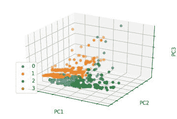

我们可以看到，一些集群是根据前两个主成分分布的。此外，PC3 似乎对团簇的分离没有太大的影响。

在此表中，我们可以看到每个组件的值如何影响分类的意义。

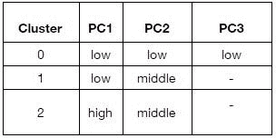

让我们画出 PC1 和 PC2 上的群集，以便更清楚地验证这一假设。

```
draw_scatter(pca_df, 'PC1', 'PC2', 'cluster', n_clusters, 'Clusters - PC1/PC2')
```

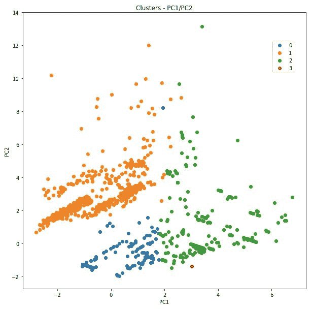

```
draw_scatter(pca_df, 'PC1', 'PC3', 'cluster', n_clusters, 'Clusters - PC1/PC3')
```

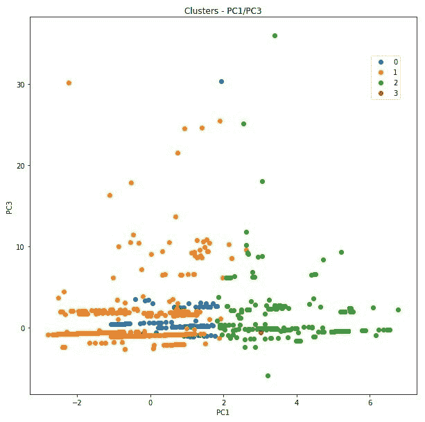

请记住，主要组件的含义定义如下:

*   PC1:不是孤立的，也不是韩国人
*   PC2:第一个月
*   PC3:国家释放

因此，从图表中我们可以得出结论:

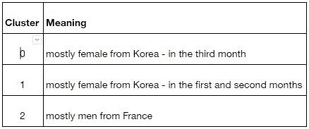

# 结论

聚类分析包括将对象放入独立的组(簇)，相似的对象放在同一个组中。物体之间的相似性是基于它们之间的距离，彼此靠近的物体有一些共同点。因此，接近的对象属于同一个集群。

在这种情况下，通过 K-means 发现的聚类显示，这些病例按照患者中的某些特征进行分组。这些特征集中在性别、感染原因、国家和月份等变量上。根据这些变量的值，数据点分布在聚类中。

聚类是具有相似特征的患者组。

我们发现的集群是:

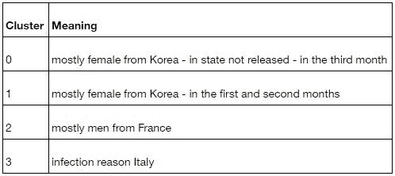

聚类 0 将 3 月份感染病毒的韩国女性患者分组。聚类 1 包含来自韩国但在其他月份感染病毒的另一组妇女。聚类 2 指的是来自法国的男性，聚类 3 将因为与来自意大利的人接触而感染病毒的患者分组。

做这样的分析让我们对疫情有了更清晰的认识。尽管冠状病毒很快就脱离了我们的控制，但我们相信，随着更多数据的可用，我们可以做好准备，以便能够在未来做出更好的应对。