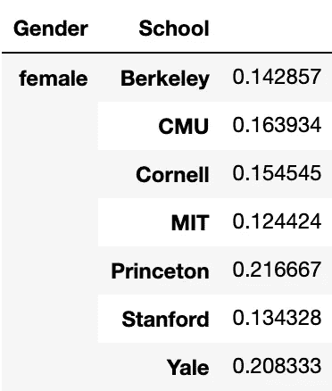
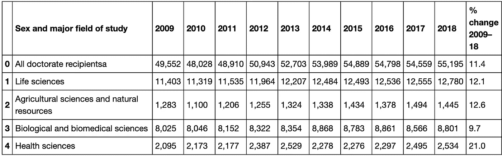
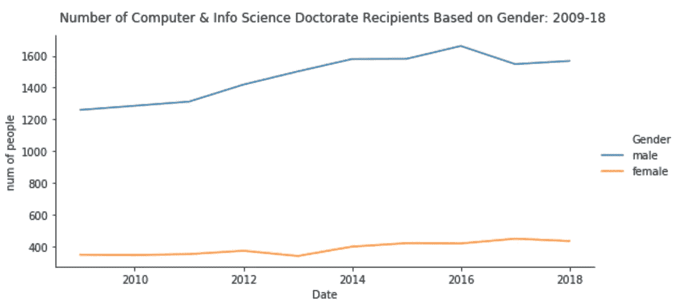
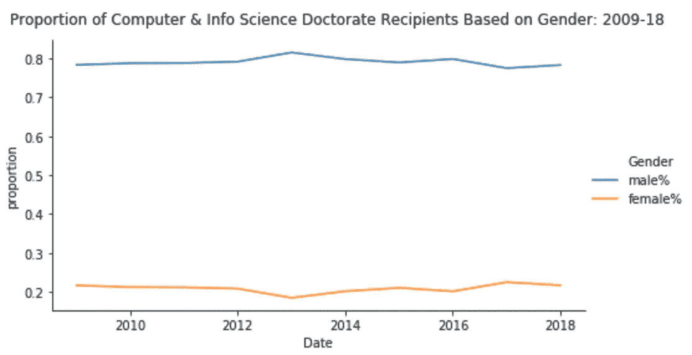
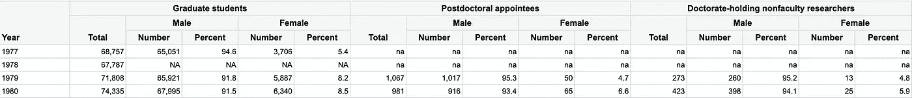
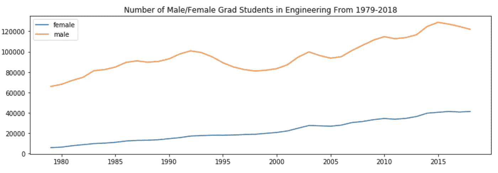
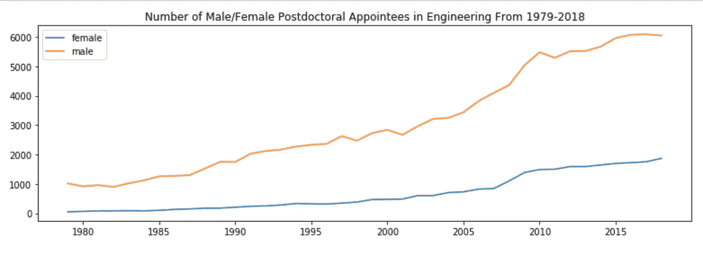
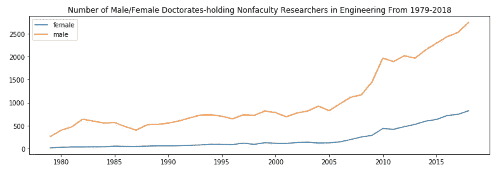
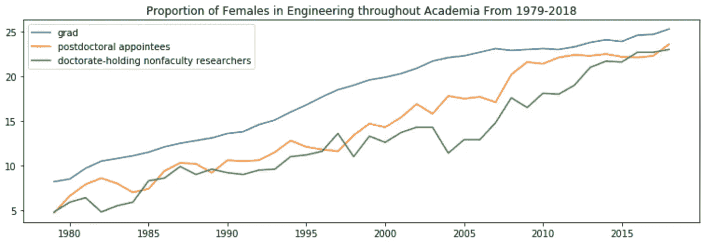
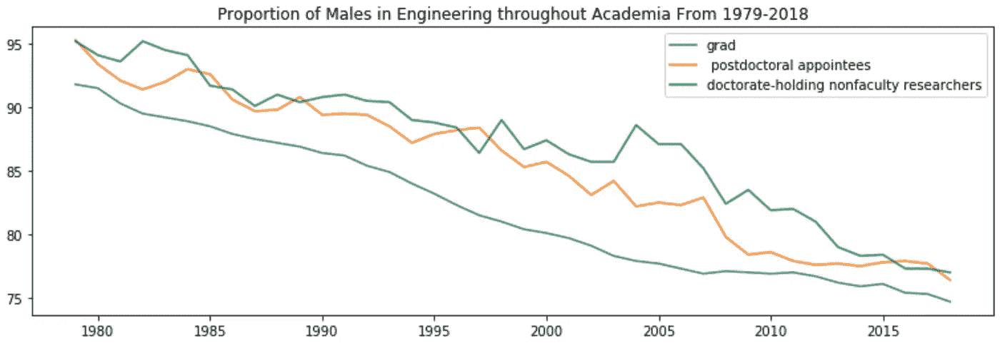

# 计算机科学/工程领域高等院校性别差异分析

> 原文：<https://towardsdatascience.com/analyzing-the-gender-disparity-among-higher-academia-in-computer-science-engineering-2d8cecefa76e?source=collection_archive---------47----------------------->

## 你不会疯狂地认为高等教育中男性明显更多——以下是数据

在学术和专业环境中，妇女在计算机科学/工程领域的代表性不足。这话我听过很多次了，但我一直在想，我们怎么才能做出这种说法。具体来说，有哪些数据支持这种说法，这些数据告诉我们这些领域代表性不足的情况是什么？在本文中，我将通过回答以下 3 个问题来探索和分析高等院校计算机科学/工程专业的性别差异:

*   **1。在美国，女性和男性在计算机科学教师职位上的比例相等吗？**
*   **2。随着时间的推移，在美国获得计算机&信息科学(CIS)教师职位的女性比例发生了怎样的变化？**
*   **3。随着时间的推移，美国学术界女性工程师的代表性发生了怎样的变化？**

> 这是伯克利大学的一个更大项目的一部分
> 
> 在 Ursatech Berkeley，我们通过在加州大学伯克利分校社区内提供无偿咨询服务以及将我们的专业知识借给大学附属团体来回馈我们的校园社区。
> 
> 我们客户的主要目标是发现和减少阻碍少数群体在计算机科学/工程领域追求成功的学术和职业生涯的障碍。为了帮助实现这一目标，UrsaTech 将开展一个数据分析项目，该项目涉及搜集网络信息，以合并和识别大学人口数据中的模式。这将有助于我们确定学生在本科生、研究生课程和/或教师职位中如何通过计算机科学/工程课程取得进步。我这个项目的重点是性别。

# 问题 1:在美国，女性和男性在计算机科学教师职位上的比例相等吗？

大学第一次遇到女计算机科学家。她是我暑期实验室研究的教授！在此之前，我从未真正遇到过女性工程师或计算机科学家。随着我继续接受教育，我开始注意到在我大学的计算机科学/工程系中女教授的人数很少。如果我学校的系是这个样子，美国其他 CS 系是什么样子？具体来说，在美国，女性计算机科学教员和男性计算机科学教员的代表性相比如何？

我从下面 7 个不同的 CS 大学系收集了样本。

## 数据源:

如果重复，我会争取更大的样本量。

*   麻省理工学院:https://www.eecs.mit.edu/people/faculty-advisors
*   斯坦福:[https://cs.stanford.edu/directory/faculty](https://cs.stanford.edu/directory/faculty)
*   cal:[https://www2 . eecs . Berkeley . edu/教员/列表/CS/教员. html](https://www2.eecs.berkeley.edu/Faculty/Lists/CS/faculty.html)
*   科内尔:【https://www.cs.cornell.edu/people/faculty】T4
*   卡耐基梅隆大学:[https://www.csd.cs.cmu.edu/directory/faculty](https://www.csd.cs.cmu.edu/directory/faculty)
*   普林斯顿:[https://www.cs.princeton.edu/people/faculty](https://www.cs.princeton.edu/people/faculty)
*   耶尔:https://cpsc.yale.edu/people/faculty

## Web 报废

我写了下面的函数来从麻省理工学院、斯坦福大学和加州大学收集数据。其他学校的数据被我的队友废弃了。

我将性别列初始化为全是男性，然后针对每个学校相应地将其更改为女性。可能会有一些偏差，因为我是根据大学提供的照片人工确定这个人是男是女的。

```
from requests import get
from bs4 import BeautifulSoup
import re
import pandas as pd
import urllib.request
import numpy as npdef lst_data(website: str, tag: str, attrs_key: str, attrs_txt: str):
 response = get(website)
 html = BeautifulSoup(response.text, ‘html.parser’)
 name_data = html.find_all(tag, attrs={attrs_key: re.compile(attrs_txt)})
 return name_data#names = [first name, last name]
def index_values(names, name_data):
 lst = []
 for name in names:
 name_str = [str(x) for x in name_data]
 new_list = [name_str.index(x) for x in name_str if re.search(name, x)]
 lst.append(new_list[0])
 return lst#initialize all as male and change to female accordingly
def make_df(name_lst, school, female_lst):
 df = pd.DataFrame({‘Name’: name_lst, ‘School’: school, ‘Gender’: ‘male’})
 df.index = df[‘Name’]
 df.loc[female_lst, ‘Gender’] = ‘female’
 df = df.reset_index(drop=True)
 return df
```

以下是我如何从斯坦福大学取消教师姓名的一个例子。

```
name_data = lst_data(‘[https://cs.stanford.edu/directory/faculty'](https://cs.stanford.edu/directory/faculty'), ‘a’, ‘href’, ‘^http’)# Returns index values [8,67]. Use to index name_data
index_values([‘Maneesh Agrawala’, ‘Matei Zaharia’], name_data)lst = []
for faculty in name_data[8:68]: 
 lst.append(faculty.text) #female faculty names
female_lst = [‘Jeannette Bohg’, ‘Emma Brunskill’, ‘Chelsea Finn’, ‘Monica Lam’, ‘Karen Liu’, ‘Dorsa Sadigh’, \
 ‘Caroline Trippel’, ‘Jennifer Widom’, ‘Mary Wootters’]stanford_df = make_df(lst, ‘Stanford’, female_lst)
```

在收集和整理了适当的数据后，我发现了每个学校计算机科学系中女性教员的比例。处理数据的其余代码链接在本文末尾的我的 github 中。

## 假设检验:1 样本 T 检验

*   **为什么选择 1 个样本进行 T 检验:**样本量< 30 因为只有 7 所学校，并且我们有一个未知的总体标准差
*   **样本:**各学校计算机科学系中女性教员的比例(图 1)



图 1——相关大学中女性计算机科学教师的比例

*   **零假设:** p = 0.5，因为我们正在测试计算机系女性教员的百分比是否等于计算机系男性教员的百分比，所以计算机系女性教员= 50%
*   **显著性水平(alpha):** 5%，当零假设实际上为真时，我们拒绝零假设的概率是 5%

```
from scipy.stats import ttest_1samptset, pval = ttest_1samp(x, 0.5) #x = sample 
print(‘t-statistic:’, tset)
print(‘pval:’, pval)if pval < 0.05: # alpha value is 0.05 or 5%
 print(“Reject”)
else:
 print(“Accept”)
```

使用 5%的显著性水平，我们从假设检验中得到 2.82e-07 的 p 值。假设零假设为真，观察到样本数据(图 1)的概率为 0.0000282%。由于 p 值小于显著性水平，我们拒绝零假设。测试表明，女性在计算机科学教师职位中的比例与男性在这些职位中的比例不相等。

这是为什么呢？cs 教师职位合格候选人的性别统计数据是什么样的？

# 2.在美国，获得计算机与信息科学(CIS)博士学位的女性在教师职位中的比例随着时间的推移发生了怎样的变化？

在美国，计算机科学系的女性人数比男性少得多。CS 教授职位的合格女性是否明显较少？随着时间的推移，在 CIS 获得博士学位并有资格获得 CS 教师职位的女性比例如何？

*   **数据来源:**数据来自美国国家科学与工程统计中心(NCSES)。他们提供了关于人口统计特征、财政支持来源和博士获得者教育历史的数据表。他们的数据是通过调查收集的。
    链接:[https://ncses.nsf.gov/pubs/nsf20301/data-tables/#group3](https://ncses.nsf.gov/pubs/nsf20301/data-tables/#group3)一旦打开链接，点击“博士获得者，按性别和主要研究领域:2009-18”
*   **数据处理:**数据集由特定研究领域的所有博士学位获得者(男性获得者和女性获得者)精心组织。我把 NCSES 数据表下载成 Excel 文件，然后转换成 csv 文件。表 2 显示了导入的 csv 文件/数据的前五行。
    我过滤了数据框，只包括男性和女性“计算机和信息科学”收件人。处理和分析数据的其余代码在下面我的 GitHub 中。



表 2:“2009-2018 年按性别和主要研究领域分列的博士获得者”,由国家社会经济研究中心提供

*   **调查结果:**



作者根据国家社会经济普查数据提供的数字



作者根据国家社会经济普查数据提供的数字

值得注意的是，从 2009 年到 2018 年，计算机与信息科学(CIS)博士学位获得者的比例相对保持不变，男性占 80%，女性占 20%。数据趋势表明，自 2009 年以来，独联体博士学位获得者中的女性比例没有增加。

这让我进一步质疑，随着你在学术界的地位越来越高，女性在工程领域的总体代表性。

*注意:没有专门针对计算机科学人口统计的数据集，所以我主要关注工程学。*

# **3。随着时间的推移，美国学术界女性工程师的代表性发生了怎样的变化？**

如果获得计算机和信息科学博士学位的女性比例较小，那么从本科到研究生的工程项目中女性的比例如何变化？

*   **数据来源:**数据来自美国国家科学与工程统计中心(NCSES)。他们提供了关于人口统计特征、财政支持来源和博士获得者教育历史的数据表。他们的数据是通过调查收集的。
    链接:[https://ncsesdata . NSF . gov/grad postdoc/2018/html/GSS 18-dt-tab 001-2c . html](https://ncsesdata.nsf.gov/gradpostdoc/2018/html/gss18-dt-tab001-2c.html)
*   **数据处理:**来自 NCSES 的原始数据表如下表 3 所示。该表包含 1977 年至 2018 年研究生、博士后和持有博士学位的非学术研究人员的数量和百分比。然而，为了保持一致性，我删除了任何具有 na 值的行，并以 1979-2018 年的数据结束。处理和分析数据的其余代码在下面我的 github 中。



表 NCSES 的“工程领域研究生、博士后和持有博士学位的非学术研究人员的性别:1977-2018”

*   **基于数量/计数视角的调查结果:**



作者根据国家社会经济普查数据提供的数字



作者根据国家社会经济普查数据提供的数字



作者根据国家社会经济普查数据提供的数字

*   **基于比例视角的调查结果:**



作者根据国家社会经济普查数据提供的数字



作者根据国家社会经济普查数据提供的数字

自 1979 年以来，高等院校中男女工程师的比例一直在下降。然而，在高等学术机构中，女工程师和男工程师的人数仍有很大差距。 ***学术界职位越高，工程领域的男女比例差距越大。***

# 调查结果摘要和重要性

*注:以下分析仅针对美国人口*

麻省理工学院、斯坦福大学、加州大学伯克利分校、康奈尔大学、卡耐基梅隆大学、普林斯顿大学和耶鲁大学的女性计算机科学教师比例样本表明，在美国，女性和男性在计算机科学院系中的比例并不平等。经过仔细观察，合格的计算机和信息科学(CIS)男性和女性博士之间有很大的差距。从 2009 年到 2018 年，独联体博士学位获得者的比例相对保持不变，男性占 80%，女性占 20%。数据趋势表明，自 2009 年以来，独联体博士学位获得者中的女性比例几乎没有增加。另一方面，自 1979 年以来，学术界男女工程师的比例一直在下降。然而，在高等学术机构中，女性和男性工程师的人数仍有很大差距。学术界职位越高，工程领域的男女比例差距越大。

大学是让我们的下一代接触充满机遇的世界的时候！直到大学的时候，我遇到了一位女性计算机科学家，我才开始尝试编码。对我来说，看到女性代表很重要。对许多其他人来说，大学可能是他们第一次在他们想从事的职业中看到与他们相似的人。我注意到我的研究中的一个限制是我寻求更多的数据。至于下一步，我想扩大视角/收集更多数据，并研究其他因素，如种族、年龄、居住地、健康状况等。此外，我希望调查是什么阻碍了更多女性进入高等院校的计算机科学/工程专业。

> 这个项目的完整代码可以在我的 github 中找到。
> 如果你喜欢阅读或者学到了新的东西，请随时给我一个👏
> 考虑分享这个来开始对话！🤔