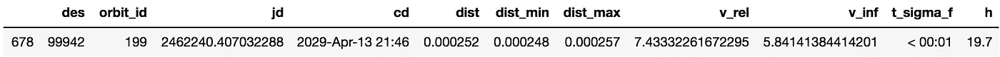
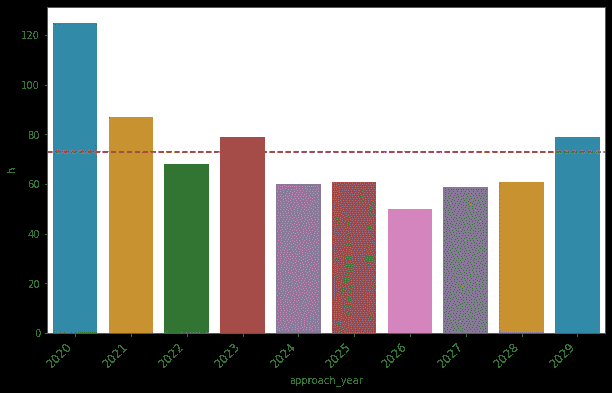
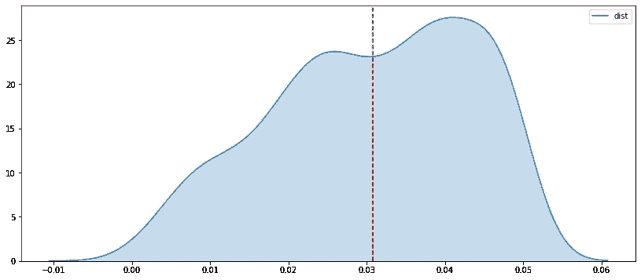
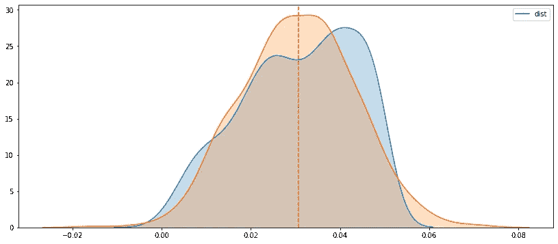

# 用 nasapy 分析未来十年的近地天体

> 原文：<https://towardsdatascience.com/analyzing-the-next-decade-of-earth-close-approaching-objects-with-nasapy-8a6194c4a493?source=collection_archive---------40----------------------->


昆廷·凯梅尔在 [Unsplash](https://unsplash.com/s/photos/meteor?utm_source=unsplash&utm_medium=referral&utm_content=creditCopyText) 上的照片

在这个例子中，我们将通过提取美国宇航局喷气推进实验室的小天体数据库确定的未来 10 年接近地球的物体，来遍历`nasapy`库的一个可能的用例。

在开始之前，导入我们将用来提取和分析数据的包。数据分析库 [pandas](https://pandas.pydata.org/) 将用于获取数据，而 [seaborn](https://seaborn.pydata.org/) 用于绘制数据。加载神奇命令`[%matplotlib inline](https://ipython.readthedocs.io/en/stable/interactive/plotting.html#id1)`以显示生成的图形。

```
**import** **nasapy**
**import** **pandas** **as** **pd**
**import** **numpy** **as** **np**
**import** **matplotlib.pyplot** **as** **plt**
**import** **seaborn** **as** **sns**

%**matplotlib** inline
```

`nasapy`库的`close_approach`方法允许人们访问 JPL SBDB 以提取与地球附近已知流星体和小行星相关的数据。设置参数`return_df=True`会自动将返回的 JSON 数据强制转换成 pandas 数据帧。提取数据后，我们将几个变量转换成`float`类型。

```
ca = nasapy.close_approach(date_min='2020-01-01', 
date_max='2029-12-31', return_df=**True**)

ca['dist'] = ca['dist'].astype(float)
ca['dist_min'] = ca['dist_min'].astype(float)
ca['dist_max'] = ca['dist_max'].astype(float)
```

返回数据的`dist`栏以天文单位(AU)描述了物体的标称接近距离。一个[天文单位](https://en.wikipedia.org/wiki/Astronomical_unit)或 AU 大致是地球到太阳的距离，约为 92，955，807 英里或 149，598，000 公里。使用`[.describe](https://pandas.pydata.org/pandas-docs/stable/reference/api/pandas.DataFrame.describe.html)`方法，我们可以显示总结数据的描述性统计数据。

```
ca['dist'].describe()count    729.000000
mean       0.030775
std        0.012718
min        0.000252
25%        0.021520
50%        0.031960
75%        0.041442
max        0.049983
Name: dist, dtype: float64
```

我们看到澳大利亚的平均进近距离约为 0.031，我们可以将其转换为英里数:

```
au_miles = 92955807.26743
ca['dist'].describe()['mean'] * au_miles2860693.219664113
```

因此，在未来十年中，接近地球的物体的平均距离约为 286 万英里，是地球到月球距离(238，900 英里)的 10 倍以上。

未来十年内最接近地球的物体会怎样？使用`[.loc](https://pandas.pydata.org/pandas-docs/stable/reference/api/pandas.DataFrame.loc.html)`方法，我们可以找到距离最近的物体。

```
ca.loc[ca['dist'] == ca['dist'].min()]
```



最近的已知天体预计将在 2029 年 4 月 13 日接近地球，距离地球 0.00023 天文单位。将天文单位转换成英里，我们可以更好地了解物体的接近距离。

```
print('Distance: ' + str(au_miles * ca['dist'].min()))
print('Minimum Distance: ' + str(au_miles * ca['dist_min'].min()))
print('Maximum Distance: ' + str(au_miles * ca['dist_max'].min()))Distance: 23440.92769543333
Minimum Distance: 644.2481158331191
Maximum Distance: 23874.510393069424
```

我的天啊。看起来这个物体会比较接近地球，大约 23000 英里，在 64423874 英里的范围内。作为比较，最大距离大约是地球到月球距离的 1/10。

让我们对未来十年每年接近地球的物体数量有个大概的了解。首先，我们使用`[.apply](https://pandas.pydata.org/pandas-docs/stable/reference/api/pandas.Series.apply.html)`和`[to_datetime](https://pandas.pydata.org/pandas-docs/stable/reference/api/pandas.to_datetime.html)`的组合将临近日期的年份提取到一个新列`approach_year`中。

```
ca['approach_year'] = ca['cd'].apply(**lambda** x: pd.to_datetime(x).year)
```

使用`[.groupby](https://pandas.pydata.org/pandas-docs/stable/reference/api/pandas.DataFrame.groupby.html)`方法，我们创建一个新的数据帧，其中包含每年接近物体的总数。

```
approaches_by_year = ca.groupby('approach_year').count().reset_index()
```

我们可以使用 seaborn 的[柱状图](https://seaborn.pydata.org/generated/seaborn.barplot.html)函数来绘制每年接近物体的数量。

```
plt.figure(figsize=(10, 6))
p = sns.barplot(x='approach_year', y='h', data=approaches_by_year)
plt.axhline(approaches_by_year['h'].mean(), color='r', linestyle='--')
p = p.set_xticklabels(approaches_by_year['approach_year'], rotation=45, ha='right', fontsize=12)
```



每年接近地球的物体数量

有趣的是，今年(2020 年)将有最多的活动，然后在接下来的几年里会有所下降，直到十年结束。平均来说，这十年中每年有不到 80 个接近地球的物体。

作为最后一个例子，让我们使用 seaborn 的`[.kdeplot](https://seaborn.pydata.org/generated/seaborn.kdeplot.html)`绘制接近物体距离的分布，它创建了一个内核命运图。我们也可以像上面那样添加一条距离的中线。

```
plt.figure(figsize=(14, 6))
plt.axvline(ca['dist'].astype(float).mean(), color='r', linestyle='--')
sns.kdeplot(ca['dist'], shade=**True**)
```



地球近距离物体距离的分布

正如我们上面提到的，平均接近距离略大于 0.03，我们可以在上面的密度图中看到。最后，我们可以使用 [numpy.random.normal](https://docs.scipy.org/doc/numpy-1.15.0/reference/generated/numpy.random.normal.html) 绘制距离分布的正态分布图，以快速比较实际分布和正态分布。

```
plt.figure(figsize=(14, 6))

x = np.random.normal(size=len(ca['dist']), 
                     scale=ca['dist'].std(), 
                     loc=ca['dist'].mean())

plt.axvline(ca['dist'].mean(), color='r', linestyle='--')

sns.kdeplot(ca['dist'], shade=**True**)
sns.kdeplot(x, shade=**True**)
```



与正态分布相比的地球近距离接近物体距离的分布

我们看到距离的分布不太正常。肯定有更复杂的技术来分析数据集的分布，但这将留到将来可能的练习中。