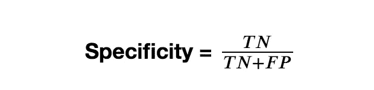
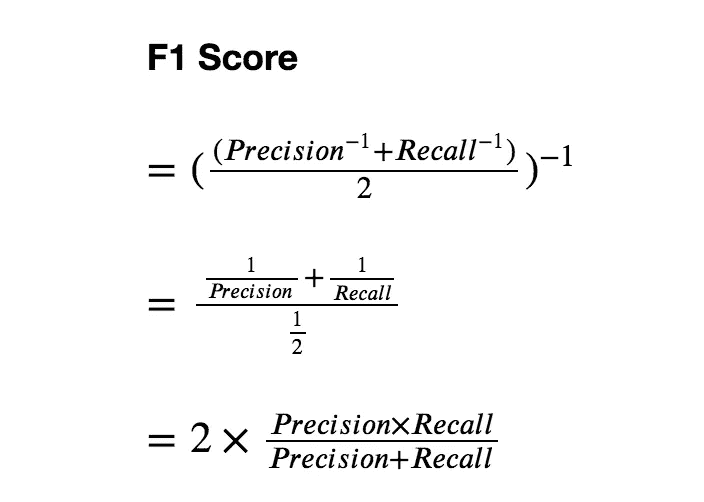
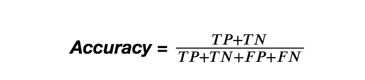
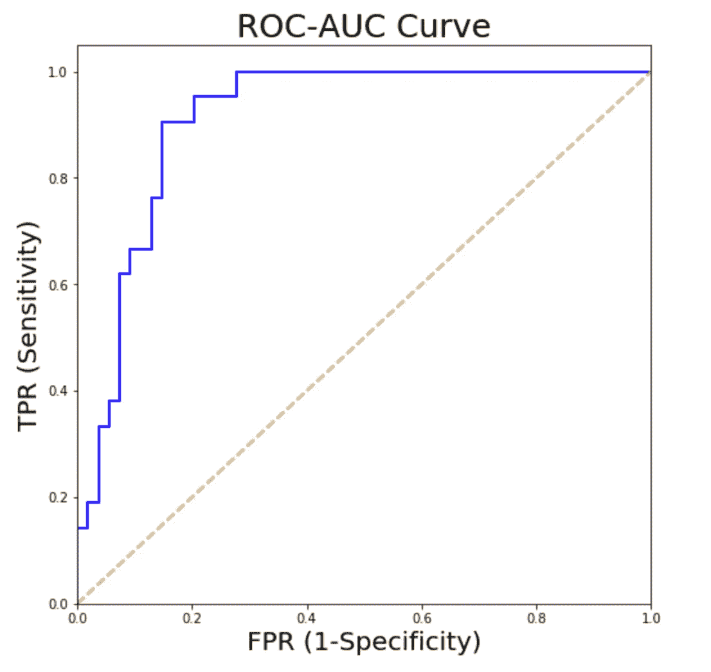
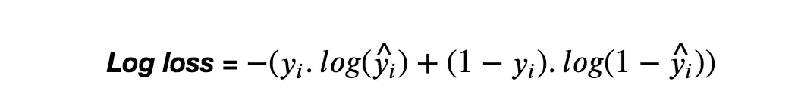
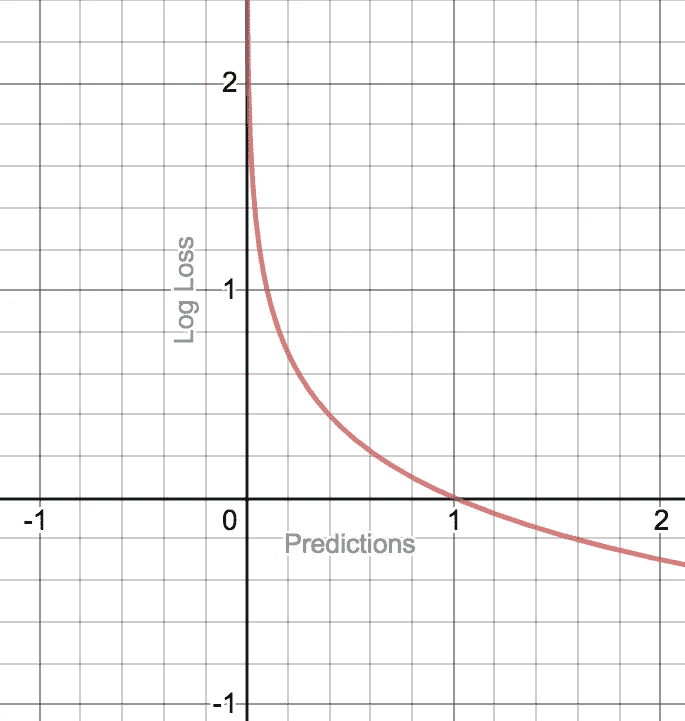
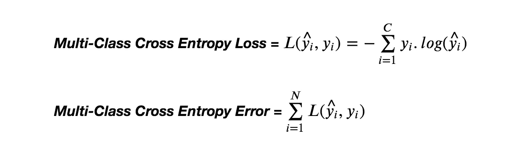
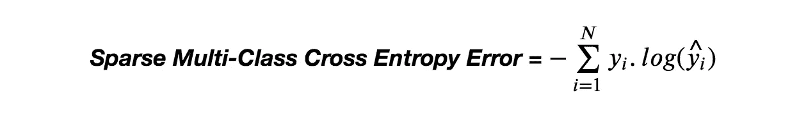
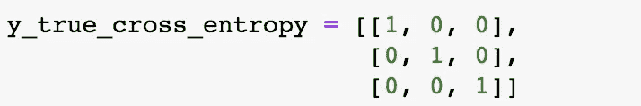
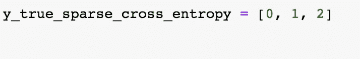

# 机器学习中分类模型的性能分析

> 原文：<https://towardsdatascience.com/analyzing-the-performance-of-the-classification-models-in-machine-learning-ad8fb962e857?source=collection_archive---------46----------------------->

## 探索混淆矩阵、ROC-AUC 曲线和机器学习中分类的成本函数的基础。

萨法尔·萨法罗夫在 [Unsplash](https://unsplash.com?utm_source=medium&utm_medium=referral) 上拍摄的照片

# 混淆矩阵

混淆矩阵(也称为误差矩阵)用于分析分类模型(如逻辑回归、决策树分类器等)的好坏。)执行。我们为什么要分析模型的性能？分析模型的性能有助于我们发现并消除偏差和方差问题(如果存在)，也有助于我们微调模型，使模型产生更准确的结果。混淆矩阵通常用于二分类问题，但也可以扩展到多分类问题。

# 混淆矩阵的术语

二元分类的混淆矩阵。[图片来源](https://commons.wikimedia.org/wiki/File:ConfusionMatrixRedBlue.png)

用例子来说明概念会更好理解，所以让我们考虑一个例子。让我们假设一个家庭去检测 COVID19。

**真阳性(TP):** 真阳性是被预测为阳性的病例，他们确实患有该疾病。

**假阳性(FP):** 假阳性是已经被预测为阳性但他们并没有那种疾病的病例。

**真阴性(TN):** 真阴性是被预测为阴性的病例，他们确实没有患那种疾病。

**假阴性(FN):** 假阴性是已经被预测为阴性，但是他们患有该疾病的病例。

**敏感度:**敏感度又称为**召回率和真阳性率**。敏感度是实际阳性中被正确预测为阳性的比例。换句话说，敏感度是真阳性与真阳性和假阴性之和的比率。

PC:作者

**特异性:**特异性也叫**真阴性率**。特异性是被正确预测为阴性的实际阴性的比例。换句话说，特异性是真阴性与真阴性和假阳性之和的比率。

PC:作者

**精度:**精度是被正确预测为阳性的预测阳性的比例。换句话说，精度是真阳性与真阳性和假阳性之和的比率。

PC:作者

**F1 得分:** F1 得分定义为精度和召回率的调和平均值。F1 分数从 0 到 1，0 为最差分数，1 为最高分数。当数据遭受类别不平衡时，可以使用 F1 分数，因为它同时考虑了假阳性和假阴性。

PC:作者

**准确度:**模型的准确度被定义为真阳性和真阴性之和与预测总数的比率。精确度范围从 0 到 100。当必须获得真阳性和真阴性时，可以使用准确性。

PC:作者

# ROC 曲线

ROC-AUC 曲线(接收操作者特征-曲线下面积)有助于分析不同阈值设置下的分类性能。类别的高真阳性率(TPR/灵敏度)描述了该模型在分类该特定类别时表现良好。可以比较各种模型的 ROC-AUC 曲线，具有高 AUC(曲线下面积)的模型被认为表现良好。换句话说，该模型在各种阈值设置下表现得非常好，产生了高 TPR(真阳性率)。

PC:作者

# 分类的成本函数

成本函数通过考虑实际值和预测值来帮助衡量模型的性能。

## 交叉熵损失

交叉熵损失也称为**对数损失**。对数损失可以应用于目标是二进制的二进制分类问题，也可以应用于多类分类问题。让我们考虑 C 是目标变量中类的数量。

> *如果 C = 2(二进制分类)，对数损失或二进制交叉熵损失计算如下，*

*   当实际值 y = 0 时，应用[(1-y) * log(1- 𝑦̂)]其中𝑦̂是 y 的预测值
*   当实际值 y = 1 时，应用[y *log(𝑦̂]]𝑦̂是 y 的预测值

PC:作者

**曲线图为-y * log(𝑦̂)当 y = 1 时(y 是实际值)**

PC:作者。用完了德斯莫斯

**图为-[(1- y) * log(1- 𝑦̂)]当 y = 0 时**

PC:作者。用完了德斯莫斯

> *如果 C > 2(多类分类)log 损失或* ***多类交叉熵损失*** *计算如下，*

PC:作者

**多类交叉熵损失**是针对单个数据实例定义的，而**多类交叉熵误差**是针对整组数据实例定义的。

## 稀疏多类交叉熵损失

稀疏多类交叉熵损失非常类似于多类交叉熵损失，除了不同于多类交叉熵损失的真实标签的表示。

PC:作者

在多类交叉熵损失中，真实标签被一热编码，而在稀疏多类交叉熵损失中，真实标签被原样保留，从而减少了计算时间。

多类交叉熵损失中真实标签 y 的表示，

PC:作者

多类稀疏交叉熵损失中真实标签 y 的表示，

PC:作者

# 摘要

*   当数据集不平衡时，可以使用 F1 分数。当一个类的样本数多于另一个类的样本数时，数据集被称为不平衡的。
*   ROC-AUC 曲线使用不同阈值设置下的真阳性率和假阳性率绘制。ROC-AUC 曲线有助于找到分类的最佳阈值。
*   交叉熵损失可以应用于二元和多类分类问题。
*   稀疏多类交叉熵损失在计算上比多类交叉熵损失更快。

## 参考

[1] Jason Brownlee，[训练深度学习神经网络时如何选择损失函数](http://how%20to%20choose%20loss%20functions%20when%20training%20deep%20learning%20neural%20networks/)。

[2] Scikit-learn，[接收操作员特征](https://scikit-learn.org/stable/auto_examples/model_selection/plot_roc.html#sphx-glr-auto-examples-model-selection-plot-roc-py)。

[3] ML- cheatsheet，[损失函数-ML 术语文档](https://ml-cheatsheet.readthedocs.io/en/latest/loss_functions.html)。

*在*[*LinkedIn*](https://www.linkedin.com/in/srivignesh-rajan-123569151/)*，*[*Twitter*](https://twitter.com/RajanSrivignesh)*上与我联系！*

**快乐的机器学习！**

## 谢谢大家！