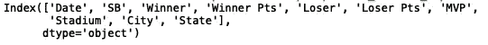
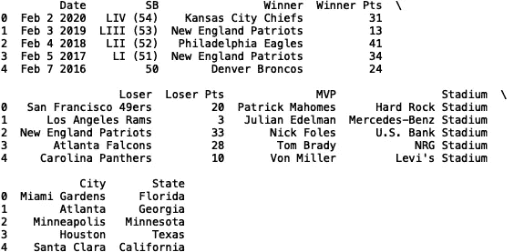
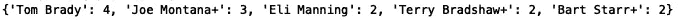
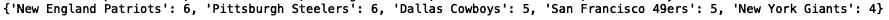
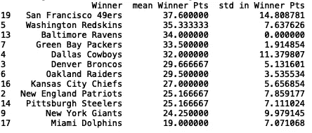
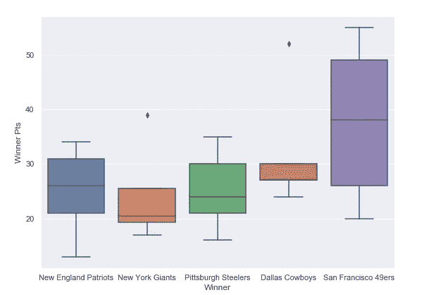
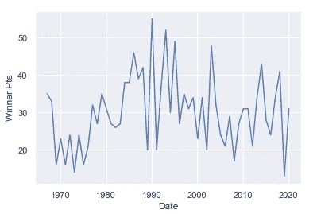
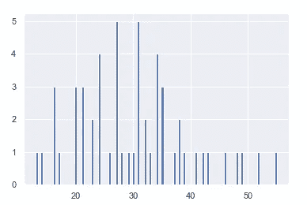

# 分析超级碗历史数据集(1967-2020)

> 原文：<https://towardsdatascience.com/analyzing-the-superbowl-history-dataset-1967-2020-fdee01a760c9?source=collection_archive---------33----------------------->

## 历史超级碗数据的探索性数据分析


Jean-Daniel Francoeur 在 [Pexels](https://www.pexels.com/photo/selective-focus-close-up-photo-of-brown-wilson-pigskin-football-on-green-grass-2570139/) 上拍摄的照片

超级碗是一年一度的比赛，决定了美国国家橄榄球联盟(NFL)的冠军。这是世界上最受关注的年度体育赛事之一，拥有大量的国内观众。平均每年美国有超过 1 亿人收看超级碗比赛。

在本帖中，我们将分析*超级碗历史数据集(1967–2020)*。我们将为获胜球队、体育场、获胜点数和最有价值球员等信息生成汇总统计数据和数据可视化。我们将使用的数据可以在[这里](https://www.kaggle.com/timoboz/superbowl-history-1967-2020)找到。

让我们开始吧。

首先，让我们使用 pandas 导入数据:

```
import pandas as pd
df = pd.read_csv("superbowl.csv")
```

接下来，我们可以打印列的列表:

```
print(df.columns)
```



如你所见，有 10 列。让我们打印前五行:

```
print(df.head())
```



我们可以看到有几个分类列。让我们定义一个将数据框、列名和限制作为输入的函数。当被调用时，它打印分类值的字典以及它们出现的频率:

```
def return_counter(data_frame, column_name, limit):
   from collections import Counter    print(dict(Counter(data_frame[column_name].values).most_common(limit)))
```

让我们将我们的函数应用到最有价值球员(“MVP”)一栏，并将我们的结果限制在五个最常见的值:

```
return_counter(df, 'MVP', 5)
```



我们看到汤姆·布拉迪拥有最多的 MVP 记录，其次是乔·蒙塔纳。


[来源](https://sports.yahoo.com/tom-bradys-says-im-not-going-anywhere-in-super-bowl-ad-that-followed-up-cryptic-tweet-001945992.html)

让我们将函数应用于“Stadium”列:

```
return_counter(df, 'Stadium', 5)
```


路易斯安那州的 Superdome、Rose Bowl 和 Orange Bowl 在数据集中出现了五次。

让我们试试“获胜者”栏，它对应于获胜的团队:

```
return_counter(df, 'Winner', 5)
```



新英格兰爱国者队和匹兹堡钢人队并列六胜。

我鼓励您将此函数应用于剩余的分类列，如“州”、“城市”和“失败者”。

正如您所看到的，这是一个有用的快速测试，可以查看数据中是否有任何明显的不平衡，这通常是建模时需要处理的一个关键问题。

接下来，从数字列(如“Winner Pts ”,即获胜团队获得的分数)中生成汇总统计数据会很有用。让我们定义一个采用数据框、分类列和数字列的函数。每个类别的数字列的平均值和标准偏差存储在数据框中，并且数据框根据平均值以降序排序。如果您想要快速查看特定类别对于特定数字列是否具有更高或更低的平均值和/或标准偏差值，这将非常有用。

```
def return_statistics(data_frame, categorical_column, numerical_column):
    mean = []
    std = []
    field = []
    for i in set(list(data_frame[categorical_column].values)):
        new_data = data_frame[data_frame[categorical_column] == i]
        field.append(i)
        mean.append(new_data[numerical_column].mean())
        std.append(new_data[numerical_column].std())
    df = pd.DataFrame({'{}'.format(categorical_column): field, 'mean {}'.format(numerical_column): mean, 'std in {}'.format(numerical_column): std})
    df.sort_values('mean {}'.format(numerical_column), inplace = True, ascending = False)
    df.dropna(inplace = True)
    return df
```

我们可以查看“获胜者”和“获胜者分数”的汇总统计数据:

```
stats = return_statistics(df, 'Winner', 'Winner Pts')
print(stats.head(15))
```



旧金山 49 人队的平均“赢家分数”和“赢家分数”的标准差最高。

接下来，我们将使用箱线图来显示基于最小值、最大值、中值、第一个四分位数和第三个四分位数的数值分布。如果您对它们不熟悉，可以看看文章[了解 Boxplots](/understanding-boxplots-5e2df7bcbd51) 。

与汇总统计函数类似，此函数采用数据框、分类列和数值列，并根据限制显示最常见类别的箱线图:

```
def get_boxplot_of_categories(data_frame, categorical_column, numerical_column, limit):
    import seaborn as sns
    from collections import Counter
    keys = []
    for i in dict(Counter(df[categorical_column].values).most_common(limit)):
        keys.append(i)
    print(keys)
    df_new = df[df[categorical_column].isin(keys)]
    sns.set()
    sns.boxplot(x = df_new[categorical_column], y =      df_new[numerical_column])
```

让我们为 5 个最常见的获胜团队的“获胜者分数”生成箱线图:

```
get_boxplot_of_categories(df, 'Winner', 'Winner Pts', 5)
```



我们还可以定义一个函数来显示获胜点的时间序列图。首先，让我们将“日期”转换成日期时间对象:

```
df['Date'] = pd.to_datetime(df['Date'])
```

接下来，让我们定义一个函数，该函数将数据框和数字列作为输入，并显示“Winner Pts”的时间序列图:

```
def get_time_series(data_frame, numerical_column):
    import matplotlib.pyplot as plt
    df_new = data_frame
    plt.scatter(df_new['Date'], df_new[numerical_column])
    plt.xlabel('Date')
    plt.ylabel(numerical_column)
```

让我们用数据帧和“赢家 Pts”调用函数:

```
get_time_series(df, 'Winner Pts')
```



最后，让我们定义一个函数，它将一个数据框和一个数字列作为输入，并显示一个直方图:

```
def get_histogram(data_frame, numerical_column):
    df_new = data_frame
    df_new[numerical_column].hist(bins=100)
```

让我们使用数据框调用函数，并生成优胜点直方图:

```
get_histogram(df, 'Winner Pts')
```



我就讲到这里，但是请随意处理数据并自己编码。

概括地说，我回顾了几种分析*超级碗历史数据集的方法。*这包括定义生成汇总统计数据的函数，如平均值、标准差和分类值的计数。我们还定义了用箱线图、直方图和时间序列图来可视化数据的函数。我希望这篇文章有趣。这篇文章的代码可以在 [GitHub](https://github.com/spierre91/medium_code) 上找到。感谢您的阅读！