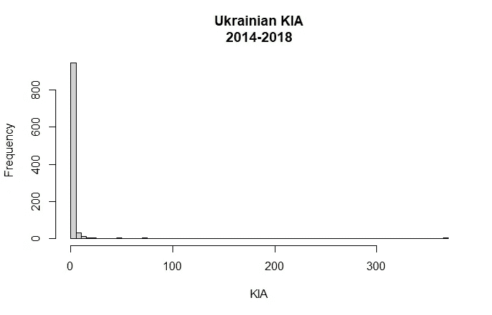
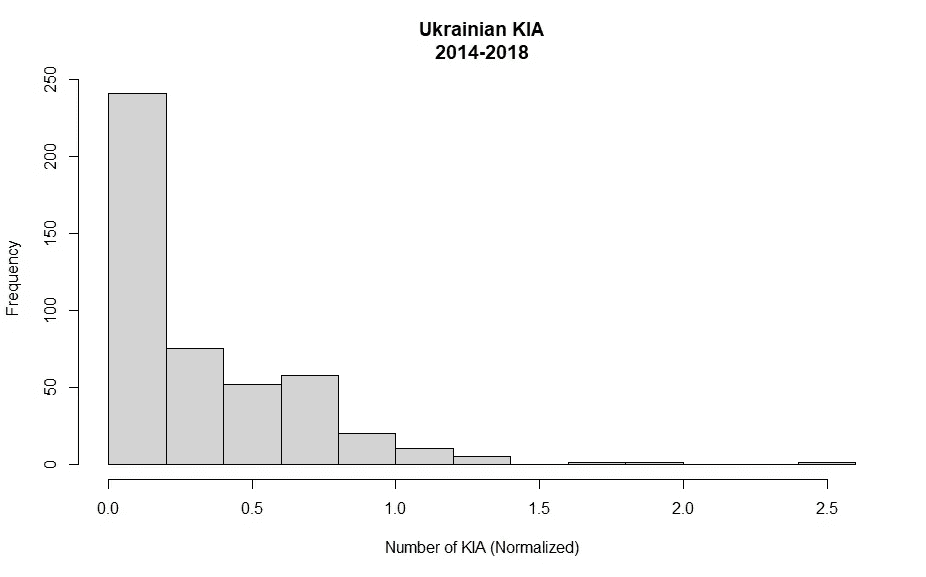
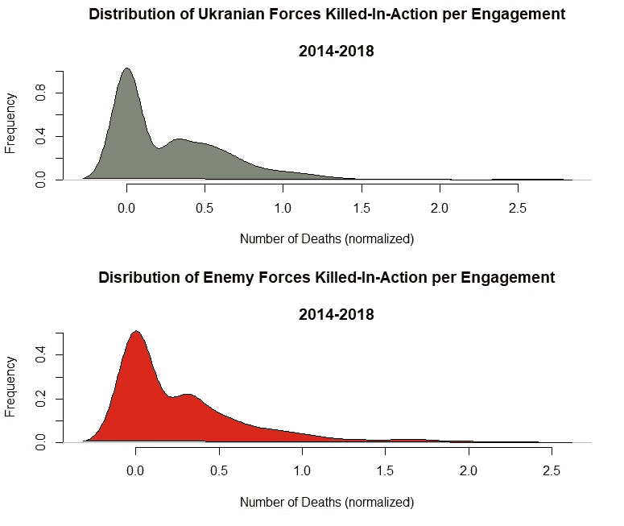
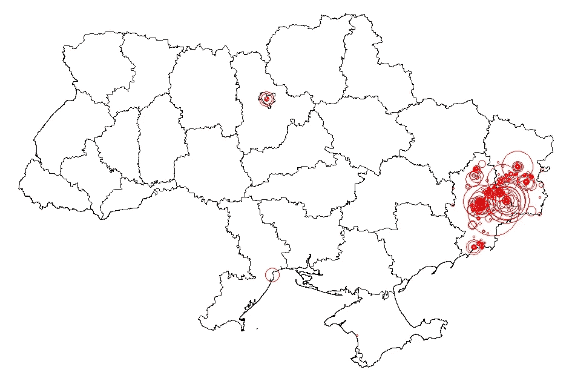
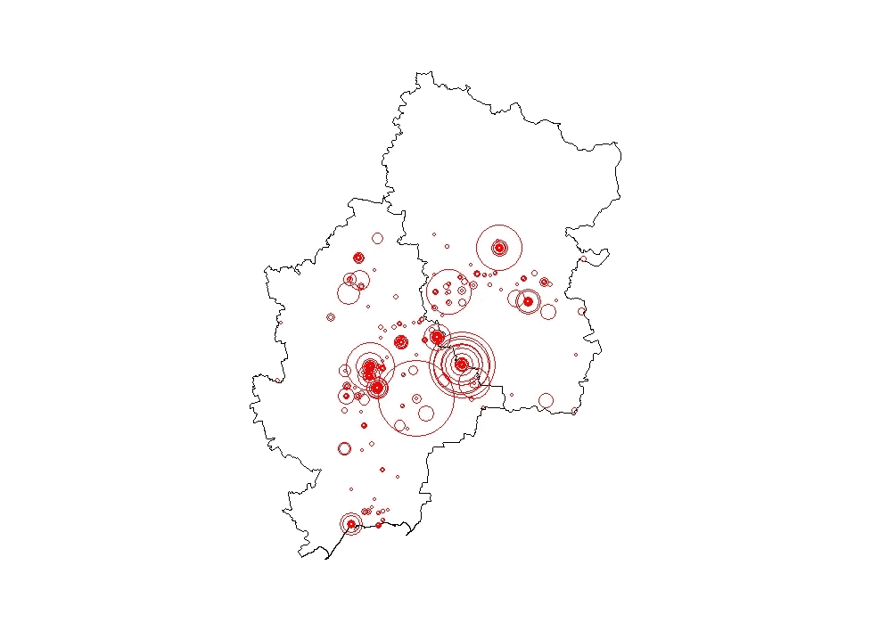

# 用 R .分析乌克兰战争

> 原文：<https://towardsdatascience.com/analyzing-the-war-in-ukraine-using-r-39d0c3379938?source=collection_archive---------42----------------------->

## 使用 tidyverse 和地图对冲突进行探索性分析！

2014 年，乌克兰顿涅茨克州和卢甘斯克州的俄罗斯分裂分子宣布独立。自行宣布成立的顿涅茨克和卢甘斯克人民共和国与乌克兰政府之间爆发了冲突。这一冲突非常复杂，涉及无数变数。人们写了关于这场冲突的书籍、文章和各种观点。我很好奇数据显示了什么。

经过一番努力，我偶然发现了人道主义数据交换:[https://data.humdata.org/](https://data.humdata.org/)。那里有很多非常有趣的数据。对我来说幸运的是，有一个关于乌克兰冲突的非常好而且相当精细的数据集。数据集中的每一行代表一个动力学事件。数据跨度从 2014 年的亲欧盟示威革命到 2018 年。我将数据读入 R 中，并通过删除一些我不感兴趣的列(我在下面的代码中省略了这一部分)对其进行了修改。我们将从检查 na 的数据开始(确保您加载了 tidyverse！):

```
# read in the data 
conflict <- read_csv('conflict_data_ukr - Raw.csv')# make.names on the columns
colnames(conflict) <- make.names(colnames(conflict))# check for NA's in the column adm_1
sum(is.na(conflict$adm_1))#119
conflict[is.na(conflict$adm_1),]#   all of the NAs in adm_1 are for the donets basin area which 
#   isn't contained in one oblast.# replace NA's in adm_1 w/ 'Donets Basin Area'
conflict$adm_1 <- conflict$adm_1 %>% replace_na('Donets Basin Area')
any(is.na(conflict)) # FALSE
```

“adm_1”变量包含事件发生在哪个州的信息(想象一个像美国大县一样的州)。我担心的是那一栏中的 na。第一行代码告诉我那里有 119 个 na。我能够对第二行代码中的数据进行子集划分，并根据“where_coordinates”列中的信息了解到所有 na 都是“Donets Basin Area”中的事件。我将 adm_1 列中的 na 替换为“Donets Basin Area ”,然后重命名了一些列:

```
# rename some columns 
conflict <- conflict %>% rename(gov.forces = side_a
                                , op.forces = side_b
                                , kia = deaths_a
                                , ekia = deaths_b
                                , civcas = deaths_civilians
                                , region = adm_1)
```

出于本分析的目的，KIA =乌克兰军队被杀，EKIA =分离势力被杀。其余的变量非常简单。我首先想探究乌克兰在一个事件中损失最多的是什么:

```
# what was the maximum number of KIA in an event
max(conflict$kia)
[1] 366
```

哇哦。在一次事件中，政府军损失了 366 名军人。让我们进一步探讨这个问题。

```
# subset for the information regarding the mass casualty event
conflict[conflict$kia == 366,]
```

这行代码为我提供了该特定事件的所有数据。事情发生在 2014 年 9 月 2 日，顿涅茨克州的伊洛瓦伊斯克。伊洛瓦伊斯克战役意义重大，因为据称这是俄罗斯正规军首次越过边境参与冲突。继续，我们来看看起亚的分布。

```
hist(conflict$kia, breaks = 100
     , xlab = "KIA"
     , main = "Ukrainian KIA\n2014-2018")
```



数据分布非常不对称。像伊洛瓦伊斯克战役这种大量死亡的事件正在创造一条向右的长尾。让我们把数据标准化。

```
# histogram of KIA normalized
hist(log10(conflict$kia)
     , xlab = "Number of KIA (Normalized)"
     , main = "Ukrainian KIA\n2014-2018")
```



我决定采用这个概念，为起亚和 EKIA 绘制密度图:

```
# initialize the plot space
par(mfrow = c(2,1))
par(bty = 'n')# density plot for kia (Ukrainian Government Forces)
a <- density(log10(conflict$kia))
plot(a
     , xlab = 'Number of Deaths (normalized)'
     , ylab = 'Frequency'
     , main = "Distribution of Ukranian Forces Killed-In-Action per Engagement\n
     2014-2018")
polygon(a, col = '#7E8777', border = "black")# density plot for ekia (Russian Separatist Forces)
b <- density(log10(conflict$ekia))
plot(b
     , xlab = 'Number of Deaths (normalized)'
     , ylab = 'Frequency'
     , main = "Disribution of Enemy Forces Killed-In-Action per Engagement\n
     2014-2018")
polygon(b, col = '#DA291C', border = 'black')
```



这些图表明的是，大多数事件的双方都有一个或更少的伤亡。然而，也有一些导致重大损失的重大交战。这就是为什么我们有长尾巴。

接下来的问题是，战斗集中在哪里？让我们创建一个柱状图来提供一些背景信息:

```
#----------------------------------------------------------
# barplot for deaths by region
#----------------------------------------------------------
df <- aggregate(conflict$best, list(conflict$region), sum)
df <- as_tibble(df) 
df <- df %>% rename(Region = Group.1
                    , no.ofDeaths = x) 
df <- df %>% arrange(no.ofDeaths)par(mar = c(5,13,5,1), bty = 'n')barplot(df$no.ofDeaths 
        , names.arg = df$Region
        , horiz = T
        , las = 1 
        , col = '#DA291C'
        , border = NA
        , xlab = "Total Number of Deaths"
        , main = 'Deaths by Region in the Ukrainian Conflict\nNote: "Donets Basin Area" includes both Luhansk and Donetsk Oblasts\nYears: 2014-2018')
```


看起来顿涅茨克州是战斗最激烈的地方。然而，目前还不清楚有多少打着“顿涅茨克盆地地区”标签的战斗实际上发生在顿涅茨克州或卢甘斯克州。我认为理解这些数据的更好的方法是用 R！

```
# load some packages
library(pacman)
p_load(maps, mapproj, rnaturalearth, scales, ggplot2)# load the data
ukr <- read_csv('conflict_data_ukr - Raw.csv')# Calculate area of a circle based on deaths per event
radius <- sqrt( ukr$best/pi )# Plot the map
ykr <- raster::getData('GADM', country = "UKR", level = 1)map(ykr)# add the points
points(ukr$longitude, ukr$latitude
       , cex = rescale(radius, c(0, 12))
       , col = 'red'
       , pch = 21)
```



这样更好，不是吗？圆圈区域表示每个事件的死亡人数(包括 KIA、EKIA 和平民死亡人数)。你可以看到在交战双方多次交战的区域周围形成了同心圆。地图中心附近环绕基辅的圆圈代表亲欧盟示威运动革命。底部附近还有一个小圆圈，代表亲欧盟示威运动革命期间发生在敖德萨的事件。让我们仔细看看顿涅茨克州和卢甘斯克州(俗称顿巴斯)。

```
# plot the Donbass
map(ykr, namefield = 'NAME_1', region = c("Donets'k", "Luhans'k"))# add the points
points(ukr$longitude, ukr$latitude
       , cex = rescale(radius, c(0, 12))
       , col = 'red'
       , pch = 21)
```



在上图中，顿涅茨克州在左边，卢甘斯克州在右边。如你所见，大部分战斗发生在顿涅茨克或边境。地图上最大的圆圈表示伊洛瓦伊斯克战役，前面提到过。

冲突是社会中令人讨厌的现实，但它产生了一些有趣的数据供探索。希望这篇文章能帮助你找到一些代码，或者对你理解东欧地缘政治有所启发。我很喜欢这篇文章的一些反馈，所以如果你愿意，请留下评论！