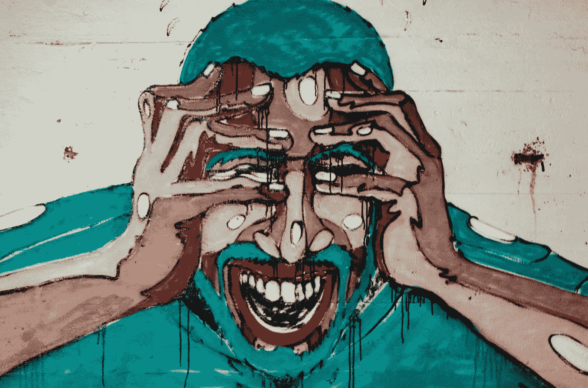
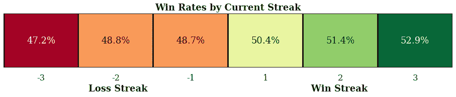
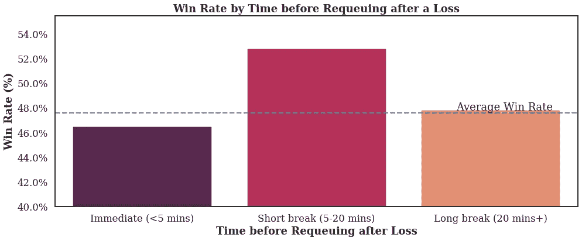
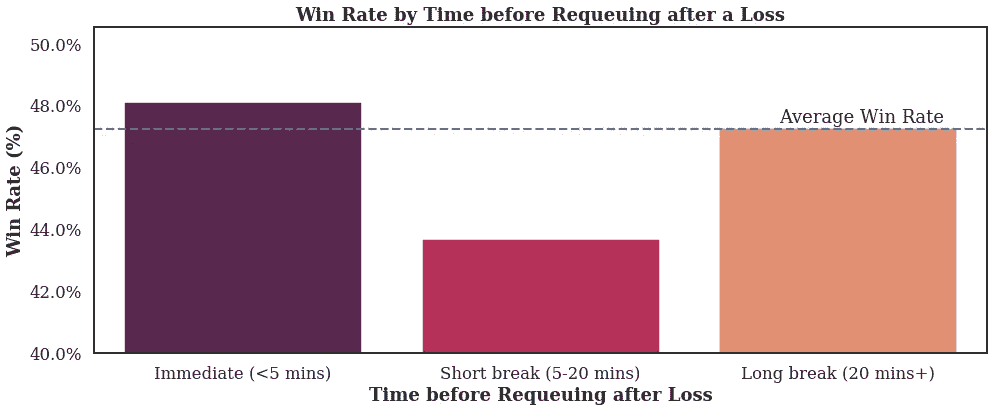

# 分析“倾斜”赢得更多游戏(英雄联盟)

> 原文：<https://towardsdatascience.com/analyzing-tilt-to-win-more-games-league-of-legends-347de832a5b1?source=collection_archive---------23----------------------->

[来源](https://unsplash.com/photos/VBe9zj-JHBs)

> “一种精神或**情感**混乱或沮丧的状态，玩家采用了非最佳策略，通常导致玩家变得过于激进”
> 
> —倾斜的定义([维基百科](https://en.wikipedia.org/wiki/Tilt_(poker)))

倾斜的。扑克玩家中常用的一个术语，尽管它也被更广泛的游戏社区完全采用。据说，它的起源来自机械弹球机，如果玩家试图倾斜机器，它会冻结脚蹼，有时甚至会显示警告:**“倾斜”。**

现在它被用来形容一个人由于某种极端情绪(通常是愤怒)而做出不理智的行为。在扑克游戏中，这可能是连败后在弱牌上全押。在游戏中，这可能是在敌人在聊天中奚落你之后向他们冲锋。然而，它也可以应用于任何数量的“现实生活”场景。当他们过了糟糕的一天，谁没有对他们所爱的人发过脾气？这是**倾斜**。当**情绪**高涨的时候**你的行为是不理智的**。

现在，那些玩过任何竞争性团队游戏的人无疑会成为他们的同伴玩家的倾斜诱导行为的受害者。这一点在热门网游《英雄联盟》中尤其成问题。该游戏既有激烈的形式(激烈的 5 对 5 场比赛)和梯形排名系统，使其成为一种情感的努力。最近我自己经历过(非常不幸的 13 连败)，我决定看看是否有任何方法可以在游戏数据中识别它。

***注:*** *所有收集的数据都是使用 Riot Data API，运行超过 10 万场。GitHub:*[https://GitHub . com/JackWillz/Projects/blob/master/Data % 20 analysis % 20 and % 20 API % 20-% 20 ol % 20 tilt/tilt _ trend . ipynb](https://github.com/JackWillz/Projects/blob/master/Data%20Analysis%20and%20API%20-%20LoL%20Tilt/tilt_trend.ipynb)

我想回答的第一个问题很简单。输了之后，你更有可能输吗？答案并不令人惊讶，如下所示:

基于玩家先前游戏结果的胜率。

***注:*** *我稍微调整了一下基线，因为我取样的选手胜率都在平均水平以上。*

这意味着最近输了 2 场比赛的玩家(根据图表，2 连败)将有 48.8%的机会赢得下一场比赛。然而，我们**不能**在这里结案，宣布 tilt 已经被证实。据统计，最近输了 2 场比赛的玩家比最近赢了 2 场比赛的玩家更有可能成为糟糕的玩家！玩家可能没有“倾斜”，他们可能只是比平均水平差。

在这种情况下，我们如何更好地理解 tilt，而不陷入这个将坏玩家与好玩家进行比较的陷阱？为此，我们利用了倾斜是一种*暂时*情绪状态的事实，这种情绪状态随着时间迅速衰减。有没有对某人发脾气却很快又后悔的经历？这同样适用于这里。

知道了这一点，我们可以看看这些失败玩家的胜率，除了这一次他们在玩下一个游戏之前等待了多长时间。为此，我们研究了排名在“金牌”(前 24%的玩家)的人，他们已经输掉了前 2 场比赛。然后我们发现了他们上一次游戏结束和下一次游戏开始之间的时间差。其结果可以在下面找到:

黄金的胜率对玩家的连败进行排名，这取决于他们在玩下一个游戏之前等待的时间。

那些在两连败后采取**不休息**的人，到目前为止**胜率最低**！根据我们对 tilt 的了解，我们可以认为，那些带着因失败而积累的情绪包袱参加下一场比赛的人会导致他们在下一场比赛中表现不佳，从而大大影响他们球队的机会。

然而，有趣的是，那些只短暂休息的人不仅胜率有所提高，而且与平均水平(刚刚输了两场比赛的金牌玩家)相比，胜率超过了 3%。有几个理论，我已经为此辩论过，但我更喜欢的是，输了 2 场比赛并休息一段时间的球员既“热身”，又没有情感债务。如果你有任何替代的想法，请让他们被听到！最后，那些长时间休息(平均 3-4 个小时，但可能是几天)的人，他们的胜率会回到接近 2 场比赛输球的平均水平。

关于这个话题，我感兴趣的最后一个问题是，不管玩家的技能等级如何，这种关系是否成立。为了测试这个理论，我对“钻石 I”玩家(前 1%)重新进行了实验。结果出乎意料..

Diamond I 的胜率对玩家连败进行排名，取决于他们在玩下一个游戏之前等待的时间。

虽然长时间休息的玩家以同样的方式回归均值，但是“立即”和“短时间休息”之间的关系已经被翻转了！那些排名第一梯队的玩家实际上会发现，如果他们在失败后定期**短暂休息**，他们的胜率会大幅**下降**，而立即玩**的玩家**会发现，与普通玩家相比，他们的胜率会有小幅**提高**！

对此我有两种流行的理论:在这个竞争激烈的环境中(许多玩家每天投入超过 8 个小时)，他们已经习惯了处理倾斜，否则，他们永远不会走到这一步。其次，在这个层面上，已经变成了数字游戏。竞争的程度如此之高，以至于真正起作用的是你投入的时间。这个级别的英雄联盟一场比赛平均 [27 分钟](https://www.leagueofgraphs.com/rankings/game-durations)长。一个不休息的球员比一个输球后坐 20 分钟来恢复的球员一天能挤出更多的比赛。

但是，这些都是理论。我相信有一个与游戏相关的心理行为科学的更大的世界相对来说还没有被开发。如果有什么不同的话，我希望这篇文章能让你简短地思考一下可能性——至少在你准备好面对下一场比赛之前。

你已经看到文章的结尾了！我叫 Jack J，是一名将人工智能应用于竞技游戏和电子竞技的专业数据科学家。我是 [**iTero 的创始人。GG**](https://itero.gg/) 和 [**jung.gg**](https://www.jung.gg/) 。你可以在 [**推特**](https://twitter.com/JackJGaming) 上关注我，加入 [**iTero Discord**](https://discord.gg/hZmk3z6adP) 或者给我发邮件 **jack@itero.gg** 。下一场见。

*最初发表于:*[*https://itero.gg/blog*](https://itero.gg/blog)