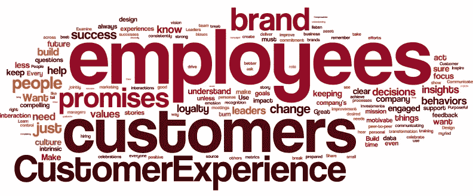
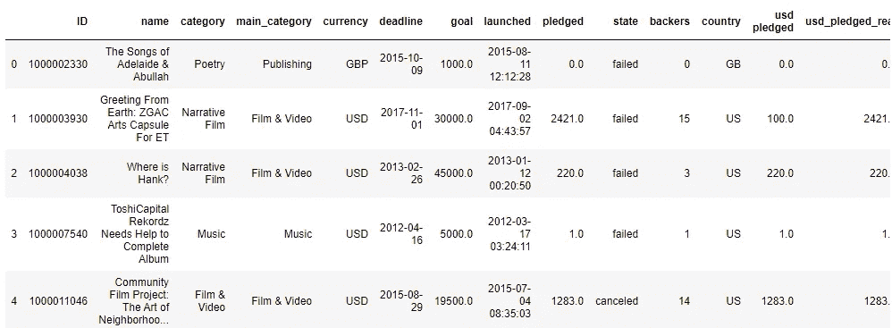
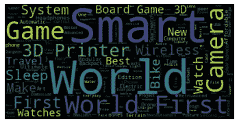
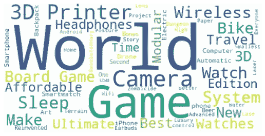

# 使用 Wordcloud 分析热门 Kickstarter 活动

> 原文：<https://towardsdatascience.com/analyzing-top-kickstarter-campaigns-with-wordcloud-2541cd3f05c8?source=collection_archive---------52----------------------->



[照片致谢](https://experiencematters.blog/2016/02/03/100-cx-tips-in-a-word-cloud/)

自从开始数据科学之旅，我就迷上了文字云。词云(或标签云)是一种独特的数据可视化工具，用于通过词频或意义来探索文本数据。当您有大量的文本数据，并且想要获得分布的基本概念时，这非常方便。

作为一名数据科学家，经过几个月的发展，我终于在上周厌倦了。我想学习如何制作我见过的(但从未忘记的)超级酷的单词云！！！所以，我找到了一个有用的[数据营教程](https://www.datacamp.com/community/tutorials/wordcloud-python)，读了一点文档，我准备实践我的新知识。

实践新的可视化类型的第一步是找到适合该可视化的数据集。鉴于我们正在尝试练习一个*单词*云，我们可能会找到一些包含文本的数据。有许多很好的选择可以实践，比如客户评论、推文或 Youtube 视频字幕，但我在 Kaggle 上找到了一个关于 Kickstarter 项目的[数据集，我认为它非常适合这种情况。](https://www.kaggle.com/kemical/kickstarter-projects)

```
import numpy as np
import pandas as pd
from PIL import Image
from wordcloud import WordCloud, STOPWORDSimport matplotlib.pyplot as plt 
%matplotlib inline df = pd.read_csv('ks-projects-201801.csv') 
df.head()
```



根据数据集在 Kaggle 上的文档，usd_pledge_real 和 usd_goal_real 列是由 Fixer.io API 生成的以美元为单位的真实转换，因此我们应该使用它们并删除所有其他与货币相关的列。

此外，因为 Kickstarter 的目的是筹集尽可能多的资金来启动你的业务，所以一个恰当定义成功的栏是承诺给每个活动的资金量。让我们使用 usd _ pledged _ real 列根据承诺金额检索排名前 500 的 Kickstarter 活动。

```
# Rename columns and drop unneeded ones 
df['usd_pledged'] = df.usd_pledged_real
df['usd_goal'] = df.usd_goal_realdf_ks = df.drop(columns=['goal', 'usd pledged', 'usd_pledged_real', 'usd_goal_real'])# Get the top 50 Kickstarter campaigns by $ pledgeddf_sorted = df_ks.sort_values(by='usd_pledged', ascending=False)
df_top = df_sorted.head(500)
```

现在，有趣的部分来了。我们可以利用之前导入的 wordcloud 库，构建一个包含 Kickstarter 前 500 名活动名称的 wordcloud。

WordCloud 对象有一个方法。generate()将从一个字符串生成一个 wordcloud。我们可以使用列表理解来构建一个巨大的字符串，其中包含 Kickstarter 活动的所有名称。

请注意，我们还从 wordcloud 库中导入了停用词。这是一组内置的词，通常不会给文本分析增加太多价值(比如 it，they 等)。).我们可以用 stopwords 参数传入这组单词，以确保排除那些不需要的单词。

有关如何正确设置插值参数的更多信息，请查看 matplotlib 的文档，但现在，它被设置为双线性。

```
# Join all names and separate them with whitespace
text = " ".join(str(name) for name in df_top.name) # Create stopword list:
stopwords = set(STOPWORDS) # Generate a word cloud image
wordcloud = WordCloud(stopwords=stopwords).generate(text)# Display the generated image:
# the matplotlib way:
plt.imshow(wordcloud, interpolation='bilinear')
plt.axis("off")
plt.show()
```



只要几行代码，我们就有了单词云！一张小小的照片，这里有很多东西，我们来做一些改进吧。

让我们把背景改成白色，这样更容易阅读。让我们把最小字体变大一点。最后，让我们排除“第一”和“聪明”这两个词，这样我们就可以看到其他词的出现。

```
# Create stopword list:
stopwords = set(STOPWORDS)# This time, add in your own words to ignore stopwords.update(["First", "Smart"])# Generate a word cloud image
wordcloud = WordCloud(stopwords=stopwords, background_color="white", min_font_size=8).generate(text)# Display the generated image:
# But make it a little larger this time..
plt.figure(figsize=(9,6))
plt.imshow(wordcloud, interpolation='bilinear')
plt.axis("off")
plt.show()
```



很有意思。以下是我们使用 word cloud 进行分析的一些要点:

*   每个人都喜欢说自己是*第一*，和*聪明*..这似乎很有效，因为他们在这个数据集中做了前 500 个 Kickstarter 活动。
*   好像和技术有关的战役很多:*电动*，*耳机*，*相机*， *3D 打印机*等。
*   这里提到的游戏也比我想象的多…谁知道 Kickstarter 这么有趣？

你已经正式创建了一个单词云！恭喜你！如果您仍然渴望更多的分析，您可以构建更多的词云来研究这些主题:

*   Kickstarter 数据附带了一个类别列，其中包含诗歌和音乐等值。不同类别是否有某些词比较常见？
*   该数据还有一个包含日期的“已启动”列。旧的活动和新的活动有明显不同的词频吗？

*原载于 2020 年 4 月 30 日*[*https://data dreamer . io*](https://datadreamer.io/2020/04/30/analyzing-top-kickstarter-campaigns-with-wordcloud/)*。*