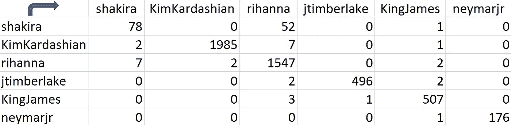

# 在没有 API 的情况下用 Python 分析 Twitter 关系

> 原文：<https://towardsdatascience.com/analyzing-twitter-relationships-in-python-without-an-api-a35b5b502cb?source=collection_archive---------14----------------------->

## 使用一些著名的 Twitter 账户进行关系分析的简单方法。


社交媒体分析是数据科学的热门话题之一。人们喜欢这些分析，并对它们感兴趣，因为每个人都熟悉这个世界。我们大部分时间都花在了推特、Instagram、脸书和其他一些社交媒体应用上。

作为一名数据爱好者，这个话题引起我的注意并不奇怪。然而，访问官方的 Twitter API 是非常具有挑战性的。于是，我搜索了另一种解决方案，找到了 [**twint**](https://github.com/twintproject/twint) 。这是一个 python 库，使你能够在没有 API 访问的情况下废弃 twitter 数据。

在本文中，我将简要介绍如何借助 twint 收集 twitter 数据，并基于一组 Twitter 用户之间的关注和提及来分析一些关系。

## 初始化 Python 代码

我们需要 **twint** 库来抓取数据，需要[**pandas**](https://pandas.pydata.org/)**来创建 dataframes，需要 [**集合**](https://docs.python.org/3/library/collections.html) 来获取列表中的分组值计数。**

```
import twint
import pandas as pd
from collections import Counter
```

**然后我们开始创建一个包含 twitter 账户的用户列表。我们的分析将包括这些用户的关系。由于代码运行时间较长，我不建议将拥有超过 **5K** 追随者的用户添加到此列表中。类似地，一个很长的列表可能也会出现同样的问题。**

**我选择了一些大家都知道的热门 Twitter 用户，让我们的分析更有趣。**

```
users = [
 **'shakira',
    'KimKardashian',
    'rihanna',
    'jtimberlake',
    'KingJames',
    'neymarjr',**
]
```

## **跟踪关系分析**

**让我们从关系分析开始，并为此编写一个名为**get _ followers**的函数，用用户名向 twint 库发送请求。该函数将返回我们的输入用户关注的用户列表。**

```
def get_followings(username):

    c = twint.Config()
    c.Username = username
    c.Pandas = True

    twint.run.Following(c)
    list_of_followings = twint.storage.panda.Follow_df

    return list_of_followings['following'][username]
```

**使用 **get_followings** 函数，我们将为用户列表中的每个人获取不同的列表，并将结果存储到一个字典( **followings** )和一个列表( **following_list** )。following_list 是所有 following 的联合版本，我们将在下一节使用它来计算最受关注的 Twitter 帐户。**

**下面的 for 循环创建了这两个变量。有时 Twitter 不响应我们的请求，在这种情况下，我们会得到一个**索引错误。对于这种情况，我在代码中添加了一个例外来跳过这些用户。****

```
followings = {}
following_list = []
for person in users:
    print('#####\nStarting: ' + person + '\n#####')
    try:
        followings[person] = get_followings(person)
        following_list = following_list + followings[person]
    except KeyError:
        print('IndexError')
```

## **我们的用户关注最多的是谁？**

**在获得以下所有列表后，我们可以简单地计算 following_list 变量中最常见的值，以获得用户中最受欢迎的帐户。为了获得最受关注的 **10 个**账户，我们将使用收藏库中的**计数器**函数。**

```
Counter(following_list).most_common(10)
```

**该函数的结果如下所示。蕾哈娜似乎被所有其他人追随，在我们的用户群中，她绝对是最受欢迎的一个。**

```
**[('rihanna', 5),
 ('RyanSeacrest', 3),
 ('BarackObama', 3),
 ('Oprah', 3),
 ('TheEllenShow', 3),
 ('kendricklamar', 3),
 ('KDTrey5', 3),
 ('Drake', 3),
 ('Nike', 3),
 ('NBA', 3)]**
```

## **遵循用户之间的关系**

**如果我们想知道我们的用户组中谁在关注谁呢？为了研究这个问题，我编写了一个 for 循环来检查用户中是否有人在另一个人的列表中。因此，它创建了一个列表字典，显示由真和假表示的以下状态。**

```
follow_relations ={}
for following_user in followings.keys():
    follow_relation_list = []
    for followed_user in followings.keys():
        if followed_user in followings[following_user]:
            follow_relation_list.append(True)
        else:
            follow_relation_list.append(False)
    follow_relations[following_user] = follow_relation_list
```

**在下面的代码中，结果字典被转换成一个 pandas 数据帧，以实现更加用户友好的可视化。数据帧的行显示跟随的用户，而列指示被跟随的用户。**

```
following_df = pd.DataFrame.from_dict(follow_relations, orient='index', columns=followings.keys())
```

**您可以在下面看到分析的输出。我们再次确认**蕾哈娜**在这张表中的受欢迎程度。所有其他人都跟着她。但是，对于**金·卡戴珊**，我们不能用类似的方式说话，根据分析，我们的用户群中只有**贾斯汀·汀布莱克**追随她。**

****

**以下关系表**

## **提及次数分析**

**提及次数是 Twitter 用户之间的另一个强有力的关系指标。下面的函数(**get _ note _ count**)就是为此而编写的，它返回两个用户之间的单向提及次数。我们应该将提到的用户名放在**提词**中，在函数中，为了更精确地分离提词，在它的开头添加了一个“ **@** ”字符。**

```
def get_mention_count(user, mention_word):

    c = twint.Config()
    c.Username = user
    c.Search = '@' + mention_word
    c.Store_object = True

    twint.run.Search(c)
    tweets = twint.output.tweets_list
    mention_count = len(tweets)
    tweets.clear()

    return mention_count
```

**在分析中，我们将使用两个嵌套的 for 循环来检索每个用户对我们组中所有其他用户的提及次数。因此，我们将得到**提 _ 关系**字典。**

```
mention_relations = {}
for mentioning_user in users:
    print('#####\nStarting: ' + mentioning_user + '\n#####')
    mention_count_list = []
    for mentioned_user in users:
        mention_count = get_mention_count(mentioning_user, mentioned_user)
        mention_count_list.append(mention_count)
    mention_relations[mentioning_user] = mention_count_list
```

**最后，我们把这本字典转换成一个熊猫的数据框架，它变成了一个可理解的和更容易解释的表格。**

```
mention_df = pd.DataFrame.from_dict(mention_relations, orient='index', columns=mention_relations.keys())
```

**我们可以看到下面提到次数表的输出。同样，行显示提到的用户，列显示提到的用户。对角线值显示了用户提到自己的次数，这些是由转发引起的。如果我们忽略这些值，我们会看到**勒布朗·詹姆斯**被小组中的每个人提及，而**蕾哈娜**看起来被除了**内马尔**之外的每个人提及。另一方面，这个团体中没有人在他们的推文中提到过内马尔。另一个有趣的推论可能是，夏奇拉在她的推文中提到蕾哈娜 52 次，然而蕾哈娜只提到她 7 次。**

****

**提及次数表**

****结论****

**我试着在著名的 Twitter 用户上解释一些基本的社交媒体分析，只是为了好玩，同时也是为了在不复杂的 python 代码的帮助下做好准备。我希望它们对你有所帮助。最后，可以肯定的是，这些分析有待改进，如果您对本文有任何建议或补充，请不要犹豫，与我们分享。**

****