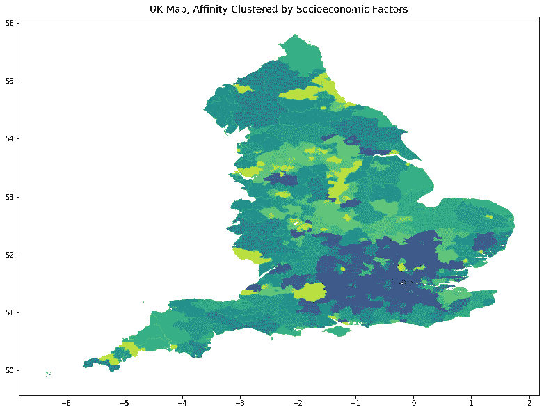
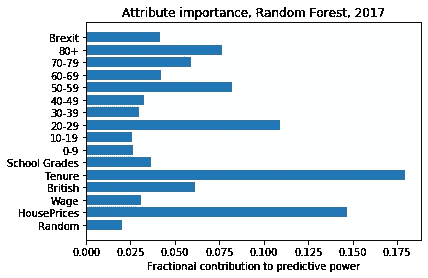
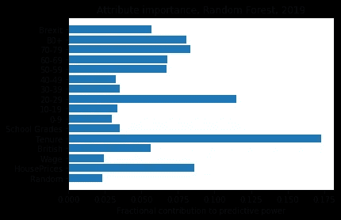

# 使用机器学习分析英国大选结果

> 原文：<https://towardsdatascience.com/analyzing-uk-general-election-results-using-machine-learning-137d130634b1?source=collection_archive---------23----------------------->

## 英格兰各地选区的聚类和分类。

## 介绍

2019 年 12 月 12 日 22:00，出口民调是英国大选结果的第一个指标。这项民意调查对英格兰、苏格兰和威尔士 144 个选区的 2 万多人进行了调查，准确预测了选举结果。这篇文章使用机器学习来展示英格兰每个选区的选举结果和社会经济条件之间的关系。这是出于对英国地缘政治格局的兴趣，特别是出于进一步了解社会和经济因素如何影响投票方向的愿望。

本文使用 8 个不同的社会经济类别对英格兰 533 个威斯敏斯特议会选区进行聚类和分类(只选择了英格兰选区，因为英国其他民族的数据更少)。相似性传播用于聚类数据，然后随机森林和 AdaBoost 技术用于分类和预测投票方向。

本报告中使用的大部分数据来自下议院网站，除了关于英国退出欧盟公投的数据是由 Hanretty 汇编的估计值(因为英国退出欧盟公投的结果没有按选区统计)。

## 数据

本文中使用的数据和包含代码清单的 Juypter 笔记本可以从[这里](https://drive.google.com/open?id=1ty-7HMlAYByL3lH0q3fFLmx5oShg0RBP)下载。

*   房价中位数:该数据记录于 2019 年 3 月，范围在利物浦、沃尔顿的 72，500 英镑至肯辛顿的 1，450，000 英镑之间。
*   周工资中位数:该数据记录于 2019 年 4 月，范围从莱斯特东部的 420 到温布尔登的 890。
*   在英国出生的居民比例:该数据记录在 2011 年人口普查中，从布伦特北部的 41%到霍顿和桑德兰南部的 98%不等。
*   住房使用权:对拥有自己住房的人的百分比的一种衡量。这一数据是在 2011 年人口普查中收集的，从哈克尼南部和肖尔迪奇的 20%到塞夫顿中部的 97%不等。
*   GCSE 成绩:2018 年 GCSE 成绩达到 5 A*到 C 的学生比例已有记录，从 Knowsley 的 38%到 Altrincham 和 Sale West 的 85%不等。
*   年龄分布:这一类别将选区居民人口划分为 9 个年龄组(0-9 岁、10-19 岁等，直到 80 岁以上)，并已作为一个社会指标包括在内。这一数据是在 2011 年人口普查中收集的。
*   英国退出欧盟立场:对每个选区投票脱离欧盟的居民百分比的估计。这一数据是从 2016 年英国退出欧盟公投结果中推断出来的，范围从哈克尼北部和斯托克纽因顿的 20%到波斯顿和斯开格内斯的 76%不等。

## 测绘

这些地块是使用 [Geopandas](http://geopandas.org/) 库结合来自 [UK-GeoJson](https://martinjc.github.io/UK-GeoJSON/) 站点的边界形状数据创建的。

# 使聚集

相似性传播(AP)是一种基于通信的聚类算法，由 Frey 和 Dueck 于 2007 年首次提出。该算法将数据点描述为网络中的一个节点，该节点通过经由图的边彼此发送信号来传达它们的聚类偏好。该通信用于定位最佳范例节点(代表它们自己的集群的最佳数据点)并将最合适的数据点分配给该集群。用于确定信号幅度的主要度量是相似性得分，其被计算为两个数据点之间的负欧几里得平方距离。使用相似性传播，首先识别和标记最小和最离散的聚类。这解释了当你离开伦敦市中心时，从暗到亮的颜色渐变，如图 1 所示。

图 1:英格兰选区使用相似性传播聚类成 32 个组。

使用 Davis Bouldin 指数，聚类的最佳数量被确定为 6。新的选区聚类如图 2 所示(使用 K-means)。伦敦市中心形成了自己独特的集群，这在英格兰其他地方是看不到的。这可能是由极高的房价推动的。

图 2:英格兰选区使用 K 均值聚类成 6 组。

# 分类

我用随机森林和 Adaboost 技术预测了每个选区的投票方向。随机森林产生的分类如下图 3 所示。

图 3: 2019 选举结果预测 vs 现实使用随机森林。使用 Photoshop 对图像进行色彩校正。

决策树分类器和随机森林在训练数据上始终达到 100%的准确率，在测试数据上达到 80-90%的准确率(当训练 2017 年和 2019 年的选举结果时)。每个属性的预测能力都是从随机森林中提取的，如图 4 所示。引入一个随机变量作为参考。任期被证明提供了关于投票方向的最多信息。对此的一种解释是，在城市里有更多的租房者，城市席位往往被工党赢得(特别是在伦敦)。

图 4:分别使用 2017 年选举和 2019 年选举结果的每个属性的预测能力。

AdaBoost 的表现相对较差，经常使用不合逻辑的属性组合来进行糟糕的分类。这是因为 AdaBoost 不能很好地处理外围数据:它会陷入尝试对错误数据点进行分类的循环中。属于众议院议长、绿党和潜在的自由民主党的席位可能会在这里引发问题。

# 结论

使用相似性传播和 K-means 聚类算法，有可能将英语选区分解成逻辑组，这些逻辑组已被绘制以便于可视化。相似性传播提供了关于哪些选区最相似以及哪些聚类最离散的信息；这最终产生了一种从伦敦市中心向外延伸的颜色渐变，这种渐变基于标签被分配的顺序。

使用随机森林可以提取每个属性的预测能力，并证明它们都为决策过程提供了有意义的贡献。分类的准确率在 80-90%之间，但是除了工党和保守党之外，没有其他席位被预测到。任期被证明是两次选举的主导因素，在 2019 年贡献了大约 19%的预测力。你可以看到 2017 年至 2019 年间英国退出欧盟立场的预测能力有了有趣的增长，这可能是由于工党席位数十年来首次转向保守党，因为他们希望看到英国退出欧盟完成。

# 参考

[1]汉莱蒂，克里斯。"面积插值和英国的欧盟成员资格公投."《选举、舆论与政党杂志》27.4(2017):466–483。

[2]弗雷、布伦丹·j 和德尔伯特·杜克。"通过在数据点之间传递消息进行聚类."科学 315.5814(2007):972–976。