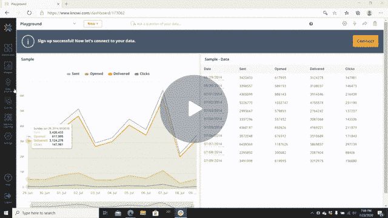
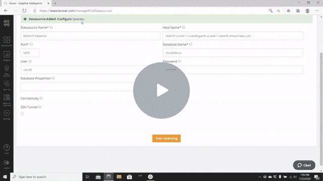
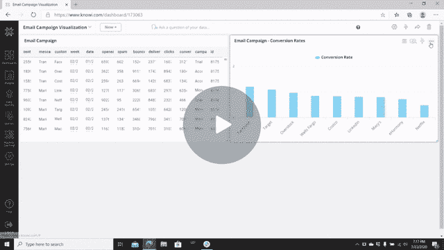

# 分析和可视化亚马逊红移数据—教程

> 原文：<https://towardsdatascience.com/analyzing-visualizing-amazon-redshift-data-tutorial-239aa6443d43?source=collection_archive---------58----------------------->

## 学习使用 Knowi 分析和可视化亚马逊红移数据

[活动发起人](https://unsplash.com/@campaign_creators?utm_source=medium&utm_medium=referral)在 [Unsplash](https://unsplash.com?utm_source=medium&utm_medium=referral) 上的照片

# 目录

*   [简介](#3563)
*   [设置 Amazon 红移数据源](#3988)
*   [从数据源查询数据](#0666)
*   [分析和可视化您的数据](#8a05)
*   [向您的可视化添加明细](#da3e)
*   [使用基于搜索的分析查询您的数据](#dd47)
*   [总结](#bd72)

# 介绍

[亚马逊红移](https://aws.amazon.com/redshift/?whats-new-cards.sort-by=item.additionalFields.postDateTime&whats-new-cards.sort-order=desc)是亚马逊基于云的关系数据库管理系统(RBDMS)。像亚马逊的大多数产品一样，亚马逊红移非常受欢迎，这是有原因的:它不仅是目前最快的云数据仓库，而且每年都在变得更快。

在 Knowi，我们为分析和报告提供与[亚马逊红移的广泛原生集成。这使我们的用户能够不受任何限制地利用 Redshift 的速度和可扩展性，并快速分析来自 Redshift 的数据，形成有价值的见解。如果您有兴趣学习如何使用 Knowi 来分析来自 Amazon Redshift 的数据，那么您来对地方了。](https://www.knowi.com/redshift-analytics)

# 设置您的 Amazon 红移数据源

登录到你的 [Knowi 试用账户](https://www.knowi.com/free-trial)后，你要做的第一件事就是连接到 Amazon Redshift 数据源，并确认你的连接成功。这是怎么回事:

1.在屏幕左侧的面板上找到“数据源”并点击它。

2.前往“数据仓库”，点击亚马逊红移。

3.我们不需要改变这里的任何参数；我会自动为我们输入所有信息。只需点击屏幕底部的“测试连接”。

4.确认连接成功后，单击“保存”

您的数据源现在已经设置好了。干得好！

# 从数据源中查询数据

您的数据源现在已经设置好了，这意味着是时候开始查询数据了。下面是如何做到这一点:

1.保存数据源后，您应该会在页面顶部收到一个警告，提示“Datasource Added”。配置查询。点击单词查询。(否则，您可以返回到屏幕左侧的面板，转到“数据源”下方，然后单击“查询”。然后从右上角选择“新查询+”。)

2.在屏幕左上方的“报告名称*”中为您的报告命名。我们将在这里分析一个电子邮件活动，所以我们称之为“电子邮件活动”

3.在查询构建器中，单击“表”栏内部。向下滚动到“public.demo_sent”并点击它。这将自动设置一个红移查询，返回该表中的数据。

4.前往屏幕的左下方，点击蓝色的“预览”按钮，预览数据。您应该看到电子邮件活动的结果，其中包括各种数据，如发送、打开和点击的电子邮件数量，以及消息类型和客户。

5.查看完数据后，滚动到屏幕右下角，点击绿色的“保存并立即运行”按钮。

一旦您的查询成功完成，Knowi 会自动将您的查询结果保存为虚拟数据集，然后将该查询的结果作为数据集存储在其[弹性数据仓库](https://www.knowi.com/docs/data-warehouse.html)中。每次运行查询时，我都会这样做。

# 分析和可视化您的数据

尽管你花了一点时间查看你的数据，但是你不太可能从它的格式中学到任何东西。利用我们的数据，我们可以发现很多事情，但假设我们必须回答一个紧迫的问题:发送给某些客户的电子邮件有更高的转化率吗？Knowi 允许我们有效地回答这个问题，然后通过以下步骤可视化我们的结果:

1.前往屏幕左侧面板的顶部，点击“仪表板”单击橙色加号图标并命名您的仪表板。我们称之为“电子邮件可视化”

2.回到面板，就在“仪表板”下面，点击“小部件”选择您刚刚创建的“电子邮件活动”小部件，并将其拖到您的控制面板上。

3.现在，你看到的可视化只是一个数据网格。我们将把它改成对眼睛稍微好一点的东西，但是首先我们必须添加我们正在寻找的度量。为此，请滚动到小部件的右上角。单击 3 点图标，然后向下滚动到“分析”并单击它。

4.前往屏幕的左上角，找到“+添加功能”我们要创建的函数非常简单:它叫做“转化率”，计算方法是将“转化率”除以“发送量”为了进行计算，点击“+添加函数”，然后将“名称”设置为转换率，将“操作”设置为(转换率/发送数)*100。

5.现在，我们看到的只是每个电子邮件活动的转换率。我们希望看到的是按客户分组的所有电子邮件活动的转换率，我们还希望我们的数据按转换率排序。首先，我们需要将“customer”栏从屏幕左侧拖动到“Grouping/Dimensions:”框中，然后放开。

6.现在，我们只需将新的“转换率”指标从“字段/指标:”拖动到“排序方式:”并将方向改为降序，以便从最高转换率到最低转换率对数据进行排序。如你所见，脸书邮件的转化率刚刚超过 1%，而网飞邮件的转化率不到 0.5%。

7.现在是时候想象一切了。回到屏幕顶部，点击“可视化”将可视化类型从“数据网格”更改为“列”

8.现在你可以看到每个客户的电子邮件转化率排名。前往屏幕的右上角，点击看起来像两张纸的“克隆”图标。将此命名为“电子邮件活动—转化率”,然后单击橙色的“添加到仪表板”按钮。

就这样，您将原始数据转化为包含有价值信息的可视化数据。脸书的转换率大约是网飞的两倍半，这一事实可能会在未来的决策中得到考虑。

# 向可视化添加明细

改进我们的可视化的下一步是通过添加钻取使它更具交互性和可导航性。向下钻取是 Knowi 中的一个强大功能，允许用户只需点击一下鼠标，就可以更深入地钻取原始数据的过滤部分。下面是我们如何向小部件添加明细:

1.单击新部件右上角的 3 点图标，向下滚动到“明细”并单击它。

2.将您的钻取类型设置为“Widget”，设置为在单击“Customer”时钻取“Email Campaign”，并在可选的钻取过滤器中设置 customer = customer。单击明细弹出窗口右下角的橙色“保存”按钮。

3.点击转化率最高的客户脸书进行测试。如您所见，这将返回脸书作为客户的所有活动。然后回到你最初的可视化，回到你的部件的右上角，点击那个角中间的左箭头图标。

# 使用基于搜索的分析查询您的数据

您的仪表板已经设置好，这意味着您已经做好充分准备，可以使用[基于搜索的分析](https://www.knowi.com/search-based-analytics/)来查询您的数据。这意味着您可以与任何讲英语的人分享您的仪表板和数据，即使他们不熟悉 Knowi。以下是如何使用基于搜索的分析来查询您的数据:

1.前往你原来的“电子邮件活动”部件的右上角，点击 3 点图标。向下滚动并点击“分析”

2.假设您想要按月监控电子邮件活动，以查看不同月份的情况是否有所不同。为了做到这一点，在你的屏幕顶部的搜索栏中输入“发送总量，打开总量，点击总量，按月转换总量”，然后点击回车。Knowi 的[自然语言处理](https://www.knowi.com/natural-language-bi)会很快给你提供你想要的东西。

3.现在是时候可视化这些数据了。回到“可视化”，将可视化类型设置为“区域”这将显示我们发送的电子邮件总数，以及每月的转换总数。转化率如此之低，以至于我们肉眼很难看到数字的任何变化，但这没关系。

4.回到右上角，再次点击“克隆”图标。将此小部件命名为“发送和转换—区域”，克隆它，然后将其添加到您的仪表板。

5.最后，回到你的仪表板。将新的“电子邮件活动—区域可视化”小部件拖到仪表板的顶部，这将使原来的“电子邮件活动”小部件位于底部。

这些数据传达了另一个有价值的见解:这些电子邮件活动收到的打开和点击数量很低，他们发送的每封电子邮件的转换数量也非常低。虽然这些数字每月都保持在较低水平，但它们似乎确实随着发送的电子邮件总数的增加而增加。

同样重要的是要记住，我们不需要丰富的编码知识或 Knowi 经验来做我们刚刚做的事情。这里的低使用门槛使得任何好奇的英语使用者都可以使用 Knowi 的仪表盘。

# 摘要

总之，我们连接到一个 Amazon Redshift 数据源，并对我们的新数据源进行查询。这将我们的查询结果存储在 Knowi 的弹性数据仓库中。然后，我们分析并可视化我们的数据，并向我们的可视化添加钻取信息，使用户能够钻取原始数据中他们希望了解更多信息的过滤部分。最后，我们使用基于搜索的分析来回答另一个问题，并将我们的答案可视化。