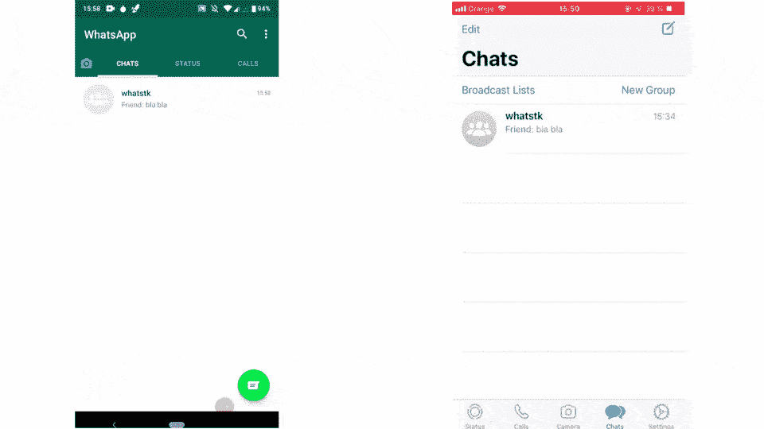

# 探索 WhatsApp 数据

> 原文：<https://towardsdatascience.com/analyzing-whatsapp-chats-with-python-20d62ce7fe2d?source=collection_archive---------16----------------------->


来自 [Unsplash](https://unsplash.com) 的[莫兰](https://unsplash.com/@ymoran)的照片

## 使用 Python 分析您的 WhatsApp 聊天数据

分析数据可能会很吸引人，很有趣，并且能够给出关于某个主题的非常有趣的见解。当这些数据与我们或我们的环境联系在一起时，分析这些数据就变得更加有趣，因为这些信息总是近在眼前，但却从来没有从分析的角度来看待过。

为此，我们通过社交网络与他人的互动是一个很好的数据来源。如今，我们每天都使用社交网络和互联网来工作或休闲。事实证明，这些方法真的很有帮助，让一些过程变得更有效率，甚至缓解了异地恋。它们影响了我们交流的方式，甚至重塑了我们的社交行为。社交网络注册，现在比以往任何时候都更需要*我们如何*和*什么*交流。

在这方面， [WhatsApp](https://www.whatsapp.com/) 已经成为最广泛使用的与他人聊天的应用之一[【1】](#outline)。在这篇文章中，我将尝试展示我们如何使用 **python** 从 WhatsApp 聊天中轻松提取和**分析数据。**

## 概述

这篇文章的概要如下

*   从手机中导出 WhatsApp 聊天
*   使用 python 库 whatstk
*   结论

# 从手机中导出 WhatsApp 聊天

从手机导出聊天内容的过程相当简单。但是，它会根据您的移动操作系统而变化(参见下面的剪辑)。

导出聊天时，确保选择无媒体的*选项。一旦生成，您可以通过邮件发送给自己，并下载/保存到您的计算机上。*

在 **Android** 上，可能会导出几个文件。我们只对文本文件感兴趣(即`txt`扩展名文件)。在 **iOS** 上，聊天被导出为`zip`。一旦你把它下载到你的电脑上，解压它以获得`txt`。



左: *Android 9，WhatsApp 2.20.123(自带源码，录屏)；右:iOS 12，WhatsApp 2.20.31(自带源码，好友* [*塞尔吉的*](https://www.instagram.com/sergidrum) *)*

# 使用 python 库 whatstk

[**whatstk**](https://lcsrg.me/whatstk) 是一个 [GPLv3 许可的](https://github.com/lucasrodes/whatstk/blob/master/LICENSE) python 库，它是我帮助开发的，提供了探索、分析和可视化 WhatsApp 聊天的工具。它支持多种聊天格式，并分别使用 [pandas](https://pandas.pydata.org/) 和 [plotly](https://plotly.com/python/) 来处理和可视化数据。

写这篇帖子的时候，最后一个稳定版本是 [0.4.1](https://pypi.org/project/whatstk/0.4.1/) 。要安装它，只需使用画中画。

```
$ pip install whatstk
```

*要求至少 Python 3.7。*

## 加载聊天

我们将从使用类`WhatsAppChat`及其方法`from_source`将聊天加载到 python 开始。对于这个演示，我将使用我使用[库工具](https://whatstk.readthedocs.io/en/stable/source/api/whatstk.whatsapp.html#module-whatstk.whatsapp.generation)随机生成的[聊天](http://raw.githubusercontent.com/lucasrodes/whatstk/develop/chats/whatsapp/lorem-2000.txt)。以下是摘录:

```
[2019-04-16 02:09] +1 123 456 789: Et labore proident laboris do labore ex. 
[2019-04-16 03:01] Mary: Reprehenderit id aute consectetur aliquip nostrud culpa, fugiat ex deserunt magna, nostrud officia id aliquip in fugiat. 🇩🇰
[2019-04-17 12:56] John: Amet magna officia ullamco pariatur ipsum cupidatat, laborum sint nostrud adipiscing sit. ✈
[2019-04-17 13:30] Mary: Cillum aute et cupidatat ipsum, occaecat lorem sint tempor ullamco elit. 🏊🏻
[2019-04-17 15:09] John: Eiusmod irure laboris dolore anim, velit velit proident qui commodo. 
[2019-04-17 17:55] Mary: Aute sed quis deserunt, veniam non veniam qui ipsum velit, aliqua sunt eu incididunt incididunt duis. 🤨
```

在您的情况下，更改参数`filepath`的值，使其指向您导出的聊天。聊天被自动解析，加载为数据帧并存储为类属性`df`。

**注意**:如果您无法以这种方式加载您的聊天，您可能需要使用 hformat 输入参数手动指定您的聊天标题的[格式](https://whatstk.readthedocs.io/en/stable/source/getting_started/hformat.html)[。对于我们的聊天，应该是这样的:](https://whatstk.readthedocs.io/en/stable/source/code_examples/load_chat_hformat.html)

## 首次数据概述

首先，我们将获得一些关于聊天活动的基本信息。

我们可以获得第一个和最后一个发送消息的时间戳，这给了我们一个初始的时间上下文。接下来，我们获取每个用户发送的消息数量，以及聊天活动期间每天发送的消息量。为了完成这个，我们利用了 pandas 提供的工具，特别是它的 *groupby* 方法。

我们注意到记录的聊天开始于 2019 年 4 月 16 日，结束于 2020 年 6 月 13 日。此外，朱塞佩和 2019 年 7 月 1 日似乎相当活跃！

## 谁说的最多？

现在，让我们仔细看看每个用户发送的消息数量。为此，我们使用类`FigureBuilder`，它简化了生成和显示基于绘图的可视化的过程。

我们使用累积计数，这意味着对于给定的一天 *D* ，我们对之前每个用户的所有干预进行计数。

虽然一个用户发送了很多消息，但这并不一定意味着他们发送了更多的字符。为了找出谁发送了最多的字符，我们可以使用函数的参数`msg_len=False`。

## 用户消息长度

我们现在将看看每个用户发送的消息的长度，因为一些用户倾向于发送更少但更长的消息，而另一些用户发送几条短消息(那就是我)。

Mary 似乎有更高的中位数，这可能表明与聊天中的其他用户相比，他们倾向于发送更长的消息。使用平均值可能会产生误导，因为它会受到离群值(即长消息)的严重影响

## 用户交互

最后，最后一幅图展示了用户之间是如何互动的。具体来说，它显示了一个矩阵，该矩阵计算了从用户 *A* 发送到用户*b*的响应数量。库做出[假设](https://whatstk.readthedocs.io/en/stable/source/whatstk.analysis.html#whatstk.analysis.get_response_matrix)消息 *n* 总是对前一消息 *n-1* 的响应。虽然这可能与事实相去甚远，但它仍然设法捕捉到了某种现实。

在这个随机生成的聊天中，我们观察到最大的消息流是从 Giuseppe 到+1 123 456 789。

# 结论

在这篇文章中，我们看到了如何用 python 加载 WhatsApp 聊天作为数据帧，并使用 plotly 可视化相关见解。可视化效果是使用工具生成的，但是，一旦聊天被加载，可能性是无限的。

我个人觉得这真的很有趣，因为每次我探索和分析 WhatsApp 聊天时，我最终都会使用一个独特的、动态的、可访问的数据集。

你可以在这里查看这篇文章[的代码。](https://gist.github.com/lucasrodes/f9a4183d769b7daacd9ea8405a5a08db)

# 变更日志

*   2020 年 7 月 30 日:文章发表。`whatstk`版本 v0.3.1
*   2021 年 5 月 27 日:修复断开的链接。`whatstk`版本 0.4.1

# 参考

[1] Birgit Bucher， [WhatsApp，微信和 Facebook Messenger 应用——全球 Messenger 使用、渗透和统计](https://www.messengerpeople.com/global-messenger-usage-statistics/)，Messenger People 2020，博客文章