# 分析#WhenTrumpIsOutOfOffice 推文

> 原文：<https://towardsdatascience.com/analyzing-whentrumpisoutofoffice-tweets-7169b3e5ca35?source=collection_archive---------45----------------------->

## R 中清理和分析 tweets 的分步指南


由[达伦·霍尔斯特德](https://unsplash.com/@darren1303?utm_source=medium&utm_medium=referral)在 [Unsplash](https://unsplash.com?utm_source=medium&utm_medium=referral) 上拍摄的照片

随着美国下届总统大选的临近，我想知道人们对被提名人的看法。现任总统会继续留在白宫，还是我们会看到一位不那么愤怒的推特咆哮的新美国总统？

## 获取数据集

我用 R 包`rtweet`下载了标签为# WhenTrumpIsOutOfOffice 在 2020 年 3 月发的推文。结果，我找到了 6000 多条带有标签的推文。

```
library(rtweet)**# create token named "twitter_token"**
twitter_token <- create_token(
  app = appname,
  consumer_key = consumer_key,
  consumer_secret = consumer_secret,
  access_token = access_token,
  access_secret = access_secret)**#download tweets into csv files**
tweets <- search_tweets(
  "#WhenTrumpIsOutOfOffice", n = 18000, include_rts = FALSE)df <- apply(tweets,2,as.character)
write.csv(df,"csv file path" )**#read the csv file**
text <- read.csv("csv file path", stringsAsFactors = FALSE)
```

## 清理数据集

像任何其他数据科学项目一样，数据清理是必不可少的。在本文中，我从 tweet 文本中删除了 URL、标签和常用的停用词。

```
**#data pre-processing**
remove_reg <- "&amp;|&lt;|&gt;"
text <- text %>%
  mutate(text = str_remove_all(text, remove_reg)) %>%
  mutate(text = tolower(text)) %>%
  mutate(text = str_replace_all(text, regex("@\\w+"),"" )) %>%
  mutate(text = str_replace_all(text, regex("http\\w+"),"" )) %>%
  mutate(text = str_replace_all(text, regex("://t.co/\\w+"),"" ))%>%
  mutate(text = str_replace_all(text, regex("<\\w+"),"" )) %>%
  mutate(text = str_replace_all(text, regex("/+[a-zA-Z0-9<>]+"),"")) %>%
  mutate(text = str_replace_all(text, regex("fa[a-zA-Z0-9+<>]+"),"" )) %>%
  mutate(text = str_replace_all(text, regex("#[a-zA-Z0-9<>]+"),"" ))
```

接下来，我使用 R 包`udpipe`来注释我们下载的 tweets。

```
library(udpipe)**#download and load the pre-trained models**
udmodel <- udpipe_download_model(language = "english")
udmodel <- udpipe_load_model(file = udmodel$file_model)**#annotate the data frame with uipipe model**
tidy_text <- udpipe_annotate(udmodel, x = text$text)
tidy_text <- as.data.frame(tidy_text)
```

注释完数据集后，我们可以从数据集中删除停用词。

```
**#Remove stop words**
my_stop_words <- tibble(
  word = c("#whentrumpisoutofoffice", "[@realdonaldtrump](http://twitter.com/realdonaldtrump)", "trump","ill"))**#Prepare stop words tibble**
all_stop_words <- stop_words %>%
  bind_rows(my_stop_words)tidy_tweets <- text %>%
  anti_join(all_stop_words, by = "word")**#To check how many words removed after stop word anti join, deleted** 
tibble(
  total_words = nrow(text),
  after_cleanup = nrow(tidy_tweets))
```

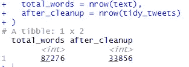

数据清理前后的字数

## 数据分析

在本文中，您将发现四种不同的文本挖掘技术应用于推文:

```
1\. Most frequent words in the tweets
2\. Keyword extraction
3\. Sentiment analysis
4\. Word association network graphs
```

## 转发次数最多的文本

两条推文的转发量超过了一千条:

当特朗普下台时，这些无法无天、腐败、肆无忌惮的白痴将和他一起消失。 ***— 1216 转推***

我会不由自主地被投票让糟糕的政客下台所吸引。我刚刚开始投票；它就像一块磁铁。投票吧。我都不等了。当它是民主的时候，他们让你做它。# when trumpisoutofoffice***—1101 转发***

## 单字和双字的词频

流行的文本挖掘技术之一是找出一个单词在一个或多个文档中出现的频率。在这篇文章中，我们将看看单字和双字的词频。虽然单个词让我们对文档中最常用的词有所了解，但双词通常能给读者更好的洞察力。

从下面的条形图中，我们可以做出一些假设:

*   特朗普卸任时，将是 2025 年 1 月
*   当特朗普不在办公室时，人们会去参加派对(“派对”在推文中出现了 165 次)

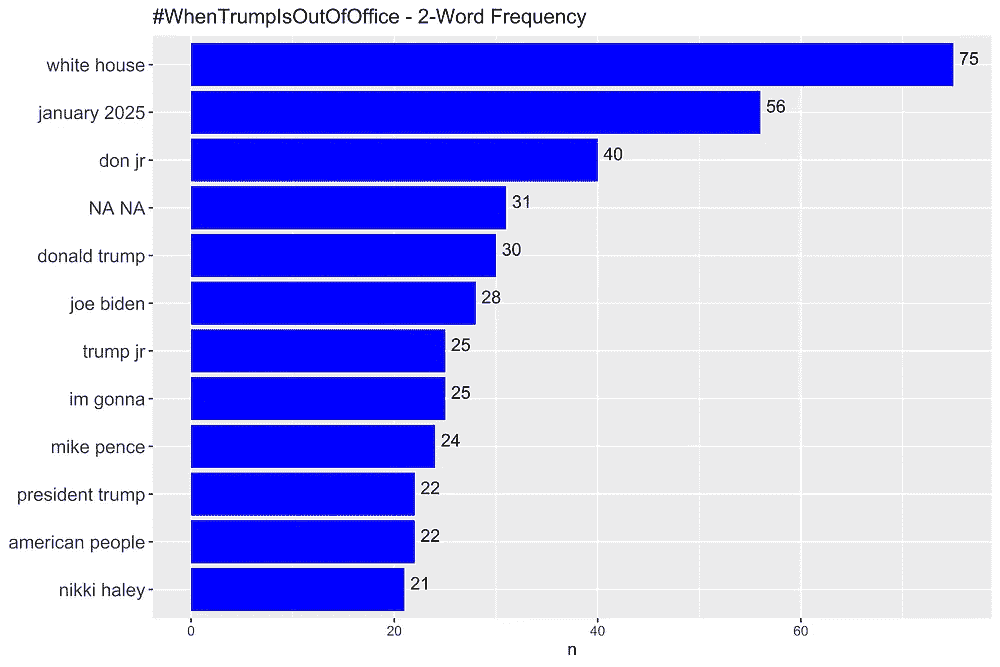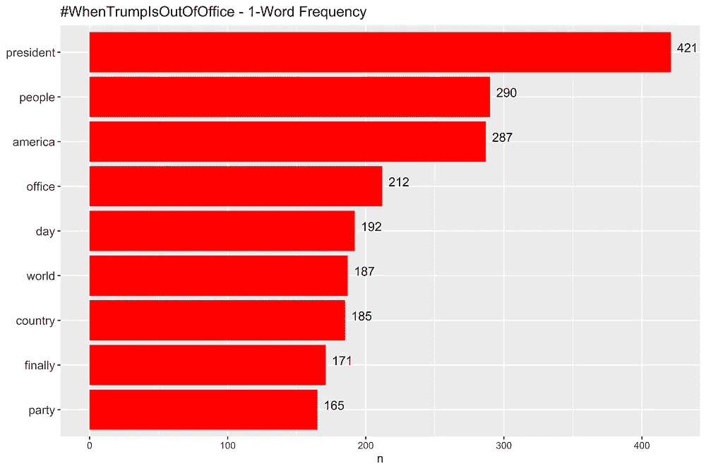

词频条形图

```
**#Unigram bar chart**
tidy_tweets %>%
  count(word, sort = TRUE) %>%
  mutate(word = reorder(word, n)) %>%
  filter(n > 150) %>%
  ggplot(aes(word, n)) +
  geom_col(fill = "red") +
  xlab(NULL) +
  coord_flip() +
  ggtitle("#WhenTrumpIsOutOfOffice - 1-Word Frequency") +
  geom_text(aes(x = word, label = n), vjust = 0, hjust = -0.3, size = 4)**#Bigram bar chart (showing codes for the bar chart only)** ...
bigrams_united %>%
  count(bigram, sort = TRUE) %>%
  mutate(bigram = reorder(bigram, n)) %>%
  filter(n > 20) %>%
  ggplot(aes(bigram, n)) +
  geom_col(fill = "blue") +
  xlab(NULL) +
  coord_flip() +
  ggtitle("#WhenTrumpIsOutOfOffice - 2-Word Frequency") +
  geom_text(aes(x = bigram, label = n), vjust = 0, hjust = -0.3, size = 4)
```

除了找出词频，我们还可以使用预先构建的算法/包快速提取关键词。在我们的例子中，我使用 RAKE 方法(快速自动关键字提取)提取关键字，该方法在 udpipe R 包中可用。

根据下面的 RAKE 关键字条形图，我们可以得出以下结论:

*   得分最高的两个关键词是“白宫”和“新总统”。人们担心特朗普是否会继续他第二个任期，或者被新总统取代。
*   与词频的结果类似，人们计划在特朗普离任时举办最大的派对
*   有趣的是，“更好的地方”也在 RAKE 关键字列表的顶部

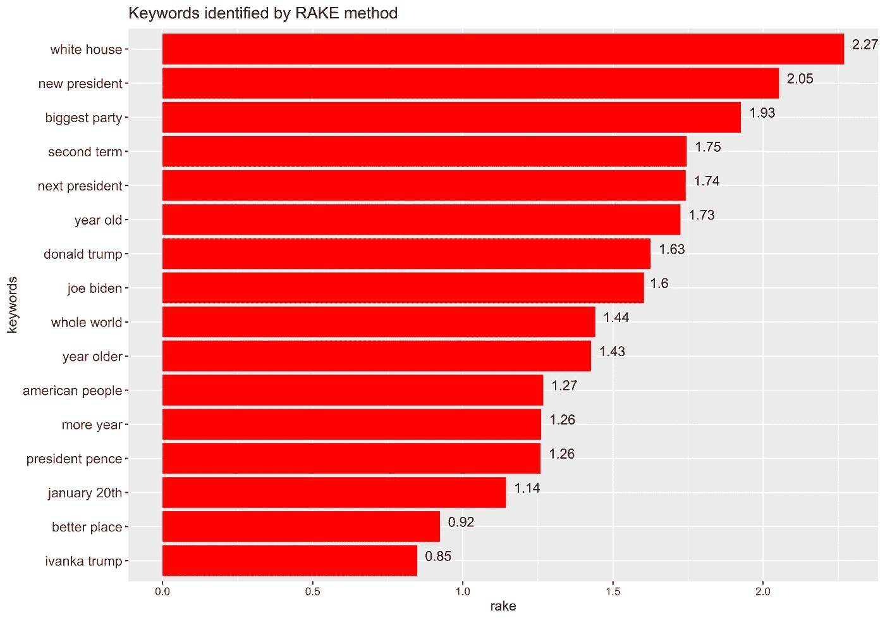

RAKE 方法确定的关键字条形图

```
**#Keywords identified by RAKE method bar chart**
stats <- keywords_rake(x = tidy_text, term = "lemma", group = "doc_id", 
                       relevant = tidy_text$upos %in% c("NOUN", "ADJ"))
stats$key <- factor(stats$keyword, levels = rev(stats$keyword))stats %>%
  **#filter data**
  filter(freq > 10 & ngram > 1) %>%
  **# set value for x, y, and fill**
  ggplot(aes(x = reorder(keyword, rake), y =  rake  )) +
  **# show in bars**
  geom_col(fill = "red") +
  **# flip the bars to be horizontal**
  coord_flip() +
  **# show value labe**l
  geom_text(aes(label = round(rake, digits = 2), vjust = 0, hjust = -0.3 )) +
  **# change y-axis name**
  xlab("keywords")+
  **# add title**
  ggtitle("Keywords identified by RAKE method") +
  **# hide legend**
  theme(legend.position = "none")
```

另一个有趣的文本挖掘技术是给每个单词一个语法标记，称为词性标记(POS)。在这种情况下，我们指定从 tweets 中提取名词短语。

POS 标记条形图的一些要点:

*   当特朗普不在办公室时，与乔·拜登相比，迈克·彭斯/彭斯总统是被频繁提及的短语
*   当特朗普离开办公室时，人们松了一口气

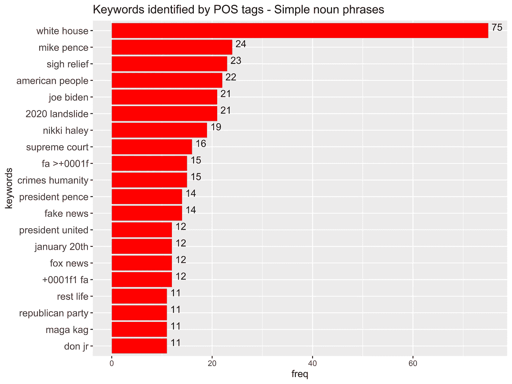

由词类标签识别的关键字—简单名词短语条形图

```
**#Keywords identified by POS tags - Simple noun phrases bar chart**
tidy_text$phrase_tag <- as_phrasemachine(tidy_text$upos, type = "upos")
stats <- keywords_phrases(x = tidy_text$phrase_tag, term = tolower(tidy_text$token), 
                          pattern =  "(A|N)*N(P+D*(A|N)*N)*", 
                          is_regex = TRUE, detailed = FALSE)
stats <- subset(stats, ngram > 1 & freq > 100)
stats$key <- factor(stats$keyword, levels = rev(stats$keyword))stats %>%
 **#data**
  #filter(freq > 100 & ngram > 1  ) %>%
 **# set value for x, y, and fill**
  ggplot(aes(x = reorder(keyword, freq), y =  freq  )) +
 **# show in bars**
  geom_col(fill = "red") +
 **# flip the bars to be horizontal**
  coord_flip() +
 **# show value label**
  geom_text(aes(label = freq, vjust = 0, hjust = -0.3 )) +
 **# change y-axis name**
  xlab("keywords")+
 **# add title**
  ggtitle("Keywords identified by POS tags - Simple noun phrases") +
 **# hide legend**
  theme(legend.position = "none")
```

## 情感分析

情感分析是自然语言处理(NLP)中的一个领域，它试图识别文本数据中的情感。舆情分析可以让我们快速了解公众对特定话题或个人的情绪。因此，Twitter 是文本挖掘的绝佳数据源，在那里你可以找到大量公开表达的观点。

## #WhenTrumpIsOutOfOffice 的总体喜好度

使用“NRC”词典，我们可以将单词标记为 8 种基本情绪(信任、期待、恐惧等)。)和两种情绪(正面和负面)。

在我们的例子中，我们看到推文中正面和负面词汇的分布几乎相等。请注意“信任”在其他情绪中所占的比例最高，而“惊讶”所占的比例最少。在下一节中，我们将详细了解与情感和情绪相关的词汇。

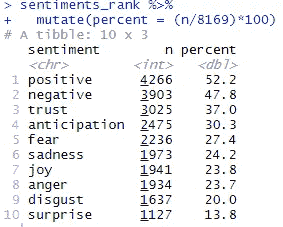

情感排名列表

```
**#Sentiment ranking list**
nrc_words <- tidy_tweets %>%
  inner_join(get_sentiments("nrc"), by = "word")**#Rank of sentiments**
sentiments_rank <- nrc_words %>%
  group_by(sentiment) %>%
  tally %>%
  arrange(desc(n))**#Find percentage**
sentiments_rank %>%
  mutate(percent = (n/8169)*100)
```

我们也可以用饼状图的形式来显示情感排名:

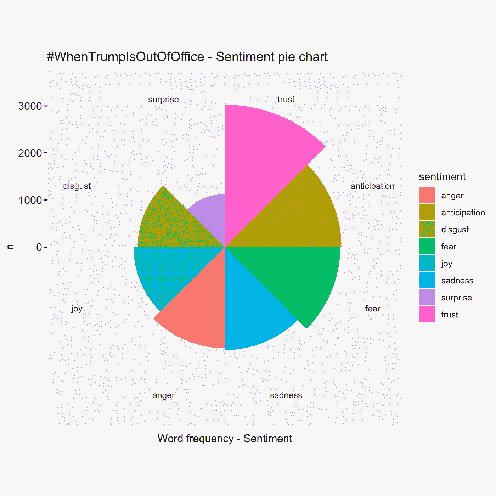

按情感分类的词频饼图

```
**#Word frequency pie chart categorized by sentiments**
sentiments_rank_clean <- sentiments_rank %>%
  filter(sentiment != "positive") %>%
  filter(sentiment != "negative")**# Create bar chart first**
bp<- ggplot(sentiments_rank_clean, aes(x=reorder(sentiment, -n), y=n, fill=sentiment))+
  geom_bar(width = 1, stat = "identity")**#Turn bar chart into a pie chart** pie <- bp + coord_polar("x", start=0) +
  ggtitle("#WhenTrumpIsOutOfOffice - Sentiment pie chart") +
  xlab("Word frequency - Sentiment")
```

## 基于情感的词频

让我们看看出现在“信任”类别中的单词，它的词频最高。请注意,“总统”这个词出现了 400 多次。

其他有趣的见解:

*   “地狱”一词是愤怒、恐惧和悲伤情绪类别的首选。
*   “终于”这个词是另一个排在厌恶、喜悦和惊讶榜首的词。
*   如果你仔细看看负面情绪下面的单词，你会发现大多数单词都与仇恨、监狱等有关。而不是与悲伤或失望相关的词语。

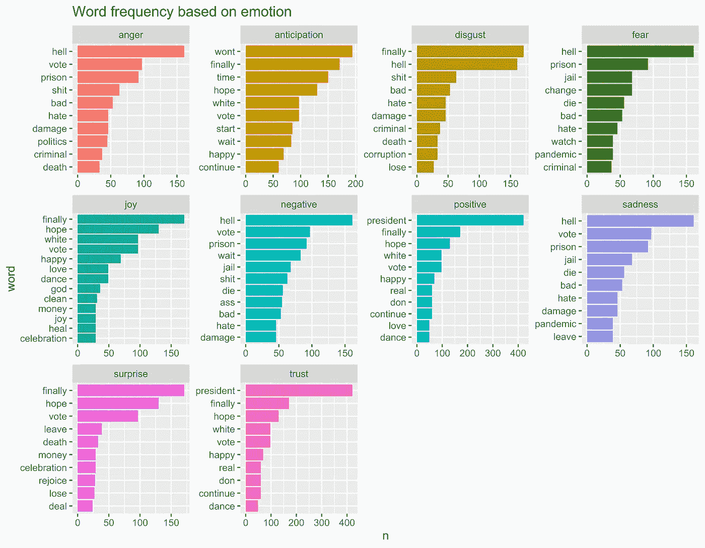

基于情绪的词频

```
**#Word frequencies based on emotions**
nrc_words %>%
 **# Count by word and sentiment**
  count(word, sentiment) %>%
 **# Group by sentiment**
  group_by(sentiment) %>%
 **# Take the top 10 words for each sentiment**
  top_n(10) %>%
  ungroup() %>%
  mutate(word = reorder(word, n)) %>%
 **# Set up the plot with aes()**
  ggplot(aes(word, n, fill = sentiment)) +
  geom_col(show.legend = FALSE) +
  facet_wrap(~ sentiment, scales = "free") +
  coord_flip() +
  ggtitle("Word frequency based on emotion")
```

## 阳性词云

我们还可以提取与积极和消极情绪相关的单词，并将它们绘制成单词云。

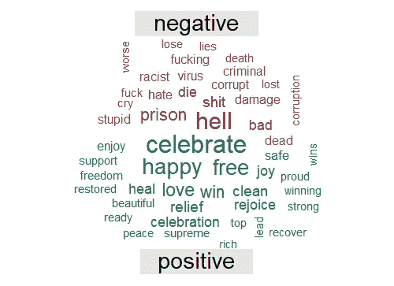

标签# WhenTrumpIsOutOfOffice 的肯定性词云

```
**#Positivity word cloud for the hashtag: #WhenTrumpIsOutOfOffice**
positivity_wordcloud <- tidy_tweets %>%
  inner_join(get_sentiments("bing"), by = c("word" = "word")) %>%
  count(word, sentiment, sort = TRUE) %>%
  acast(word ~ sentiment, value.var = "n", fill = 0) %>%
  comparison.cloud(colors = c( "#A32D39","#177255"),  title.size = 1.8,
                   max.words = 50,scale=c(2,0.7))
```

## #WhenTrumpIsOutOfOffice 的词关联图

最后，我们还可以看到一条 tweet 和整个 tweet 文档中的单词是如何相互关联的。

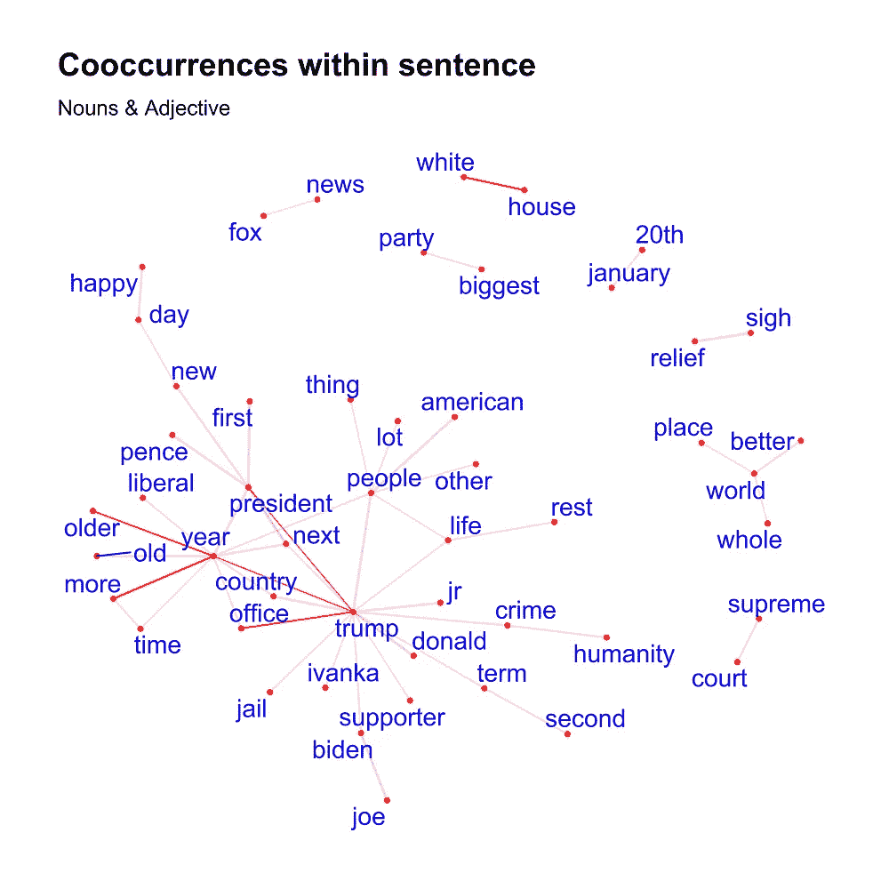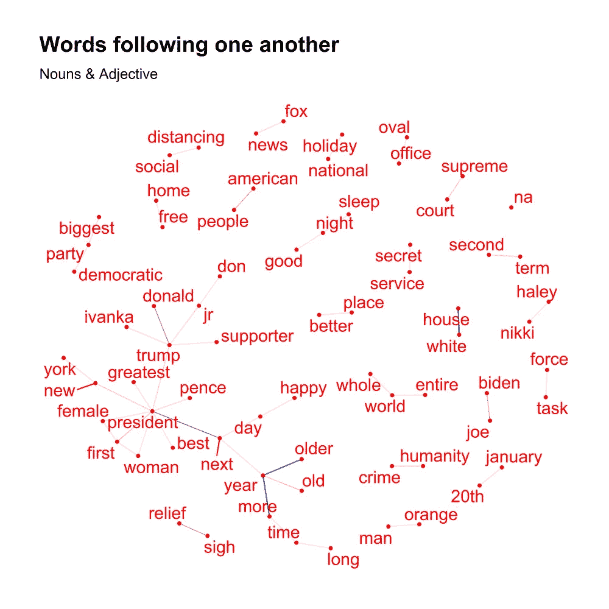

#WhenTrumpIsOutOfOffice 的词联想网络图

左边的网络图标题为“句内共现”，显示了在一个句子中经常一起使用的短语。在网络图中，节点代表年度字母中使用的单词，边(链接)的阴影反映每个单词之间的紧密程度。如果术语关系密切，边缘的色调就越暗。两对单词在图表中脱颖而出，这是“长期”和“利润少”的单词组合。

至于右边的网络图，该图向我们显示了在一个文档中彼此“相邻”的单词。在这个图表中，我们可以看到“Pence”和“female/ woman”与单词“president”密切相关

```
**#Cooccurrences within sentence network graph**
**#how many times nouns and adjectives are used in the same sentence**
cooc <- cooccurrence(x = subset(tidy_text, upos %in% c("NOUN", "ADJ")), 
                     term = "lemma", 
                     group = c("doc_id", "paragraph_id", "sentence_id"))library(igraph)
library(ggraph)
library(ggplot2)wordnetwork <- head(cooc, 50)
wordnetwork <- graph_from_data_frame(wordnetwork)
ggraph(wordnetwork, layout = "fr") +
  geom_edge_link(aes(edge_alpha = cooc), edge_colour = "red") +
  geom_node_point(color = "red", size = 1) +
  geom_node_text(aes(label = name), col = "blue", size = 5, repel = TRUE) +
  theme_graph(base_family = "Arial") +
  theme(legend.position = "none") +
  labs(title = "Cooccurrences within sentence", subtitle = "Nouns & Adjective")**#Words following one another network graph**
cooc <- cooccurrence(tidy_text$lemma, relevant = tidy_text$upos %in% c("NOUN", "ADJ"), skipgram = 1)
dev.off()
head(cooc)
wordnetwork <- head(cooc, 50)
wordnetwork <- graph_from_data_frame(wordnetwork)
ggraph(wordnetwork, layout = "fr") +
  geom_edge_link(aes( edge_alpha = cooc),edge_colour = "blue") +
  geom_node_point(color = "red", size = 1) +
  geom_node_text(aes(label = name), col = "red", size = 5,  repel = TRUE) +
  theme_graph(base_family = "Arial") +
  labs(title = "Words following one another", subtitle = "Nouns & Adjective") +
  theme(legend.position = "none")
```

# 结论

总的来说，我们已经导出了几个关键词，从整体上探索了单词与#WhenTrumpIsOutOfOffice 的关系，并能够做出以下假设:

*   人们担心特朗普卸任后，谁将成为下一任美国总统。总统会继续他的第二个任期，还是他的副总统会取代他？或者我们最终会看到这个国家的第一位女总统吗？
*   总的来说，积极情绪与解脱和庆祝有关，而消极情绪与伤害和“坐牢”有关。