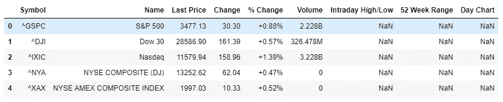
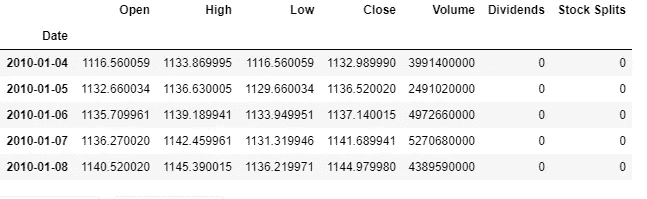
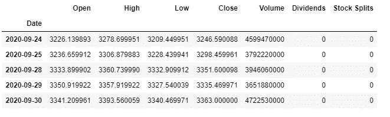
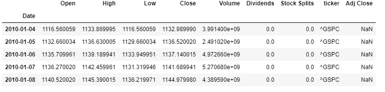
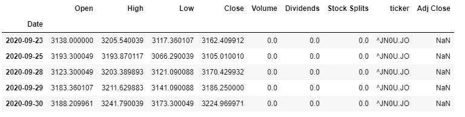
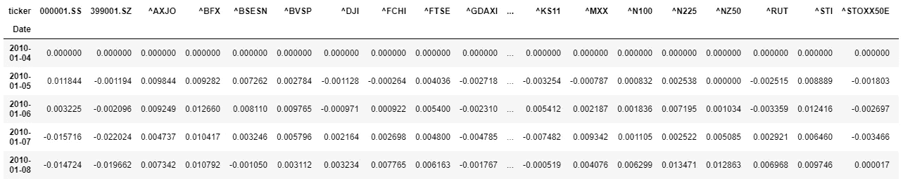
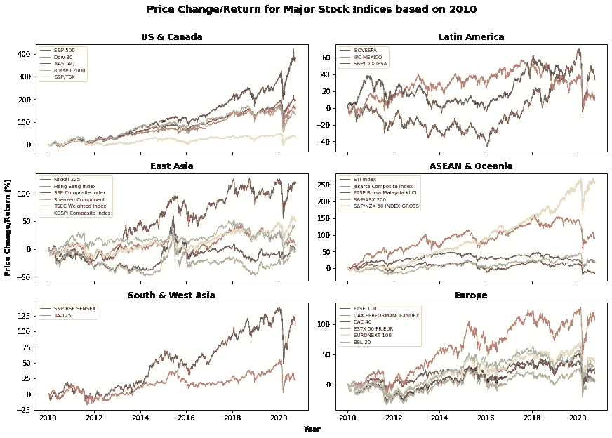
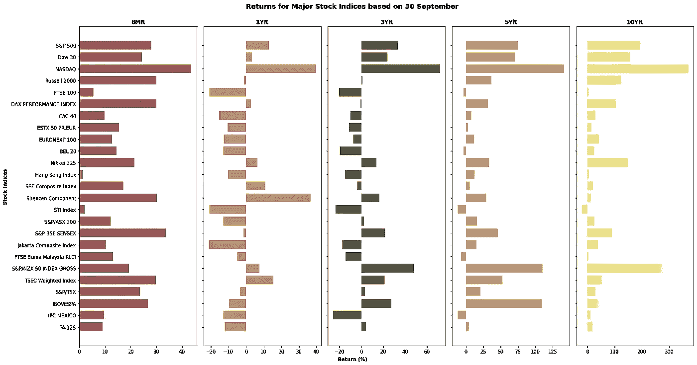

# 用 Python 分析世界股票指数的表现

> 原文：<https://towardsdatascience.com/analyzing-world-stock-indices-performance-in-python-610df6a578f?source=collection_archive---------8----------------------->


马库斯·斯皮斯克在 [Unsplash](https://unsplash.com?utm_source=medium&utm_medium=referral) 上的照片

***来自《走向数据科学》编辑的提示:*** *虽然我们允许独立作者根据我们的* [*规则和指导方针*](/questions-96667b06af5) *发表文章，但我们并不认可每个作者的贡献。你不应该在没有寻求专业建议的情况下依赖一个作者的作品。详见我们的* [*读者术语*](/readers-terms-b5d780a700a4) *。*

股票指数是选定公司的列表，其平均价格(或加权平均)反映了股票市场。股票指数也可以反映它们所涵盖的某个行业或地区。它们也经常被称为衡量基金业绩的基准。与当前价格相比，股票指数更重要的部分是某个确定时刻的表现或价格变化，无论是前一天还是前三个月。

本文的后半部分将介绍如何用 Python 评估股票指数的表现。

# 如何获取数据

与股票指数相关的数据可以从 Yahoo！金融。在 Python 中，有一个流行的模块可以更容易地从 Yahoo！金融。如果它还没有安装，您可以通过输入这段代码，然后导入所需的库/模块进行处理，将它安装到您的 Jupyter 笔记本中。

那么，我们如何获取股票数据呢？因为这篇文章是分析世界主要指数的表现，下一步要做的是从 Yahoo！财经网站。

现在，这是从网站上摘下的列表的标题/开头内容:



我们可以看到，对于每个股票指数，每行都有名称和符号。这些符号对于检索数据非常重要。现在，是时候为这些股票指数收集历史数据了。

为了收集每个股票指数的历史数据，首先，我们需要用 symbol 的参数调用 Ticker 模块。例如，如果我们想获得标准普尔 500 的历史数据，我们可以键入:

我们还需要定义数据检索的周期。应该获取日数据还是周数据？必须在“周期”参数中输入。还必须定义开始和结束日期。

在这里，将从 2020 年 1 月 1 日开始每天(“1d”)检索数据，直到 2020 年 9 月 30 日。参数中指定的结束日期将不包括在检索到的数据中(因此，只检索到前一天)



S&P 历史股票数据—左:数据的头/开始，右:数据的尾/结束

现在是时候收集**所有**股指的历史数据了。

获取股票指数的历史数据



世界主要股票指数历史数据—左:数据的开头/开头，右:数据的结尾/结尾

# 一些预处理和数据分析

在前面的部分中，我们已经成功收集了从 2010 年 1 月到 2020 年 9 月 30 日的世界主要股票指数的历史股票数据。现在，是时候为分析做一些预处理了。

我想做的第一步是按地区对每个指数进行分类。以下是我对该地区的定义:

区域索引

现在，为该区域创建一个新列。

```
def getRegion(ticker):
    for k in region_idx.keys():
        if ticker in region_idx[k]:
            return k
msi['region']= msi.ticker.apply(lambda x: getRegion(x))
```

## 自 2010 年初以来的价格变化

由于股票价格是以不同的货币表示的，因此要想全面了解业绩，最好以相同的单位或指标来查看。现在，让我们来看看这些指数自 2010 年 1 月 4 日以来十年间的价格变化。变化将以百分比(%)表示。价格变化使用当天的收盘价(“收盘”)。

在上面的代码块中，定义了一个新函数来计算价格变化。然后，对于主数据集中的每一行，调用该函数来输出价格变化。

现在，为了简化流程，让我们将数据集转换为 tickers 作为列，将行作为每个日期的价格变化。

现在，价格变化的新数据框架将如下所示:



每个股票指数的价格变动至 2010 年 1 月 4 日

是时候绘制这些价格变化了。对于这一部分，地块将在区域中。



基于 2010 年 1 月 4 日的价格变化

从上面的图中可以看出，自 2016 年以来，美国的股票指数增长迅速。自 2010 年以来，纳斯达克股票价格已经上涨了 5 倍。其他美国股票指数，如标准普尔 500、罗素 2000 指数和道琼斯 30 指数也上涨了股价，但表现不如纳斯达克。

其他地区的一些指数价格也上涨了 1-2.5 倍。日经 225 指数(日本)、S&P/新西兰 50 指数(新西兰)、S&P BSE SENSEX 指数(印度)和德国 DAX 指数(德国)是各自地区指数中最赚钱的股票指数(如果你自 2010 年 1 月以来以某种方式投资了它们或一些反映它们的基金)。

我们也不能不提所有这些股票指数都受到了新冠肺炎的影响。它们都在 2020 年初左右显著下降，但总体而言，大多数都在此后不断攀升。

**短期至长期价格变化/回报**

当我们谈论股票时，通常我们会将当前价格与前几个月或前几年的历史价格进行比较。对于这一部分，我们将分析短期到长期的价格变化。

为了清楚和详细，我们比较的是同一天的数据，而不是之前的数据。所以，2020 年 9 月 30 日的 6M(六个月)是指 2020 年 9 月 30 日前 6 个月的那一天，也就是 2020 年 3 月 30 日。同一天的 1Y(一年)表示 2019 年 9 月 30 日，以此类推。

首先，我们将数据集划分到 2020 年 9 月 30 日。

现在，要得到历史价格，有点棘手。我们想要引用的日期(过去的日期)可能不是工作日。除此之外，每个国家的工作日也不尽相同。因此，为了解决这个问题，我们选择过去日期之前的最后一个工作日。

现在，让我们来看看之前一些决定性时刻的价格变化。

让我们画出这些股票指数的价格变化/回报。



世界主要股票指数的短期至长期回报/价格变化

参照上面的图表，所有主要股票指数在 6 个月的时间里都表现良好(价格上涨)。另一方面，在其他时期，这些指数的表现参差不齐。10 年来，大多数股票指数都是盈利的，除了 STI 指数(但只是略有下降)。

总之，参考相同的图，一般来说，最持续盈利的股票指数是:

*   标准普尔 500(美国)
*   道琼斯 300 指数(美国)
*   纳斯达克(美国)
*   日经 225(日本)
*   深证成分指数(中国)
*   S&P/新西兰 50 总指数(新西兰)
*   TSEC 加权指数(台湾)

请检查以下链接中的代码以供进一步参考:

[](https://github.com/intandeay/StockIndicesAnalysis) [## 库存/库存指数分析

### 此时您不能执行该操作。您已使用另一个标签页或窗口登录。您已在另一个选项卡中注销，或者…

github.com](https://github.com/intandeay/StockIndicesAnalysis)