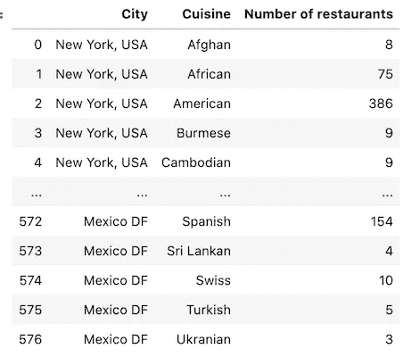
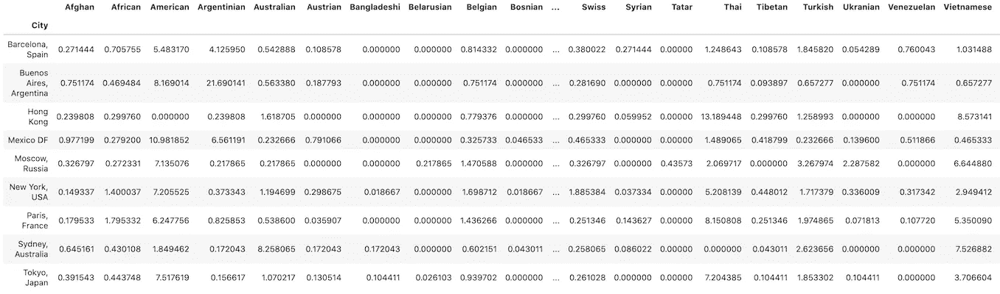
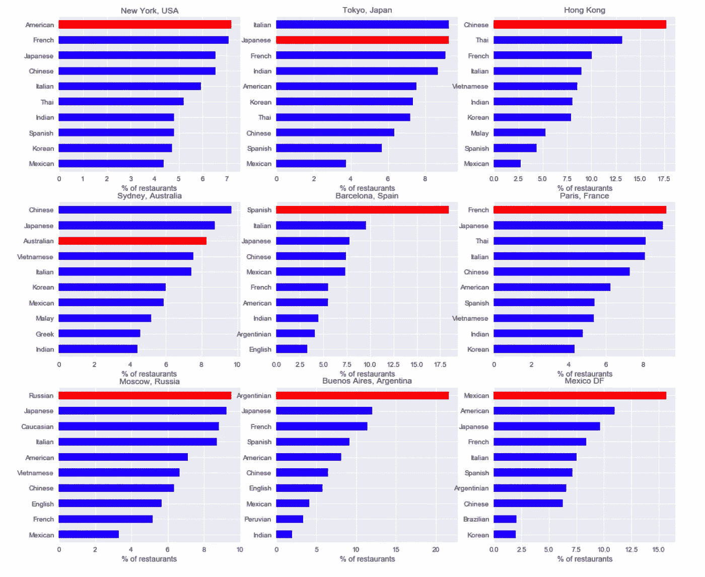
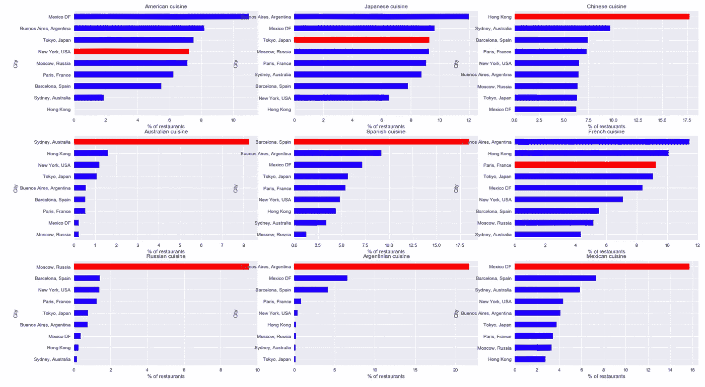
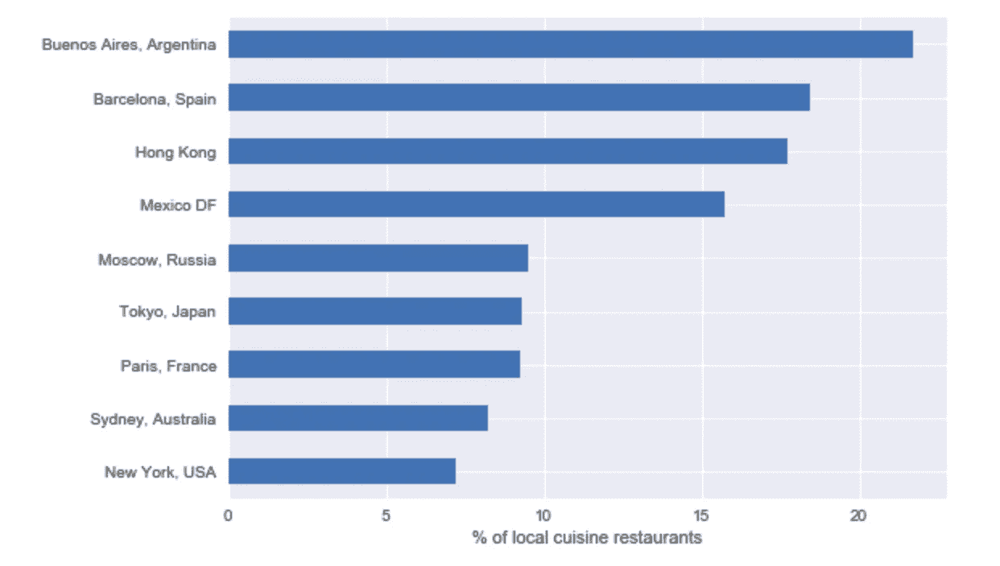
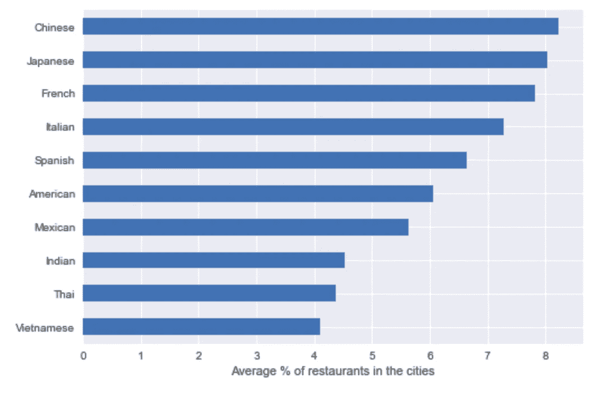

# 用 Python 和 Foursquare API 分析全球美食

> 原文：<https://towardsdatascience.com/analyzing-worldwide-cuisines-with-python-and-foursquare-api-e63455c14246?source=collection_archive---------34----------------------->

## 分析世界上最大的城市最受欢迎的美食

照片由[瑞秋·帕克](https://unsplash.com/@therachelstory?utm_source=medium&utm_medium=referral)在 [Unsplash](https://unsplash.com?utm_source=medium&utm_medium=referral)

世界上有很多著名的菜系，像中国菜、日本菜、墨西哥菜、西班牙菜……很明显，墨西哥是品尝墨西哥菜的最佳地点，泰国是品尝泰国菜的最佳地点，等等，但是去这么多国家品尝每一种不同的菜系是非常乏味的。然而，在世界上的每一个大城市，你都可以找到许多国际餐馆，在那里你可以尝试新的美食。但是体验会足够好吗？

今天，我将与你分享我最近参加的一个数据科学课程的最终项目，在那里我创建了一个 *Jupyter 笔记本*，用于使用 Foursquare API 探索纽约、东京、香港、悉尼、巴塞罗那、巴黎、莫斯科、布宜诺斯艾利斯和墨西哥 DF 的城市，并猜猜**哪个城市最适合尝试每种美食**。

# 定义数据

对于这个项目，将使用 [Foursquare API](https://developer.foursquare.com) 。作为用户，您需要一个免费的开发人员帐户，以便获得认证您的 HTTP 请求的凭证。对于上面提到的每个城市，我们将一个接一个地为每种国际美食的餐馆请求 API，并将结果存储在一个*Pandas*data frame*data frame*中，以便稍后处理它们并执行一些有趣的分析。

*   **待探索城市** : *纽约、东京、香港、悉尼、巴塞罗那、巴黎、莫斯科、布宜诺斯艾利斯、墨西哥 DF* 。
*   **要查询的美食**(列表摘自 [Foursquare API 文档](https://developer.foursquare.com/docs/build-with-foursquare/categories/) ): *阿富汗、非洲、美国、缅甸、柬埔寨、中国、菲律宾、喜马拉雅、印度尼西亚、日本、韩国、马来、蒙古、泰国、西藏、越南、澳大利亚、奥地利、孟加拉、比利时、加勒比海、高加索、捷克、荷兰、白俄罗斯、波斯尼亚、保加利亚、罗马尼亚、鞑靼、英语、法语、德语、希腊、夏威夷、匈牙利、印度、意大利、萨尔瓦多、阿根廷、巴西、巴西*

在开始使用 API 之前，需要提取一些信息，比如每种美食的`categoryId`，或者每个探索城市的当地美食。首先，场馆类别的完整列表可在[网站 https://developer . four square . com/docs/build-with four square/categories/](https://developer.foursquare.com/docs/build-with-foursquare/categories/)获得。从这里，我们将手动提取`food`下对应于国家美食的类别(*西班牙、印度、泰国)...*)，以便能够**只通过国籍**来过滤餐馆，而不是其他不相关的标准，如素食主义者、清真、汉堡店...

对于上面提到的每个城市，我们将询问每个菜系的餐馆的 API:`https://api.foursquare.com/v2/venues/explore?&near={city}&categoryId={category_id}`。对于每个城市和菜系，餐馆的数量(`['response']['totalResults']`)将保存在一个 [*熊猫数据框*](https://pandas.pydata.org/pandas-docs/stable/reference/api/pandas.DataFrame.html) 中。

所以直到现在，我们的笔记本看起来像这样:

# 检索数据

我们已经知道我们想要获得什么数据，以及在哪里和如何获得它。然后，下一步是编写一个循环，向 Foursquare API 询问**每个城市**中每种定义的美食有多少家餐馆，并将其存储到 Pandas 数据帧中。

# 转换数据

在生成的*数据帧*中，每一行将代表特定菜系和城市的餐馆数量，因此我们将有 *NxM* 行，其中 *N* 是定义的菜系数量， *M* 是城市数量。

下载数据的数据帧

这种格式不适合我们的需要，所以我们不得不将它转换成一个新的数据框架，其中每行代表一个城市，每列代表该城市中每种菜肴的餐馆百分比。转换将包括执行一次性编码，按城市对结果进行分组，最后按行对结果进行规范化。

转换后的数据帧

# 分析数据

现在，数据已经准备好进行分析，让我们定义四个洞察，并看看如何获得它们并在图中可视化它们:

*   **每个城市的十大美食**
*   **各种美食的热门城市**
*   **各城市本地美食的受欢迎程度**
*   **世界上最受欢迎的美食**

> 在展示结果之前，我想先观察一下。在这个项目中，我们将与 Foursquare 中的 65 种不同类型的美食合作。由于此处显示的结果是百分比(超过 100)，**在一个公平的划分中，1.54%对应于每种菜肴**。我认为这是一个重要的澄清，因为如果没有它，某些城市的某些菜肴 20%的百分比可能看起来不算多，但实际上这是一个非常高的百分比。

## 每个城市的十大美食

对于每个城市，我们将绘制一个条形图，显示 10 种最受欢迎的美食，按照该城市餐馆的百分比排序。每个城市的当地美食将用红色标出。

每个城市十大美食的评选结果

**在大多数城市，当地美食是赢家**。然而，在一些地方，比如巴塞罗那或布宜诺斯艾利斯，当地美食和第二受欢迎的美食之间的差异比在巴黎或纽约要大得多。

**在一些城市，我们可以看到最受欢迎的美食是如何来自邻近国家的**:例如，在墨西哥，美国餐馆非常受欢迎；在香港，泰国菜和越南菜似乎也很受欢迎，或者在悉尼，来自中国、日本、越南或韩国等东亚国家的食物非常有名。然而，纽约和巴塞罗那的情况不同，纽约第一名和第十名之间的差距不到 3%，巴塞罗那排在西班牙菜和意大利菜之后，接下来的三种最受欢迎的美食是日本菜、中国菜和墨西哥菜，这些国家离西欧很远。

## 各种美食的热门城市

或许你可以在东京找到最好的*寿司*或者在巴塞罗那找到最好的*玉米饼*，但是看看上面的结果，看起来本地美食并不总是最受欢迎的。现在出现的问题和之前正好相反，每种美食排名靠前的城市是哪些。在这里，我们将为所分析城市的每种当地美食绘制一个条形图，对于每种美食，我们将看到在哪里可以找到该美食的更多餐厅。

每种美食最受欢迎城市的结果

显而易见，从分析的城市来看，拥有更多美式餐厅的城市是纽约、日本、东京等等。然而，令人惊讶的是，它并不总是这样。

*   中国、澳大利亚、西班牙、俄罗斯、阿根廷和墨西哥菜肴在各自的城市比在世界其他地方更受欢迎。澳大利亚人和俄罗斯人的差异尤其大。
*   美国、日本和法国的菜肴在一些外国城市更受欢迎，比如墨西哥城或布宜诺斯艾利斯，而不是在他们国家的首都。

## 每个城市当地美食的受欢迎程度

正如我们之前看到的，在一些城市，当地美食并不是最受欢迎的。在这里，我们将检查每个被分析城市的当地美食有多受欢迎。同样，通过条形图，我们可以看到每个城市本地美食餐厅的百分比。

当地美食在每个城市的受欢迎程度

从这个情节来看，似乎很明显，在巴塞罗那，布宜诺斯艾利斯，墨西哥 DF，或者香港，当地的美食真的很受欢迎，而在纽约或悉尼这样的城市，美食种类更丰富。

## 世界上最受欢迎的美食

前面的观察结果是否意味着西班牙、阿根廷、中国和墨西哥菜肴是世界上最受喜爱和最受欢迎的？在最后一部分，我们将在条形图中绘制每种美食的平均百分比，以检查全球前 10 大美食(基于 9 个分析的城市)。

全球各种美食的平均百分比结果

看起来世界上最受欢迎的菜系是中国、日本、法国、意大利和西班牙。我们看到香港的中国菜或巴塞罗那的西班牙菜非常受欢迎，而在巴黎或东京，当地菜肴的受欢迎程度与外国菜肴相当接近。

排名第一(中国，8%)和第十(越南，4%)的最受欢迎的菜肴之间没有太大的区别。从这前 10 名中，中国、日本、法国、西班牙、美国和墨西哥是一些被分析城市的地方美食。当我们分析每个城市最受欢迎的美食时，我们可以看到，对于巴塞罗那(西班牙)、中国香港、法国巴黎、美国纽约和墨西哥 DF，最受欢迎的美食是当地美食，而对于东京，日本料理排在第二位，非常接近第一位(意大利)。

**意大利美食似乎很受欢迎，但我们没有分析任何一个意大利城市**，所以我们无法判断它在国内是否也如此受欢迎。

# 未来建议

这个项目的结果非常有趣，尤其是对那些对旅游和美食感兴趣的人来说。然而，为了做更深入的研究，**应该探索更多的城市**。将一些意大利城市，如罗马、费伦泽或那不勒斯，以及伊斯坦布尔、曼谷和河内添加到列表中会非常有趣，因为意大利、土耳其、泰国和越南美食非常受欢迎，这样就有可能检查它们在各自的城市是否也受欢迎。

我们绝对应该包括一座意大利城市——照片由里卡多·戈麦斯·安吉尔拍摄

对于顶级美食，根据这个项目的结果是中国、日本、法国、意大利和西班牙，这将是一个好主意**包括每个国家的更多城市**。例如，在西班牙，巴塞罗那代表了该国 11%的人口，因此添加像马德里、巴伦西亚、毕尔巴鄂、塞维利亚或圣地亚哥德孔波斯特拉这样的城市不仅会提供该国更好的样本，而且还包括不同种类的西班牙美食，如加泰罗尼亚、巴斯克或加利西亚美食。

另一个建议是**考虑餐馆**的评级，因为这里所有的结果来自于场地的数量，而不是它们的质量。Foursquare API 提供了对场馆评级的访问，即使这会使 API 查询循环慢很多。

当然，我的 GitHub 库里有[完整的笔记本。](https://github.com/gbarreiro/best_cuisines/blob/master/best-cuisines.ipynb)

# 参考

*   木星实验室:[https://jupyter.org/install](https://jupyter.org/install)
*   熊猫 data frame:[https://pandas . pydata . org/pandas-docs/stable/reference/API/pandas。DataFrame.html](https://pandas.pydata.org/pandas-docs/stable/reference/api/pandas.DataFrame.html)
*   Matplotlib 条形图:[https://matplotlib . org/API/_ as _ gen/matplotlib . py plot . bar . html？highlight = bar # matplotlib . py plot . bar](https://matplotlib.org/api/_as_gen/matplotlib.pyplot.bar.html?highlight=bar#matplotlib.pyplot.bar)
*   four square API:[https://developer.foursquare.com](https://developer.foursquare.com)
*   完整笔记本:[https://github . com/gbarreiro/best _ cuisines/blob/master/best-cuisines . ipynb](https://github.com/gbarreiro/best_cuisines/blob/master/best-cuisines.ipynb)