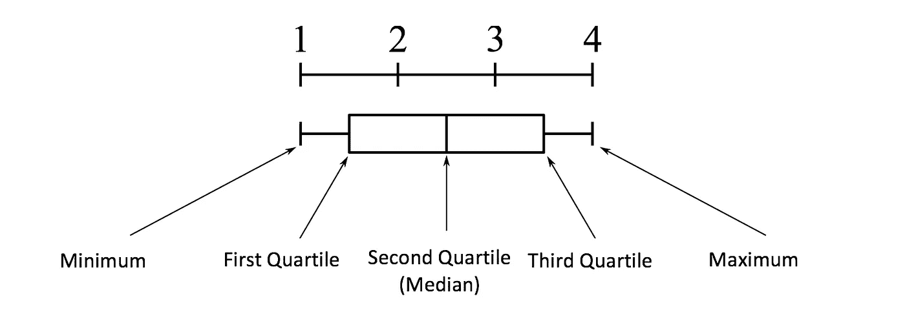
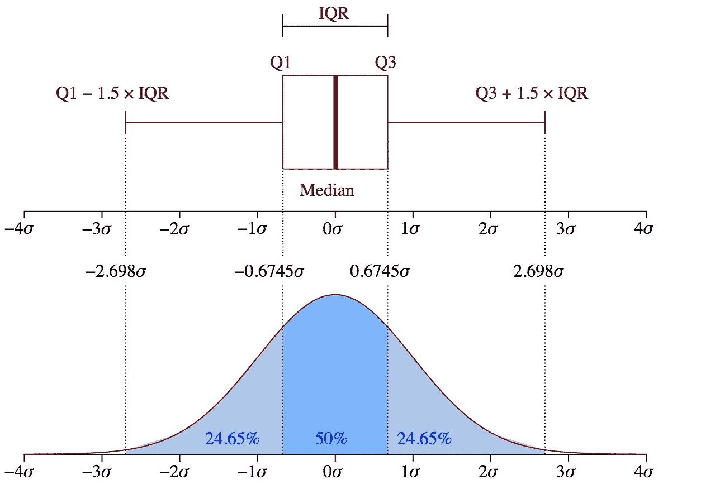
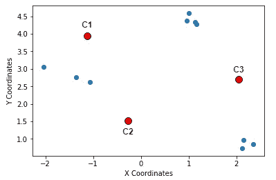
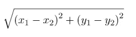
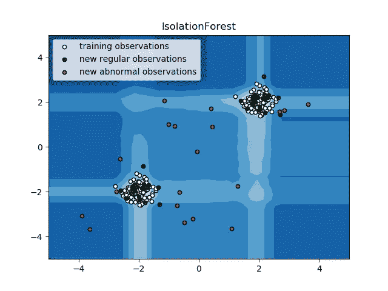

# 异常检测:检测异常值的技术

> 原文：<https://towardsdatascience.com/anamoly-detection-techniques-to-detect-outliers-fea92047a222?source=collection_archive---------31----------------------->


[阿里·哈坚](https://unsplash.com/@alisvisuals?utm_source=medium&utm_medium=referral)在 [Unsplash](https://unsplash.com?utm_source=medium&utm_medium=referral) 上的照片

**异常检测**是对罕见项目、事件或观察结果的识别，这些项目、事件或观察结果通过与大多数数据显著不同而引起怀疑。通常，异常项目会转化为某种问题，如信用卡欺诈、网络入侵、医疗诊断、系统健康监控。

异常检测基于两个基本前提

*   数据中很少出现异常。
*   他们的特征明显不同于正常情况。

# 异常检测技术

# 四分位数间距(IQR)

识别数据中不规则性的最简单方法是标记偏离分布的常见统计属性的数据点，包括平均值、中值、众数和四分位数。

最流行的方法之一是**四分位数间距(IQR)。** IQR 是统计学中的一个概念，通过将数据集分成四分位数来衡量统计离差和数据可变性。

简而言之，任何数据集或任何一组观察值都根据数据的值以及它们与整个数据集的比较情况被划分为四个定义的区间。四分位数将数据分为三个点和四个区间。



图片来源:维基百科

四分位距(IQR)很重要，因为它用于定义异常值。它是第三个四分位数和第一个四分位数的差值(IQR = Q3 -Q1)。在这种情况下，异常值被定义为低于(Q1 1.5 倍 IQR)或高于(Q3+1.5 倍 IQR)的观测值



图片来源:维基百科

## 履行

`np.percentile`是 Python 中的烘焙功能

`q75, q25 = np.percentile(x, [75 ,25])
iqr = q75 - q25`

## 缺点

IQR 技术在以下情况下不起作用

1.  该模式基于季节性。这涉及到更复杂的方法，例如将数据分解成多个趋势，以确定季节性的变化。

2.随着恶意对手不断调整自己，异常或正常的定义可能会频繁改变

# 基于聚类的异常检测

聚类是无监督学习领域中最流行的概念之一。潜在的前提是相似的数据点倾向于属于相似的组或聚类，这是由它们与局部质心的距离决定的。

K-means 是一种广泛使用的聚类算法。它创建了“k”个相似的数据点聚类。不属于这些组的数据实例可能会被标记为异常。其他聚类算法，如层次聚类和数据库扫描，也可以用来检测异常值。

K-means 算法的工作方式如下:

1.  指定簇的数量 *K* 。
2.  通过首先改组数据集，然后为质心随机选择 *K* 个数据点来初始化质心，而无需替换。
3.  计算质心和数据点之间的距离。
4.  继续迭代，直到质心没有变化。也就是说，数据点到聚类的分配没有改变。

## 履行

1.  **初始化随机质心**

你从三个(我们决定 K 为 3)随机点(以(x，y)的形式)开始这个过程。这些点被称为**质心**，这只是一个用来表示*中心*的花哨名称。我们先把这三个点命名为 **C1、**和 **C3** ，这样你以后就可以参考了。



**K-Means 中的步骤 1:随机质心**

**2。计算质心和数据点之间的距离**

接下来，测量数据点与这三个随机选择的点之间的距离。一个非常流行的距离测量函数的选择，在本例中，是[](https://en.wikipedia.org/wiki/Euclidean_distance)****。****

**简而言之，如果 2D 空间上有 n 个点(如上图所示)，并且它们的坐标由(x_i，y_i)表示，那么该空间上任意两点( **(x1，y1)** 和 **(x2，y2)** )之间的欧几里德距离由下式给出:**

****

**假设 C1、C2、C3 的坐标分别为— **(-1，4)** 、 **(-0.2，1.5)**、 **(2，2.5)** 。现在让我们写几行 Python 代码，它将计算数据点和这些随机选择的质心之间的欧几里德距离。我们从初始化质心开始。**

```
# Initialize the centroids
c1 = (-1, 4)
c2 = (-0.2, 1.5)
c3 = (2, 2.5)
```

**接下来，我们编写一个小的辅助函数来计算数据点和质心之间的欧几里德距离。**

```
# A helper function to calculate the Euclidean distance between the data points and the centroidsdef calculate_distance(centroid, X, Y):
    distances = []

    # Unpack the x and y coordinates of the centroid
    c_x, c_y = centroid

    # Iterate over the data points and calculate the distance using the           # given formula
    for x, y in list(zip(X, Y)):
        root_diff_x = (x - c_x) ** 2
        root_diff_y = (y - c_y) ** 2
        distance = np.sqrt(root_diff_x + root_diff_y)
        distances.append(distance)

    return distances
```

**我们现在可以将该函数应用于数据点，并相应地分配结果。**

```
# Calculate the distance and assign them to the DataFrame accordingly
data['C1_Distance'] = calculate_distance(c1, data.X_value, data.Y_value)
data['C2_Distance'] = calculate_distance(c2, data.X_value, data.Y_value)
data['C3_Distance'] = calculate_distance(c3, data.X_value, data.Y_value)# Preview the data
print(data.head())
```

****3。比较、分配、平均和重复****

**这基本上是 K-Means 聚类算法的最后一步。一旦你有了数据点和质心之间的距离，你就可以比较这些距离并取最小的一个。特定数据点到质心的距离最小，该质心被指定为该特定数据点的聚类。**

**让我们以编程的方式来做这件事。**

```
# Get the minimum distance centroids
    data['Cluster'] = data[['C1_Distance', 'C2_Distance', 'C3_Distance']].apply(np.argmin, axis =1)

# Map the centroids accordingly and rename them
    data['Cluster'] = data['Cluster'].map({'C1_Distance': 'C1', 'C2_Distance': 'C2', 'C3_Distance': 'C3'})

# Get a preview of the data
    print(data.head(10))
```

**现在最有趣的部分来了，*通过确定数据点坐标的**平均值**来更新质心*(这些数据点现在应该属于某个质心)。因此得名**K-意为**。平均值计算看起来是这样的:**

****

****K-Means 中的均值更新(n 表示属于一个聚类的数据点的数量)****

**下面几行代码可以帮您做到这一点:**

```
# Calculate the coordinates of the new centroid from cluster 1
x_new_centroid1 = data[data['Cluster']=='C1']['X_value'].mean()
y_new_centroid1 = data[data['Cluster']=='C1']['Y_value'].mean()# Calculate the coordinates of the new centroid from cluster 2
x_new_centroid2 = data[data['Cluster']=='C3']['X_value'].mean()
y_new_centroid2 = data[data['Cluster']=='C3']['Y_value'].mean()# Print the coordinates of the new centroids
print('Centroid 1 ({}, {})'.format(x_new_centroid1, y_new_centroid1))
print('Centroid 2 ({}, {})'.format(x_new_centroid2, y_new_centroid2))
```

**重复这个过程，直到质心的坐标不再更新。**

## **缺点**

**K-means 算法是一种流行的算法，被广泛应用于图像压缩、文档分类等领域。K-mean 的目标是将数据点分组到不同的非重叠子组中。当集群具有一种球形形状时，它做得非常好。然而，当团簇的几何形状偏离球形时，它会受到影响。此外，它也不会从数据中学习聚类数，而是需要预先定义。**

# **隔离森林**

**隔离森林是一种无监督学习算法，属于集成决策树家族。这种方法不同于所有以前的方法。所有以前的方法都是试图找到数据的正常区域，然后将这个定义区域之外的任何东西识别为异常值或异常值。这种方法的工作原理不同。它通过给每个数据点分配一个分数来明确隔离异常，而不是描绘和构建正常点和区域。它利用了这样一个事实，即异常是少数数据点，并且它们具有与正常情况下非常不同的属性值。**

**隔离森林通过随机选择一个特征，然后随机选择所选特征的最大值和最小值之间的分割值来“隔离”观察值。**

**由于递归分割可以用树结构表示，分离样本所需的分裂次数等于从根节点到终止节点的路径长度。**

**这种路径长度在这种随机树的森林中平均，是常态的度量和我们的决策函数。**

**随机分区会为异常产生明显更短的路径。因此，当随机树的森林共同产生特定样本的较短路径长度时，它们极有可能是异常。**

**这种算法在处理非常高维的数据集时非常有效，并且被证明是一种非常有效的异常检测方法。**

**这篇[论文](https://cs.nju.edu.cn/zhouzh/zhouzh.files/publication/icdm08b.pdf)涵盖了隔离林如何工作的全部细节。**

## **履行**

****

```
**import** **numpy** **as** **np**
**import** **matplotlib.pyplot** **as** **plt**
**from** **sklearn.ensemble** **import** [IsolationForest](https://scikit-learn.org/stable/modules/generated/sklearn.ensemble.IsolationForest.html#sklearn.ensemble.IsolationForest)rng = np.random.RandomState(42)*# Generate train data*
X = 0.3 * rng.randn(100, 2)
X_train = [np.r_](https://docs.scipy.org/doc/numpy/reference/generated/numpy.r_.html#numpy.r_)[X + 2, X - 2]
*# Generate some regular novel observations*
X = 0.3 * rng.randn(20, 2)
X_test = [np.r_](https://docs.scipy.org/doc/numpy/reference/generated/numpy.r_.html#numpy.r_)[X + 2, X - 2]
*# Generate some abnormal novel observations*
X_outliers = rng.uniform(low=-4, high=4, size=(20, 2))*# fit the model*
clf = [IsolationForest](https://scikit-learn.org/stable/modules/generated/sklearn.ensemble.IsolationForest.html#sklearn.ensemble.IsolationForest)(max_samples=100, random_state=rng)
clf.fit(X_train)
y_pred_train = clf.predict(X_train)
y_pred_test = clf.predict(X_test)
y_pred_outliers = clf.predict(X_outliers)*# plot the line, the samples, and the nearest vectors to the plane*
xx, yy = [np.meshgrid](https://docs.scipy.org/doc/numpy/reference/generated/numpy.meshgrid.html#numpy.meshgrid)([np.linspace](https://docs.scipy.org/doc/numpy/reference/generated/numpy.linspace.html#numpy.linspace)(-5, 5, 50), [np.linspace](https://docs.scipy.org/doc/numpy/reference/generated/numpy.linspace.html#numpy.linspace)(-5, 5, 50))
Z = clf.decision_function([np.c_](https://docs.scipy.org/doc/numpy/reference/generated/numpy.c_.html#numpy.c_)[xx.ravel(), yy.ravel()])
Z = Z.reshape(xx.shape)[plt.title](https://matplotlib.org/api/_as_gen/matplotlib.pyplot.title.html#matplotlib.pyplot.title)("IsolationForest")
[plt.contourf](https://matplotlib.org/api/_as_gen/matplotlib.pyplot.contourf.html#matplotlib.pyplot.contourf)(xx, yy, Z, cmap=plt.cm.Blues_r)b1 = [plt.scatter](https://matplotlib.org/api/_as_gen/matplotlib.pyplot.scatter.html#matplotlib.pyplot.scatter)(X_train[:, 0], X_train[:, 1], c='white',
                 s=20, edgecolor='k')
b2 = [plt.scatter](https://matplotlib.org/api/_as_gen/matplotlib.pyplot.scatter.html#matplotlib.pyplot.scatter)(X_test[:, 0], X_test[:, 1], c='green',
                 s=20, edgecolor='k')
c = [plt.scatter](https://matplotlib.org/api/_as_gen/matplotlib.pyplot.scatter.html#matplotlib.pyplot.scatter)(X_outliers[:, 0], X_outliers[:, 1], c='red',
                s=20, edgecolor='k')
[plt.axis](https://matplotlib.org/api/_as_gen/matplotlib.pyplot.axis.html#matplotlib.pyplot.axis)('tight')
[plt.xlim](https://matplotlib.org/api/_as_gen/matplotlib.pyplot.xlim.html#matplotlib.pyplot.xlim)((-5, 5))
[plt.ylim](https://matplotlib.org/api/_as_gen/matplotlib.pyplot.ylim.html#matplotlib.pyplot.ylim)((-5, 5))
[plt.legend](https://matplotlib.org/api/_as_gen/matplotlib.pyplot.legend.html#matplotlib.pyplot.legend)([b1, b2, c],
           ["training observations",
            "new regular observations", "new abnormal observations"],
           loc="upper left")
[plt.show](https://matplotlib.org/api/_as_gen/matplotlib.pyplot.show.html#matplotlib.pyplot.show)()
```

**资料来源:scikit-learn.org**

# **结论**

**这篇文章概述了检测数据异常的不同技术。它的范围从使用简单的统计方法，如标准差，到无监督的学习算法，如隔离森林。每种方法都有其优点和缺点。例如，四分位间距(IQR)不适用于季节模式，K 均值聚类擅长将数据分组到不同的非重叠子组中。当集群具有一种球形形状时，它做得非常好。隔离森林提供了一种反向方法来检测异常。它利用了这样一个事实，即异常是少数数据点，并且它们具有与正常情况下非常不同的属性值。作为一个好的实践者，了解算法/方法背后的假设是很好的，这样你就会对每种方法的优缺点有一个很好的想法。这将有助于您决定何时以及在何种情况下使用每种方法。**