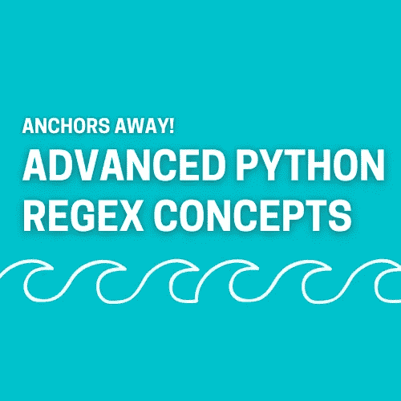

# 起锚！更多你希望知道的 Python 正则表达式概念

> 原文：<https://towardsdatascience.com/anchors-away-more-python-regular-expressions-you-wish-you-knew-8a7780ac54e9?source=collection_archive---------32----------------------->

## 教程| Python |正则表达式(Regex)

## 使用 Python 中的高级正则表达式工具处理文本的秘密



作者图片

所以你已经知道了 Python 中正则表达式的基础。像如何使用字符集、元字符、量词和捕获组这样的东西是基本的构建模块，但是你是一个超级用户，永远不会满足于仅仅是基础。你的文本争论问题比你希望用这些工具解决的要复杂得多。幸运的是，Python 中有更多的正则表达式概念需要学习。这是更多文本辩论工具的锚！

> 不确定基本的？查看我关于 Python 中正则表达式(regex)构建块的文章。

[](/a-gentle-introduction-to-regular-expressions-with-python-4f3fce46dcb4) [## Python 正则表达式的简明介绍

### 正则表达式是数据科学家对付非结构化文本最强大的武器

towardsdatascience.com](/a-gentle-introduction-to-regular-expressions-with-python-4f3fce46dcb4) 

# (正文)起锚了！

在我们开始 SS 正则表达式之前，我们需要讨论锚。更具体地说，**文本锚**。文本锚表示在字符串的开头或结尾查找匹配。在 Python 中，有两种类型的锚点:

*   `^`:匹配字符串开头的以下正则表达式
*   `$`:匹配字符串末尾的前一个正则表达式

提醒一下，要在 Python 中使用 regex，需要导入`re`模块。在尝试新的正则表达式主题(比如锚点)时，`re.findall()`函数特别有用。它将返回一个包含字符串中匹配项实际值的向量的列表。开始之前，请确保加载了`re`模块。

```
import re
```

## 起锚，`^`起锚

要起航，我们必须在旅行开始时起锚。当处理文本数据时，您可能需要匹配一个正则表达式模式，但前提是它出现在字符串中的第一项。为此，我们还使用了一个锚点，具体来说就是`^`。

为了演示，我们的目标是找到单词“the”，但前提是它出现在字符串的开头。

```
anchor = 'The ship set sail on the ocean'
anchor_n = 'Ships set sail on the ocean to go places'
```

从`anchor`开始，当我们使用`^`锚查找“the”时，我们只返回了它的一个实例。

```
anchor01 = re.findall('^[Tt]he', anchor)
print(anchor01)['The']
```

我们知道这是第一个实例，因为字符串开头的“the”是大写的。现在用`anchor_n`，不返回任何结果。正则表达式通常匹配句子中的“The ”,但是使用`^`定位符时，它只检查句子的开头。

```
anchor02 = re.findall('^[Tt]he', anchor_n)
print(anchor02)[]
```

## 抛锚，`$`锚

在我们的正则表达式之旅结束时，我们需要放下锚。有时，只有当正则表达式出现在字符串末尾时，才需要匹配它。这是通过`$`锚完成的。

让我们再来看一下`anchor`字符串，这次是在字符串的末尾寻找“海洋”。我们会有一个结果，“海洋。”

```
anchor03 = re.findall('ocean$', anchor)
print(anchor03)['ocean']
```

同样，如果我们查看`anchor_n`，这次使用`$`或结束锚，我们将得不到匹配，即使“海洋”出现在字符串中。如果它不在绳子的末端，`$`号锚就不会把它捡起来。

```
anchor04 = re.findall('ocean$', anchor_n)
print(anchor04)[]
```

# 正则表达式否定(避免冰山)


安妮·斯普拉特在 [Unsplash](https://unsplash.com?utm_source=medium&utm_medium=referral) 上的照片

现在我们知道了如何在字符串的开头和结尾匹配字符串(提升和降低 SS 正则表达式的锚点)，我们可以继续下一个概念:告诉 regex 匹配什么**不匹配**。

想象一下，你是一艘大船的船长，这是一艘船的处女航。让我们称这艘船为泰坦尼克号。作为这艘船的船长，你可能更关注于**而不是**撞上冰山，而不是其他任何具体的事情。

在字符串中，您可能希望指定某些模式来避免。要做到这一点，使用否定。这些将匹配除了您指定的内容之外的任何内容。在 Python 中有两种主要的方法来处理它们:

*   大写元字符:元字符匹配一组字符。一个大写的元字符通常会匹配除该字符集之外的所有内容
*   `^`和字符集:使用一个`^`和一个字符集将匹配除了在字符集中指定的以外的所有内容

## 大写元字符

在我上一篇关于 Python 中正则表达式的文章中，我们介绍了三种不同的元字符:`\s`、`\w`和`\d`。作为复习，它们匹配字符串中的一组字符:`\s`匹配空白字符(空格、制表符和换行符)，`\w`匹配字母数字字符(字母和数字)，而`\d`匹配任何数字(数字)。

当您大写这些元字符中的任何一个时，它将匹配除了正常匹配之外的所有内容。要查看它们的运行情况，让我们创建一个包含空格、数字、字母和标点符号的新字符串:

```
negation = 'I sail my 3 ships on the 7 seas.'
```

现在，当我们看一看我们的大写元字符时，我们将看到它们的输出是如何变化的。

*   这将匹配除空格之外的任何内容。我们在输出中看到来自`negation`字符串的所有字母、数字和标点符号

```
negation01 = re.findall('\S', negation)
print(negation01)['I', 's', 'a', 'i', 'l', 'm', 'y', '3', 's', 'h', 'i', 'p', 's', 'o', 'n', 't', 'h', 'e', '7', 's', 'e', 'a', 's', '.']
```

*   `\W`:这将匹配除了字母和数字以外的任何内容。我们这里的输出是每个空格和句尾的句号

```
negation02 = re.findall('\W', negation)
print(negation02)[' ', ' ', ' ', ' ', ' ', ' ', ' ', ' ', '.']
```

*   `\D`:这将匹配除数字以外的任何内容。您可能已经猜到，输出中有字母、空格和标点符号

```
negation03 = re.findall('\D', negation)
print(negation03)['I', ' ', 's', 'a', 'i', 'l', ' ', 'm', 'y', ' ', ' ', 's', 'h', 'i', 'p', 's', ' ', 'o', 'n', ' ', 't', 'h', 'e', ' ', ' ', 's', 'e', 'a', 's', '.']
```

## `^`和字符集

一些用例需要比元字符更灵活的否定。让我们看一个例子:

*   匹配给定字符串中的所有辅音

我们来分解一下这个问题。字母表里有 21 个辅音，我们想要全部。它们是不连续的，所以我们不能仅仅使用字符集中的一系列字母来得到它们。我们确实知道元音和辅音是互斥的，而且只有 5 个元音。如果我们能找到所有的元音，我们应该能通过否定得到所有的辅音。让我们从复习如何用字符集查找元音开始。

```
negation04 = re.findall('[AEIOUaeiou]', negation)['I', 'a', 'i', 'i', 'o', 'e', 'e', 'a']
```

括号内的字符定义了字符集。在这种情况下，任何元音都匹配。要获得除元音以外的所有内容，我们可以使用`^`。这将否定字符集内的所有内容。

```
negation05 = re.findall('[^AEIOUaeiou]', negation)[' ', 's', 'l', ' ', 'm', 'y', ' ', '3', ' ', 's', 'h', 'p', 's', ' ', 'n', ' ', 't', 'h', ' ', '7', ' ', 's', 's', '.']
```

…但那不是辅音。还有一点工作要做。我们的结果中有空格、数字和标点符号。由于捕获组中的所有内容都被否定，所以我们只需在结果中匹配所有不想要的内容。`\s`负责空格，`\d`负责数字，`\.`负责句点。`\.`不是元字符，是逃期。

```
negation06 = re.findall('[^AEIOUaeiou\s\d\.]', negation)['s', 'l', 'm', 'y', 's', 'h', 'p', 's', 'n', 't', 'h', 's', 's']
```

在所有的字符之后，我们需要以辅音结尾，也许这并不比键入 21 个不同的辅音更快，但它确实演示了我们如何将所有的字符加在一起，并使用正则表达式来得到我们想要的东西。

# 环顾四周(观赏野生动物)


马丁·韦特斯坦在 [Unsplash](https://unsplash.com?utm_source=medium&utm_medium=referral) 上拍摄的照片

出海时，我们可能会留意一些东西。看到一些野生动物将会是一次更有趣的旅行。我们寻找野生动物，这样我们就可以找到一个靠近它的地方来停泊我们的船。作为一名经验丰富的船长，我们并不真正关心野生动物本身，只关心附近的安全空间，以便驾驶船只。

类似于我们想通过野生动物寻找一个停车的地方，我们可能想在一些文本中寻找我们真正想要的信息。如果您现在还没有弄明白，正则表达式可以轻松地处理这个问题。为此，我们使用了一种叫做环视的方法。Look arounds 在字符串中搜索特定的匹配项，然后返回它之前或之后的某个值。这给我们留下了两种主要的环视方式:向前看和向后看。

让我们用下面的字符串作为例子来说明这两者是如何工作的。

```
lookaround = 'A penguin costs 2.99, a whale costs 5.99, I only have 3.50 left.'
```

对于我们想从这个字符串中提取什么信息，我们有两个场景。

1.  每只动物的成本是多少？
2.  卖什么动物？

起初，你可能会想为什么我们需要环顾四周才能做到这一点。你可以简单地寻找一个数字，句号，和另外两个数字。大概是这样的:

```
lookaround01 = re.findall('\d\.\d{2}', lookaround)
```

这是一个不错的开始，但是这一行代码的输出会给出三种价格。

```
print(lookaround01)[[1]]
[1] "2.99" "5.99" "3.50"
```

只有两种动物价格，最后一种是不相关的。环顾四周将有助于我们删除最后一个，并把一切都很好地纳入一个数据框架。

## 向后看

查看`lookaround`字符串，我们看到每种动物的价格前面都有单词“costs”我们将在后面用一个**来看看。这将匹配我们通常匹配的任何内容，但前提是它之前有其他内容的匹配。前瞻的通用公式是`"(?<=if preceded by this)match_this"`。在我们的例子中，这将翻译如下(`\s`被添加以说明单词和数字之间的空间):**

```
# Look behind
look_behind = re.findall('(?<=costs)\s\d\.\d{2}', lookaround)
```

现在我们有了每只动物的价格，不包括我在绳子上剩下的钱。

```
print(look_behind)[' 2.99', ' 5.99']
```

如果你仔细看，你会注意到琴弦上有空隙。现在不要担心这些，当我们建立一个数据框架来保存我们的价目表时，我们会处理这些问题。

## 向前看

现在，我们已经从字符串中获得了动物的价格，我们希望为价格列表数据框获取动物的名称。

为此，我们现在需要匹配单词“成本”前面的单词。为此，我们将使用**前瞻**。前瞻的基本公式如下:`"match this(?=if followed by this)"`。要从我们的字符串中获取动物名称，应该是这样的:

```
# Look Ahead
look_ahead = re.findall('\w+\s(?=costs)', lookaround)
```

就这样，我们抓住了单词 costs 之前的每个单词。在我们的字符串中是所有动物的名字。

```
print(look_ahead)['penguin ', 'whale ']
```

## 创建动物价格数据框

为了创建动物价格的数据框架，我们已经拥有了大部分我们需要的东西。我们只是用来自`animals`和`prices`的向量作为列创建一个数据帧。当然，要在 Python 中做到这一点，我们需要首先导入`pandas`模块作为`pd`。

```
import pandas as pdanimal_prices = {'animals': look_ahead, 'prices': look_behind}
animal_prices_df = pd.DataFrame(animal_prices)
```

如果你忘了，当我们使用`re.findall()`时，它返回一个字符串列表。这可以很容易地用于创建字典和数据框。

我们的下一步是解决这些多余的空间。我们将使用`.strip()`方法。它移除字符串开头或结尾的空格。我们将使用列表理解在一行代码中为每一列完成这项工作。

```
animal_prices_df['animals'] = [animal.strip() for animal in animal_prices_df['animals']]
animal_prices_df['prices'] = [price.strip() for price in animal_prices_df['prices']]
```

生成的数据框如下所示:

```
 animals prices
0  penguin   2.99
1    whale   5.99
```

# 结论和进一步学习

就这样，你在 SS 正则表达式上的巡航结束了。你学到了:

1.  如何匹配出现在字符串开头或结尾的字符串
2.  如何用否定来寻找除了某物以外的任何东西
3.  如何使用 look arounds 来匹配后面或前面的事物

以下是与 Python 中的正则表达式相关的一些其他资源，可能对您有所帮助:

*   [官方](https://docs.python.org/3/library/re.html) `[re](https://docs.python.org/3/library/re.html)` [文档](https://docs.python.org/3/library/re.html):虽然文档看起来令人生畏，但学习如何阅读它只会在你编程时对你有所帮助
*   [w3schools 参考资料](https://www.w3schools.com/python/python_regex.asp):庞大的编码和脚本语言参考资料知识库，包括 python。他们的许多例子都可以通过点击“自己尝试”按钮直接在浏览器上运行
*   [Datacamp 课程](https://www.datacamp.com/join-me/ODczNDQ5)(付费链接):一个致力于数据科学、机器学习和数据可视化的在线学习社区。查看他们的课程“Python 中的正则表达式”网站上每门课程的第一章都是免费的！

[](https://realdrewdata.medium.com/membership) [## 通过我的推荐链接加入 Medium-Drew Seewald

### 作为一个媒体会员，你的会员费的一部分会给你阅读的作家，你可以完全接触到每一个故事…

realdrewdata.medium.com](https://realdrewdata.medium.com/membership)