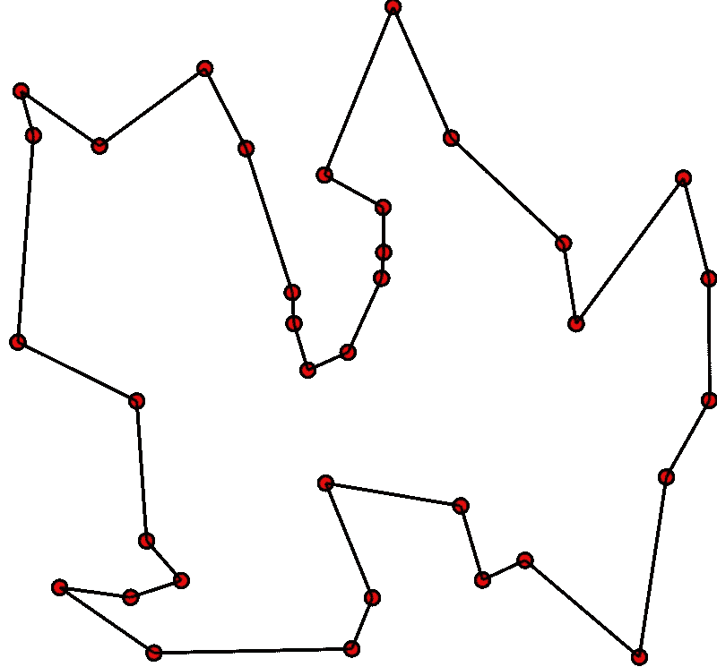
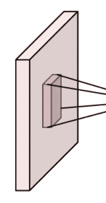

# 自行车上的古丝绸之路——游牧自行车人问题

> 原文：<https://towardsdatascience.com/ancient-silk-road-on-bicycle-nomad-cyclist-problem-c0c6db8bb217?source=collection_archive---------48----------------------->

## 旅行商问题的分步指南及其在自行车旅游规划中的应用

丝绸之路是一个古老的路线网络，包括中国西部、中亚、西亚和南亚的几十个城市。过去，从一个城市到另一个城市的最短已知路径通常成为路线的一部分。例外是为了避免暴徒，恶劣的天气和耗尽食物和水的风险。


沿着古丝绸之路的一条路线——(与[OpenStreetMap.org](https://www.openstreetmap.org/)一起画的路线)

我的几个朋友计划明年骑自行车穿越古丝绸之路。这将是一次人力驱动的旅行，就像过去大多数人通过这些路线旅行一样。我的朋友不是职业自行车运动员。所以，在这数千公里的旅程中，每一桨都必须划向正确的方向。

我最初认为这是一个疯狂的想法，但后来我意识到这将是一生一次的旅行。所以，我决定尝试编程来计划这次旅行。

# 城市

这些骑自行车的人已经计划好了以下几个丝绸之路上不可错过的主要古城:

中国🇨🇳Xi(丝绸贸易的起源地)

中国🇨🇳兰州

中国🇨🇳敦煌

中国🇨🇳高昌

中国🇨🇳乌鲁木齐市

哈萨克斯坦阿拉木图🇰🇿

吉尔吉斯斯坦🇰🇬比什凯克

乌兹别克斯坦🇺🇿塔什干

塔吉克斯坦🇹🇯杜尚别

乌兹别克斯坦🇺🇿boy sun

乌兹别克斯坦🇺🇿撒马尔罕

乌兹别克斯坦布哈拉🇺🇿

土库曼斯坦🇹🇲梅尔夫

土库曼斯坦🇹🇲阿什哈巴德

伊朗🇮🇷德黑兰

伊朗🇮🇷大不里士

土耳其🇹🇷安卡拉

土耳其🇹🇷伊斯坦布尔

沿途有很多城市有丰富的历史遗迹，在古代贸易中有重要意义，但是不可能在人力自行车旅行中包括所有的城市。比如巴基斯坦的塔西拉，中国的喀什。

# 旅行推销员问题

为了找到穿过所有这些城市的最短路线，让我们使用经典的旅行商问题(以下简称 TSP)算法。TSP 是一个优化问题。TSP 说

> *“给定一个要游览的城市列表以及这些城市之间的距离，游览所有这些地点并返回我们出发地点的最短路径是什么”*

在原始 TSP 中，我们计算的路线是一条封闭路线，并且我们的开始和结束位置必须相同。



旅行推销员问题——点代表城市，线代表道路——([TSP on Wikipedia](https://en.wikipedia.org/wiki/Travelling_salesman_problem))

但是作为骑自行车的人，我们感兴趣的是沿途的城市，而不是回到起点。TSP 有许多变体，让我们把 TSP 的这种变体称为“**游牧自行车手问题**”。


开放旅游旅行推销员问题(图片由作者提供)

# 距离矩阵

距离矩阵是制定几乎所有涉及路径的优化问题的起点。例如最短路径问题、旅行商问题、车辆路径问题和物流路径优化。

看看下面的距离矩阵:


丝绸之路距离矩阵—第一部分(图片由作者提供)

第 2 行第 1 列的单元格的值为 626。这是从兰州到西安的公里数。然而，从西安到兰州的距离是 627，由第一行第二列中的单元表示。

上表中每个像元的值是以公里为单位的道路长度，从左侧的城市到顶部标题中的城市。

我们将使用 2D 数组(或者 Python 中的 2D 列表)来存储距离矩阵值。

```
*# distance matrix* D **=** [[0, 627, 1724, 2396, 2531, 3179],
    [626, 0, 1096, 1768, 1903, 2551],
    [1723, 1095, 0, 929, 1064, 1713],
    [2395, 1766, 849, 0, 163, 811],
    [2531, 1903, 985, 163, 0, 656],
    [3186, 2557, 1640, 817, 664, 0]]
```

对于真实世界的位置，我们可以使用简单的 API 调用，使用[谷歌地图距离矩阵 API](https://developers.google.com/maps/documentation/distance-matrix/overview) 和 [Mapbox 的矩阵 API](https://docs.mapbox.com/help/glossary/matrix-api/) 轻松计算我们位置的距离矩阵。

# 计算距离矩阵

手动计算多个城市的距离矩阵变得很烦人。让我们写一些脚本来为我们计算距离矩阵。

要使用 Google Maps Matrix API 计算距离矩阵，我们只需提供地点的名称。但是我决定硬编码城市的经度，纬度坐标。我认为当不止一个地方有相似的名字时，坐标可以避免混淆。

`getCities`方法给出了城市+坐标的列表。

```
**def** **getCities**():
    *# locations to visit
*    cities **=** [
        {
            "name": "Xi'an, Shaanxi, China",
            "location": [34.341576, 108.939774]
        },
        {
            "name": "Lanzhou, China",
            "location": [36.061089, 103.834305]
        },

        ...

        {
            "name": "Istanbul, Turkey",
            "location": [41.022576, 28.961477]
        }
    ]
    **return** cities
```

# 计算距离矩阵

计算距离矩阵现在很容易。我们只需要调用一个 gmap API 端点，提供两个列表:起点和终点，我们希望计算它们之间的距离，并以 JSON 的形式返回我们的距离矩阵，该矩阵将被解析并转换为我们在上面看到的 2D 列表`D`。

```
import requests, traceback

**def** **gmapMatrix**(origins, destinations):
    API_KEY **=** GET_GMAP_API_KEY() *# <<= gmap api key
*    URL **=**f"https://maps.googleapis.com/maps/api/distancematrix/json?units=metric&origins={origins}&destinations={destinations}&key={API_KEY}"

    **try**:
        r **=** requests.get(URL)
        jsn **=** r.json()

        **return** jsn
    **except** Exception:
        traceback.print_exc()
        **return** None
```

让我们找到我们的距离矩阵。好吧，没那么容易。原来谷歌的 Matrix APIs 有一些限制。

根据谷歌地图矩阵 API:

1.  发送到距离矩阵 API 的每个查询都会生成元素，其中起点数量乘以目标数量等于元素数量
2.  每个请求最多允许 25 个起点或 25 个目的地
3.  每个服务器端请求最多允许 100 个元素

# 计算超过 100 个元素的距离矩阵

我们有大约 20 个城市。20*20 等于 400。我们超过了 100 个元素的限制。我们必须将我们的请求分成 100 个一批，获取距离并构建我们的`20 x 20`距离矩阵。

如果你熟悉深度学习中的卷积神经网络，你可能知道我们*取一小部分矩阵，做一些运算，计算另一个矩阵*的卷积技术。这个过程是一步一步的，每次只对矩阵的一小部分起作用。



一次查看矩阵的一小部分([卷积神经网络，维基百科](https://en.wikipedia.org/wiki/Convolutional_neural_network))

别担心，我们处理 100 个元素限制的计算比卷积神经网络简单得多。

看看项目代码中的`[convolveAndComputeDistMatrix](https://github.com/emadehsan/nomad-cyclist/blob/0f42ef8a06bdf2be0b7c0fdec32661d16efded38/distance_matrix.py#L26)`方法。该方法遍历距离矩阵，仅挑选 100 个项目来寻找距离，并构造一个距离矩阵`20 x 20`...我们想要的距离矩阵。

# 履行

让我们把我们的游牧自行车手问题(TSP)公式化为一个线性规划问题。为了解决一个线性规划问题，我们通常需要 4 样东西

*   决策变量
*   限制
*   目标
*   解决者

# 解决者

(优化)解算器是一个软件或库，它采用以某种方式定义(建模)的优化问题，并试图找到该问题的最佳解决方案。我们的工作是对问题进行适当的建模，求解者承担繁重的工作。

我们将使用 OR-Tools，这是一个由 Google AI 团队开发的开源库，用于解决优化问题。

让我们看看如何为或工具初始化或工具的线性规划求解问题建模

```
from ortools.linear_solver import pywraplp

s **=** pywraplp.Solver('TSP', \
        pywraplp.Solver.GLOP_LINEAR_PROGRAMMING)
```

# 决策变量

简而言之，决策变量是包含线性规划算法输出的变量。我们的算法做出的决定！

对于 TSP，决策变量将是与距离矩阵大小相同的 2D 列表。它将在像元中包含`1`，其对应的道路必须被访问，因此是输出路径的一部分。以及`0`在不得通行的道路上。


可视化旅行商问题的决策变量(图片由作者提供)

根据 OR-Tools [线性求解器文档](https://developers.google.com/optimization/reference/python/linear_solver/pywraplp#intvar)，我们使用`IntVar`定义一个整数决策变量。

如果在普通的 Python 代码中，我们将创建一个名为`count`的变量，它将保存某个任务完成的次数。我们可能会从 0 开始，并随着每个任务不断增加，直到程序结束，其中会包含一些我们感兴趣的有用值。

```
count **=** 0
```

如果我们想要定义相同的变量，但要由 OR-Tools 线性求解器使用，我们将按如下方式定义它(现在它将被称为决策变量)。

```
*# IntVar(lowerBound, upperBound, name)* count **=** s.IntVar(0, 100, 'count_var')
```

注意，我们也必须提供界限。这告诉规划求解找到一个从下限到上限的整数值。这有助于缩小可能的输出范围，求解器可以更快地找到解决方案。

现在我们定义 TSP 的决策变量。这将是一个由`IntVar`组成的 2d Python 列表。但是在这里，城市的边界将是从`0`到`1`，除了那些没有找到内部距离的城市，它们的边界将是从`0`到`0`。

```
x **=** [[s.IntVar(0, 0 **if** D[i][j] **is** None **else** 1, '') \
        **for** j **in** range(n)] **for** i **in** range(n)]
```

# 限制

将约束视为必须遵守的限制或规则。根据 TSP，

"我们必须在一条封闭的道路上游览每一个城市一次."

首先我们将解决一个封闭旅游的 TSP 问题。然后我们将修改它，为我们的游牧骑行者提供一条开放的最短路径。因此，在我们的解决方案中，必须只有一条路通往城市，并且只有一条路通往城外。

```
**for** i **in** range(n):  
    *# in i-th row, only one element can be used in the tour
*    *# i.e. only 1 outgoing road from i-th city must be used
    # in the tour
*    s.Add(1 **==** sum(x[i][j] **for** j **in** range(n))) 

    *# in j-th column, only one element can be used in the tour
*    *# i.e. only 1 incoming road to j-th city must be used in tour
*    s.Add(1 **==** sum(x[j][i] **for** j **in** range(n))) 

    *# a city must not be assigned a path to itself in the tour
*    *# no direct road from i-th city to i-th city again must be taken
*    s.Add(0 **==** x[i][i])
```

以上约束是不够的。有时存在有问题的子区域，每个子区域覆盖不同城市的子集，但没有一个子区域覆盖所有城市。我们想在所有城市进行一次(最短的)旅行。


有问题的(断开的)子旅行团(图片由作者提供)

我们知道，任何由 6 个城市组成的封闭路径都有 6 条弧线(边/路)连接它们(如上图)。因此，我们告诉我们的求解程序，如果一个旅行是一个子旅行(即它覆盖的城市少于距离矩阵中的城市总数)，连接这些城市的道路必须少于这个子旅行中的城市数。这将强制求解程序查找未闭合的子区域，最终成功找到连接所有城市的闭合(最短)旅行。

但是我们不能找到所有可能的次区域，并把它们包含在我们的约束中。避免这种子区域的方法是，在第一次运行我们的算法时，我们找到一个解决方案，如果它包含子区域，我们再次运行算法，这次我们告诉它保持这些子区域不闭合。我们不断重复这个过程，直到我们找到一个覆盖所有城市的最佳旅游路线，而不是小的不相连的子区域。

让我们对这个约束进行建模:

```
*# Subtours from previous run (if any)* **for** sub **in** Subtours:
    *# list containing total outgoing+incoming arcs to 
*    *# each city in this subtour
*    K **=** [ x[sub[i]][sub[j]] **+** x[sub[j]][sub[i]] \
         **for** i **in** range(len(sub)**-**1) **for** j **in** range(i**+**1,len(sub)) ]

    *# sum of arcs (roads used) between these cities must 
*    *# be less than number of cities in this subtour
*    s.Add(len(sub)**-**1 **>=** sum(K))
```

# 目标

我们整数规划算法的目标。在我们的例子中，我们希望尽可能缩短我们访问所有城市的距离。

```
*# minimize the total distance of the tour* s.Minimize(s.Sum(x[i][j]*****(0 **if** D[i][j] **is** None **else** D[i][j]) \
                   **for** i **in** range(n) **for** j **in** range(n)))
```

换句话说，找到一条穿过这些城市的最短路径，同时遵守上述约束。这是一条最短的路径。因为可能有多条长度相同的最短路径。

# 游牧骑自行车者问题

TSP 与开放路线将是我们的游牧自行车的问题。让我们现有的算法找到开放路线而不是封闭路线的一个简单技巧是在距离矩阵中添加一个虚拟城市。将这个虚拟城市到所有其他城市的距离设置为 0。

当求解程序找到最优解时，在封闭路径上的某个地方会有一个虚拟城市。我们简单地删除这个虚拟城市和它的进出弧线(道路),为我们的游牧自行车手提供一条开放的路线。

```
*# to make the loops run 1 more time then current size of
# our lists so we could add another row / column item* n1 **=** n **+** 1

*# if i or j are equal to n, that means we are in the last 
# row / column. just add a 0 element here* E **=** [[0 **if** n **in** (i,j) **else** D[i][j] \
    **for** j **in** range(n1)] **for** i **in** range(n1)]
```

由此产生的路线将是最短的单程和开放的旅游覆盖所有城市。

# 手动 v 计算路线比较

根据我们的求解程序，我们必须按照这个顺序在城市中循环

```
Shortest Path for our Cycling Tour:
    Cities:  Xi'an  Lanzhou  Dunhuang  Gaochang  Urumqi  Khorgas  Horgos  Almaty  Bishkek  Tashkent  Samarqand  Dushanbe  Baysun  Bukhara  Merv  Ashgabat  Tehran  Tabriz  Ankara  Istanbul
 City Index      0        1         2         3       4        5       6       7        8         9         12        10      11       13    14        15      16      17      18        19
   Distance      0      627      1096       929     163      656      -1     332      237       631        310       292     196      341   353       400     948     632    1463       451
 Cumulative      0      627      1723      2652    2815     3471    3470    3802     4039      4670       4980      5272    5468     5809  6162      6562    7510    8142    9605     10056
```

在上述输出不可读的情况下，相同输出的照片:


算法计算的游牧骑行旅行(图片由作者提供)

在决定了要参观的城市之后，我们对参观这些地方的顺序做了一个粗略的计划。在谷歌地图上，你不能在超过 10 个地方之间创建一条路线(我想)。

我们之前计划的中国丝绸之路城市路线的第一站，与我们的算法建议的路线相匹配:


丝绸之路的中国部分—(在[谷歌地图](https://goo.gl/maps/HguetrsnzNPHCFDK8)上绘制)

我们计划的中东到欧洲之旅的最后一站…这也与算法输出相匹配:


穿越中东的丝绸之路—(在[谷歌地图](https://goo.gl/maps/HWXHU9e3zS5evcqQA)上绘制)

我们手动规划的中亚城市路线的第二段(中间):


中亚——丝绸之路——(在[谷歌地图](https://goo.gl/maps/TU6fX2Za3edWrAYs7)上绘制)

根据我们的算法，除了中亚的几个城市之外，最短路线与我们手动规划的路线的 90%匹配:


中亚——最短路径——丝绸之路——([谷歌地图](http://maps.google.com/))

当骑自行车数千公里时，即使少走几百公里也能让我们感觉如释重负。我们希望这是对旅行推销员问题和游牧自行车手问题的一个很好的指导。我们接下来要考虑的一个重要问题是海拔。

# 规划自己的路线

所有的项目代码都在 GitHub 上，上面有很多有用的评论。您可以随意定制它并提出拉取请求。

这里使用的(TSP)线性规划算法摘自 Serge Kruk 的[实用 Python AI 项目](https://amzn.to/3iPceJD)一书。如果你想学习路线优化算法或者一般的优化算法，强烈推荐。

接下来，我们将增加考虑海拔和攀爬难度的选项，这对于计划游览的骑行者来说是非常重要的。

*原载于 2020 年 10 月 19 日*[*https://alternate . parts*](https://alternate.parts/blog/nomad-cyclist)*。*