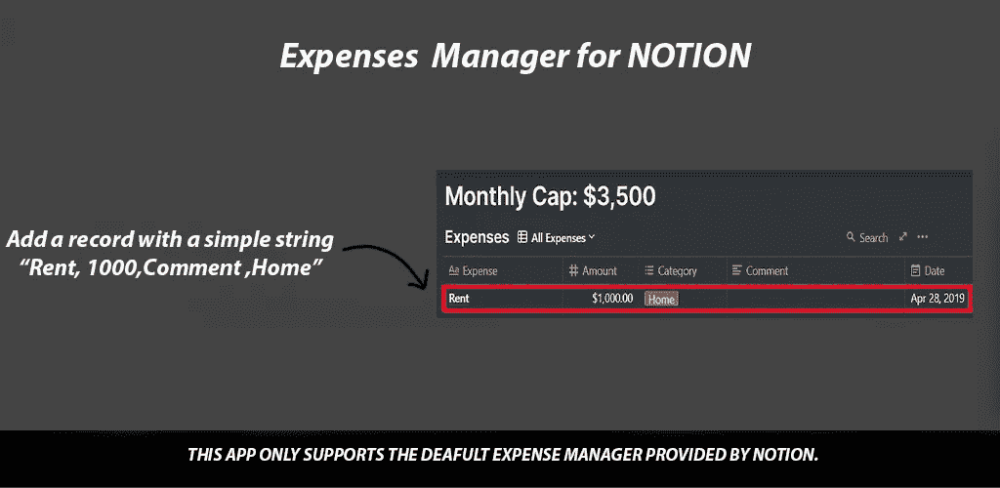

# 使用 Chaquopy 实现概念自动化的 Android 应用程序

> 原文：<https://towardsdatascience.com/android-app-for-notion-automation-using-chaquopy-863e72fa4ecd?source=collection_archive---------59----------------------->

## 使用 Android、Chaqopy 和 opinion-py 实现观念的自动化。



**这个应用程序是如何工作的？**

我[最近写了一篇文章](https://medium.com/@prathu10/automating-notion-using-notion-py-fa0f2e8f089e)，讲述了我如何使用 idea-py 自动将我的费用添加到 idea 的费用管理器数据库中。

在发现使用 idea-py 添加费用是多么容易之后，我继续创建了一个简单的 android 应用程序，它允许我输入一个简单的文本字符串，然后将数据迁移到 idea 的数据库中。我使用 chaquoy 在 android 中运行我的 python 脚本。这个项目在 git-hub 上是开源的，欢迎你来[查看](https://github.com/Prathmesh2498/ExpensesManagerForNotion)并让我知道你的想法。如果您希望合作，请阅读 github 上的[自述文件。](https://github.com/Prathmesh2498/ExpensesManagerForNotion/blob/master/README.md)

因此，这个应用程序基本上做的，是采取一个字符串'费用，金额，评论，标签'并将其添加到概念的费用数据库。因为你可以在 github 上查看完整的代码，所以我只解释核心代码。

```
# -*- coding: utf-8 -*-
"""
Created on Sat May  3 15:22:31 2020

@author: Prathmesh D
"""

def addRecord(Expense,Amount,Comment,Category,v2,db):
    import datetime
    from notion.client import NotionClient
    Date = datetime.datetime.now()

    print(v2)
    print(db)
    # Obtain the `token_v2` value by inspecting your browser cookies on a logged-in session on Notion.so

    try:
        client = NotionClient(token_v2=v2)
        print("Client Connected..")
    except:
        s ="V2Error"
        return s

    try:
        cv = client.get_collection_view(db)
        print("Connected to db")
    except:
        s="dbError"
        return s

    try:
        row = cv.collection.add_row()

        row.Expense = Expense
        row.Amount = Amount
        row.Comment = Comment
        row.Category = Category
        row.Date=Date
        return "Success"
    except Exception as e:
        s = str(e)
	#Get the values from the database         
	filter_params = [{
            "property": "Expense",
        }]
        result = cv.build_query(filter=filter_params).execute()
        #Get size of db
	size = len(result)
        #Remove last entry
	result[size-1].remove()
        return s
```

基本脚本和我之前的[帖子](https://medium.com/@prathu10/automating-notion-using-notion-py-fa0f2e8f089e)中的一样。唯一增加的是 catch 块，其中我删除了最新的记录，因为有一些错误，并将生成的错误返回给 android 应用程序。

在 android 应用程序中，我使用 AsyncTask 向 python 脚本发送请求，并返回结果。如果您不熟悉 AsyncTask，它有 4 个主要部分:

1.  onPreExecute() —在调用新线程之前准备数据。在 UI 线程上运行。
2.  doInBackground(Params…) —创建新线程并在后台运行的异步调用。这是我们将使用 chaqopy 调用脚本的地方。
3.  onProgressUpdate(Progress…) —该方法在 UI 线程上运行，您可以更新在 doInBackground()方法中完成的流程或操作。我还没有在我的应用程序中使用它，但是使用它的一种方法是显示在一次调用中添加多个条目时完成了多少个条目。
4.  onPostExecute(Result) —此函数在 doInBackground()完成执行后调用。它也运行在 UI 线程上。

以下是我如何使用这些方法的:

1.  onPreExecute()

```
@Override
protected void onPreExecute() {
    super.onPreExecute();

    editTextString[0] = getData.getText().toString();
    getData.setText("");

    d[0] = editTextString[0].split(Pattern.quote(","));

    amount[0] = Integer.parseInt(d[0][1]);

    date[0] = Calendar.getInstance().getTime();

}
```

2.doInBackround(参数…)

```
@Override
protected String doInBackground(String... params) {
    try{
	//Call to chaquopy library
        returned_value = viewSource(MainActivity.this, d[0], amount[0], date[0], TOKEN_V2, DB_URL);
	return returned_value;
    }catch (Exception e){
        return returned_value;
    }

}
```

2.1 viewSource(参数…)

Chaquopy 码

```
@Override
protected String doInBackground(String... params) {
    try{
	//Call to chaquopy library
        returned_value = viewSource(MainActivity.this, d[0], amount[0], date[0], TOKEN_V2, DB_URL);
	return returned_value;
    }catch (Exception e){
        return returned_value;
    }

}
```

3.onPostExecute(结果)

在这个方法中，我们主要检查用户是否正确输入了他的 v2_Token 和数据库 URL，我们检查 python 脚本的结果，并相应地在主 UI 线程上显示结果。

```
@Override
protected void onPostExecute(String result) {
    super.onPostExecute(result);
    SharedPreferences.Editor putEditor = getSharedPreferences(SAVED_PREFERENCES, MODE_PRIVATE).edit();
    if(result.equals("Success")) {
        Toast.makeText(MainActivity.this, result, Toast.LENGTH_SHORT).show();
    }
    else{

        if(result.equals("V2Error")){
            Toast.makeText(MainActivity.this, "Your V2 Token is wrong. Please Enter Details again!", Toast.LENGTH_LONG).show();
            putEditor.remove("Init");
            putEditor.commit();
            Intent intent = new Intent(MainActivity.this,userDetails.class);
            startActivityForResult(intent,2);

        }
        else if(result.equals("dbError")){
            Toast.makeText(MainActivity.this, "Your db URL is wrong. Please Enter Details again!", Toast.LENGTH_LONG).show();
            putEditor.remove("Init");
            putEditor.commit();
            Intent intent = new Intent(MainActivity.this,userDetails.class);
            startActivityForResult(intent,2);
        }
        else{
            String sourceString = "<b>" + result + "</b> " ;
            tv.setText(Html.fromHtml(sourceString, Html.FROM_HTML_MODE_LEGACY));
            Toast.makeText(MainActivity.this, "Record Deleted!\\nPlease add again.", Toast.LENGTH_LONG).show();
        }

    }
```

我希望这在某种程度上对你有所帮助。

下次见。干杯！