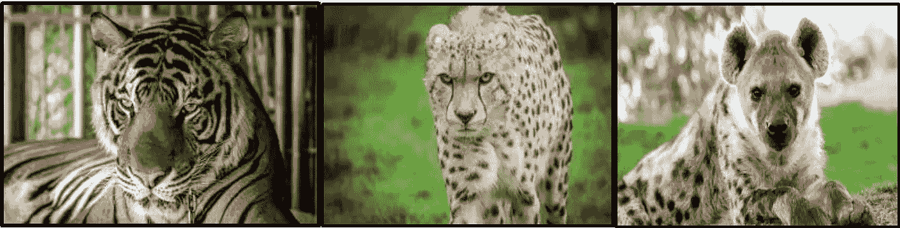
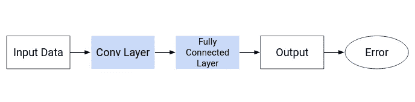
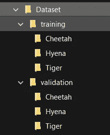
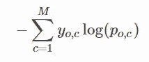

# 使用 PyTorch 和卷积神经网络的动物分类

> 原文：<https://towardsdatascience.com/animal-classification-using-pytorch-and-convolutional-neural-networks-78f2c97ca160?source=collection_archive---------16----------------------->



作者图片

# 介绍

***PyTorch*** 是脸书 AI 研究实验室(FAIR)开发的深度学习框架。由于其 C++和 CUDA 后端，称为 Tensors 的 N 维数组也可以在 GPU 中使用。

***卷积神经网络(ConvNet/CNN)*** 是一种深度学习，它获取输入图像，并为各种特征分配重要性(权重和偏差)，以帮助区分图像。



作者图片

神经网络大致分为 3 层:

*   输入层
*   隐藏层(可以由一个或多个这样的层组成)
*   输出层

隐藏层可以进一步主要分为两层-

*   卷积层:从给定的输入图像中提取特征。
*   完全连通的密集图层:它为卷积图层中的要素分配重要性以生成输出。

卷积神经网络过程通常包括两个步骤

*   前向传播:权重和偏差被随机初始化，这在最后生成输出。
*   反向传播:权重和偏差在开始时随机初始化，并根据误差更新值。对于较新的输出，这些更新的值一次又一次地发生正向传播，以最小化误差。+


照片由 [Fotis Fotopoulos](https://unsplash.com/@ffstop?utm_source=medium&utm_medium=referral) 在 [Unsplash](https://unsplash.com?utm_source=medium&utm_medium=referral) 上拍摄

激活函数是分配给神经网络中每个神经元的数学方程，并根据其在图像中的重要性(权重)来确定是否应该激活它。

有两种类型的激活功能:

*   线性激活函数:它获取输入，乘以每个神经元的权重，并创建与输入成比例的输出信号。然而，线性激活函数的问题是，它给出的输出是一个常数，因此不可能使用反向传播，因为它与输入没有关系。此外，它将所有层折叠成一个层，从而将神经网络变成一个单层网络。
*   非线性激活函数:这些函数在不同层之间创建复杂的映射，有助于更好地学习数据建模。一些非线性激活函数是 sigmoid、tanh、softmax、ReLU(整流线性单元)、Leaky ReLU 等。

理论够了，开始吧。

# 开源代码库

如果您熟悉 Github，请查看我的代码和数据集存储库。

[](https://github.com/Shubhankar07/Zoo-Classification-using-Pytorch-and-Convolutional-Neural-Networks) [## 使用 Pytorch 和卷积神经网络进行分类

### 使用 PyTorch 和 CNN 对老虎-鬣狗-猎豹进行分类这个项目是为我的中型博客制作的。一定要去看看…

github.com](https://github.com/Shubhankar07/Zoo-Classification-using-Pytorch-and-Convolutional-Neural-Networks) 

克里斯里德在 [Unsplash](https://unsplash.com?utm_source=medium&utm_medium=referral) 上的照片

# 资料组

要训练一个模型，首要任务是找到一个数据集。对于该项目，使用的数据集是 Kaggle 原始数据集的修改版本:

原始数据集:【https://www.kaggle.com/c/swdl2020/overview 

定制数据集:[https://drive . Google . com/file/d/1 krqqs 2 hi 2 kagfgactdwqpquzo 6 rx 2 ve 6/view？usp =分享](https://drive.google.com/file/d/1KRqqs2hi2KagfGAcTdWQPQUZO6RX2VE6/view?usp=sharing)

数据集中有 3 个类对应于三种动物:老虎、鬣狗和猎豹。



作者图片

数据集已经分为两个文件夹，即培训和验证。训练文件夹包含 2700 幅图像，每幅 900 幅在不同的文件夹中，验证文件夹包含 300 幅图像，每幅 100 幅在对应于每只动物的不同文件夹中。

# 导入库

如果您尚未安装 PyTorch 库，请使用以下命令:

如果您在 Anaconda 上运行，那么一旦您进入虚拟环境，运行命令-

```
**conda install pytorch torchvision cudatoolkit=10.1 -c pytorch**
```

如果您想使用 pip 在本地安装它，以下命令将打开一个 wheel 文件供下载-

```
**pip install torch==1.5.0+cu101 torchvision==0.6.0+cu101 -f**
```

# 了解数据集

一旦我们导入了所需的库，让我们导入数据集并理解它。

正如我们所见，总共有 3 个类，每个代表一种特定的动物。 *data_dir* 是存储数据集的路径。如果在一个在线环境中工作，那么数据集要么需要上传到本地环境，要么保存到驱动器上，就像 Google Colab 的情况一样。如果您在本地环境中工作，请在此处插入本地数据集路径。

现在让我们把数据集转换成一个 N 维张量。

现在，可变数据集是一个包含所有用于训练的图像的张量。如上所述，数据集的大小为 2700。

我们现在将使用验证文件夹作为测试文件夹。测试数据集的大小是 300。

现在让我们检查数据集。

每个图像的形状为 3x400x400，图像尺寸为 400x400，3 表示颜色通道 RGB。

现在让我们显示数据集中的一些图像。

# **为训练准备数据集**

我们现在将把训练集分成两部分进行训练和验证。

为此，我们将使用 random_split()函数。

让我们将批处理大小保持在 32 并加载数据。

我们来看看批次。

现在我们已经完成了准备工作，让我们来看看模型。

# 构建模型

在这里，我们使用交叉熵或对数损失作为损失函数。在多类分类的情况下，交叉熵公式为:



现在让我们检查一下 GPU 是否可用，如果可用就使用它。

现在已经选好 GPU 了。如果“cuda”不可用，那么如果您在本地工作，请检查您的设置。如果你在 Kaggle 上工作，那么确保没有其他 GPU 会话是活动的，并且你没有用完每月 30 小时的免费配额。

我们现在来定义卷积网络的各层。

我们已经定义了 3 个隐藏层。对于激活功能，我们使用 ReLU(校正线性单位)。

现在我们已经建立了一个基本模型，让我们尝试用各种学习率和时期来拟合它，并检查准确性。

现在让我们来分析这个模型。

让我们最后评估一下这个模型。

如你所见，准确率非常低，只有 50.9%左右。这是因为我们还没有给模型添加任何卷积层。


约书亚·索蒂诺在 [Unsplash](https://unsplash.com?utm_source=medium&utm_medium=referral) 上拍摄的照片

现在让我们使用 Resnet-18 构建卷积层。

Resnet 或残差网络是一种卷积神经网络，具有强大的表示能力，使其有可能训练多达数百甚至数千层，并仍然实现令人信服的性能。我们将使用 Resnet-18，它表示网络有 18 层深。

现在让我们定义卷积层。

我们现在将使用预训练的 Resnet-18 模型。

现在让我们看看输出形状。

检查 GPU 是否可用，并将其指定为设备。

确认设备类型为 GPU。

加载用于训练和测试的数据。

分配模型。

现在让我们检查初始损失和准确性。

最初的精确度是 35%。现在让我们设置超参数并开始训练模型。

Opt_func 代表优化器函数。它们通过响应损失函数的输出来更新模型，从而将损失函数和模型参数联系在一起。我们将要使用的函数是 Adam optimizer。Adam 是一种优化算法，可以用来代替经典的随机梯度下降过程，以基于训练数据迭代地更新网络权重。它实现了 AdaGrad(自适应梯度算法)和 RMSProp(均方根传播)的优点。

现在让我们来分析这个模型。

现在，让我们最后评估一下这个模型。

# 分析

正如我们所见，卷积层的应用有助于将精度提高到 89.5%。通过具有更大的训练数据集和进一步调整超参数，可以进一步提高精确度。

# 结论

我们已经成功地建立了一个卷积神经网络模型来对动物园的动物进行分类。类似的分类数据集相当多，可以通过了解来熟悉卷积神经网络、PyTorch 等概念。


在 [Unsplash](https://unsplash.com?utm_source=medium&utm_medium=referral) 上由 [Tincho Franco](https://unsplash.com/@tinchofranco?utm_source=medium&utm_medium=referral) 拍摄的照片