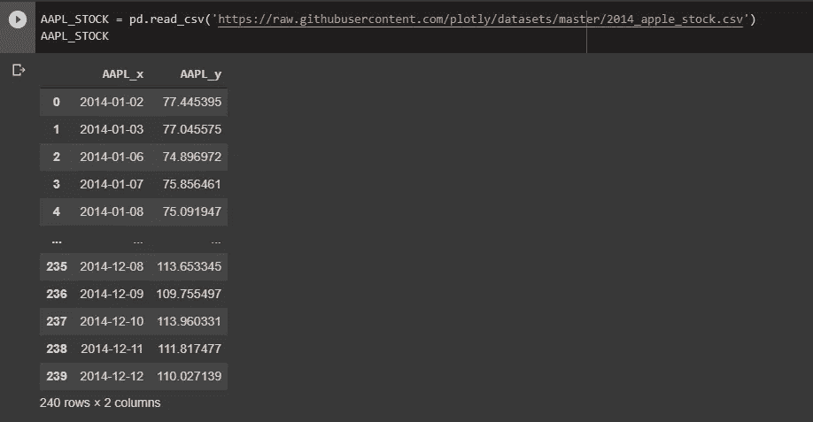
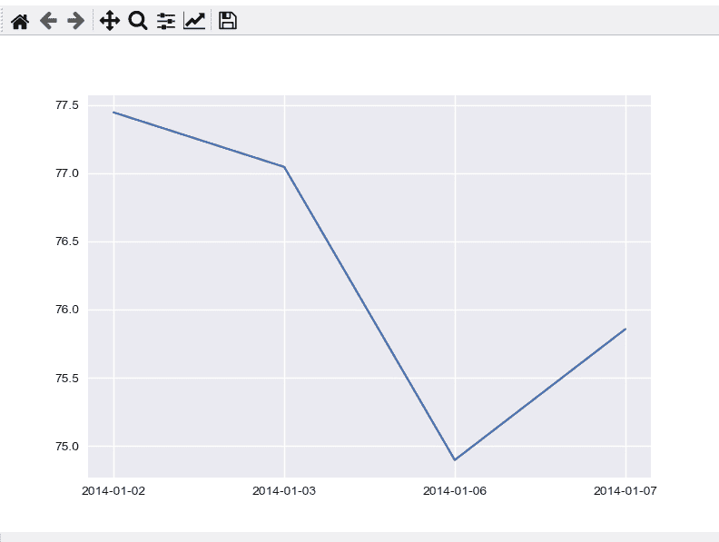
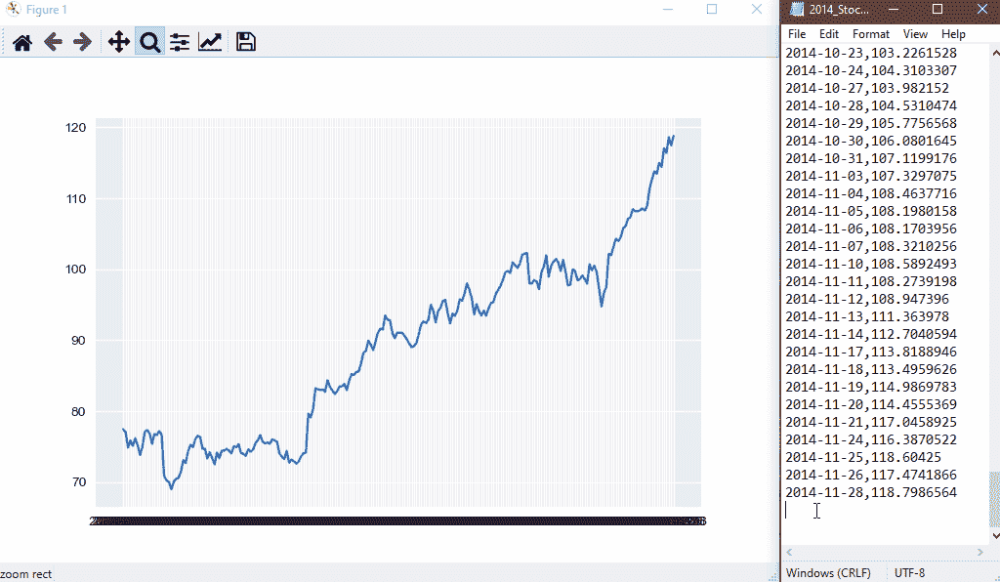

# 使用 Python 制作数据动画

> 原文：<https://towardsdatascience.com/animate-data-using-python-dd558e9103d?source=collection_archive---------23----------------------->

## 仅使用 MatPlotLib 查看实时数据


本指南的目标是向您展示如何实时更新图表。这可以用于各种应用，如可视化来自传感器的实时数据或跟踪股票价格。

在本教程中，数据将是静态的，但可以很容易地用于动态数据。当然，您需要在本地机器或虚拟环境中安装 **MatPlotlib** 和 **Pandas** 。


照片由[卢克·切瑟](https://unsplash.com/@lukechesser?utm_source=medium&utm_medium=referral)在 [Unsplash](https://unsplash.com?utm_source=medium&utm_medium=referral) 上拍摄


## 进口

**FuncAnimation** 是我们将用来持续更新图形的方法，为其提供实时效果。

我们将在本教程中使用 **MatPlotLib** 来生成我们的图形，并使用 **panda 的**库来读取 CSV 文件。

## 初始化子情节

我们将创建一个支线剧情，使我们更容易一遍又一遍地利用同一个情节。

## 创建动画方法

`animation(i)`方法是我们将用来一遍又一遍地画线的方法。这个方法会被 MatPlotLib 库中的`FuncAnimation`方法反复调用，直到你决定终止程序。

在这个例子中，我将使用一个从互联网上下载的静态文件。该文件为我们提供了苹果公司 2014 年的股价。

下面是我们的虚拟数据的样子:



现在，为了模拟实时数据，而不是一次性绘制整个图表，我将绘制每一行。这给了我们虚幻的真实数据。

记住`animation(i)`函数将在每次迭代 时被 ***调用。每调用一次`i`就加一。这一行，`AAPL_STOCK[0:i]['AAPL_x']`，将返回对应于我们正在进行的迭代的行。***

例如，在迭代 1 中，我们将返回数据集中的第一行。在第 n 次迭代中，我们将返回数据集中的第 n 行(及其之前的所有行)。

要绘制到图形的线，我们只需要调用`ax.plot(x,y)`。我们也调用`ax.clear()`来清除之前生成的行。我们这样做是为了在每次迭代后不要在彼此上面画线。


## 为什么在循环中导入数据集？

您可能已经注意到，我们在循环中读取 CSV。我们需要这样做的原因是，如果新数据被添加到 CSV 中，我们可以读取它并将其绘制到我们的图表中。

## 如果我想使用文本文件呢？

如果你使用一个文本文件，你可以在每次迭代中给 x 和 y 追加值。例如:

## 运行动画

要运行动画，我们只需要使用下面的。

```
animation = FuncAnimation(fig, func=animation, interval=1000)plt.show()
```

这里,` **FuncAnimation** `将连续运行我们的动画程序。`**interval**`用于确定更新之间的延迟。目前，它被设置为 **1000 毫秒**，但它可以根据你的需要或快或慢。


**这里是所有的代码:**



截屏由作者拍摄

## 当新的价值加入其中时，它真的能工作吗？

因此，在这里，我只是从我们上面使用的 CSV 中删除了一些数据。

然后，一旦图形更新到数据集的末尾，我就复制一些新数据并保存文件。然后，该图表用我刚刚添加的所有新数据进行了更新。在这种情况下，它更新得相当快，但只是因为间隔时间被设置为**100 毫秒**。



截屏由作者拍摄


如果你喜欢这个指南，你可以**看看下面写的其他一些很酷的文章**！如果你有任何问题，请留下你的评论，我会尽力帮助你。

[](/this-story-was-completely-written-by-an-ai-cb31ee22feae) [## 这个故事完全是由一个人工智能写的

### Grover 可以产生假新闻的人工智能模型

towardsdatascience.com](/this-story-was-completely-written-by-an-ai-cb31ee22feae) [](/data-visualization-animate-bar-graphs-df9ca03a09f2) [## 数据可视化:动画条形图！

### Excel 和 After Effects 中的数据可视化和动画

towardsdatascience.com](/data-visualization-animate-bar-graphs-df9ca03a09f2) [](https://medium.com/in-fitness-and-in-health/this-advice-could-save-millions-of-people-6e318db330ad) [## 这个建议可以拯救数百万人

### 降低你的胆固醇，这简直是要了你的命

medium.com](https://medium.com/in-fitness-and-in-health/this-advice-could-save-millions-of-people-6e318db330ad) [](https://medium.com/2-minute-madness/scientific-evidence-what-writers-ought-to-know-724eb7145e09) [## 科学证据:作者应该知道什么

### 并非所有的证据都是平等的。

medium.com](https://medium.com/2-minute-madness/scientific-evidence-what-writers-ought-to-know-724eb7145e09) [](https://medium.com/workhouse/innovation-is-thriving-during-the-pandemic-531fe6975a61) [## 疫情期间，创新蓬勃发展

### 科技如何帮助人类对付致命的疫情病毒。

medium.com](https://medium.com/workhouse/innovation-is-thriving-during-the-pandemic-531fe6975a61)