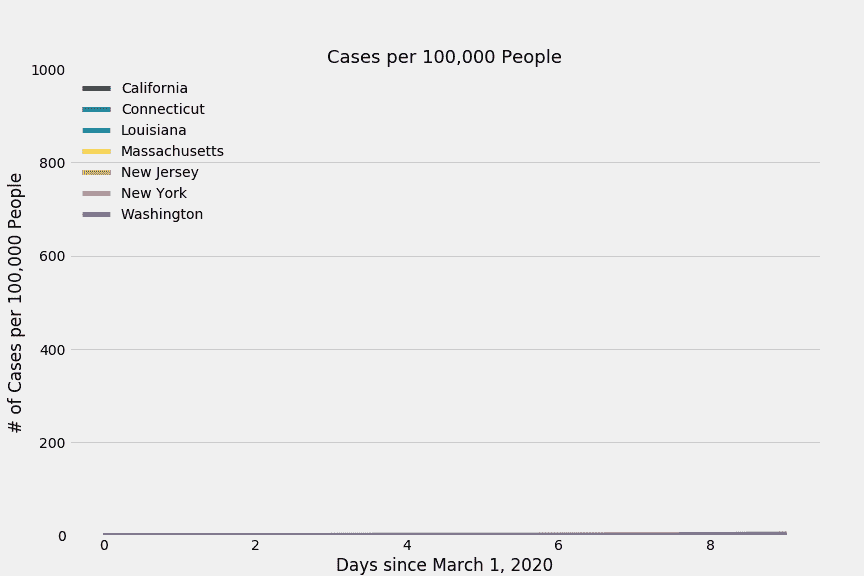

# 通过 4 个简单的步骤用 Python 制作动画！

> 原文：<https://towardsdatascience.com/animate-your-graphs-in-python-in-4-easy-steps-243dccad9a7?source=collection_archive---------21----------------------->

## **利用新冠肺炎数据实现数据可视化的创意**


我们开始吧！资料来源:Nik Piepenbreier

在之前的一篇文章中，我们探索了如何用几行代码制作漂亮的 Matplotlib 图。你可以通过[访问这个链接](/visualizing-covid-19-data-beautifully-in-python-in-5-minutes-or-less-affc361b2c6a)来查看这个帖子，作为如何将这些图表放在一起的快速复习。

我们将研究 COVID 数据，并绘制出自 2020 年 3 月 1 日以来每 100，000 人的比率。我们筛选出截至 2020 年 4 月 10 日受影响最大的五个州(按每 100，000 人的比率)，以及华盛顿和加利福尼亚州，因为它们的早期病例数。

让我们看看我们在组装什么！



我们的最终产品。资料来源:Nik Piepenbreier

# **第一步:让我们载入数据**

我们将开始分析，加载我们分析所需的库，并生成一些数据帧来存储我们的数据:

我们的第一行代码:导入库和数据！资料来源:Nik Piepenbreier

让我们更详细地分解我们的代码:

在第 1 节中，我们导入了几个库。我们使用 **Pandas** 来保存数据帧中的数据以及生成基本的绘图。我们使用 matplotlib 来生成实际的图形。我们使用 **glob** 获取文件名，然后创建 GIF。最后，我们使用 **moviepy** 来生成 GIF。

如果没有安装这些库，可以使用 pip 来安装。默认情况下会安装 Matplotlib，因此我们不将它包含在下面的列表中:

```
pip install pandas
pip install glob
pip install moviepy
```

在第 2 节的**中，我们生成两个数据帧。我们从纽约时报 GitHub 获取数据，这个 GitHub 按州收集新冠肺炎病例的数据到一个名为 df 的数据框架中。我们还从人口普查网站获取各州的人口数据。**

最后，在**第 3 节**中，我们将人口数据框架中的数据合并到主数据框架 df 中。如果你想了解更多这方面的知识，[看看这个教程](https://datagy.io/vlookup-in-python-and-pandas-using-map-or-merge/)。

我们还通过将病例数除以该州人口并乘以 100，000，得出每 100，000 人中的新冠肺炎病例率。这被分配给一个叫做 rate 的变量。这类似于我们的另一篇关于用 Matplotlib 漂亮地可视化新冠肺炎数据的文章:

[](/visualizing-covid-19-data-beautifully-in-python-in-5-minutes-or-less-affc361b2c6a) [## 用 Python 漂亮地可视化新冠肺炎数据(不到 5 分钟！！)

### 让 Matplotlib 不那么痛苦！

towardsdatascience.com](/visualizing-covid-19-data-beautifully-in-python-in-5-minutes-or-less-affc361b2c6a) 

# **第二步:准备我们的数据**

我们的数据现在包括所有州的数据。这将产生一个非常混乱的视觉效果。因此，我们希望将我们的分析限制在更小、更易管理的状态数量上。我们将在 2020 年 4 月 10 日选出人均收入最高的州。我们还将把华盛顿和加利福尼亚包括进来，因为他们有早期的高病例数:

为制图准备数据。资料来源:Nik Piepenbreier

在**第 4 节**中，我们生成了一个我们感兴趣的州列表。我们创建一个只包含昨天数据的新数据帧。然后，我们生成了当天人均收入最高的州的列表(按降序排列，只选择前五名)。最后，我们追加华盛顿和加利福尼亚。

然后，在**第 5 节**中，我们将我们的原始数据帧 df 限制为仅包括所标识的州。我们将数据范围限制为仅包括 2020 年 3 月 1 日以后的数据(因为在此日期之前病例报告率极低/偏低)。最后，我们透视数据集，使其可以绘制成图表。

在第 6 节的**中，我们重置了多索引数据帧的索引，以允许绘图。我们重置了索引并删除了日期列。这似乎有点争议，但我发现将数据显示为“# of days from March 1，2020”更容易理解，特别是考虑到我们希望在数据中包含的运动。**


我们的四个简单步骤！资料来源:Nik Piepenbreier

# **第三步:绘制数据图表**

我们现在已经准备好了绘制图表的数据。下面的代码迭代创建许多 png 图像，我们将把这些图像拼接在一起，创建我们的 GIF:

绘制我们的数据。资料来源:Nik Piepenbreier

在第 7 节中，我们完成了几件事:

*   我们将样式设置为匹配 538 主题，
*   我们测量数据帧的长度，并将其赋给一个名为 length 的变量。我们给这个值加 10。这使得默认情况下输出文件名更容易排序(而不是从 1 开始)。
*   我们使用 for 循环为每个日期生成单独的可视化效果。如果你想学习更多关于 for-loops 的知识，[看看这个指南](https://datagy.io/python-for-loop/)，它会教你你需要知道的一切。
*   如果您一直在跟进，请确保更改最后一行，以反映存储图形的文件夹的路径。要使 GIF 正常工作，请将其创建为不包含任何其他内容的新文件夹。

# **步骤 4:创建我们的可视化动画**

现在我们到了激动人心的时刻！您现在已经创建了一个装满 png 的文件夹，我们正准备将它们转换成 GIF。

生成我们的 GIF。资料来源:Nik Piepenbreier

在第 8 节中，我们主要做两件事:

*   我们使用 glob 生成所有 png 的列表。为此，在代码的第 4 行，更新 PNG 文件夹的路径，确保在代码中保留/*。这将从该文件夹中取出所有文件。
*   我们使用 moviepy 来生成 GIF。GIF 将以每秒 6 帧的速度运行，并将存储在您的用户目录中。如果找不到它，请在计算机上搜索 COVID.gif。

# 庆祝我们的最终产品！

让我们检查一下我们的最终作品，然后花点时间整理一下自己。在很短的时间内，我们创造了一个美丽的动画，非常容易地展示了新冠肺炎的怪异和令人羞愧的传播。


让我们庆祝一下！资料来源:Nik Piepenbreier

# **结论:用 Python 创建动画数据可视化**


感谢您抽出时间！资料来源:Nik Piepenbreier

非常感谢你阅读这篇文章！在这篇文章中，我们学习了如何将数据帧合并在一起，用 for 循环创建多个可视化效果，并将这些可视化效果转换成 GIF。

我希望你能学到一些新东西，找到一些创造性的方法来展示你的数据！