# 用人工智能让你自己成为一个迪斯尼角色

> 原文：<https://towardsdatascience.com/animating-yourself-as-a-disney-character-with-ai-78af337d4081?source=collection_archive---------14----------------------->

## 先睹为快数字艺术的未来

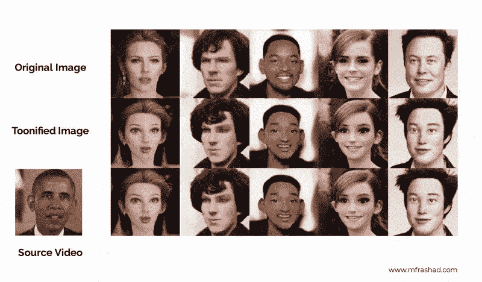

【作者生成的图片】【CC 许可下来源于维基百科的名人图片: [Scarlet J.](https://en.wikipedia.org/wiki/Scarlett_Johansson#/media/File:Goldene_Kamera_2012_-_Scarlett_Johansson_3_(cropped).JPG) ， [Benedict C](https://en.wikipedia.org/wiki/Sherlock_(TV_series)#/media/File:Benedict_Cumberbatch_filming_Sherlock_cropped2.jpg) 。，[将 S](https://en.wikipedia.org/wiki/Will_Smith#/media/File:TechCrunch_Disrupt_2019_(48834434641)_(cropped).jpg) 。、 [Emma W.](https://en.wikipedia.org/wiki/Emma_Watson#/media/File:Emma_Watson_2013.jpg) 、 [Elon M.](https://en.wikipedia.org/wiki/Elon_Musk#/media/File:Elon_Musk_Royal_Society.jpg) 【奥巴马视频来源于 [VoxCeleb 数据集](http://www.robots.ox.ac.uk/~vgg/data/voxceleb/)，CC BY 4.0】

上周，我在网上冲浪，无意中发现了贾斯汀·平克尼写的一篇有趣的文章。有什么好玩的？有人用这个想法做了一个很酷的应用！多伦·阿德勒(Doron Adler)用迪士尼人物对 StyleGAN2 模型进行了微调，然后将这些层与真实人脸模型(FFHQ)混合，并根据真实人脸生成迪士尼人物。

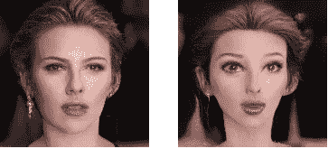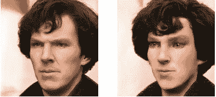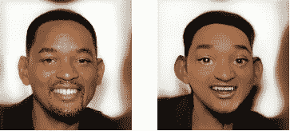

根据 CC 许可，图片来源于维基百科:[斯嘉丽·约翰逊](https://en.wikipedia.org/wiki/Scarlett_Johansson#/media/File:Goldene_Kamera_2012_-_Scarlett_Johansson_3_(cropped).JPG)、[本尼迪克特·康伯巴奇](https://en.wikipedia.org/wiki/Sherlock_(TV_series)#/media/File:Benedict_Cumberbatch_filming_Sherlock_cropped2.jpg)和[威尔·史密斯](https://en.wikipedia.org/wiki/Will_Smith#/media/File:TechCrunch_Disrupt_2019_(48834434641)_(cropped).jpg)。作者生成的动画图像。

然后，贾斯汀·平克尼接着在[上发布了这个模型，以此来统一](https://toonify.photos/original)。你只需上传你的照片，就能立刻得到你的迪士尼角色。试试吧！

但是，在这篇文章中，我们将学习如何以编程的方式来实现这一点，并制作角色动画！

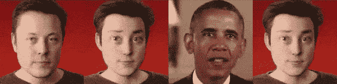

埃隆·马斯克的动画角色(为 GIF 优化而压缩)[图片由作者生成][埃隆·马斯克图片来源于 Flickr 由[特斯拉车主俱乐部比利时](https://www.flickr.com/photos/teslaclubbe/12271223586/in/photolist-jGnefs-7B4UpY-9BSeXs-haF167-eX9YxQ-ozwwpo-d83K9o-bXaJjZ-eyW9oB-fr8vN5-fqTf5g-7TXJEu-7B1dzT-nVS8fa-gjVgTf-haETfc-anD1Gd-ccdkPb-e2rcqL-5ubGnz-z4XLj7-rRMLTf-4t8UwZ-oNtTSq-jGn7AL-DYXSbK-emx5tu-526A61-rdqdcL-52281c-dYpvQE-cex63W-cex65f-ftXbTC-feq9zf-rocWAZ-feq9zL-BcRSGv-8NFnMJ-GvCak7-vWRj6g-AWqF3z-uMdB5p-vDTKwn-GVHFMa-gm9SkQ-tuWDGY-sAgpsJ-92iXxj-bnvZh)，CC 由 2.0 许可][奥巴马视频来源于 [VoxCeleb 数据集](http://www.robots.ox.ac.uk/~vgg/data/voxceleb/)，CC 由 4.0]

# 目录

1.  开始
2.  StyleGAN
3.  图层交换的意义
4.  用一阶运动制作动画
5.  辅导的

如果您不想学习理论并直接学习编码，您可以跳到教程。

# 生成对抗网络

这种角色生成背后的核心机制是一个称为生成性对抗网络(GAN)的概念，由于其生成性应用，该概念目前在社区中非常流行。甘是什么？这基本上是两个网络试图相互竞争，发电机和鉴别器。生成器试图欺骗鉴别器，使其相信其生成的图像是真实的，而鉴别器试图在真实图像和假(生成的)图像之间进行分类。

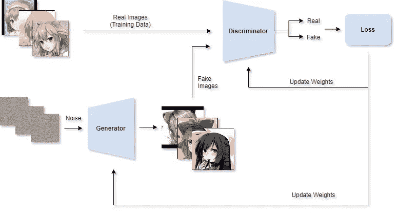

甘建筑[【来源:作者用 StyleGAN2 生成动漫人物】](/generating-anime-characters-with-stylegan2-6f8ae59e237b)

首先通过向鉴别器显示来自数据集的真实图像和随机噪声(来自未训练的生成器的图像)来训练鉴别器。由于数据分布非常不同，鉴别器将能够容易地进行区分。

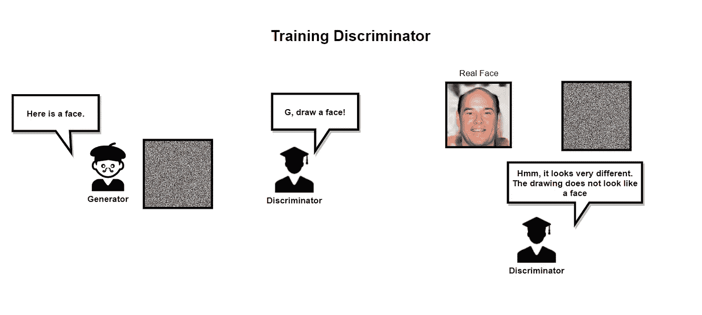

初始鉴别器训练[图片由作者提供][面部图像由[thispersondoesnotexist.com](https://thispersondoesnotexist.com/)生成]

*免责声明:由于我试图尽可能简化，该图可能无法准确反映 GAN 的情况。*

然后，我们将切换到训练发电机，同时冻结鉴别器。生成器将学习如何基于鉴别器的输出(真的或假的)生成更好的图像，直到鉴别器不能再正确鉴别为止。然后，我们切换回训练鉴别器，循环继续，两者都变得更好，直到生成器达到生成非常真实的图像的点，您可以停止训练。

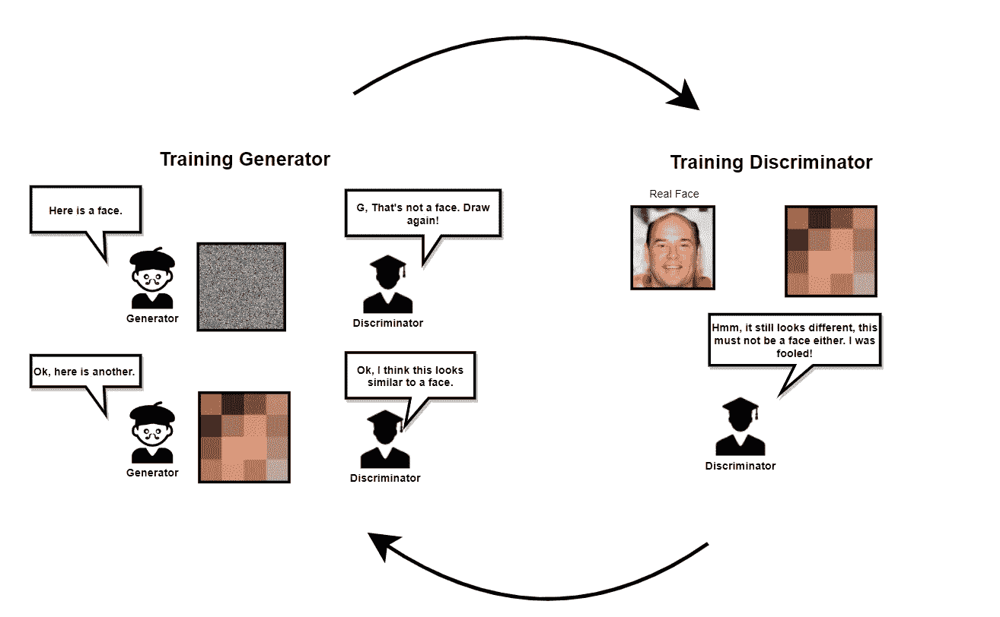

GAN 培训概述。生成器将学习生成更好的图像，鉴别器将学习更好地分类，因为假图像开始看起来非常相似。最终，它会达到一个点，图像非常相似，而鉴别器只有一半的时间是正确的。[图片由作者提供][面部图片由[thispersondoesnotexist.com](https://thispersondoesnotexist.com/)生成]

# StyleGAN

2018 年，NVIDIA 发表了一篇突破性的论文，该论文管理生成高质量的图像(1024x1024)，题为[“基于风格的生成式对抗性网络生成器架构”](https://arxiv.org/pdf/1812.04948.pdf)。其中一个新颖之处是，它解开了潜在的空间，使我们能够在不同的水平上控制属性。例如，较低层将能够控制姿势和头部形状，而较高层控制诸如照明或纹理的高级特征。

通过引入额外的映射网络来完成解缠结，该映射网络将输入*(从正态分布采样的噪声/随机向量)映射到分离的向量 ***w*** 并将其馈送到层的不同级别。因此，z 输入的每个部分控制不同级别的特征*

*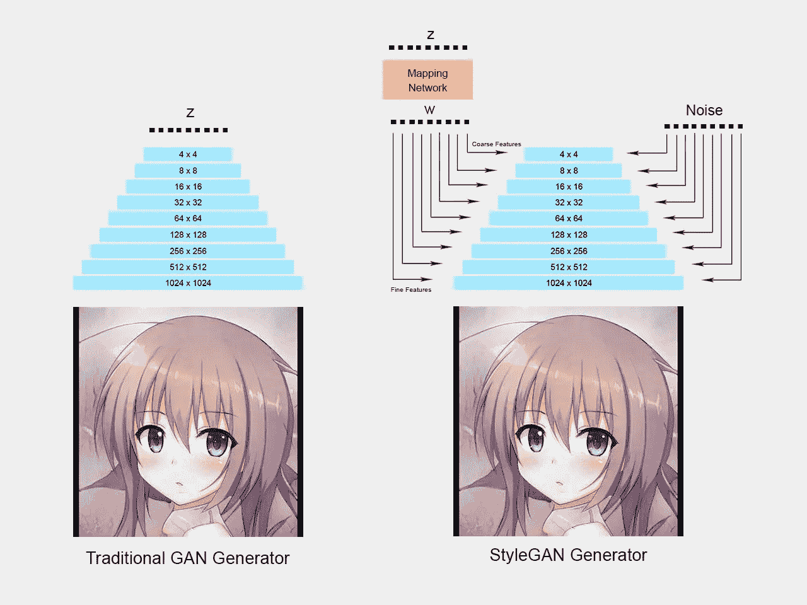*

*StyleGAN 生成器架构[【来源:作者用 StyleGAN2 生成动漫角色】](/generating-anime-characters-with-stylegan2-6f8ae59e237b)*

*因此，如果我们改变较低层(4x4，8x8)的输入，我们将会有高级特征的变化，例如头型、发型和姿势。*

*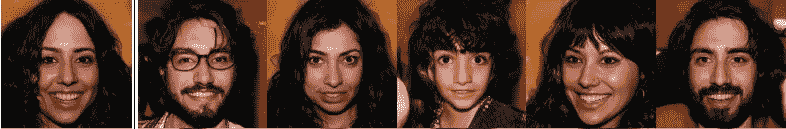*

*粗糙层次细节的变化(头型、发型、姿势、眼镜)[来源:
[分析和改善 StyleGAN 的图像质量](https://arxiv.org/pdf/1912.04958.pdf)*

*另一方面，如果您更改较高层(512x512，1024x1024)的输入，我们将在更精细的功能方面有所变化，如照明、肤色和头发颜色。*

*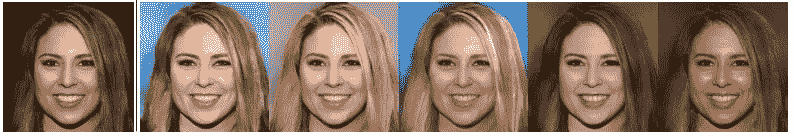*

*精细层次细节(头发颜色)的变化【来源:
[分析和改善 StyleGAN 的图像质量](https://arxiv.org/pdf/1912.04958.pdf)*

*我们可以尝试通过分析激活图来进一步可视化解缠结，并像本文所做的那样对激活进行聚类。*

*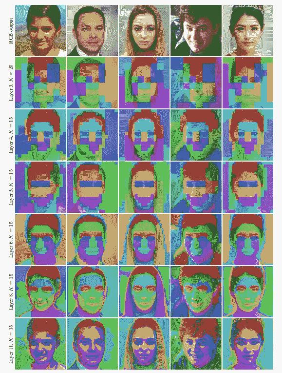*

*使用球形 K-均值聚类的 StyleGAN2 层分析显示了 StyleGAN 语义的解开。每种颜色代表一个不同的集群[ [来源:时尚编辑:揭示甘斯](https://arxiv.org/pdf/2004.14367.pdf)的地方语义*

*颜色代表一个集群，你可以把它看作是图像的可控部分。在最后一层，你可以看到照明的不同部分表现为不同的集群。在中间层中，诸如眼睛、鼻子或嘴的面部特征被表示为不同的聚类，这意味着这是面部特征的变化被控制的地方。最后，在前几层中，头部的不同部分被表示为不同的簇，这证明它控制着人的形状、姿势和发型。*

*你可以在这里观看这篇论文的演示视频。*

*[](https://crossminds.ai/video/5f6e7419d81cf36f1a8e31e0/) [## 时尚编辑:揭示 GANs - Crossminds 的本地语义

### 作者:Edo Collins，Raja Bala，Bob Price，Sabine Süsstrunk 描述:虽然 GAN 图像合成的质量已经…

crossminds.ai](https://crossminds.ai/video/5f6e7419d81cf36f1a8e31e0/) 

除了解开，StyleGAN 还做了其他几个改进，如渐进增长架构。虽然他们在 StyleGAN2 中换成了类似 [MSG-GAN](https://arxiv.org/abs/1903.06048) 的架构。关于最新的更新，你可以阅读这篇文章或者观看下面的 StyleGAN2 演示视频。

[](https://crossminds.ai/video/5f6e71a6d81cf36f1a8e30ee/) [## StyleGAN - Crossminds 图像质量的分析与改进

### 作者:Tero Karras，Samuli Laine，Miika Aittala，Janne Hellsten，Jaakko Lehtinen，Timo Aila

crossminds.ai](https://crossminds.ai/video/5f6e71a6d81cf36f1a8e30ee/) 

我也用这个网站来跟踪今年关于 CVPR 和 ECCV 的新论文。所以，还是挺有用的。

# StyleGAN 网络混合

StyleGAN 独特的“解开缠绕”功能使我们能够混合不同的模型，并从一张脸上生成迪士尼角色。如果前几层控制面部特征，最后几层控制纹理，**如果我们把最后几层和另一个模特的层互换会怎么样？**

例如，如果我们将人脸模型的权重用于前几层，将绘画模型的权重用于层的其余部分，它将生成具有绘画风格的人脸！此外，它不仅可以复制第二个模型的纹理，而且还可以复制不同模型的面部特征风格，如迪士尼人物的眼睛或嘴巴。

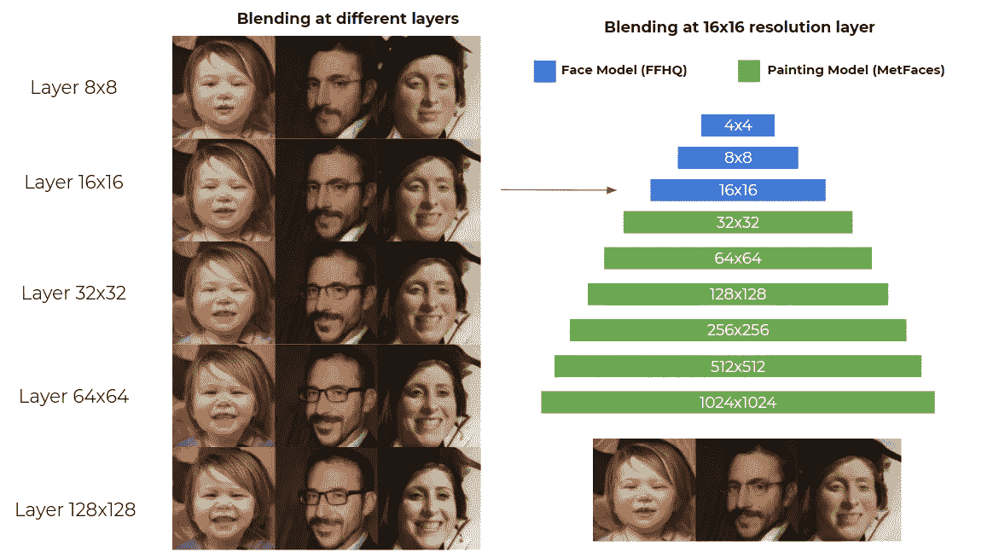

FFHQ 模型和 MetFaces 模型在各层和 16x16 层的网络融合[图像由作者生成][使用的人脸是生成的，人不存在]

# 一阶运动模型

在我们创造了迪斯尼角色之后，为什么不把它带到另一个层次，并制作出动画呢？一篇名为[“图像动画的一阶运动模型”](https://arxiv.org/abs/2003.00196)的有趣论文为我们提供了这样的能力。基本上，它试图使用关键点从驾驶视频中学习运动，并试图变形输入图像来实现运动。

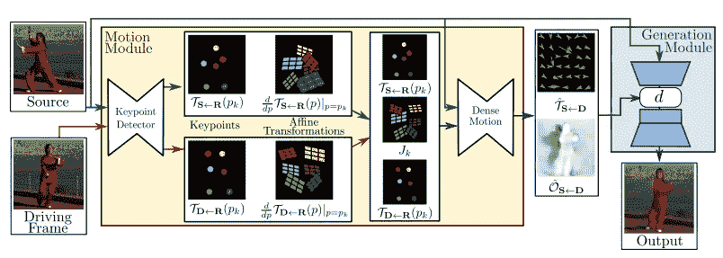

一阶运动模型概述[ [来源:图像动画一阶运动模型，CC BY 4.0]](https://github.com/AliaksandrSiarohin/first-order-model)

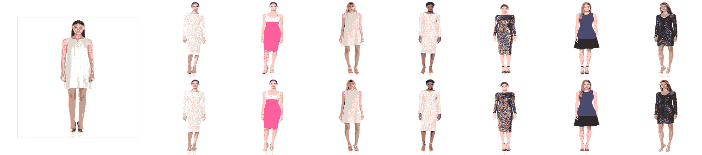

时装模特的一阶运动模型。请注意，它能够制作模型背面的动画。【[来源:图像动画一阶运动模型，CC BY 4.0】](https://github.com/AliaksandrSiarohin/first-order-model)

# 辅导的

现在我们已经对这个概念有了一点了解，让我们开始写代码吧！幸运的是，贾斯汀·平克尼提供了他的卡通化模型，并为它创建了一个实验室。我做了另一个 Colab 笔记本，基本上是他的代码，并添加了从 Aliaksandr Siarohin 的笔记本修改而来的动画代码。

这里有 [Colab 笔记本](https://colab.research.google.com/drive/1er1ZA4xvDKmy0PkPaNM0_oWppAblB9xy?usp=sharing)供你跟随！

首先，确保你用的是 GPU 运行时和 Tensorflow 1。

```
%tensorflow_version 1.x
```

***注意:*** *%*

接下来，我们克隆回购并创建我们将使用的文件夹。

```
!git clone [https://github.com/justinpinkney/stylegan2](https://github.com/justinpinkney/stylegan2)
%cd stylegan2
!nvcc test_nvcc.cu -o test_nvcc -run
!mkdir raw
!mkdir aligned
!mkdir generate
```

***注:*** *'！'用于在 Colab 中运行 shell 命令，如果您在本地执行此操作，只需在您的 shell/控制台上运行该命令。*

接下来，上传你的图像到 raw 文件夹，我们将使用一个脚本来裁剪面部和调整图像的大小，因此你的图像不必是全脸。但为了获得更好的效果，请确保您的面部分辨率至少为 256x256。

在这个例子中，我们将使用 Elon Musk 图像作为例子。

```
!wget [https://drive.google.com/uc?id=1ZwjotR2QWSS8jaJ12Xj00tXfM0V_nD3c](https://drive.google.com/uc?id=1ZwjotR2QWSS8jaJ12Xj00tXfM0V_nD3c) -O raw/example.jpg
```

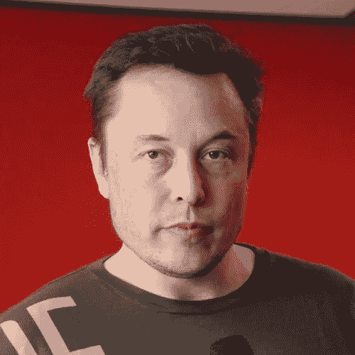

埃隆·马斯克图片【来源:Flickr by [特斯拉车主俱乐部比利时](https://www.flickr.com/photos/teslaclubbe/12271223586/in/photolist-jGnefs-7B4UpY-9BSeXs-haF167-eX9YxQ-ozwwpo-d83K9o-bXaJjZ-eyW9oB-fr8vN5-fqTf5g-7TXJEu-7B1dzT-nVS8fa-gjVgTf-haETfc-anD1Gd-ccdkPb-e2rcqL-5ubGnz-z4XLj7-rRMLTf-4t8UwZ-oNtTSq-jGn7AL-DYXSbK-emx5tu-526A61-rdqdcL-52281c-dYpvQE-cex63W-cex65f-ftXbTC-feq9zf-rocWAZ-feq9zL-BcRSGv-8NFnMJ-GvCak7-vWRj6g-AWqF3z-uMdB5p-vDTKwn-GVHFMa-gm9SkQ-tuWDGY-sAgpsJ-92iXxj-bnvZh)，CC BY 2.0】

然后，我们将加载由多伦的阿德勒和正常的 FFHQ 人脸模型的真实人脸和迪士尼人物的混合模型。

为什么我们还需要加载正常的真实人脸(FFHQ)模型？请记住，StyleGAN 模型仅采用潜在向量 z，并基于潜在向量生成人脸。它不像图像到图像转换模型那样获取图像并转换图像。

那么我们如何生成一张我们想要的脸呢？StyleGAN2 介绍了一种投射到潜在空间的方法。基本上，我们可以尝试使用梯度下降为我们想要的图像找到匹配的潜在向量。

但在我们试图找到匹配的潜在向量之前，我们需要首先裁剪和对齐图像。

```
!python align_images.py raw aligned
```

该脚本将源图像目录和输出目录作为输入，并将正确地裁剪和对齐我们的脸。

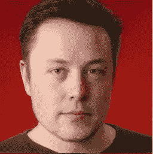

被裁剪和对齐的脸[来源:Flickr，作者:[比利时特斯拉车主俱乐部](https://www.flickr.com/photos/teslaclubbe/12271223586/in/photolist-jGnefs-7B4UpY-9BSeXs-haF167-eX9YxQ-ozwwpo-d83K9o-bXaJjZ-eyW9oB-fr8vN5-fqTf5g-7TXJEu-7B1dzT-nVS8fa-gjVgTf-haETfc-anD1Gd-ccdkPb-e2rcqL-5ubGnz-z4XLj7-rRMLTf-4t8UwZ-oNtTSq-jGn7AL-DYXSbK-emx5tu-526A61-rdqdcL-52281c-dYpvQE-cex63W-cex65f-ftXbTC-feq9zf-rocWAZ-feq9zL-BcRSGv-8NFnMJ-GvCak7-vWRj6g-AWqF3z-uMdB5p-vDTKwn-GVHFMa-gm9SkQ-tuWDGY-sAgpsJ-92iXxj-bnvZh)

最后，我们将图像投影到潜在空间。

```
!python project_images.py --num-steps 500 aligned generated
```

该脚本将获取`aligned`目录中的图像，并在`generated`文件夹中创建保存为`.npy`文件的潜在向量。

现在我们有了潜在向量，我们可以尝试使用我们的混合迪士尼模型来生成人脸。

生成的图像保存在`generated`文件夹中。我们可以显示笔记本里面的图像。

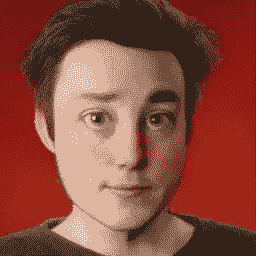

埃隆·马斯克卡通化[图片由作者生成]

瞧啊。我们有一个迪士尼化的埃隆·马斯克，但我们还没有完成。让我们来制作动画吧！

首先，我们在一阶模型上克隆 Aliaksanr 的回购。

```
!git clone https://github.com/AliaksandrSiarohin/first-order-model
```

然后，我们将设置一个路径，这样我们就不必在一阶模型目录下进行 python 导入，或者你可以直接`cd`到这个目录。

然后，在加载关键点和视频生成器模型之前，我们需要先下载预先训练好的权重。该文件相当大~700 MB，您可能需要手动下载，因为 Google 不允许使用 wget 下载大文件。

```
!wget "https://drive.google.com/uc?export=download&id=1jmcn19-c3p8mf39aYNXUhdMqzqDYZhQ_" -O vox-cpk.pth.tar
```

使用刚才下载的重量加载一阶模型。

接下来，我们需要一个驾驶视频，我们将从那里获得动画。您可以使用示例视频或上传自己的视频。如果您上传视频，请确保相应地更改文件路径。

```
!wget https://drive.google.com/uc?id=1LjDoFmeP0hZQSsUmnou0UbQJJzQ8rMLR -O src_video.mp4
```

最后，我们可以生成动画！

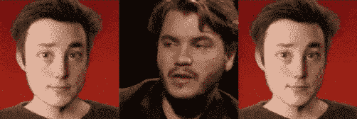

[作者生成的图像][来自 [VoxCeleb 数据集的中间视频]](http://www.robots.ox.ac.uk/~vgg/data/voxceleb/)

耶！我们终于让我们的角色有了生气。祝贺你，如果你设法达到这一点🎉

# 下一步是什么？

我们还有很多东西可以做实验。如果我们混合其他模型，如绘画的模型，或者我们也可以反向混合迪士尼人物和绘画，我们基于迪士尼人物或绘画生成一个真实的脸。我们也可以尝试加入 Deepfake，用我们的迪士尼角色替换迪士尼电影中的面孔。

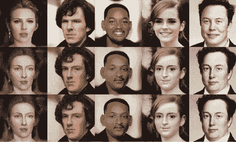

涂脂抹粉的脸的动画【图片由作者生成】【名人图片来源于 CC 许可下的维基百科图片: [Scarlet J.](https://en.wikipedia.org/wiki/Scarlett_Johansson#/media/File:Goldene_Kamera_2012_-_Scarlett_Johansson_3_(cropped).JPG) ， [Benedict C](https://en.wikipedia.org/wiki/Sherlock_(TV_series)#/media/File:Benedict_Cumberbatch_filming_Sherlock_cropped2.jpg) 。，[将 S](https://en.wikipedia.org/wiki/Will_Smith#/media/File:TechCrunch_Disrupt_2019_(48834434641)_(cropped).jpg) 。，[艾玛 W.](https://en.wikipedia.org/wiki/Emma_Watson#/media/File:Emma_Watson_2013.jpg) ，[埃隆 M.](https://en.wikipedia.org/wiki/Elon_Musk#/media/File:Elon_Musk_Royal_Society.jpg) ]

如果你喜欢我的作品，看看我的其他文章！

[](/generating-anime-characters-with-stylegan2-6f8ae59e237b) [## 使用 StyleGAN2 生成动画角色

### 了解如何生成这个很酷的动画人脸插值

towardsdatascience.com](/generating-anime-characters-with-stylegan2-6f8ae59e237b) [](/how-to-train-stylegan2-ada-with-custom-dataset-dc268ff70544) [## 如何使用自定义数据集训练 StyleGAN2-ADA

### 了解如何训练人工智能生成您想要的图像

towardsdatascience.com](/how-to-train-stylegan2-ada-with-custom-dataset-dc268ff70544) 

也可以在 Linkedin 上和我联系。

[](https://www.linkedin.com/in/mfathyrashad/) [## Muhammad Fathy Rashad -计算机视觉和深度学习 R & D 实习生- ViTrox 公司…

### 在我 16 岁的时候，我以最年轻的学生的身份开始了我的学业，并出版了 2 款总安装量超过 1.5K 的手机游戏…

www.linkedin.com](https://www.linkedin.com/in/mfathyrashad/) 

# 参考

[1]t .卡拉斯、s .莱恩和 t .艾拉(2019 年)。一种基于风格的生成对抗网络生成器体系结构。在*IEEE 计算机视觉和模式识别会议论文集*(第 4401–4410 页)。

[2]t . Karras，Laine，s .，Aittala，m .，Hellsten，j .，Lehtinen，j .，& Aila，T. (2020 年)。stylegan 图像质量的分析与改进。在*IEEE/CVF 计算机视觉和模式识别会议论文集*(第 8110–8119 页)。

[3]Siarohin，a .，Lathuilière，s .，Tulyakov，s .，Ricci，e .，& Sebe，N. (2019 年)。图像动画的一阶运动模型。在*神经信息处理系统的进展*(第 7137-7147 页)。

[4]柯林斯，e .，巴拉，r .，普莱斯，b .，& Susstrunk，S. (2020 年)。风格编辑:揭示 GANs 的本地语义。在*IEEE/CVF 计算机视觉和模式识别会议论文集*(第 5771–5780 页)。

[https://www.justinpinkney.com/stylegan-network-blending/](https://www.justinpinkney.com/stylegan-network-blending/)*