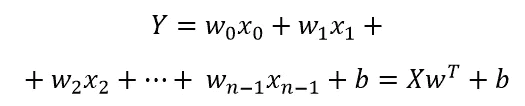
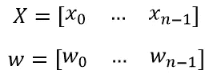
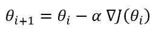
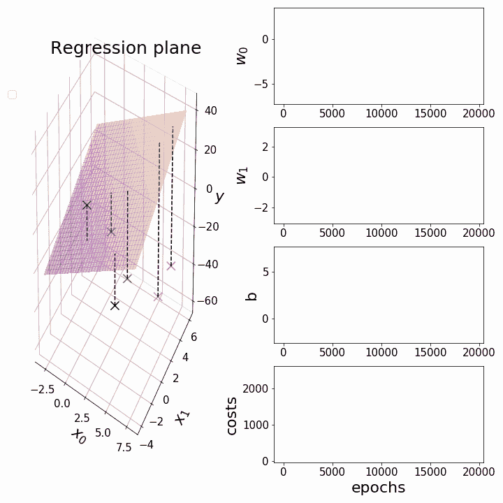
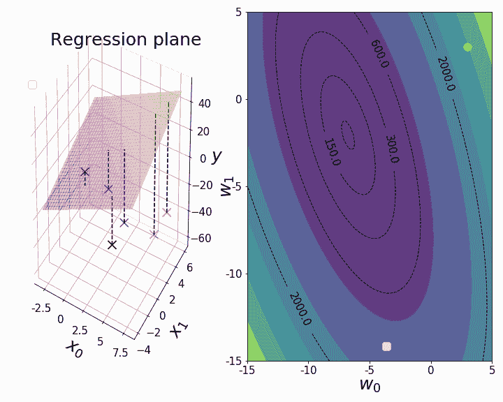
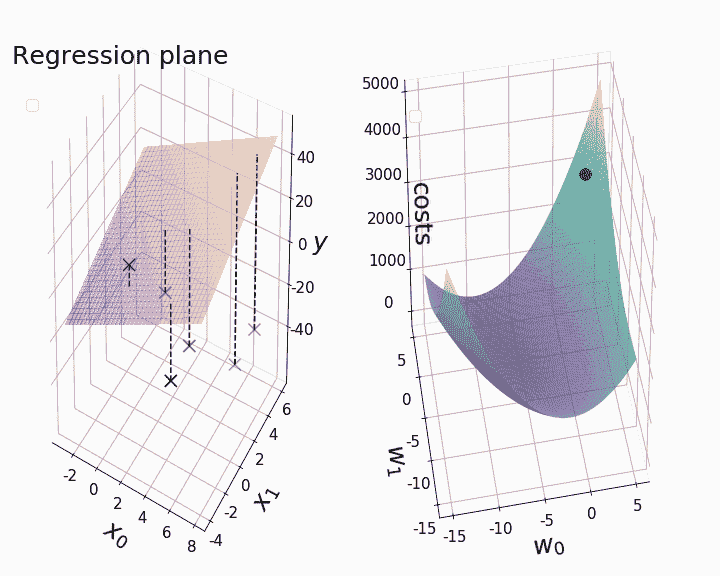
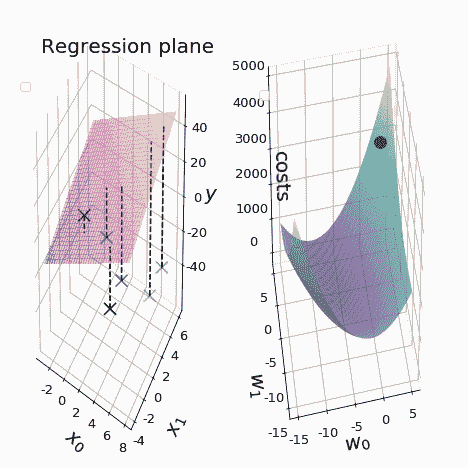

# 用 Python 制作多元线性回归动画

> 原文：<https://towardsdatascience.com/animations-of-multiple-linear-regression-with-python-73010a4d7b11?source=collection_archive---------32----------------------->

在这篇文章中，我们的目标是扩展我们的能力，可视化梯度下降到多元线性回归。这是《[渐变下降动画》的后续文章:1。简单线性回归](/gradient-descent-animation-1-simple-linear-regression-e49315b24672?source=your_stories_page---------------------------)”。正如我们之前所做的，我们的目标是建立一个模型，使用批量梯度下降将模型拟合到我们的训练数据，同时存储每个时期的参数值。之后，我们可以使用我们存储的数据，通过 Python 的[赛璐珞](https://pypi.org/project/celluloid/)模块来创建动画。

*这是我在 7 月 20 日上传的一篇关于同一主题的文章的修订版。主要改进包括封面照片和一些动画。*

# 建立模型

多元线性回归是简单线性回归的扩展版本，其中多个预测变量 *X* 用于预测单个因变量 *Y* 。对于 *n 个*预测变量，这可以用数学方法表示为

随着

而 *b* 代表我们回归平面的 y 截距(“偏差”)。我们的目标是找到使训练数据点和超平面之间的均方距离最小化的超平面。梯度下降使我们能够确定我们的模型参数 *θ* 的最佳值，包括我们的权重 *w* 和我们的偏差项 *b* ，以最小化观测数据点 *y* 和我们用回归模型*预测的数据点【ŷ).*在训练期间，我们的目标是根据以下公式更新我们的参数值，直到我们达到收敛:

其中∇ *J(θ)* 表示我们的成本函数 *J* 相对于我们的模型参数 *θ的梯度。*学习率用 *α* 表示。每个权重的偏导数和偏差项与我们的[简单线性回归模型](/gradient-descent-animation-1-simple-linear-regression-e49315b24672?source=your_stories_page---------------------------)中的相同。然而，这一次，我们想要建立一个(多元)线性回归模型，它对预测变量的数量是灵活的，并引入一个权重矩阵来同时调整所有权重。此外，我们在拟合过程中直接将参数值存储在数组中，这在计算上比我们在上一篇文章中使用 for 循环和列表要快。我决定将权重的初始参数值设置为 3，将偏差的初始参数值设置为-1。在 Python 中，我们导入一些库并建立我们的模型:

之后，我们打算让我们的模型适应一些任意的训练数据。虽然我们的模型理论上可以处理任何数量的预测变量，但我选择了一个具有两个预测变量的训练数据集。我们有意使用一个特别小的学习率， *α* =0.001，以避免动画中过大的步长。由于本文关注的是动画而不是统计推断，我们简单地忽略了线性回归的假设(例如，不存在多重共线性等。)目前来说。

为了确保我们拟合的参数收敛到它们的真实值，我们使用 [sklearn 的先天线性回归模型](https://scikit-learn.org/0.20/modules/generated/sklearn.linear_model.LinearRegression.html)来验证我们的结果:

现在，我们终于可以创作出我们的第一部动画了。像以前一样，我们希望从可视化值开始，我们的成本函数和参数在绘制 3-D 中的相应回归平面时相对于时期呈现。如前所述，我们打算只绘制选定时期的值，因为最大的步长通常在梯度下降开始时观察到。在每个 for 循环之后，我们对我们的绘图进行快照。通过[相机的动画功能](https://pypi.org/project/celluloid/)，我们可以将快照变成动画。为了获得所需的回归平面，我们通过 [numpy.meshgrid](https://numpy.org/doc/stable/reference/generated/numpy.meshgrid.html) 引入一个坐标网格(M1，M2)，并定义一个函数“pred_meshgrid()”来计算在某个时期与模型参数相关的相应 z 值。下面动画中看到的虚连接线可以通过训练数据点和预测点之间的线图获得。通过返回最终的参数值(参见注释掉的代码！)我们在我们的动画中获得，我们确保我们粗略地可视化了模型收敛，尽管没有使用我们在拟合过程中存储的参数值的全部范围。

尽管很简单，但分别绘制每个时期的参数值实际上是可视化具有两个以上模型参数的梯度下降的最具信息量和最现实的方式。这是因为我们只能以这种方式同时见证成本和所有模型参数的变化。

# 固定截距模型:

当创建更复杂的渐变下降动画时，特别是在 3d 中，我们必须关注两个模型参数，同时保持第三个参数“固定”。我们通常对多重线性回归模型的权重比偏差项更感兴趣。为了直观显示成本如何随着我们调整后的权重(w₀、w₁)稳步下降，我们必须建立一个新的线性回归模型，其中偏差项 *b* 是固定的。这可以通过将 *b* 的初始值设置为预定义值 *b_fixed* 并删除新模型中更新 *b* 的代码部分来轻松完成。 *b_fixed* 可以取任何值。在这种情况下，我们只是将它设置为前一个模型收敛到的 y 截距值:

在用我们的新模型积累新数据后，我们再次为下面的动画创建另一个坐标网格(N1，N2)。这个坐标网格使我们能够在给定的数字范围内，为每一对可能的 w₀和 w₁绘制成本图。

## 等值线图表

等高线图允许我们通过等高线和填充等高线在二维平面上可视化三维表面。在我们的例子中，我们希望将 w₀和 w₁分别绘制在 x 轴和 y 轴上，成本 *J* 作为等高线。我们可以用 [Matplotlib 的轮廓函数](https://matplotlib.org/3.1.1/api/_as_gen/matplotlib.pyplot.contour.html)标记图形中的特定轮廓级别。因为我们知道我们的最终成本大约是 76，我们可以设置我们的最后轮廓水平为 80。

当 y 轴截距允许变化时，我们看到了参数值和成本随后期的显著变化，这是我们不想在回归和参数图中遗漏的。然而，随着 *b* 被固定，大部分“动作”似乎被限制在前 400 个纪元。因此，我们将我们打算在下面的动画中可视化的时期限制为 400，这在计算上花费较少，并且产生更吸引人的动画。为了证实这种印象，我们可以将最终参数值(100，000 个时期后返回的固定截距模型)与 400 个时期后获得的参数值进行比较(参见下面注释掉的代码！).因为参数值和成本值通常是匹配的，尽管限制了被可视化的时期的数量，我们还是可视化了模型收敛，这是公平的。

动画回归平面和等高线图([大](https://s1.gifyu.com/images/MultiLinReg_2_large.gif))

## 表面图

对于最后一个图，我们希望包含与等高线图相同的时期。然而，这一次，我们希望使用曲面图在三维空间中可视化梯度下降。

动画回归平面和曲面图([大](https://s1.gifyu.com/images/MultiLinReg_3_Large.gif))

理论上，在 x-y 平面上绘制梯度下降的轨迹——就像我们绘制等高线图一样——对应于梯度下降的“真实”轨迹。与上面的曲面图相反，梯度下降实际上根本不涉及 z 方向的移动，因为只有参数可以自由变化。更深入的解释见[此处](https://blog.paperspace.com/intro-to-optimization-in-deep-learning-gradient-descent/amp/)。最后，我想指出用赛璐珞制作动画是非常耗时的。尤其是涉及曲面出图的动画可能需要 40 分钟才能返回所需的结果。尽管如此，我还是更喜欢赛璐珞，因为它简单明了。一如既往，创造性的投入和建设性的批评是赞赏！

我希望这篇文章对你有所帮助。如果有任何问题或者你发现了任何错误，请随时发表评论。在本系列的下一篇文章中，我将致力于以逻辑回归为例的梯度下降动画。完整的笔记本可以在我的 [GitHub](https://github.com/BundleOfKent/MultipleLinearRegression) 上找到。

感谢您的关注！

**参考文献**:

 [## 深度学习中的优化介绍:梯度下降

### 图片来源:奥莱利媒体深度学习，在很大程度上，真的是关于解决大规模讨厌的优化…

blog.paperspace.com](https://blog.paperspace.com/intro-to-optimization-in-deep-learning-gradient-descent/amp/)  [## 线性回归

### 在统计学中，线性回归是一种建模标量响应(或变量)之间关系的线性方法

en.wikipedia.org](https://en.wikipedia.org/wiki/Linear_regression#Simple_and_multiple_linear_regression) 

**附录**:

缩小版(特色图片)