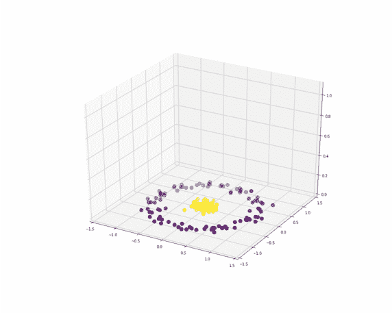

# 神经网络转换数据的动画

> 原文：<https://towardsdatascience.com/animations-of-neural-networks-transforming-data-42005e8fffd9?source=collection_archive---------22----------------------->

## 我们可以对神经网络为什么以及如何工作有更好的直觉

谈到分类算法，对它们如何工作的解释可以是*直观的*:

*   **逻辑回归**和 **SVM** 找到一个**超平面**将空间“切割”成两个。(但是这两种算法的途径不一样，所以最终的超平面也不一样。)
*   如果数据不是线性可分的，使用**内核技巧**， **SVM** 将数据转换到**一个更高维度的空间**，然后将其“切割”成两个。
*   **决策树**将数据分组到**超矩形**中，超矩形将包含一个类的大部分。
*   **K 最近邻**分析**新观测值的邻居**来预测该观测值的类别。

那么**神经网络**呢？

# 隐藏层的变换

我们举个简单的数据集例子:两个类，两个特征 x1 和 x2，数据*不线性可分*。

```
import numpy as npnp.random.seed(1)x1=np.concatenate((np.random.normal(0.5,0.1,100),
np.random.normal(0.2,0.05,50),
np.random.normal(0.8,0.05,50))).reshape(-1,1)x2=np.concatenate((np.random.normal(0.5,0.2,100),
np.random.normal(0.5,0.2,50),
np.random.normal(0.5,0.2,50))).reshape(-1,1)X=np.hstack((x1,x2))y=np.concatenate((np.repeat(0,100),np.repeat(1,100)))
```

可视化如下，数据也是标准化的。

```
from sklearn.preprocessing import StandardScaler
scaler = StandardScaler()
X=scaler.fit_transform(X)plt.scatter(X[:, 0], X[:, 1], c=y,s=20)
plt.axis('equal')
```


对于该数据集，神经网络最简单的合适结构是具有**两个神经元的一个隐藏层**的结构。如果你看不出为什么，那就继续，你会直观地理解。

我们也可以认为激活函数是 **sigmoid 函数**。

```
from sklearn.neural_network import MLPClassifierclf = MLPClassifier(solver=’lbfgs’,hidden_layer_sizes=(2,),
activation=”logistic”,max_iter=1000)clf.fit(X, y)
```

初始数据通过隐藏层进行转换。由于隐藏层有两个神经元，我们可以在 2D 平面上可视化这两个神经元的输出。

因此，初始 2D 数据集被转换到另一个 2D 空间。


我们可以用相应的权重计算隐藏层 A1 的值:

```
A1=1/(1+np.exp(-(X@clf.coefs_[0]+clf.intercepts_[0])))
```

然后我们可以将 A1 层可视化:

```
fig, ax = plt.subplots(figsize=(5,5))
ax.scatter(A1[:, 0], A1[:, 1], c=y,s=30)
ax.set_xlim(-0.1, 1.1)
ax.set_ylim(-0.1, 1.1)
```


现在，如何将初始数据转换成这些值？我们可以将这个过程动画化:

*   一开始，我们有原始数据集(记住，它不是线性可分的)
*   最后，我们将在(0，1)方块中得到转换后的数据，因为 sigmoid 函数的输出介于 0 和 1 之间。你看到数据的形式了吗？是的，这就是奇迹发生的时候…


# 输出神经元的性质

我们可以看到最后，**数据集变成线性可分！**对于二元分类，输出神经元是一个逻辑回归。并且很容易找到线性决策边界。在这种情况下，超平面分隔符将是一条直线。

> 因此，神经网络背后的直觉是，隐藏层将非线性可分离的初始数据转换到它们几乎线性可分离的空间。

# 神经网络的整体结构

结合隐藏层和输出层，我们有一个表面，我们可以在下面可视化。它是一个曲面，因为输入有两个变量，输出是概率，所以我们可以用 z 轴来表示。


现在我们可以看到，这两个神经元“切割”了两个类之间的两个边界。

# 稍微复杂一点的数据

现在让我们考虑下面的数据集。一个类在另一个类里面，有一个循环的形式。在使用神经网络之前，哪些算法可以解决这个问题？


*   **二次判别分析**是合适的候选，因为两类协方差矩阵不同，中心相同。决策边界将是一个几乎完美的圆，以区分黄色点和紫色点。
*   **带 RBF** (径向基函数)**核**的 SVM 也会很完美。
*   一个**神经网络**怎么样？两个神经元意味着你只“切”两次，这里我们至少需要三个。


## 最终神经网络表示

我们可以首先看到下面的最终表面，决策边界实际上是一种三角形。


## 隐藏层的变换

初始的 2D 空间被转换成具有 3 个神经元的 3D 空间。我们可以让这种转变生动起来。

*   一开始，数据集在一个平面上。我们将认为 z 轴的值为零。
*   最后，数据集被映射到(0，1)立方体中，因为 sigmoid 函数的输出介于 0 和 1 之间。



现在你能看到数据集在这个立方体中几乎是线性可分的吗？让我们通过旋转立方体来创建另一个动画。现在你看到了，用一架飞机，我们可以很容易地把黄色的点和紫色的点分开？


为了理解算法是如何工作的，我喜欢用简单的数据创建可视化。如果你也觉得它们有帮助，请评论。

这些情节首先是用 python 创建的，然后我用 gifmaker 制作动画。